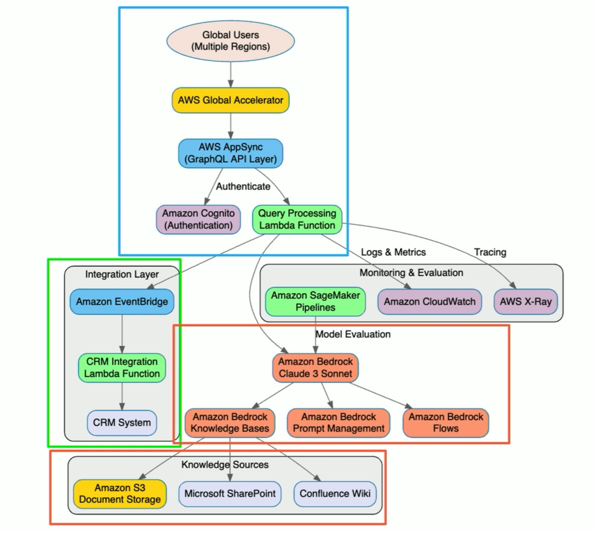

# AWS Certified Generative AI - Professional

# Domain 1 Review

# Task 1.1: Analyze requirements and design GenAI solutions.
This lesson is a high-level overview of the first task statement and how it aligns with the GenAI developer role.

AWS offers services and tools to help analyze requirements and design GenAI solutions. These include **Amazon Bedrock, Amazon Bedrock Knowledge Bases, Foundation Models (FMs) integration patterns, constraints, and deployment strategies, Amazon Q, Amazon SageMaker AI, Amazon SageMaker AI Pipelines, AWS Well-Architected Framework, AWS WA Tool Generative AI Lens**, and more.

Understanding these services, how to configure them for specific use cases, and when to use them is crucial to your knowledge as a GenAI developer. 
As you review these lessons for Task 1.1, check that you understand how to do the following:
## Create comprehensive architectural designs 

Create comprehensive architectural designs by using appropriate FMs, integration patterns, and deployment strategies that align with specific business needs and technical constraints. Ensure you understand how to do the following:

  * Understand how to use **Amazon Bedrock** for accessing FMs from leading AI companies, including AI21 Labs, Anthropic, Cohere, Meta, Stability AI, and Amazon through a unified API for rapid experimentation and deployment.
  * Learn integration patterns specific to GenAI applications, particularly for workflows involving agentic orchestration and Retrieval Augmented Generation (RAG), which require tailored integration strategies.
  * Implement event-driven **integration patterns** using services like Amazon **Simple Queue Service (Amazon SQS)**, **Apache Kafka**, publish-subscribe (pub/sub) systems, webhooks, and event streaming platforms for GenAI solution integration with downstream systems.
  * Design serverless GenAI architectures using **AWS AppSync** as an API layer to use GraphQL benefits, such as declarative data fetching, serverless caching, security controls, and direct Amazon Bedrock integration. 

## Develop technical proof-of-concept implementations by using **Amazon Bedrock** 

Develop PoCs to validate feasibility, performance characteristics, and business value before proceeding to full-scale deployment.

  * Use **Amazon Bedrock** for rapid experimentation with pre-trained models, allowing customization for specific use cases and integration into applications **without managing complex infrastructure**.
  * Implement **Amazon Bedrock Knowledge Bases** for RAG-based chat assistants, which streamlines setting up vector databases to query custom documents and integrates with services like Amazon S3, Microsoft SharePoint, and Atlassian Confluence.
  * Use the **Generative AI Application Builder** on AWS to accelerate development and streamline experimentation without requiring deep AI experience, using pre-built connectors to various large language models (LLMs) through Amazon Bedrock.
  * Explore advanced **Amazon Bedrock features**, including Knowledge Bases for implementing the entire RAG workflow, Prompt Management for creating versioned reusable prompt templates, Flows for chaining multiple AI operations, and Agents for task automation.

## Create standardized technical components 

As a GenAI developer, you need to understand how to create standardized technical components. Ensure you understand how to do the following
  * Apply the **AWS Well-Architected Framework and Generative AI Lens** to implement best practices for building business applications with Amazon Q, Amazon Bedrock, and Amazon SageMaker AI.
  * Implement **GenAIOps practices** to optimize the application lifecycle, using resources like **Amazon SageMaker AI Pipelines** and **MLflow** for LLM experimentation at scale.
  * Design infrastructure components that support GenAI applications, including **Amazon Elastic Compute Cloud (Amazon EC2)** for running applications, **Amazon S3** for storing data and outputs, **Amazon CloudWatch** for monitoring, and **AWS Lambda** for serverless event-driven GenAI applications.
  * Study architectural patterns for **Amazon Bedrock applications**, focusing on advanced service integration techniques and implementation patterns for generative AI workloads.

---
---

## Example 1 of a GenAI application

* Your company needs to implement a customer support chatbot that can handle routine inquiries and escalate complex issues to human agents. The chatbot should integrate with your existing customer relationship management (CRM) system and maintain context throughout conversations. **Which integration pattern would be most appropriate for this solution?**

**Answer Choices**
 * Synchronous API integration with direct calls to Amazon Bedrock
 * Asynchronous batch processing using Amazon SQS and Lambda
 * Orchestrated workflow using AWS Step Functions with retrieval-augmented generation
 * Streaming integration using Amazon Kinesis and real-time analytics

---

**Correct Answer**
 * Orchestrated workflow using AWS Step Functions with retrieval-augmented generation

**Explanation**
*An orchestrated workflow using **AWS Step Functions** with **retrieval-augmented generation** would be the most appropriate integration pattern for this customer support chatbot because:*
 * Step Functions can orchestrate the complex workflow needed for a chatbot that must maintain context, access external systems, and make decisions about escalation
 * Retrieval-augmented generation (RAG) allows the chatbot to pull relevant information from the CRM system to provide accurate, contextual responses
 * This pattern supports maintaining conversation state and context across multiple interactions
 * Step Functions can handle the logic for determining when to escalate to human agents
 * The pattern provides visibility into the execution flow and error handling capabilities

**Which patterns do not apply to this use case?**
 * Synchronous API integration would be too simplistic for this complex use case involving multiple systems and decision points. 
 * Asynchronous batch processing isn't suitable for real-time conversational interfaces. 
 * Streaming integration is more appropriate for continuous data processing rather than conversational interfaces.

---
---

## Example 2 of a GenAI application

* A financial services company wants to implement a generative AI solution for summarizing lengthy financial documents and extracting key financial metrics. The solution must have high accuracy for financial terminology and maintain data privacy. **Which foundation model approach in Amazon Bedrock would be most appropriate?**

**Answer Choices**
  * Use Claude 3 Sonnet with few-shot prompting for financial summarization
  * Use Llama 3 with RAG (Retrieval-Augmented Generation) for document processing
  * Fine-tune Titan Text model on proprietary financial documents
  * Use Amazon Bedrock Knowledge Bases with Anthropic Claude and company-specific financial data

**Correct Answer**
* Use Amazon Bedrock Knowledge Bases with Anthropic Claude and company-specific financial data

---

*Using **Amazon Bedrock Knowledge Bases** with **Anthropic Claude** and company-specific financial data would be the most appropriate solution for this scenario because:*

  * Knowledge Bases allow the company to integrate their proprietary financial documents and terminology without exposing sensitive data for fine-tuning
  * The solution maintains data privacy as the documents stay within the company's AWS environment
  * Claude models have demonstrated strong capabilities in understanding and summarizing complex documents
  * Knowledge Bases provide retrieval capabilities that improve accuracy for domain-specific information like financial metrics
  * This approach doesn't require extensive model fine-tuning, which would be more complex and require more resources

**Which patterns do not apply to this use case?**
  * While Claude 3 Sonnet with few-shot prompting could work for simple cases, it wouldn't have the deep integration with company-specific financial documents. 
  * Llama 3 with RAG is conceptually similar to Knowledge Bases but would require more custom implementation. 
  * Fine-tuning Titan Text would require sharing sensitive financial data for the training process, raising privacy concerns.

---
---

## Example 3 of a GenAI application

  * Your company is developing a generative AI application that will process sensitive internal documents to answer employee questions. The application must remain within your company's network boundary and cannot send data to external services.
 **Which deployment strategy would best meet these requirements?**

**Answer Choices**
  * Use Amazon Bedrock with a private VPC endpoint and data encryption
  * Deploy foundation models on Amazon SageMaker with model parallelism
  * Implement Amazon Bedrock Knowledge Bases with cross-region replication
  * Use AWS Inferentia instances with locally deployed open-source models

---
**Correct Answer**
* Use Amazon Bedrock with a private VPC endpoint and data encryption

**Explanation**

*Using **Amazon Bedrock with a private VPC endpoint and data encryption** would best meet the requirements because*:
  * Amazon Bedrock can be accessed via VPC endpoints, keeping all traffic within your AWS network and not traversing the public internet
  * This approach maintains data privacy while leveraging powerful foundation models without having to manage model infrastructure
  * Data encryption can be implemented both in transit and at rest to protect sensitive documents
  * It provides a balance between security requirements and implementation complexity

**Which patterns do not apply to this use case?**

 * Deploying foundation models on SageMaker with model parallelism would be unnecessarily complex and resource-intensive when managed services like Bedrock are available. 
 * Amazon Bedrock Knowledge Bases with cross-region replication doesn't specifically address the network boundary requirement. 
 * Using AWS Inferentia with locally deployed models would require significant expertise in model deployment and optimization, which is likely beyond the scope needed for this use case.

---

## Example 4 of a GenAI application
**Detailed Use case - Enhance customer support operations**

* A multinational financial services company needs to enhance its customer support operations across 15 countries and eight languages. It wants to implement a generative Al (GenAl) solution that can understand customer queries, provide accurate responses based on its extensive knowledge base, and seamlessly integrate with existing customer relationship management systems. 
* The solution must comply with financial regulations, maintain data privacy, and provide consistent experiences across all Regions while .reducing response times by 70%. 


**Architectural diagram** 
  * Analyzing requirements: Specific business needs, multilingual support, regulatory compliance, performance requirements, integration with CRM systems, and scalability.
  * Evaluate foundation models (FMS): Selecting the right foundation model available through **Amazon Bedrock** based on performance, cost, and specific use case requirements. **Claude Sonnet** is a **good choice** for this use case because it offers strong multilingual performance and reasoning capabilities, can understand and summarize complex documents, and maintains data privacy.
  * Retrieval Augmented Generation (RAG) pattern: Implementing RAG using **Amazon Bedrock Knowledge Bases** to connect to the knowledge base and company's financial documentation stored across the company's **Amazon S3 storage**, SharePoint, and their internal Conthe company's knowledge base and provide contextually relevant responses based on the knowledge base. This approach provides accurate and up-to-date financial information, while maintaining compliance with regulatory requirements and maintaining data privacy.
  * Amazon EventBridge: Utilizing **Amazon EventBridge** for event-driven architecture to connect the AI Assistant with the existing CRM system and help with ticket creation and updates.
  * AWS AppSync: Implementing **AWS AppSync** as the API layer to use GraphQL declarative data fetching capabilities and build in security controls to ensure data privacy and compliance.
  * AWS Global Accelerator: Deploying **Global Accelerator** for high-performance, low-latency access to customer support operations across regions.
  * AWS X-Ray: Utilizing **AWS X-Ray** for monitoring and tracing to identify and resolve performance bottlenecks and ensure the solution meets the performance requirements.

Create a consistent experience across all regions with the **AWS AppSync** API layer and **AWS Global Accelerator**. Other components: 
  * **AWS CloudFormation**: To create and manage the infrastructure as code.
  * **Amazon SageMaker Pipelines**: To automate the model training and deployment process.
  * **Amazon Cognito**: To manage user authentication and authorization.
  * **AWS Key Management Service (KMS)**: To encrypt sensitive data.
  * **AWS Identity and Access Management (IAM)**: To manage access to AWS resources.
  * **Amazon CloudWatch**: To monitor and log events.

---

## Quiz

**Question 1:** A healthcare company needs to create standardized components for its medical documentation system that will be deployed across multiple facilities. The components must handle sensitive medical data while meeting strict compliance requirements.
**Which approaches provide the most operationally efficient standardization? (Select TWO.)**

**Answer Choices**
  * Create isolated components for each facility with basic error handling.
  * Implement reusable security components using AWS Identity and Access Management (IAM) roles and AWS Key Management Service (AWS KMS) encryption.
  * Develop standardized workflow components using AWS Step Functions with compliance monitoring.
  * Store component templates in Amazon S3 without version control.
  * Process all documents using basic AWS Lambda functions.

---

**Question 2:**

You need to validate the feasibility of using foundation models (FMs) for customer service automation. The system needs to handle multiple languages and integrate with existing support workflows.

**Which approach is MOST operationally efficient?**

**Answer Choices**

  * Build a complete production system with comprehensive language support and full workflow integration.
  * Create a focused prototype using Amazon Bedrock with core functionality validation and basic workflow testing.
  * Implement custom machine learning (ML) models with specialized language processing capabilities.
  * Deploy pre-built chatbot templates with standard multilingual support.

**Question 3:**

A financial services company needs to ensure that its AI implementation follows AWS best practices.

**Which approaches provide the most efficient validation? (Select TWO.)**

**Answer Choices**

  * Use the AWS Well-Architected Tool (AWS WA Tool) with AWS Well-Architected Generative AI Lens.
  * Implement a custom architecture review process.
  * Apply AWS Well-Architected Framework.
  * Use third-party architecture validation tools.
  * Follow general cloud architecture guidelines.

**Question 4:**

**When designing foundation model (FM) integration patterns for a large-scale system, which approach is MOST operationally efficient?**

**Answer Choices**

  * Implement synchronous API calls with basic retry logic for all model interactions.
  * Design event-driven architecture with Amazon Simple Queue Service (Amazon SQS) queuing and AWS Step Functions orchestration.
  * Process all requests through AWS Lambda functions with direct model invocation patterns.
  * Create direct FM access patterns without service integration layers.

---
---


### Answer Key
1. ✔️ (b), ✔️ (c)

**Explanation**
  * ❌ (a)  **Incorrect**: Isolated components for each facility create unnecessary duplication, increase maintenance overhead, and lack consistent governance across deployments.
  * ✔️ (b) **Correct**: Reusable security components with IAM and AWS KMS provide consistent access control and encryption across facilities while maintaining compliance requirements. This standardized approach ensures uniform security implementation across all deployments.
  * ✔️ (c) **Correct**: Standardized Step Functions workflows enable consistent document processing with built-in compliance monitoring, state management, and error handling. This approach ensures reliable processing patterns across all facilities.
  * ❌ (d) **Incorrect**: Storing templates without version control lacks necessary governance and audit capabilities needed for healthcare compliance. This approach does not support proper component management and tracking.
  * ❌ (e) **Incorrect**: Basic Lambda functions without standardization lack necessary controls and governance features needed for consistent deployment across healthcare facilities.

2. ✔️ (b)

**Explanation**
  * ❌ (a) **Incorrect**: Building a complete production system with comprehensive language support and full workflow integration is not the most operationally efficient approach. This approach requires significant resources and time to implement and maintain, and it may not be cost-effective. Building a complete production system requires significant time and resources without validating core feasibility first. This approach introduces unnecessary complexity and delays valuable feedback on fundamental capabilities.
  * ✔️ (b) **Correct**: Creating a focused prototype using Amazon Bedrock with core functionality validation and basic workflow testing is the most operationally efficient approach. This approach allows you to validate the feasibility of using foundation models (FMs) for customer service automation and test the system with core functionality and basic workflow testing. A focused prototype using Amazon Bedrock enables quick validation of essential features while demonstrating business value. This approach allows testing of critical capabilities like language support and basic workflow integration without excessive development overhead.
  * ❌ (c) **Incorrect**: Implementing custom machine learning (ML) models with specialized language processing capabilities is not the most operationally efficient approach. This approach requires significant resources and time to implement and maintain, and it may not be cost-effective. Developing custom ML models introduces unnecessary complexity and extended development time. This approach diverts resources from validating the fundamental feasibility of using FMs.
  * ❌ (d) **Incorrect**: Deploying pre-built chatbot templates with standard multilingual support is not the most operationally efficient approach. This approach may not be cost-effective and may not provide the level of customization needed for the system. Pre-built templates lack the flexibility needed to validate specific requirements and integration capabilities. This approach does not adequately test the feasibility of custom workflow integration and language handling.

3.  ✔️(a), ✔️ (c)

**Explanation**
  * ✔️ (a): AWS WA Tool with AWS Well-Architected Generative AI Lens provides specialized guidance for AI implementations.
  * ❌ (b): A custom review process might lack AWS best practices and standardized evaluation criteria.
  * ✔️ (c): The Well-Architected Framework provides AWS best practices for architecting cloud and AI.
  * ❌ (d): Third-party tools lack specific AWS and AI implementation guidance.
  * ❌ (e): General guidelines do not address AI-specific architectural requirements on AWS.

4.  ✔️(b)
**Explanation**
  * ❌ (a): Synchronous API calls for all operations create potential timeout issues, lack proper error handling, and do not provide the scalability needed for large-scale implementations.
  * ✔️ (b): Event-driven architecture with appropriate queuing and workflow management provides optimal scalability, reliability, and resource utilization while enabling proper error handling and state management.
  * ❌ (c): Pure Lambda implementation without proper orchestration might not handle complex workflows efficiently and might lack the state management needed for sophisticated processing patterns.
  * ❌ (d): Direct model access without proper service integration layers lacks necessary monitoring, control, and reliability capabilities needed for production workloads.

5.   ✔️(a), ✔️ (c)
* ✔️ (a): Token monitoring with strategic caching enables cost-effective processing by tracking usage patterns and implementing efficient caching based on document frequency and type while maintaining compliance.
* ❌ (b): Processing without optimization leads to unnecessary token consumption and increased costs, particularly at scale with high document volumes.
* ✔️ (c): Facility-specific budgets with optimized prompts allow for granular cost control while maintaining efficient processing patterns. This enables departmental tracking and optimization.
* ❌ (d): Fixed 30-day caching does not consider document uniqueness or update frequency, potentially violating compliance requirements and wasting storage resources.
* ❌ (e): Using separate models for different document types increases complexity and cost without providing meaningful optimization benefits.

---
---

## Bonus Assignment

### Scenario
An insurance company wants to automate processing of claim documents to reduce manual effort and improve consistency.

#### Step 1. Design the architecture (Skill 1.1.1)

**Create a simple architecture diagram showing the following:**
* Document storage (Amazon S3)
* Processing workflow
* Foundation model integration
* Response generation

**Select appropriate Amazon Bedrock models for the following:**
* Document understanding
* Information extraction
* Summary generation

#### Step 2. Implement proof-of-Concept (Skill 1.1.2)

**Set up AWS environment:**
* aws s3 mb s3://claim-documents-poc-<your-initials>

**Create a Python application with the following:**
* Document upload functionality
* Amazon Bedrock integration
* Simple RAG component using policy information
* Claim summary generation

#### Step 3. Create reusable components (Skill 1.1.3)

**Develop standardized for the following:**
* Prompt template manager
* Model invoker
* Basic content validator

#### Step 4. Test and evaluate
* Test with 2-3 sample documents
* Compare performance of different models
* Document findings and recommendations


## Core Implementation Examples

### Basic Document Processor

```python
import boto3
import json

# Initialize clients
s3 = boto3.client('s3')
bedrock_runtime = boto3.client('bedrock-runtime')

def process_document(bucket, key, model_id='anthropic.claude-v2'):
    # Get document from S3
    response = s3.get_object(Bucket=bucket, Key=key)
    document_text = response['Body'].read().decode('utf-8')
    
    # Create prompt for information extraction
    prompt = f"""
    Extract the following information from this insurance claim document:
    - Claimant Name
    - Policy Number
    - Incident Date
    - Claim Amount
    - Incident Description
    
    Document:
    {document_text}
    
    Return the information in JSON format.
    """
    
    # Invoke Bedrock model
    response = bedrock_runtime.invoke_model(
        modelId=model_id,
        body=json.dumps({
            "prompt": prompt,
            "temperature": 0.0,
            "max_tokens_to_sample": 1000
        })
    )
    
    # Parse response
    response_body = json.loads(response['body'].read())
    extracted_info = response_body['completion']
    
    # Generate summary
    summary_prompt = f"""
    Based on this extracted information:
    {extracted_info}
    
    Generate a concise summary of the claim.
    """
    
    summary_response = bedrock_runtime.invoke_model(
        modelId=model_id,
        body=json.dumps({
            "prompt": summary_prompt,
            "temperature": 0.7,
            "max_tokens_to_sample": 500
        })
    )
    
    summary_body = json.loads(summary_response['body'].read())
    summary = summary_body['completion']
    
    return {
        "extracted_info": extracted_info,
        "summary": summary
    }

# Example usage
if __name__ == "__main__":
    result = process_document('claim-documents-poc-xyz', 'claims/claim1.txt')
    print(json.dumps(result, indent=2))
```

### Simple prompt template manager

```python
class PromptTemplateManager:
    def __init__(self):
        self.templates = {
            "extract_info": """
            Extract the following information from this insurance claim document:
            - Claimant Name
            - Policy Number
            - Incident Date
            - Claim Amount
            - Incident Description
            
            Document:
            {document_text}
            
            Return the information in JSON format.
            """,
            
            "generate_summary": """
            Based on this extracted information:
            {extracted_info}
            
            Generate a concise summary of the claim.
            """
        }
    
    def get_prompt(self, template_name, **kwargs):
        template = self.templates.get(template_name)
        if not template:
            raise ValueError(f"Template {template_name} not found")
        
        return template.format(**kwargs)
```

### Basic model comparison

```python
def compare_models(document_text, models=['anthropic.claude-v2', 'anthropic.claude-instant-v1']):
    results = {}
    
    for model in models:
        start_time = time.time()
        
        # Process with current model
        response = bedrock_runtime.invoke_model(
            modelId=model,
            body=json.dumps({
                "prompt": "Extract key information from this document: " + document_text,
                "temperature": 0.0,
                "max_tokens_to_sample": 1000
            })
        )
        
        # Calculate metrics
        elapsed_time = time.time() - start_time
        response_body = json.loads(response['body'].read())
        output = response_body['completion']
        
        results[model] = {
            "time_seconds": elapsed_time,
            "output_length": len(output),
            "output_sample": output[:100] + "..."
        }
    
    return results
```

### Extra challenging steps

To **#neverstoplearning** and once you've completed this bonus assignment, consider these extensions to further enhance your skills.

* Add a simple web interface using Flask
* Implement a knowledge base with policy information
* Add content filtering for sensitive information
* Create a simple feedback mechanism

---
---

# Task 1.2 Select and Configure FMs

This lesson is a high-level overview of the second task and how it aligns to the GenAI developer role.

As you review these lessons for Task 1.2, check that you understand how to do the following:

* Assess and choose FMs by using performance benchmarks, capability analysis, and limitation evaluation to ensure optimal alignment with specific business use cases and technical requirements.

* Create flexible architecture patterns by using Lambda, Amazon API Gateway, and AWS AppConfig to enable dynamic model selection and provider switching without requiring code modifications.

* Design resilient AI systems by using AWS Step Functions circuit breaker patterns, Amazon Bedrock Cross-Region Inference for models with limited Regional availability, cross-Region model deployment, and graceful degradation strategies to ensure continuous operation during service disruptions.

* Implement FM customization deployment and lifecycle management (for example, by using Amazon SageMaker AI to deploy domain-specific fine-tuned models, parameter-efficient adaptation techniques such as low-rank adaptation [LoRA] and adapters for model deployment, SageMaker Model Registry for versioning and to deploy customized models, automated deployment pipelines to update models, rollback strategies for failed deployments, lifecycle management to retire and replace models).

