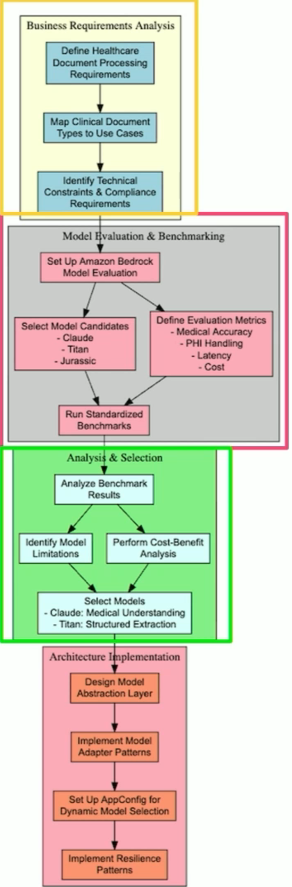
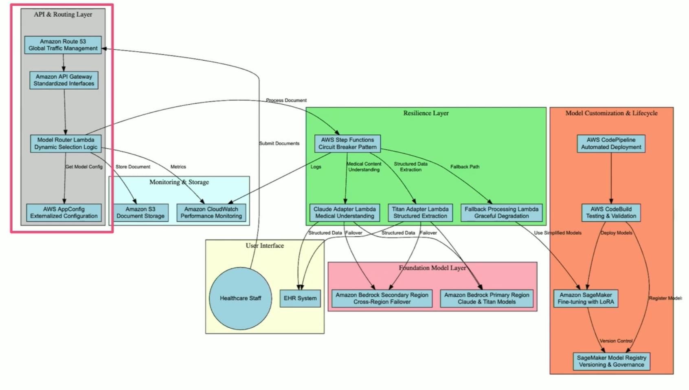
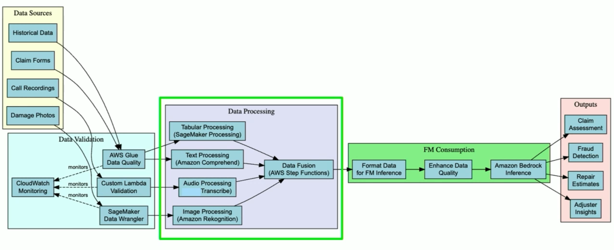
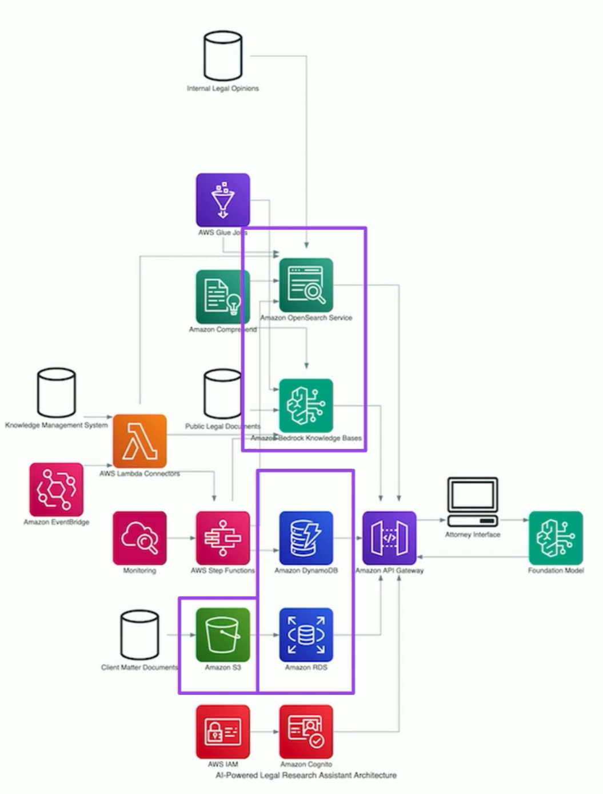
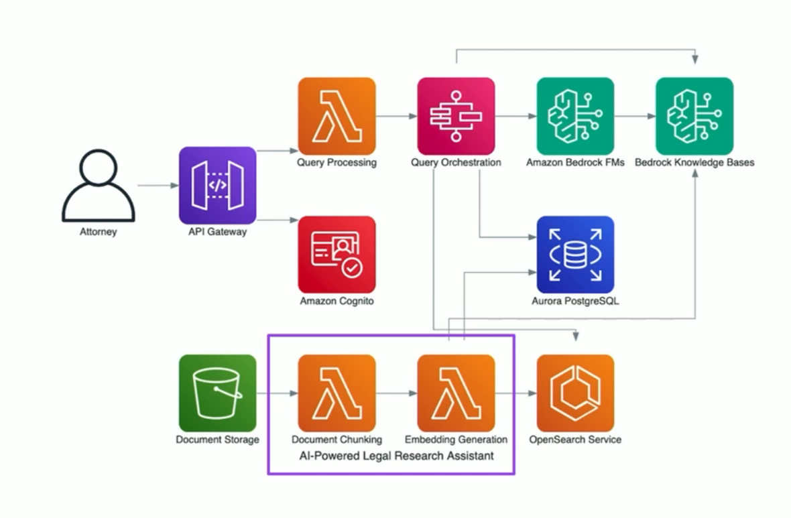
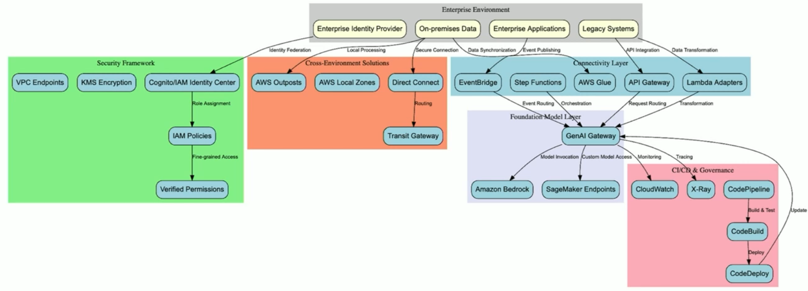
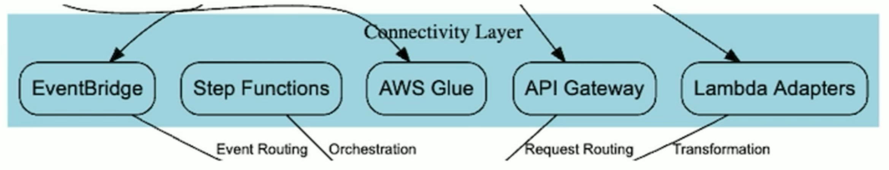
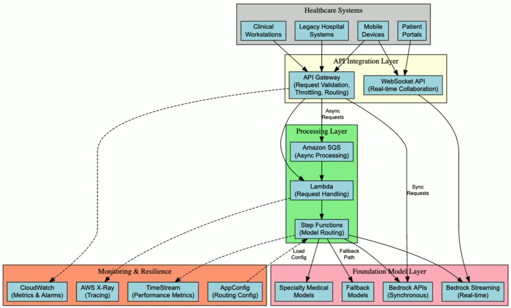
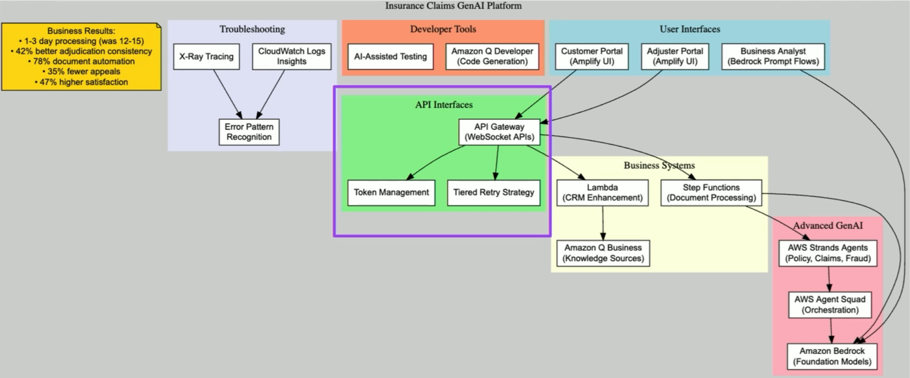

# AWS CGAID-P Official Training

# Content Domain 1: Foundation Model Integration, Data Management, and Compliance


## Task 1.1: Analyze requirements and design GenAI solutions
This lesson is a high-level overview of the first task statement and how it aligns to the GenAI developer role.

As you review these lessons for Task 1.1, check that you understand how to do the following:

- Create comprehensive architectural designs by using appropriate FMs, integration patterns, and deployment strategies that align with specific business needs and technical constraints.

- Develop technical proof-of-concept implementations by using Amazon Bedrock to validate feasibility, performance characteristics, and business value before proceeding to full-scale deployment.

- Create standardized technical components by using the AWS Well-Architected Framework and AWS Well-Architected Tool (AWS WA Tool) Generative AI Lens to ensure consistent implementation across different deployment scenarios.


### Review AWS Services
This lesson reviews the AWS services that help GenAI developers analyze requirements and design GenAI solutions.

**AWS services overview**

AWS offers services and tools to help analyze requirements and design GenAI solutions. These include **Amazon Bedrock, Amazon Bedrock Knowledge Bases, Foundation Models (FMs) integration patterns, constraints, and deployment strategies, Amazon Q, Amazon SageMaker AI, Amazon SageMaker AI Pipelines, AWS Well-Architected Framework, AWS WA Tool Generative AI Lens**, and more.

Understanding these services, how to configure them for specific use cases, and when to use them is crucial to your knowledge as a GenAI developer. 

Use the following information to review your knowledge about these services.


#### Creating comprehensive architectural designs

As a GenAI developer, you need to understand how to create comprehensive architectural designs. 

**Ensure you understand how to do the following:**

- Understand how to use **Amazon Bedrock** for accessing FMs from leading AI companies, including AI21 Labs, Anthropic, Cohere, Meta, Stability AI, and Amazon through a unified API for rapid experimentation and deployment.

- Learn integration patterns specific to GenAI applications, particularly for workflows involving agentic orchestration and Retrieval Augmented Generation (RAG), which require tailored integration strategies.

- Implement event-driven integration patterns using services like **Amazon Simple Queue Service (Amazon SQS), Apache Kafka**, publish-subscribe (pub/sub) systems, webhooks, and event streaming platforms for GenAI solution integration with downstream systems.

- Design serverless GenAI architectures using **AWS AppSync** as an API layer to use GraphQL benefits, such as declarative data fetching, serverless caching, security controls, and direct Amazon Bedrock integration. 


#### Developing technical PoC implementations
As a GenAI developer, you need to understand how to develop technical PoC implementations. 

**Ensure you understand how to do the following:**

- Use **Amazon Bedrock** for rapid experimentation with pre-trained models, allowing customization for specific use cases and integration into applications without managing complex infrastructure.

- Implement **Amazon Bedrock Knowledge Bases** for RAG-based chat assistants, which streamlines setting up vector databases to query custom documents and integrates with services like Amazon S3, Microsoft SharePoint, and Atlassian Confluence.

- Use the **Generative AI Application Builder on AWS** to accelerate development and streamline experimentation without requiring deep AI experience, using pre-built connectors to various large language models (LLMs) through Amazon Bedrock.

Explore advanced **Amazon Bedrock features**, including Knowledge Bases for implementing the entire RAG workflow, Prompt Management for creating versioned reusable prompt templates, Flows for chaining multiple AI operations, and Agents for task automation.


#### Creating standardized technical components
As a GenAI developer, you need to understand how to create standardized technical components. 

**Ensure you understand how to do the following:**

- Apply the **AWS Well-Architected Framework** and **Generative AI Lens** to implement best practices for building business applications with Amazon Q, Amazon Bedrock, and Amazon SageMaker AI.

- Implement **GenAIOps practices** to optimize the application lifecycle, using resources like Amazon SageMaker AI Pipelines and MLflow for LLM experimentation at scale.

- Design infrastructure components that support GenAI applications, including **Amazon Elastic Compute Cloud (Amazon EC2)** for running applications, **Amazon S3** for storing data and outputs, **Amazon CloudWatch** for monitoring, and **AWS Lambda** for serverless event-driven GenAI applications.

- Study architectural patterns for Amazon Bedrock applications, focusing on advanced service integration techniques and implementation patterns for generative AI workloads.

### Self Assessment

> When answering questions, **pause and identify keywords and phrases** in the question. Understanding what the question is asking will help you choose the best answer option.


1.1.1 **Your company needs to implement a customer support chatbot that can handle routine inquiries and escalate complex issues to human agents. The chatbot should integrate with your existing customer relationship management (CRM) system and maintain context throughout conversations.**

**Which integration pattern would be most appropriate for this solution?**

- Synchronous API integration with direct calls to Amazon Bedrock
- Asynchronous batch processing using Amazon SQS and Lambda
- Orchestrated workflow using AWS Step Functions with retrieval-augmented generation
- Streaming integration using Amazon Kinesis and real-time analytics

1.1.2 **A financial services company wants to implement a generative AI solution for summarizing lengthy financial documents and extracting key financial metrics. The solution must have high accuracy for financial terminology and maintain data privacy.**

**Which foundation model approach in Amazon Bedrock would be most appropriate?**

- Use Claude 3 Sonnet with few-shot prompting for financial summarization
- Use Llama 3 with RAG (Retrieval-Augmented Generation) for document processing
- Fine-tune Titan Text model on proprietary financial documents
- Use Amazon Bedrock Knowledge Bases with Anthropic Claude and company-specific financial data


### Review AWS Skills
This lesson reviews AWS skills to analyze requirements and design GenAI solutions.

#### Create comprehensive architectural designs

For the exam, ensure you understand how to create comprehensive architectural designs.

**Ensure you understand how to configure and implement the following steps:**

1. Evaluate business requirements to select appropriate FMs from Amazon Bedrock's catalog, including AI21 Labs, Anthropic, Cohere, Meta, Stability AI, and Amazon models, based on specific use case needs.
2. Design integration patterns for GenAI applications by determining whether to implement RAG, agentic orchestration, or hybrid approaches based on data access requirements and response quality needs.
3. Architect event-driven integration patterns using Amazon Simple Queue Service (Amazon SQS), Apache Kafka, or other pub/sub systems to ensure that GenAI solutions can effectively communicate with downstream systems.
4. Implement serverless GenAI architectures with AWS AppSync as the API layer to use GraphQL capabilities, including declarative data fetching and built-in security controls.
5. Develop appropriate deployment strategies considering factors such as model size, latency requirements, cost constraints, and scaling needs to determine optimal hosting options.

#### Develop technical PoC implementations

For the exam, ensure you understand how to develop technical PoC implementations.

**Ensure you understand how to configure and implement the following steps:**

1. Set up Amazon Bedrock environments for rapid experimentation with pre-trained models, enabling customization for specific use cases without managing complex infrastructure.
2. Configure Knowledge Bases to implement RAG-based chat assistants by connecting to data sources like Amazon S3, Microsoft SharePoint, and Atlassian Confluence.
3. Use the Generative AI Application Builder on AWS to accelerate development through pre-built connectors and templates that streamline experimentation.
4. Implement Amazon Bedrock features, including Prompt Management for creating versioned templates, Flows for chaining AI operations, and Agents for task automation to build complete solutions.
5. Measure and evaluate performance characteristics, including response quality, latency, throughput, and cost to validate business value before proceeding to full-scale deployment.

####Standardize technical components

For the exam, ensure you understand how to standardize technical components.

**Ensure you understand how to configure and implement the following steps:**

1. Apply the AWS Well-Architected Framework and Generative AI Lens to implement best practices for operational excellence, security, reliability, performance efficiency, and cost optimization.
2. Establish GenAIOps practices using Amazon SageMaker AI Pipelines and MLflow to standardize experimentation, model training, and deployment workflows.
3. Design reusable infrastructure components, including Amazon EC2 for applications, Amazon S3 for data storage, CloudWatch for monitoring, and Lambda for serverless event handling.
4. Create standardized architectural patterns for Amazon Bedrock applications that can be consistently implemented across multiple deployment scenarios.
5. Implement governance frameworks for prompt management, model versioning, and access controls to ensure consistent security and compliance across all GenAI implementations.
6. Develop standardized evaluation metrics and testing procedures to consistently measure model performance, bias, and alignment with business objectives across deployments.

### Self Assessment

1.1.3 **A customer service department wants to implement a generative AI solution to draft email responses to customer inquiries. The business requirements include maintaining brand voice, ensuring factual accuracy, and reducing response time.**

**Which architectural component would be LEAST important for meeting these requirements?**

- A content filtering system to detect and prevent inappropriate responses
- A human-in-the-loop review process for complex or sensitive inquiries
- A knowledge base integration to provide up-to-date product information
- A multi-modal foundation model that can process images and text

1.1.4 **Your company is developing a generative AI application that will process sensitive internal documents to answer employee questions. The application must remain within your company's network boundary and cannot send data to external services.**

**Which deployment strategy would best meet these requirements?**

- Use Amazon Bedrock with a private VPC endpoint and data encryption
- Deploy foundation models on Amazon SageMaker with model parallelism
- Implement Amazon Bedrock Knowledge Bases with cross-region replication
- Use AWS Inferentia instances with locally deployed open-source models


## Task 1.2: Select and configure FMs
### Assessing and choosing FMs
As a GenAI developer, you need to understand how to assess and choose FMs. 
	
**Ensure you understand how to do the following:**
	
  * Understand how to evaluate FMs in Amazon Bedrock using comprehensive performance benchmarks across dimensions, including reasoning, knowledge, safety, and multilingual capabilities to ensure alignment with business requirements.
	
  * Learn capability analysis techniques for FMs by evaluating their context window sizes, token limits, and specialized capabilities, such as code generation, mathematical reasoning, and multimodal processing.
	
  * Develop systematic approaches to limitation evaluation by identifying model hallucinations, biases, and knowledge cutoff dates to determine their impact on specific business use cases.
	
  * Implement structured evaluation frameworks using Amazon Bedrock Model Evaluation to compare model performance across multiple dimensions and select optimal models for specific tasks.
	
  * Analyze cost-performance tradeoffs between different FMs by considering inference costs, throughput requirements, and latency constraints to optimize for both business value and technical efficiency.
	
	
####	Creating flexible architecture patterns
As a GenAI developer, you need to understand how to create flexible architecture patterns. 
	
**Ensure you understand how to do the following:**
	
  * Design abstraction layers using Lambda functions that separate business logic from model-specific implementation details to enable seamless model switching.
	
  * Implement API Gateway with custom authorizers and request/response transformations to standardize interfaces regardless of the underlying FM being used.
	
  * Use AWS AppConfig to externalize model selection parameters, allowing runtime configuration changes without code deployments or service interruptions.
	
  * Create adapter patterns that normalize inputs and outputs across different FMs, ensuring consistent application behavior regardless of the model provider.
	
  * Develop feature flag systems using AWS AppConfig that enable gradual rollout of new models, A/B testing between models, and quick rollbacks if performance issues arise.
	
	
#### Designing resilient AI systems
As a GenAI developer, you need to understand how to design resilient AI systems. 
	
**Ensure you understand how to do the following:**
	
  * Implement Step Functions circuit breaker patterns to detect model failures and automatically route requests to fallback models or degraded service modes.
	
  * Configure Amazon Bedrock Cross-Region Inference to ensure high availability by routing requests to alternative AWS Regions when primary Regions experience disruptions.
	
  * Design multi-model ensembling strategies that combine outputs from multiple FMs to improve reliability and accuracy while reducing dependency on any single model.
	
  * Develop graceful degradation strategies that maintain core functionality through more basic models or rule-based systems when advanced FMs are unavailable.
	
  * Implement comprehensive monitoring using CloudWatch with custom metrics and alarms to detect model performance degradation and trigger automated remediation actions.
	
	
#### Implementing FM customization and lifecycle management
As a GenAI developer, you need to understand how to design implement FM customization and lifecycle management.
	
**Ensure you understand how to do the following:**
	
  * Learn domain-specific fine-tuning techniques using Amazon SageMaker AI to adapt FMs to specialized use cases while maintaining their general capabilities.
	
  * Implement parameter-efficient adaptation techniques like Low-Rank Adaptation (LoRA) and adapters to reduce computational requirements while achieving comparable performance to full fine-tuning.
	
  * Use Amazon SageMaker Model Registry for versioning customized models, tracking lineage, and managing approval workflows for model deployment.
	
  * Design automated deployment pipelines using AWS CodePipeline and AWS CodeBuild to systematically test, validate, and deploy updated FMs.
	
  * Implement comprehensive rollback strategies using blue/green deployments and canary releases to quickly revert to previous model versions when issues are detected.
	
  * Establish lifecycle management processes for FMs, including regular evaluation, scheduled updates, and retirement criteria to ensure that models remain current and effective.

### Self Assessment
1.2.1 **Your team needs to adapt a foundation model for a specialized medical domain without extensive retraining.**

**Which parameter-efficient adaptation technique would be most appropriate for this scenario?**

- Full model fine-tuning with gradient descent
- Low-Rank Adaptation (LoRA)
- Prompt engineering with few-shot examples
- Creating a new model from scratch using transfer learning

1.2.2 **Your company is deploying a critical AI application that uses Amazon Bedrock models. The application must remain operational even if a single AWS region experiences an outage.**

**Which approach would provide the most effective cross-region resilience?**

- Deploy the application in a single region with multiple Availability Zones
- Implement Amazon Bedrock Cross-Region Inference with automatic failover
- Create separate, independent deployments in multiple regions with DNS-based routing
- Use AWS Global Accelerator to route requests to the nearest available region

### Review AWS Skills
This lesson reviews AWS skills to select and configure FMs.
	
**Assess and choose FMs**
	
For the exam, ensure you understand how to assess and choose FMs.
	
Ensure you understand how to configure and implement the following steps:
	
1. Define evaluation criteria by mapping business requirements to specific FM capabilities, including reasoning depth, knowledge breadth, multilingual support, and specialized functions.

2. Set up systematic benchmarking using Model Evaluation to compare multiple FMs across standardized tasks relevant to your use case.

3. Analyze performance metrics across dimensions, including accuracy, latency, throughput, and cost, to identify optimal model candidates for specific business applications.

4. Conduct limitation analysis by testing edge cases, identifying knowledge cutoff impacts, and evaluating hallucination tendencies to understand potential risks.

5. Perform cost-benefit analysis by calculating total cost of ownership (TCO), including inference costs, integration complexity, and maintenance requirements for different foundation models.

6. Document model selection rationale with quantitative benchmarks and qualitative assessments to support decision-making and enable future reevaluation.
	
**Create flexible architecture patterns**
	
For the exam, ensure you understand how to create flexible architecture patterns.
	
Ensure you understand how to configure and implement the following steps:
	
1. Design an abstraction layer using Lambda functions that separates business logic from model-specific implementation details.

2. Implement standardized request and response formats in API Gateway to help ensure consistent interfaces, regardless of the underlying FM.

3. Configure AWS AppConfig to externalize model selection parameters, enabling runtime configuration changes without code deployments.

4. Create adapter patterns that normalize inputs and outputs across different FMs, ensuring consistent application behavior regardless of provider.

5. Implement a model router component using Lambda that dynamically selects the appropriate FM based on request characteristics and configuration settings.

6. Set up feature flags in AWS AppConfig to enable gradual rollout of new models, A/B testing between models, and quick rollbacks if performance issues arise.

**Design resilient AI systems**
	
For the exam, ensure you understand how to design resilient AI systems.
	
Ensure you understand how to configure and implement the following steps:
	
1. Implement circuit breaker patterns using Step Functions to detect FM failures and automatically route requests to fallback options.

2. Configure Amazon Bedrock Cross-Region Inference to ensure high availability by routing requests to alternative Regions during service disruptions.

3. Design multi-model ensembling strategies that combine outputs from multiple FMs to improve reliability while reducing dependency on any single model.

4. Implement timeout and retry mechanisms with exponential backoff using Lambda to handle transient failures in FM APIs.

5. Create graceful degradation pathways that maintain core functionality through more basic models or rule-based systems when advanced FMs are unavailable.

6. Set up comprehensive monitoring using CloudWatch with custom metrics and alarms to detect model performance degradation and trigger automated remediation actions.
	
**Implement FM customization and lifecycle management**
	
For the exam, ensure you understand how to implement FM customization and lifecycle management.

Ensure you understand how to configure and implement the following steps:

1. Prepare domain-specific datasets for fine-tuning by collecting, cleaning, and formatting data according to FM requirements.

2. Configure and execute fine-tuning jobs using Amazon SageMaker to adapt FMs to specialized use cases while maintaining their general capabilities.

3. Implement parameter-efficient adaptation techniques like LoRA using SageMaker AI to reduce computational requirements while achieving comparable performance to full fine-tuning.

4. Set up SageMaker Model Registry to version customized models, track lineage, and manage approval workflows for model deployment.

5. Design automated deployment pipelines using CodePipeline and CodeBuild to systematically test, validate, and deploy updated FMs.

6. Implement blue/green deployment patterns using Lambda aliases to enable seamless transitions between model versions and quick rollbacks when necessary.

7. Establish model monitoring processes using SageMaker Model Monitor to track drift, performance degradation, and other indicators that signal the need for model updates.

8. Create lifecycle management procedures including evaluation schedules, update criteria, and retirement processes to ensure that FMs remain current and effective throughout their lifecycle.

### Use Case

**Extract information and create reports**

A large healthcare provider with operations across North America needs to develop an Al system to analyze medical documents, extract key clinical information, and generate structured reports for their electronic health record (EHR) system. \
The solution needs to handle diverse document types including clinical notes, lab reports, radiology findings, and patient histories while maintaining strict compliance with Health Insurance Portability and Accountability Act of 1996 (HIPAA) regulations. \
The system requires 99.9% availability, high accuracy in medical terminology extraction, and the ability to adapt to evolving medical practices and terminology. 

**Architecture**


Step 1. FM Evaluation using Bedrock Model Evaluation to benchmark multiple FMs. 

Step 2. Consider performance metrics, Accuracy, privacyy, performance, etc.,

Step 3. Analyze results alongside operational constaraints, such as cost, latency, and scalability.

Step 4. Find the best FM for the use case, based on hallucination, knowledge cutoff, etc.,

**Architecture Patterns**

- Use AWS Lambda, API Gateway, and AWS AppConfig to create a serverless application.
- Use AWS Step Functions, Amazon Bedrock, and Amazon Route 53 to build a resilient AI system.
- Use Amazon CloudWatch to monitor and alert on AI system performance.

**Optimize Performance**
- SageMaker AI - configure and run fine-tuning jobs to adapt FMs to specialized medical use cases to conform with the requiremenst of the healthcare provider.
  - Low-Rank Adaptation (LoRA) - To reduce compute requirements while achieving comparable performance to full fine-tuning, use LoRA to adapt FMs to specialized medical use cases.

**Lifecycle Management**
- Use Amazon Sagemaker Model Registry to version customized models, track lineage, and manage approval workflows for model deployment.
- Use AWS CodePipeline and AWS CodeBuild to systematically test, validate, and deploy updated FMs.
- Use AWS Lambda aliases to enable seamless transitions between model versions and quick rollbacks when necessary.
- Use Amazon SageMaker Model Monitor to track drift, performance degradation, and other indicators that signal the need for model updates.
- Use Amazon CloudWatch to monitor and alert on AI system performance.

To complete model lifecycle management, create lifecycle management proceduresimplement knowledge management procedures to track and manage FM knowledge and updates, and implement evaluation schedules, update criteria, and retirement processes to ensure that FMs remain current and effective throughout their lifecycle.

#### Knowledge Check

### KNOWLEDGE CHECK

01/05
**In a system using AWS Step Functions for generative AI (GenAI) operations, which pattern BEST implements a circuit breaker for handling model failures?**

- Implementing exponential backoff within AWS Lambda functions
- Using Step Functions Choice states with error counts and timeouts
- Adding retries to Amazon API Gateway endpoints
- Implementing Amazon DynamoDB based error tracking
- Using Amazon EventBridge to trigger alternative workflows

02/05

**Which methods effectively support graceful degradation in a generative AI (GenAI) system? (Select TWO.)**

- Implementing fallback to more basic models with reduced capabilities
- Maintaining multiple model versions with capability tiering
- Returning cached responses for all requests during degradation
- Complete system shutdown during any model unavailability
- Switching to rule-based responses for all queries during degradation
- Routing all traffic to a single, generic model regardless of the original use case

03/05

**Which architectural patterns support dynamic model switching without code deployment when using Amazon Bedrock? (Select TWO.)**

- Using AWS AppConfig to store model configurations and AWS Lambda environment variables
- Implementing direct API calls with hardcoded model endpoints
- Using Amazon API Gateway with AWS Lambda integration and feature flags in AWS AppConfig
- Storing model selections in Amazon DynamoDB with direct access from applications
- Use AWS CloudFormation for model configuration

04/05

**Which combination of AWS services BEST supports Regional resilience for a mission-critical generative AI (GenAI) application?**

- Amazon Bedrock with multi-Region deployment and Amazon Route 53 health checks
- Cross-Region read replicas without active failover
- Amazon CloudFront distribution without Regional model deployment
- AWS Global Accelerator without Regional model redundancy

05/05

**When evaluating text summarization models in Amazon Bedrock for a production system that requires consistent performance, which evaluation result would indicate the BEST model selection?**
- The model demonstrates moderate fluctuation with a robustness score of 25.3%, producing notably different summaries when input text contains minor variations.
- The model shows minimal variation with a robustness score of 8.5%, maintaining consistent summary quality even when input text has slight variations or noise.
- The model exhibits high sensitivity with a robustness score of 42.1%, generating significantly different summaries for slightly modified input text.
- The model shows intermediate variation with a robustness score of 15.7%, with summary quality varying based on input text modifications.
- The model displays substantial inconsistency with a robustness score of 33.9%, producing unpredictable summaries when input text is slightly altered.


### Bonus Assignment

Now, you will have an opportunity to build a resilient AI system that dynamically selects between different foundation models based on performance, availability, and use case requirements.

You'll implement a flexible architecture that allows for seamless model switching and ensures continuous operation during service disruptions.

Bonus assignments are an open-ended way for you to assess your overall knowledge of this task. You can share your answers on social media and tag #awsexamprep for us to review.


#### Scenario

You're building a customer service AI assistant for a financial services company. The assistant needs to:

- Answer product questions based on company documentation
- Generate personalized responses to customer inquiries
- Maintain high availability and consistent performance
- Comply with financial industry regulations

#### Part 1: Foundation Model assessment and benchmarking

Set up a benchmarking framework to evaluate different Amazon Bedrock models

Compare models based on:

- Response quality for financial domain questions
- Latency and throughput
- Cost per request
- Compliance with guardrails

#### Step 2. Flexible architecture for dynamic model selection

- Implement a model abstraction layer using AWS Lambda
- Configure AWS AppConfig for dynamic model selection rules
- Create an API Gateway endpoint for consistent client access

#### Step 3. Resilient system design

- Implement AWS Step Functions with circuit breaker patterns
- Set up cross-region model deployment for high availability
- Create graceful degradation strategies for service disruptions

#### Step 4. Model customization and lifecycle management

- Fine-tune a model for financial domain using Amazon SageMaker
- Implement model versioning and deployment workflows
- Create automated testing and rollback strategies

#### Part 1: Foundation Model assessment and benchmarking

Step 1: Set up evaluation framework

Create a Python script to evaluate models using Amazon Bedrock:

```python
import boto3
import json
import time
import pandas as pd
from concurrent.futures import ThreadPoolExecutor

# Initialize Bedrock client
bedrock_runtime = boto3.client('bedrock-runtime')

# Models to evaluate
models = [
    "anthropic.claude-3-sonnet-20240229-v1:0",
    "anthropic.claude-instant-v1",
    "amazon.titan-text-express-v1"
]

# Test cases with ground truth answers
test_cases = [
    {
        "question": "What is a 401(k) retirement plan?",
        "context": "Financial services",
        "ground_truth": "A 401(k) is a tax-advantaged retirement savings plan offered by employers."
    },
    # Add more test cases...
]

def invoke_model(model_id, prompt, max_tokens=500):
    """Invoke a model with the given prompt and return the response and metrics."""
    start_time = time.time()
    
    # Prepare request body based on model provider
    if "anthropic" in model_id:
        body = json.dumps({
            "anthropic_version": "bedrock-2023-05-31",
            "max_tokens": max_tokens,
            "messages": [
                {"role": "user", "content": prompt}
            ]
        })
    elif "amazon" in model_id:
        body = json.dumps({
            "inputText": prompt,
            "textGenerationConfig": {
                "maxTokenCount": max_tokens,
                "temperature": 0.7,
                "topP": 0.9
            }
        })
    # Add more model providers as needed
    
    try:
        # Invoke the model
        response = bedrock_runtime.invoke_model(
            modelId=model_id,
            body=body
        )
        
        # Parse the response
        response_body = json.loads(response['body'].read().decode())
        
        if "anthropic" in model_id:
            output = response_body['content'][0]['text']
        elif "amazon" in model_id:
            output = response_body['results'][0]['outputText']
        
        # Calculate metrics
        latency = time.time() - start_time
        token_count = len(output.split())  # Rough estimate
        
        return {
            "success": True,
            "output": output,
            "latency": latency,
            "token_count": token_count
        }
    except Exception as e:
        return {
            "success": False,
            "error": str(e),
            "latency": time.time() - start_time
        }

def evaluate_models():
    """Evaluate all models on all test cases and return results."""
    results = []
    
    for test_case in test_cases:
        prompt = f"Question: {test_case['question']}\nContext: {test_case['context']}"
        
        for model_id in models:
            print(f"Evaluating {model_id} on: {test_case['question']}")
            response = invoke_model(model_id, prompt)
            
            if response["success"]:
                # Calculate similarity score with ground truth (simplified)
                similarity = calculate_similarity(response["output"], test_case["ground_truth"])
                
                results.append({
                    "model_id": model_id,
                    "question": test_case["question"],
                    "output": response["output"],
                    "latency": response["latency"],
                    "token_count": response["token_count"],
                    "similarity_score": similarity
                })
            else:
                results.append({
                    "model_id": model_id,
                    "question": test_case["question"],
                    "error": response["error"],
                    "latency": response["latency"]
                })
    
    return pd.DataFrame(results)

def calculate_similarity(output, ground_truth):
    """Calculate similarity between model output and ground truth (simplified)."""
    # In a real implementation, use more sophisticated NLP techniques
    # This is a very simplified version
    output_words = set(output.lower().split())
    truth_words = set(ground_truth.lower().split())
    
    if not truth_words:
        return 0.0
        
    common_words = output_words.intersection(truth_words)
    return len(common_words) / len(truth_words)

# Run evaluation
if __name__ == "__main__":
    results_df = evaluate_models()
    
    # Save results to CSV
    results_df.to_csv("model_evaluation_results.csv", index=False)
    
    # Print summary
    print("\nEvaluation Summary:")
    summary = results_df.groupby("model_id").agg({
        "latency": "mean",
        "similarity_score": "mean",
        "token_count": "mean"
    }).reset_index()
    
    print(summary)
Step 2: Analyze results and create a model selection strategy

Create a selection strategy based on your benchmark results:


def create_model_selection_strategy(results_df):
    """Create a model selection strategy based on evaluation results."""
    # Calculate overall scores
    model_scores = results_df.groupby("model_id").agg({
        "latency": "mean",
        "similarity_score": "mean"
    }).reset_index()
    
    # Normalize scores (lower latency is better, higher similarity is better)
    max_latency = model_scores["latency"].max()
    model_scores["latency_score"] = 1 - (model_scores["latency"] / max_latency)
    
    # Calculate weighted score (adjust weights based on priorities)
    model_scores["overall_score"] = (
        0.7 * model_scores["similarity_score"] + 
        0.3 * model_scores["latency_score"]
    )
    
    # Sort by overall score
    model_scores = model_scores.sort_values("overall_score", ascending=False)
    
    # Create strategy
    strategy = {
        "primary_model": model_scores.iloc[0]["model_id"],
        "fallback_models": model_scores.iloc[1:]["model_id"].tolist(),
        "model_scores": model_scores.to_dict(orient="records")
    }
    
    return strategy

# Generate strategy
strategy = create_model_selection_strategy(results_df)
print(json.dumps(strategy, indent=2))

# Save strategy to file for AppConfig
with open("model_selection_strategy.json", "w") as f:
    json.dump(strategy, f, indent=2)

```

#### Part 2: Flexiable architecture for dynamic model selection

**Step 1: Create AWS AppConfig for model configuration**

Set up AWS AppConfig using AWS CLI or console:


```bash
# Create application
aws appconfig create-application --name "AIAssistantApp"

# Create environment
aws appconfig create-environment --application-id YOUR_APP_ID --name "Production"

# Create configuration profile
aws appconfig create-configuration-profile \
    --application-id YOUR_APP_ID \
    --name "ModelSelectionStrategy" \
    --location-uri "hosted" \
    --type "AWS.AppConfig.FeatureFlags"

# Create and deploy configuration
aws appconfig create-hosted-configuration-version \
    --application-id YOUR_APP_ID \
    --configuration-profile-id YOUR_PROFILE_ID \
    --content-type "application/json" \
    --content file://model_selection_strategy.json

# Deploy configuration
aws appconfig start-deployment \
    --application-id YOUR_APP_ID \
    --environment-id YOUR_ENV_ID \
    --configuration-profile-id YOUR_PROFILE_ID \
    --configuration-version 1 \
    --deployment-strategy-id YOUR_STRATEGY_ID

```
Step 2: Create model abstraction Lambda

Create a Lambda function for model abstraction:

```python
import boto3
import json
import os

def lambda_handler(event, context):
    # Get AppConfig configuration
    appconfig_client = boto3.client('appconfig')
    config_response = appconfig_client.get_configuration(
        Application='AIAssistantApp',
        Environment='Production',
        Configuration='ModelSelectionStrategy',
        ClientId='AIAssistantLambda'
    )
    
    # Parse configuration
    config = json.loads(config_response['Content'].read().decode('utf-8'))
    
    # Extract request details
    body = json.loads(event.get('body', '{}'))
    prompt = body.get('prompt', '')
    use_case = body.get('use_case', 'general')
    
    # Select model based on use case and configuration
    model_id = select_model(config, use_case)
    
    # Invoke selected model
    response = invoke_model(model_id, prompt)
    
    return {
        'statusCode': 200,
        'body': json.dumps({
            'model_used': model_id,
            'response': response
        })
    }

def select_model(config, use_case):
    """Select appropriate model based on configuration and use case."""
    # Check if there's a use case specific model
    use_case_models = config.get('use_case_models', {})
    if use_case in use_case_models:
        return use_case_models[use_case]
    
    # Default to primary model
    return config.get('primary_model')

def invoke_model(model_id, prompt):
    """Invoke the selected model with error handling."""
    bedrock_runtime = boto3.client('bedrock-runtime')
    
    try:
        # Prepare request body based on model provider
        if "anthropic" in model_id:
            body = json.dumps({
                "anthropic_version": "bedrock-2023-05-31",
                "max_tokens": 500,
                "messages": [
                    {"role": "user", "content": prompt}
                ]
            })
        elif "amazon" in model_id:
            body = json.dumps({
                "inputText": prompt,
                "textGenerationConfig": {
                    "maxTokenCount": 500,
                    "temperature": 0.7,
                    "topP": 0.9
                }
            })
        # Add more model providers as needed
        
        # Invoke the model
        response = bedrock_runtime.invoke_model(
            modelId=model_id,
            body=body
        )
        
        # Parse the response
        response_body = json.loads(response['body'].read().decode())
        
        if "anthropic" in model_id:
            return response_body['content'][0]['text']
        elif "amazon" in model_id:
            return response_body['results'][0]['outputText']
        
    except Exception as e:
        print(f"Error invoking model {model_id}: {str(e)}")
        # Return error message or try fallback model
        return f"Error generating response: {str(e)}"

```

Step 3: Set Up API Gateway

Create an API Gateway REST API:

```bash
# Create API
aws apigateway create-rest-api --name "AIAssistantAPI"

# Get root resource ID
ROOT_ID=$(aws apigateway get-resources --rest-api-id YOUR_API_ID --query 'items[0].id' --output text)

# Create resource
aws apigateway create-resource --rest-api-id YOUR_API_ID --parent-id $ROOT_ID --path-part "generate"

# Create POST method
aws apigateway put-method --rest-api-id YOUR_API_ID --resource-id YOUR_RESOURCE_ID --http-method POST --authorization-type "NONE"

# Set up Lambda integration
aws apigateway put-integration --rest-api-id YOUR_API_ID --resource-id YOUR_RESOURCE_ID --http-method POST --type AWS_PROXY --integration-http-method POST --uri "arn:aws:apigateway:REGION:lambda:path/2015-03-31/functions/YOUR_LAMBDA_ARN/invocations"

# Deploy API
aws apigateway create-deployment --rest-api-id YOUR_API_ID --stage-name "prod"
```

#### Part 3: Resilient system design

**Step 1: Create Step Functions workflow with circuit breaker**

Create a Step Functions state machine definition:

```json
{
  "Comment": "AI Assistant with Circuit Breaker Pattern",
  "StartAt": "TryPrimaryModel",
  "States": {
    "TryPrimaryModel": {
      "Type": "Task",
      "Resource": "arn:aws:states:::lambda:invoke",
      "Parameters": {
        "FunctionName": "${PrimaryModelLambdaArn}",
        "Payload": {
          "prompt.$": "$.prompt",
          "use_case.$": "$.use_case"
        }
      },
      "Retry": [
        {
          "ErrorEquals": ["States.TaskFailed"],
          "IntervalSeconds": 1,
          "MaxAttempts": 2,
          "BackoffRate": 2
        }
      ],
      "Catch": [
        {
          "ErrorEquals": ["States.ALL"],
          "Next": "TryFallbackModel"
        }
      ],
      "Next": "SuccessState"
    },
    "TryFallbackModel": {
      "Type": "Task",
      "Resource": "arn:aws:states:::lambda:invoke",
      "Parameters": {
        "FunctionName": "${FallbackModelLambdaArn}",
        "Payload": {
          "prompt.$": "$.prompt",
          "use_case.$": "$.use_case",
          "is_fallback": true
        }
      },
      "Retry": [
        {
          "ErrorEquals": ["States.TaskFailed"],
          "IntervalSeconds": 1,
          "MaxAttempts": 2,
          "BackoffRate": 2
        }
      ],
      "Catch": [
        {
          "ErrorEquals": ["States.ALL"],
          "Next": "GracefulDegradation"
        }
      ],
      "Next": "SuccessState"
    },
    "GracefulDegradation": {
      "Type": "Task",
      "Resource": "arn:aws:states:::lambda:invoke",
      "Parameters": {
        "FunctionName": "${DegradationLambdaArn}",
        "Payload": {
          "prompt.$": "$.prompt",
          "use_case.$": "$.use_case"
        }
      },
      "Next": "SuccessState"
    },
    "SuccessState": {
      "Type": "Succeed"
    }
  }
}
```

Create the fallback model Lambda:

```python
import boto3
import json

def lambda_handler(event, context):
    """Fallback model handler that uses a simpler, more reliable model."""
    prompt = event.get('prompt', '')
    use_case = event.get('use_case', 'general')
    
    # Use a simpler, more reliable model
    model_id = "amazon.titan-text-express-v1"  # Example fallback model
    
    try:
        # Invoke the model with simplified parameters
        bedrock_runtime = boto3.client('bedrock-runtime')
        response = bedrock_runtime.invoke_model(
            modelId=model_id,
            body=json.dumps({
                "inputText": prompt,
                "textGenerationConfig": {
                    "maxTokenCount": 300,  # Reduced for reliability
                    "temperature": 0.5,
                    "topP": 0.9
                }
            })
        )
        
        response_body = json.loads(response['body'].read().decode())
        output = response_body['results'][0]['outputText']
        
        return {
            'statusCode': 200,
            'body': json.dumps({
                'model_used': f"FALLBACK:{model_id}",
                'response': output
            })
        }
    except Exception as e:
        # Let Step Functions catch this and move to graceful degradation
        raise Exception(f"Fallback model failed: {str(e)}")

```

Create the graceful degradation Lambda:

```python
import json

def lambda_handler(event, context):
    """Graceful degradation handler that returns a predefined response."""
    prompt = event.get('prompt', '')
    use_case = event.get('use_case', 'general')
    
    # Provide a graceful response based on the use case
    responses = {
        "general": "I'm sorry, but I'm currently experiencing technical difficulties. Please try again later or contact customer service for immediate assistance.",
        "product_question": "I apologize, but I can't access product information right now. Please refer to our product documentation or contact customer service at 1-800-555-1234.",
        "account_inquiry": "I'm unable to process account inquiries at the moment. For urgent matters, please call our customer service line at 1-800-555-1234."
    }
    
    default_response = "I'm sorry, but I'm currently experiencing technical difficulties. Please try again later."
    response_text = responses.get(use_case, default_response)
    
    return {
        'statusCode': 200,
        'body': json.dumps({
            'model_used': "DEGRADED_SERVICE",
            'response': response_text
        })
    }
```

**Step 2: Set up cross-Region deployment**

Create a CloudFormation template for cross-Region deployment:

```yaml
AWSTemplateFormatVersion: '2010-09-09'
Description: 'AI Assistant Cross-Region Deployment'

Parameters:
  Environment:
    Type: String
    Default: prod
    AllowedValues:
      - dev
      - prod
    Description: Deployment environment

Resources:
  ModelAbstractionLambda:
    Type: AWS::Lambda::Function
    Properties:
      FunctionName: !Sub "ai-assistant-model-abstraction-${Environment}"
      Handler: index.lambda_handler
      Role: !GetAtt LambdaExecutionRole.Arn
      Runtime: python3.9
      Timeout: 30
      MemorySize: 256
      Code:
        ZipFile: |
          import boto3
          import json
          import os
          
          def lambda_handler(event, context):
              # Implementation as shown earlier
              pass
  
  LambdaExecutionRole:
    Type: AWS::IAM::Role
    Properties:
      AssumeRolePolicyDocument:
        Version: '2012-10-17'
        Statement:
          - Effect: Allow
            Principal:
              Service: lambda.amazonaws.com
            Action: 'sts:AssumeRole'
      ManagedPolicyArns:
        - 'arn:aws:iam::aws:policy/service-role/AWSLambdaBasicExecutionRole'
      Policies:
        - PolicyName: BedrockAccess
          PolicyDocument:
            Version: '2012-10-17'
            Statement:
              - Effect: Allow
                Action:
                  - 'bedrock:InvokeModel'
                  - 'bedrock-runtime:InvokeModel'
                Resource: '*'
        - PolicyName: AppConfigAccess
          PolicyDocument:
            Version: '2012-10-17'
            Statement:
              - Effect: Allow
                Action:
                  - 'appconfig:GetConfiguration'
                Resource: '*'
  
  ApiGateway:
    Type: AWS::ApiGateway::RestApi
    Properties:
      Name: !Sub "ai-assistant-api-${Environment}"
      Description: API for AI Assistant
  
  ApiResource:
    Type: AWS::ApiGateway::Resource
    Properties:
      RestApiId: !Ref ApiGateway
      ParentId: !GetAtt ApiGateway.RootResourceId
      PathPart: "generate"
  
  ApiMethod:
    Type: AWS::ApiGateway::Method
    Properties:
      RestApiId: !Ref ApiGateway
      ResourceId: !Ref ApiResource
      HttpMethod: POST
      AuthorizationType: NONE
      Integration:
        Type: AWS_PROXY
        IntegrationHttpMethod: POST
        Uri: !Sub "arn:aws:apigateway:${AWS::Region}:lambda:path/2015-03-31/functions/${ModelAbstractionLambda.Arn}/invocations"
  
  ApiDeployment:
    Type: AWS::ApiGateway::Deployment
    DependsOn: ApiMethod
    Properties:
      RestApiId: !Ref ApiGateway
      StageName: !Ref Environment

Outputs:
  ApiEndpoint:
    Description: API Gateway endpoint URL
    Value: !Sub "https://${ApiGateway}.execute-api.${AWS::Region}.amazonaws.com/${Environment}/generate"
  LambdaArn:
    Description: Lambda function ARN
    Value: !GetAtt ModelAbstractionLambda.Arn
Deploy the CloudFormation template to multiple Regions:


# Deploy to primary region
aws cloudformation deploy \
    --template-file template.yaml \
    --stack-name ai-assistant-stack \
    --parameter-overrides Environment=prod \
    --region us-east-1 \
    --capabilities CAPABILITY_IAM

# Deploy to secondary region
aws cloudformation deploy \
    --template-file template.yaml \
    --stack-name ai-assistant-stack \
    --parameter-overrides Environment=prod \
    --region us-west-2 \
    --capabilities CAPABILITY_IAM
Set up Route 53 for cross-Region routing:


# Create health check for primary region
aws route53 create-health-check \
    --caller-reference $(date +%s) \
    --health-check-config "Port=443,Type=HTTPS,ResourcePath=/prod/generate,FullyQualifiedDomainName=YOUR_API_ID.execute-api.us-east-1.amazonaws.com,RequestInterval=30,FailureThreshold=3"

# Create hosted zone (if you don't have one)
aws route53 create-hosted-zone \
    --name yourdomain.com \
    --caller-reference $(date +%s)

# Create DNS records with failover routing policy
aws route53 change-resource-record-sets \
    --hosted-zone-id YOUR_HOSTED_ZONE_ID \
    --change-batch '{
        "Changes": [
            {
                "Action": "CREATE",
                "ResourceRecordSet": {
                    "Name": "ai-assistant.yourdomain.com",
                    "Type": "A",
                    "SetIdentifier": "Primary",
                    "Failover": "PRIMARY",
                    "AliasTarget": {
                        "HostedZoneId": "Z1UJRXOUMOOFQ8",
                        "DNSName": "YOUR_API_ID.execute-api.us-east-1.amazonaws.com",
                        "EvaluateTargetHealth": true
                    },
                    "HealthCheckId": "YOUR_HEALTH_CHECK_ID"
                }
            },
            {
                "Action": "CREATE",
                "ResourceRecordSet": {
                    "Name": "ai-assistant.yourdomain.com",
                    "Type": "A",
                    "SetIdentifier": "Secondary",
                    "Failover": "SECONDARY",
                    "AliasTarget": {
                        "HostedZoneId": "Z2OJLYMUO9EFXC",
                        "DNSName": "YOUR_API_ID.execute-api.us-west-2.amazonaws.com",
                        "EvaluateTargetHealth": true
                    }
                }
            }
        ]
    }'
```

#### Part 4: Model customization and lifecycle management

**Step 1: Fine-tune a model with SageMaker**

Prepare a fine-tuning dataset:

```python
import pandas as pd
import json

# Create a financial Q&A dataset
data = [
    {"question": "What is a 401(k)?", "answer": "A 401(k) is a tax-advantaged retirement savings plan offered by employers."},
    {"question": "How does compound interest work?", "answer": "Compound interest is when you earn interest on both the money you've saved and the interest you earn."},
    # Add more examples...
]

# Convert to DataFrame
df = pd.DataFrame(data)

# Save to CSV for SageMaker training
df.to_csv("financial_qa_dataset.csv", index=False)

# Create SageMaker training script
with open("train.py", "w") as f:
    f.write("""
import argparse
import os
import json
import pandas as pd
from transformers import AutoModelForCausalLM, AutoTokenizer, Trainer, TrainingArguments
from datasets import Dataset

def parse_args():
    parser = argparse.ArgumentParser()
    parser.add_argument("--model-dir", type=str, default=os.environ.get("SM_MODEL_DIR"))
    parser.add_argument("--training-dir", type=str, default=os.environ.get("SM_CHANNEL_TRAINING"))
    return parser.parse_args()

if __name__ == "__main__":
    args = parse_args()
    
    # Load dataset
    data_path = os.path.join(args.training_dir, "financial_qa_dataset.csv")
    df = pd.read_csv(data_path)
    
    # Prepare dataset
    def format_instruction(row):
        return f"Question: {row['question']}\\nAnswer: {row['answer']}"
    
    df["text"] = df.apply(format_instruction, axis=1)
    dataset = Dataset.from_pandas(df[["text"]])
    
    # Load model and tokenizer
    model_name = "distilgpt2"  # Use a smaller model for example purposes
    tokenizer = AutoTokenizer.from_pretrained(model_name)
    model = AutoModelForCausalLM.from_pretrained(model_name)
    
    # Tokenize dataset
    def tokenize_function(examples):
        return tokenizer(examples

```
Share your work with the AWS community

When you share your bonus assignments, the AWS Exam Prep team and others will be able to endorse you on LinkedIn for the skills you demonstrated in this project and in your preparations for your certification exam.

Write a short blog post explaining your learnings and your approach to the challenge.

Link to your project on GitHub.

Tag #awsexamprep, and the AWS Exam Prep team will review it.

**Disclaimer:**

This project is for educational purposes only and might lead to AWS service charges.\
You assume any risk associated with this project. You are responsible for any costs associated with your AWS account.

**Remember to do the following:**

Monitor your usage limits.

Set up billing alerts to avoid unexpected charges.

Clean up any test environments after completion.


## Task 1.3: Implement data validation and processing pipelines for FM consumption.

**AWS services overview**

AWS offers services and tools to help analyze requirements and design GenAI solutions. These include AWS Glue Data Quality, Amazon SageMaker Data Wrangler, AWS Lambda, Amazon CloudWatch, Amazon Bedrock, AWS Transcribe, SageMaker Processing, Amazon SageMaker AI endpoints, Amazon Comprehend, and more.

Understanding these services, how to configure them for specific use cases, and when to use them is crucial to your knowledge as a GenAI developer. 
	
Use the following information to review your knowledge about these services.


#### Creating comprehensive data validation workflows
As a GenAI developer, you need to understand how to create comprehensive data validation workflows. 

**Ensure you understand how to do the following:**

 * Understand how to implement AWS Glue Data Quality for automated data quality checks, including defining custom rules for validating data completeness, consistency, and accuracy before FM processing.

 * Learn Amazon SageMaker Data Wrangler capabilities for interactive data exploration and validation, using its built-in data quality visualizations to identify anomalies, outliers, and distribution shifts in training and inference data.

 * Develop custom Lambda functions for specialized validation logic that addresses domain-specific requirements not covered by off-the-shelf solutions, including complex business rules and contextual validation.

 * Implement comprehensive data quality monitoring using CloudWatch metrics to track validation results over time, setting up alarms for quality degradation and creating dashboards for visibility into data quality trends.

 * Design validation workflows that handle both structured and unstructured data types, applying appropriate validation techniques for text (coherence, language detection), images (resolution, format, content verification), and tabular data (schema validation, range checks).


#### Creating data processing workflows for complex data types
As a GenAI developer, you need to understand how to create data processing workflows for complex data types. 

**Ensure you understand how to do the following:**

 * Architect advanced multimodal pipeline architectures that can process diverse data types in parallel, coordinating their integration for foundation model consumption using Step Functions to orchestrate complex workflows.

 * Implement specialized image processing pipelines using Amazon Rekognition and SageMaker Processing to detect objects, crop relevant sections, normalize dimensions, and prepare images for multimodal foundation models.

 * Develop audio processing workflows using Amazon Transcribe for speech-to-text conversion, Amazon Comprehend for sentiment analysis, and custom processing for noise reduction and speaker diarization before foundation model consumption.

 * Learn tabular data transformation techniques using Amazon SageMaker Processing jobs with custom scripts for feature engineering, normalization, and embedding generation to prepare structured data for foundation models.

 * Understand how to use Amazon Bedrock multimodal models' specific requirements, implementing preprocessing steps that align with each model's input format specifications and performance characteristics.


#### Formatting input data for FM inference
As a GenAI developer, you need to understand how to format input data for FM inference. 

**Ensure you understand how to do the following:**

 * Develop expertise in constructing properly formatted JSON payloads for Amazon Bedrock API requests, including appropriate parameter settings for temperature, top_p, and max_tokens based on specific use cases.

 * Learn conversation formatting techniques for dialog-based applications, implementing proper turn-taking structures, conversation history management, and context windowing to maintain coherence across multiple interactions.

 * Implement structured data preparation for SageMaker AI endpoints, including serialization approaches, batch processing strategies, and input tensor formatting based on model architecture requirements.

 * Design dynamic prompt construction systems that assemble contextual information, user queries, and system instructions into optimized prompts that maximize foundation model performance for specific tasks.

 * Develop specialized formatting approaches for multimodal inputs, including proper encoding of images, audio, and text in a single request payload while respecting model-specific limitations on input sizes and formats.


#### Enhancing input data quality
As a GenAI developer, you need to understand how to design enhance input data quality.

**Ensure you understand how to do the following:**

 * Use Amazon Bedrock to implement text reformatting and standardization, using foundation models themselves to normalize inconsistent inputs, expand abbreviations, and correct grammatical errors before main task processing.

 * Implement entity extraction using Amazon Comprehend to identify and standardize key entities like names, dates, and locations in input text, improving consistency in how these entities are presented to foundation models.

 * Develop custom Lambda functions for data normalization that implement domain-specific standardization rules, including terminology normalization, unit conversion, and format standardization.

 * Understand techniques for noise reduction in text data, including removing extraneous formatting, standardizing whitespace, handling special characters, and filtering out irrelevant content before foundation model processing.

 * Implement content enrichment workflows that augment input data with additional context from knowledge bases, taxonomies, or reference data to provide foundation models with more comprehensive information for generating accurate responses.


This lesson reviews AWS skills to implement data validation and processing pipelines for FM consumption.

#### Comprehensive data validation workflows

### AWS Skills

For the exam, ensure you understand how to create comprehensive data validation workflows.

**Ensure you understand how to configure and implement the following steps:**

1. Define data quality requirements by mapping business objectives to specific data quality dimensions including completeness, accuracy, consistency, and timeliness for foundation model inputs.

2. Configure AWS Glue Data Quality to implement rule-based validation checks for structured data, including setting up DQ rules for schema validation, value range checks, and relationship verification.

3. Implement SageMaker Data Wrangler workflows to visually explore data distributions, identify outliers, and detect anomalies in training and inference datasets.

4. Develop custom Lambda functions for specialized validation logic that addresses domain-specific requirements not covered by off-the-shelf solutions.

5. Set up CloudWatch metrics and alarms to monitor data quality over time, creating dashboards that track validation success rates and data quality trends.

6. Design validation feedback loops that automatically flag problematic data for human review and continuously improve validation rules based on foundation model performance.

#### Create data processing workflows for complex data types

For the exam, ensure you understand how to create data processing workflows for complex data types.

**Ensure you understand how to configure and implement the following steps:**

1. Design multimodal data processing architectures using Step Functions to orchestrate complex workflows that handle different data types in parallel.

2. Implement text preprocessing pipelines that handle tokenization, normalization, and cleaning operations using Amazon Comprehend and custom Lambda functions.

3. Create image processing workflows using Amazon Rekognition and SageMaker Processing jobs to detect objects, normalize dimensions, and prepare images for multimodal foundation models.

4. Develop audio processing pipelines using Amazon Transcribe for speech-to-text conversion and Amazon Transcribe Call Analytics for specialized audio content like customer service calls.

5. Build tabular data transformation workflows using Amazon SageMaker Processing with custom scripts for feature engineering, normalization, and embedding generation.

6. Implement data fusion techniques that combine information from multiple modalities into coherent inputs for foundation models, handling alignment and synchronization challenges.

#### Format input data for FM inference

For the exam, ensure you understand how to format input data for FM inference.

**Ensure you understand how to configure and implement the following steps:**

1. Study the API documentation for target foundation models to understand their specific input format requirements, parameter options, and constraints.

2. Develop templates for constructing properly formatted JSON payloads for Amazon Bedrock API requests, including appropriate parameter settings for temperature, top_p, and max_tokens.

3. Implement conversation history management for dialog-based applications, including techniques for context windowing, turn-taking structures, and maintaining coherence across multiple interactions.

4. Create structured data preparation pipelines for SageMaker AI endpoints that handle serialization, batching, and input tensor formatting based on model architecture requirements.

5. Build dynamic prompt construction systems that assemble contextual information, user queries, and system instructions into optimized prompts for specific tasks.

6. Implement efficient handling of multimodal inputs, including proper encoding of images, audio, and text in a single request payload while respecting model-specific limitations.

#### Enhance input data quality

For the exam, ensure you understand how to enhance input data quality.

**Ensure you understand how to configure and implement the following steps:**

1. Analyze foundation model performance patterns to identify input quality issues that impact response quality and consistency.

2. Implement text reformatting and standardization using Amazon Bedrock to normalize inconsistent inputs, expand abbreviations, and correct grammatical errors.

3. Create entity extraction workflows using Amazon Comprehend to identify and standardize key entities like names, dates, and locations in input text.

4. Develop custom Lambda functions for domain-specific normalization rules, including terminology standardization, unit conversion, and format harmonization.

5. Implement content enrichment workflows that augment input data with additional context from knowledge bases or reference data to provide foundation models with more comprehensive information.

6. Design quality monitoring systems that track the relationship between input data quality metrics and foundation model output quality to continuously refine enhancement strategies.


### Self Assessment

1.3.1. You're preparing to send a request to the Claude model in Amazon Bedrock.

**Which of the following JSON request formats is correctly structured?**

1. 
```json
{

 "prompt": "Summarize the benefits of cloud computing",

 "max_tokens_to_sample": 500,

 "temperature": 0.7

}
```

2. 
```json
{

 "anthropic_version": "bedrock-2023-05-31",

 "max_tokens": 500,

 "messages": [

   {

     "role": "user",

     "content": "Summarize the benefits of cloud computing"

   }

 ]

}
```

3. 
```json
{

 "inputs": "Summarize the benefits of cloud computing",

 "parameters": {

   "max_length": 500,

   "temperature": 0.7

 }

}
```

4. 
```json
{

 "text": "Summarize the benefits of cloud computing",

 "model": "claude-v2",

 "max_tokens": 500

}
```

1.3.2. You're developing a chatbot application using Amazon Bedrock.

**Which conversation formatting approach would produce the most consistent responses from the Claude model?**

1. Concatenate all previous messages with the current query

2. Send only the most recent user query to the model

3. Use the messages array with alternating user and assistant roles

4. Convert the conversation to a bullet-point summary before sending


### Use Case - Claims Processing

Use case 
A leading insurance company needs to modernize its claims processing system by implementing an Al solution that can analyze diverse data sources, including claim forms, damage photos, customer call recordings, and historical claim data. 

The goal is to develop an intelligent claims assessment system that can evaluate claim validity, estimate repair costs, detect potential fraud, and provide adjusters with comprehensive insights. 

**Architecture**



**Data Validation Workflow Components**
1. Use **AWS Glue Data Quality** to perform rule based validation on structured data/semi-structured data, validate damage dates against dates and claim amounts are within policy limits.
2. Use **Amazon SageMaker Data Wrangler** to visually explore data distributions and relationships, and identify anomalous patterns.
3. Use custom **AWS Lambda** functions to perform insurance specific validation rules (match policy numbers to customer names, validate damage dates against dates and daamage images show damage).
4. Use **Amazon CloudWatch** to monitor data quality metrics and alert on data quality issues.

**Data Processing Workflow Components**
1. Use **AWS Step Functions** to create a workflow that orchestrates the data processing pipeline.
2. Use **Amazon Comprehend** to perform natural language processing (NLP) on the data such as textual descriptions to detect language, sentiment, and entities.
2. Use **AWS Lambda** to perform insurance specific text normalization/.
3. Use **Amazon Rekognition** for image processing workflows to detect objects, damage patterns, and picture quality.
4. Use **Amazon SageMaker AI** processing jobs to perform insurance specific image processing workflows.
5. Use **Amazon Transcribe** to perform insurance specific audio processing workflows to transcribe audio to text and detect sentiment analysis and fraud detection.
6. Use **Amazon Transcribe** to create coherent comprehensive claim representations of the data for FM processing.


**Formatting input data for FM processing**
1. Implement conversation history management to maintain context across multiple interactions, while managing total context length.
2. Build a dynamic prompt construction that assembles contextual information about claims based on their characteristics, such as policy number, claim number, and damage location. This will significantly improve the quality and accuracy of responses from the foundation model.

**Data quality inpu**
1. Incosistent formatting, incomplete accident descriptions, missing damage photos - use Amazon Bedrock to normalize input, correct grammatical errors, and fill in missing information before sending to FM
2. Use **Amazon Comprehend** for entity extraction.

For content enrichment workflows, augment claims data with additional information such as vehicle specs, repair cost benchmarks, etc., for auto claim.

### Knowledge Check

01/05
**Which approach is the MOST operationally efficient for implementing a data validation workflow for foundation model data?**

- Use AWS Glue Data Quality for automated validation and connect it with Amazon CloudWatch for monitoring.
- Use AWS Lambda functions to validate each data field individually.
- Implement all validations in Amazon SageMaker Data Wrangler.
- Write custom validation scripts in Amazon EC2 instances.

02/05

**You're designing a system that prepares customer interaction data from multiple sources for foundation model analysis.**

**Which approaches are the MOST operationally efficient for ensuring proper data formatting and validation? (Select TWO.)**

- Create a standardized formatting layer using AWS Lambda with caching and implement model-specific validation.
- Store all data in Amazon DynamoDB with JSON formatting.
- Implement centralized formatting with Amazon SageMaker AI endpoints and proper error handling.
- Use Amazon Aurora to format and validate all inputs.
- Process all inputs through Amazon EMR for formatting and validation.


03/05
Your team needs to process large volumes of multimodal data (text, images, and audio) for a foundation model.

**Which approach is MOST operationally efficient for handling this complex data processing?**

- Use separate AWS Lambda functions for each data type and coordinate with AWS Step Functions.
- Process all data types using Amazon EMR clusters.
- Implement Amazon SageMaker Processing jobs with custom containers for each modality.
- Use the multimodal capabilities of  Amazon Bedrock with Amazon SageMaker Processing for pre/post-processing.
- Store all data in Amazon S3 and process using Amazon Athena.


04/05

**You're developing a system to analyze customer service interactions that include both audio recordings and text chat logs.**

**Which approach is the MOST operationally efficient for extracting insights from both data sources?**

- Process all data through Amazon Comprehend only.
- Use Amazon Transcribe for audio and Amazon Comprehend for both transcribed and text data.
- Process audio with Amazon Polly and text with AWS Lambda functions.
- Use Amazon Translate for all text processing.
- Implement custom speech-to-text processing in Amazon EC2 instances.


05/05

**You're implementing a customer service system that needs to handle both one-time queries and multi-turn conversations with memory.**

**Which Amazon Bedrock API approaches can meet these requirements? (Select TWO.)**

- Use invokeModel for one-time queries and handle response parsing appropriately.
- Implement createModelCustomization for conversation handling.
- Use invokeModelWithResponseStream for multi-turn conversations with state management.
- Implement getModelCustomizations for all interactions.
- Use deleteModelCustomization for cleaning up conversations.


### Bonus Assignment

#### Project architecture and components

**Step 1: Data validation workflow**

- Set up AWS Glue Data Quality for validating structured customer feedback data
- Create Lambda functions for custom validation of unstructured text reviews
- Implement CloudWatch metrics to monitor data quality over time

**Step 2. Multimodal data processing**

- Process text reviews using Amazon Comprehend for entity extraction and sentiment analysis
- Extract text from product images using Amazon Textract
- Transcribe customer service calls using Amazon Transcribe
- Transform tabular survey data into natural language summaries

**Step 3. Data formatting for FMs**

- Format processed data for Claude in Amazon Bedrock
- Create conversation templates for dialog-based analysis
- Implement multimodal request formatting for image and text analysis

**Step 4. Data quality enhancement**

- Use Amazon Comprehend to extract key entities and themes
- Implement text normalization with Lambda functions
- Create a feedback loop to improve data quality based on model responses

**Implementation guide**

**Prerequisites**

- AWS account with appropriate permissions
- Basic knowledge of Python and AWS services
- Sample data (provided in the project repository)

**Part 1: Data validation workflow**

**Step 1: Set Up AWS Glue Data Catalog and Data Quality**

Create an S3 bucket for your project data:

```bash
aws s3 mb s3://customer-feedback-analysis-<your-initials>
```

Upload the sample data files to your S3 bucket:

```bash
aws s3 cp sample-data/ s3://customer-feedback-analysis-<your-initials>/raw-data/ --recursive
```

Create an AWS Glue Crawler to catalog your data:

```bash
aws glue create-crawler \
  --name customer-feedback-crawler \
  --role AWSGlueServiceRole-CustomerFeedback \
  --database-name customer_feedback_db \
  --targets '{"S3Targets": [{"Path": "s3://customer-feedback-analysis-<your-initials>/raw-data/"}]}'
```

Run the crawler:

```bash
aws glue start-crawler --name customer-feedback-crawler
```

Create a Glue Data Quality ruleset for customer reviews:

```python
import boto3
from awsglue.data_quality import DataQualityRule, DataQualityRulesetEvaluator

# Define rules for customer reviews
rules = [
    # Check for completeness of required fields
    DataQualityRule.is_complete("review_text"),
    DataQualityRule.is_complete("product_id"),
    DataQualityRule.is_complete("customer_id"),
    
    # Check for valid values
    DataQualityRule.column_values_match_pattern("review_text", ".{10,}"),  # At least 10 chars
    DataQualityRule.column_values_match_pattern("rating", "^[1-5]$"),  # Rating 1-5
    
    # Check for data consistency
    DataQualityRule.column_values_match_pattern("review_date", "\\d{4}-\\d{2}-\\d{2}"),  # YYYY-MM-DD
    
    # Check for statistical properties
    DataQualityRule.column_length_distribution_match("review_text", 
                                                    min_length=10, 
                                                    max_length=5000)
]

# Create ruleset
glue_client = boto3.client('glue')
response = glue_client.create_data_quality_ruleset(
    Name='customer_reviews_ruleset',
    Description='Data quality rules for customer reviews',
    Ruleset='\n'.join([str(rule) for rule in rules]),
    Tags={'Project': 'CustomerFeedbackAnalysis'}
)

print(f"Created ruleset: {response['Name']}")
Create a Lambda function for custom text validation:


import json
import boto3
import re
from datetime import datetime

def lambda_handler(event, context):
    # Get the S3 object
    s3_client = boto3.client('s3')
    bucket = event['Records'][0]['s3']['bucket']['name']
    key = event['Records'][0]['s3']['object']['key']
    
    # Only process text reviews
    if not key.endswith('.txt') and not key.endswith('.json'):
        return {
            'statusCode': 200,
            'body': json.dumps('Not a text review file')
        }
    
    try:
        response = s3_client.get_object(Bucket=bucket, Key=key)
        content = response['Body'].read().decode('utf-8')
        
        # Parse the content (assuming JSON format)
        if key.endswith('.json'):
            review = json.loads(content)
            text = review.get('review_text', '')
        else:
            text = content
            
        # Validation checks
        validation_results = {
            'file_name': key,
            'timestamp': datetime.now().isoformat(),
            'checks': {
                'min_length': len(text) >= 10,
                'has_product_reference': bool(re.search(r'product|item|purchase', text, re.IGNORECASE)),
                'has_opinion': bool(re.search(r'like|love|hate|good|bad|great|terrible|excellent|poor|recommend', text, re.IGNORECASE)),
                'no_profanity': not bool(re.search(r'badword1|badword2', text, re.IGNORECASE)),  # Add actual profanity list
                'has_structure': text.count('.') >= 1  # At least one sentence
            }
        }
        
        # Calculate overall quality score (simple version)
        passed_checks = sum(1 for check in validation_results['checks'].values() if check)
        total_checks = len(validation_results['checks'])
        validation_results['quality_score'] = passed_checks / total_checks
        
        # Send metrics to CloudWatch
        cloudwatch = boto3.client('cloudwatch')
        cloudwatch.put_metric_data(
            Namespace='CustomerFeedback/TextQuality',
            MetricData=[
                {
                    'MetricName': 'QualityScore',
                    'Value': validation_results['quality_score'],
                    'Unit': 'None',
                    'Dimensions': [
                        {
                            'Name': 'Source',
                            'Value': 'TextReviews'
                        }
                    ]
                }
            ]
        )
        
        # Save validation results
        validation_key = key.replace('raw-data', 'validation-results').replace('.txt', '.json').replace('.json', '_validation.json')
        s3_client.put_object(
            Bucket=bucket,
            Key=validation_key,
            Body=json.dumps(validation_results),
            ContentType='application/json'
        )
        
        return {
            'statusCode': 200,
            'body': json.dumps(validation_results)
        }
        
    except Exception as e:
        print(f"Error processing {key}: {str(e)}")
        return {
            'statusCode': 500,
            'body': json.dumps(f"Error: {str(e)}")
        }
```

Set up an S3 trigger for the Lambda function:

```bash
aws lambda create-event-source-mapping \
  --function-name TextValidationFunction \
  --batch-size 1 \
  --event-source-arn arn:aws:s3:::customer-feedback-analysis-<your-initials> \
  --events s3:ObjectCreated:*
```
Create a CloudWatch Dashboard for monitoring data quality:

```python
import boto3

# Create CloudWatch dashboard
cloudwatch = boto3.client('cloudwatch')

dashboard_body = {
    "widgets": [
        {
            "type": "metric",
            "x": 0,
            "y": 0,
            "width": 12,
            "height": 6,
            "properties": {
                "metrics": [
                    ["CustomerFeedback/TextQuality", "QualityScore", "Source", "TextReviews"]
                ],
                "period": 86400,
                "stat": "Average",
                "region": "us-east-1",
                "title": "Text Review Quality Score"
            }
        },
        {
            "type": "metric",
            "x": 0,
            "y": 6,
            "width": 12,
            "height": 6,
            "properties": {
                "metrics": [
                    ["CustomerFeedback/DataQuality", "RulesetPassRate", "Ruleset", "customer_reviews_ruleset"]
                ],
                "period": 86400,
                "stat": "Average",
                "region": "us-east-1",
                "title": "Glue Data Quality Pass Rate"
            }
        }
    ]
}

response = cloudwatch.put_dashboard(
    DashboardName='CustomerFeedbackQuality',
    DashboardBody=json.dumps(dashboard_body)
)

print(f"Created dashboard: {response['DashboardArn']}")
```

Step 2: Analyze results and create a model selection strategy

Create a selection strategy based on your benchmark results:

```python
def create_model_selection_strategy(results_df):
    """Create a model selection strategy based on evaluation results."""
    # Calculate overall scores
    model_scores = results_df.groupby("model_id").agg({
        "latency": "mean",
        "similarity_score": "mean"
    }).reset_index()
    
    # Normalize scores (lower latency is better, higher similarity is better)
    max_latency = model_scores["latency"].max()
    model_scores["latency_score"] = 1 - (model_scores["latency"] / max_latency)
    
    # Calculate weighted score (adjust weights based on priorities)
    model_scores["overall_score"] = (
        0.7 * model_scores["similarity_score"] + 
        0.3 * model_scores["latency_score"]
    )
    
    # Sort by overall score
    model_scores = model_scores.sort_values("overall_score", ascending=False)
    
    # Create strategy
    strategy = {
        "primary_model": model_scores.iloc[0]["model_id"],
        "fallback_models": model_scores.iloc[1:]["model_id"].tolist(),
        "model_scores": model_scores.to_dict(orient="records")
    }
    
    return strategy

# Generate strategy
strategy = create_model_selection_strategy(results_df)
print(json.dumps(strategy, indent=2))

# Save strategy to file for AppConfig
with open("model_selection_strategy.json", "w") as f:
    json.dump(strategy, f, indent=2)

```

**Part 2: Multimodal data processing**

**Step 1: Process text reviews with Amazon Comprehend**

Create a Lambda function to process text reviews:

```python
import json
import boto3
import os

def lambda_handler(event, context):
    # Get the S3 object
    s3_client = boto3.client('s3')
    bucket = event['Records'][0]['s3']['bucket']['name']
    key = event['Records'][0]['s3']['object']['key']
    
    # Only process validated text reviews
    if not key.endswith('_validation.json'):
        return {
            'statusCode': 200,
            'body': json.dumps('Not a validated review file')
        }
    
    try:
        # Get the validation results
        response = s3_client.get_object(Bucket=bucket, Key=key)
        validation_results = json.loads(response['Body'].read().decode('utf-8'))
        
        # Check if the quality score is sufficient
        if validation_results['quality_score'] < 0.7:  # Threshold for processing
            print(f"Quality score too low: {validation_results['quality_score']}")
            return {
                'statusCode': 200,
                'body': json.dumps('Quality score too low')
            }
        
        # Get the original review text
        original_key = key.replace('validation-results', 'raw-data').replace('_validation.json', '.json')
        response = s3_client.get_object(Bucket=bucket, Key=original_key)
        review = json.loads(response['Body'].read().decode('utf-8'))
        text = review.get('review_text', '')
        
        # Use Amazon Comprehend for entity extraction and sentiment analysis
        comprehend = boto3.client('comprehend')
        
        # Detect entities
        entity_response = comprehend.detect_entities(
            Text=text,
            LanguageCode='en'
        )
        
        # Detect sentiment
        sentiment_response = comprehend.detect_sentiment(
            Text=text,
            LanguageCode='en'
        )
        
        # Detect key phrases
        key_phrases_response = comprehend.detect_key_phrases(
            Text=text,
            LanguageCode='en'
        )
        
        # Combine the results
        processed_review = {
            'original_text': text,
            'entities': entity_response['Entities'],
            'sentiment': sentiment_response['Sentiment'],
            'sentiment_scores': sentiment_response['SentimentScore'],
            'key_phrases': key_phrases_response['KeyPhrases'],
            'metadata': {
                'product_id': review.get('product_id', ''),
                'customer_id': review.get('customer_id', ''),
                'review_date': review.get('review_date', '')
            }
        }
        
        # Save processed results
        processed_key = key.replace('validation-results', 'processed-data').replace('_validation.json', '_processed.json')
        s3_client.put_object(
            Bucket=bucket,
            Key=processed_key,
            Body=json.dumps(processed_review),
            ContentType='application/json'
        )
        
        return {
            'statusCode': 200,
            'body': json.dumps('Successfully processed review')
        }
        
    except Exception as e:
        print(f"Error processing {key}: {str(e)}")
        return {
            'statusCode': 500,
            'body': json.dumps(f"Error: {str(e)}")
        }
```

**Step 2: Process product images with Amazon Textract and Rekognition**

Create a Lambda function to process product images:

```python
import json
import boto3
import os

def lambda_handler(event, context):
    # Get the S3 object
    s3_client = boto3.client('s3')
    bucket = event['Records'][0]['s3']['bucket']['name']
    key = event['Records'][0]['s3']['object']['key']
    
    # Only process image files
    if not key.lower().endswith(('.png', '.jpg', '.jpeg')):
        return {
            'statusCode': 200,
            'body': json.dumps('Not an image file')
        }
    
    try:
        # Extract text from the image using Amazon Textract
        textract = boto3.client('textract')
        response = textract.detect_document_text(
            Document={
                'S3Object': {
                    'Bucket': bucket,
                    'Name': key
                }
            }
        )
        
        # Extract the text
        extracted_text = ""
        for item in response['Blocks']:
            if item['BlockType'] == 'LINE':
                extracted_text += item['Text'] + "\n"
        
        # Analyze the image using Amazon Rekognition
        rekognition = boto3.client('rekognition')
        
        # Detect labels
        label_response = rekognition.detect_labels(
            Image={
                'S3Object': {
                    'Bucket': bucket,
                    'Name': key
                }
            },
            MaxLabels=10,
            MinConfidence=70
        )
        
        # Detect text (as a backup to Textract)
        text_response = rekognition.detect_text(
            Image={
                'S3Object': {
                    'Bucket': bucket,
                    'Name': key
                }
            }
        )
        
        # Combine the results
        processed_image = {
            'image_key': key,
            'extracted_text': extracted_text,
            'labels': [label for label in label_response['Labels']],
            'detected_text': [text for text in text_response['TextDetections'] if text['Type'] == 'LINE'],
            'metadata': {
                'product_id': os.path.basename(key).split('_')[0] if '_' in os.path.basename(key) else ''
            }
        }
        
        # Save processed results
        processed_key = key.replace('raw-data', 'processed-data').replace(os.path.splitext(key)[1], '_processed.json')
        s3_client.put_object(
            Bucket=bucket,
            Key=processed_key,
            Body=json.dumps(processed_image),
            ContentType='application/json'
        )
        
        return {
            'statusCode': 200,
            'body': json.dumps('Successfully processed image')
        }
        
    except Exception as e:
        print(f"Error processing {key}: {str(e)}")
        return {
            'statusCode': 500,
            'body': json.dumps(f"Error: {str(e)}")
        }
```

**Step 3: Process customer service calls with Amazon Transcribe**

Create a Lambda function to process audio recordings:

```python
import json
import boto3
import os
import uuid
import time

def lambda_handler(event, context):
    # Get the S3 object
    s3_client = boto3.client('s3')
    bucket = event['Records'][0]['s3']['bucket']['name']
    key = event['Records'][0]['s3']['object']['key']
    
    # Only process audio files
    if not key.lower().endswith(('.mp3', '.wav', '.flac')):
        return {
            'statusCode': 200,
            'body': json.dumps('Not an audio file')
        }
    
    try:
        # Start a transcription job
        transcribe = boto3.client('transcribe')
        job_name = f"transcribe-{uuid.uuid4()}"
        output_key = key.replace('raw-data', 'transcriptions').replace(os.path.splitext(key)[1], '.json')
        output_uri = f"s3://{bucket}/{output_key}"
        
        transcribe.start_transcription_job(
            TranscriptionJobName=job_name,
            Media={
                'MediaFileUri': f"s3://{bucket}/{key}"
            },
            MediaFormat=os.path.splitext(key)[1][1:],  # Remove the dot
            LanguageCode='en-US',
            OutputBucketName=bucket,
            OutputKey=output_key,
            Settings={
                'ShowSpeakerLabels': True,
                'MaxSpeakerLabels': 2  # Assuming customer and agent
            }
        )
        
        # Wait for the transcription job to complete (in production, use Step Functions or EventBridge)
        while True:
            status = transcribe.get_transcription_job(TranscriptionJobName=job_name)
            if status['TranscriptionJob']['TranscriptionJobStatus'] in ['COMPLETED', 'FAILED']:
                break
            time.sleep(5)
        
        if status['TranscriptionJob']['TranscriptionJobStatus'] == 'COMPLETED':
            # Process the transcription with Comprehend
            # First, get the transcription file
            response = s3_client.get_object(Bucket=bucket, Key=output_key)
            transcription = json.loads(response['Body'].read().decode('utf-8'))
            
            # Extract the transcript text
            transcript = transcription['results']['transcripts'][0]['transcript']
            
            # Use Amazon Comprehend for sentiment analysis
            comprehend = boto3.client('comprehend')
            sentiment_response = comprehend.detect_sentiment(
                Text=transcript,
                LanguageCode='en'
            )
            
            # Detect key phrases
            key_phrases_response = comprehend.detect_key_phrases(
                Text=transcript,
                LanguageCode='en'
            )
            
            # Combine the results
            processed_call = {
                'audio_key': key,
                'transcript': transcript,
                'speakers': transcription['results'].get('speaker_labels', {}).get('segments', []),
                'sentiment': sentiment_response['Sentiment'],
                'sentiment_scores': sentiment_response['SentimentScore'],
                'key_phrases': key_phrases_response['KeyPhrases'],
                'metadata': {
                    'call_id': os.path.basename(key).split('.')[0],
                    'duration': status['TranscriptionJob']['MediaFormat']
                }
            }
            
            # Save processed results
            processed_key = key.replace('raw-data', 'processed-data').replace(os.path.splitext(key)[1], '_processed.json')
            s3_client.put_object(
                Bucket=bucket,
                Key=processed_key,
                Body=json.dumps(processed_call),
                ContentType='application/json'
            )
            
            return {
                'statusCode': 200,
                'body': json.dumps('Successfully processed audio')
            }
        else:
            return {
                'statusCode': 500,
                'body': json.dumps(f"Transcription failed: {status['TranscriptionJob']['FailureReason']}")
            }
        
    except Exception as e:
        print(f"Error processing {key}: {str(e)}")
        return {
            'statusCode': 500,
            'body': json.dumps(f"Error: {str(e)}")
        }
```

**Step 4: Process survey data with SageMaker Processing**

Create a SageMaker Processing script for survey data:

```python
import pandas as pd
import numpy as np
import argparse
import os
import json

def process_survey_data(input_path, output_path):
    # Read the survey data
    df = pd.read_csv(f"{input_path}/surveys.csv")
    
    # Basic data cleaning
    df = df.dropna(subset=['customer_id', 'survey_date'])  # Drop rows with missing key fields
    
    # Convert categorical ratings to numerical
    rating_map = {'Very Dissatisfied': 1, 'Dissatisfied': 2, 'Neutral': 3, 'Satisfied': 4, 'Very Satisfied': 5}
    for col in df.columns:
        if 'rating' in col.lower() or 'satisfaction' in col.lower():
            df[col] = df[col].map(rating_map).fillna(df[col])
    
    # Calculate summary statistics
    summary_stats = {
        'total_surveys': len(df),
        'avg_satisfaction': df['overall_satisfaction'].mean(),
        'sentiment_distribution': df['overall_satisfaction'].value_counts().to_dict(),
        'top_issues': df['improvement_area'].value_counts().head(3).to_dict()
    }
    
    # Generate natural language summaries for each survey
    summaries = []
    for _, row in df.iterrows():
        summary = {
            'customer_id': row['customer_id'],
            'survey_date': row['survey_date'],
            'summary_text': generate_summary(row),
            'ratings': {col: row[col] for col in df.columns if 'rating' in col.lower() or 'satisfaction' in col.lower()},
            'comments': row.get('comments', '')
        }
        summaries.append(summary)
    
    # Save the processed data
    with open(f"{output_path}/survey_summaries.json", 'w') as f:
        json.dump(summaries, f)
    
    with open(f"{output_path}/survey_statistics.json", 'w') as f:
        json.dump(summary_stats, f)

def generate_summary(row):
    """Generate a natural language summary of a survey response"""
    satisfaction_level = "satisfied" if row['overall_satisfaction'] >= 4 else \
                        "neutral" if row['overall_satisfaction'] == 3 else "dissatisfied"
    
    summary = f"Customer {row['customer_id']} was {satisfaction_level} overall with their experience. "
    
    # Add details about specific ratings
    if 'product_rating' in row:
        summary += f"They rated the product {row['product_rating']}/5. "
    
    if 'service_rating' in row:
        summary += f"They rated the customer service {row['service_rating']}/5. "
    
    # Add improvement area if available
    if 'improvement_area' in row and pd.notna(row['improvement_area']):
        summary += f"They suggested improvements in the area of {row['improvement_area']}. "
    
    # Add comments if available
    if 'comments' in row and pd.notna(row['comments']) and len(str(row['comments'])) > 0:
        summary += f"Their comments: '{row['comments']}'"
    
    return summary

if __name__ == "__main__":
    parser = argparse.ArgumentParser()
    parser.add_argument("--input-path", type=str, default="/opt/ml/processing/input")
    parser.add_argument("--output-path", type=str, default="/opt/ml/processing/output")
    args = parser.parse_args()
    
    process_survey_data(args.input_path, args.output_path)
```

**Create a Python script to run the SageMaker Processing job:**

```python
import boto3
import sagemaker
from sagemaker.processing import ScriptProcessor, ProcessingInput, ProcessingOutput

def run_survey_processing_job():
    # Initialize SageMaker session
    sagemaker_session = sagemaker.Session()
    role = sagemaker.get_execution_role()
    
    # Define the processing job
    script_processor = ScriptProcessor(
        command=['python3'],
        image_uri='737474898029.dkr.ecr.us-east-1.amazonaws.com/sagemaker-scikit-learn:0.23-1-cpu-py3',
        role=role,
        instance_count=1,
        instance_type='ml.m5.xlarge',
        sagemaker_session=sagemaker_session
    )
    
    # Run the processing job
    script_processor.run(
        code='survey_processing.py',
        inputs=[
            ProcessingInput(
                source='s3://customer-feedback-analysis-<your-initials>/raw-data/surveys.csv',
                destination='/opt/ml/processing/input'
            )
        ],
        outputs=[
            ProcessingOutput(
                output_name='survey_output',
                source='/opt/ml/processing/output',
                destination='s3://customer-feedback-analysis-<your-initials>/processed-data/surveys/'
            )
        ]
    )
    
    print("Survey processing job started")

if __name__ == "__main__":
    run_survey_processing_job()
```

**Part 3: Data formatting for FMs**

**Step 1: Create a Lambda Function for formatting data for Claude**

```python
import json
import boto3
import base64
import os

def lambda_handler(event, context):
    # Get the S3 object
    s3_client = boto3.client('s3')
    bucket = event['Records'][0]['s3']['bucket']['name']
    key = event['Records'][0]['s3']['object']['key']
    
    # Only process processed data files
    if not key.endswith('_processed.json'):
        return {
            'statusCode': 200,
            'body': json.dumps('Not a processed data file')
        }
    
    try:
        # Get the processed data
        response = s3_client.get_object(Bucket=bucket, Key=key)
        processed_data = json.loads(response['Body'].read().decode('utf-8'))
        
        # Determine the data type and format accordingly
        if 'transcript' in processed_data:
            # Audio data
            formatted_data = format_audio_data(processed_data)
        elif 'extracted_text' in processed_data:
            # Image data
            formatted_data = format_image_data(processed_data, bucket, key)
        elif 'entities' in processed_data:
            # Text review data
            formatted_data = format_text_data(processed_data)
        elif 'summary_text' in processed_data:
            # Survey data
            formatted_data = format_survey_data(processed_data)
        else:

```

---
---


## Task 1.4: Design and implement vector store solutions.

This lesson reviews AWS services to design and implement vector store solutions.

### AWS services overview

AWS offers services and tools to help design and implement vector store solutions. These include Amazon Bedrock Knowledge Bases, Amazon OpenSearch Service, Amazon S3, Amazon DynamoDB, Amazon RDS, AWS Step Functions, AWS Lambda, Amazon EventBridge, and more.

Understanding these services, how to configure them for specific use cases, and when to use them is crucial to your knowledge as a GenAI developer.

Use the following information to review your knowledge about these services.
	
### Creating advanced vector database architectures
As a GenAI developer, you need to understand how to create advanced vector database architectures. 
	
**Ensure you understand how to do the following:**
	
  * Understand how to implement Amazon Bedrock Knowledge Bases for hierarchical organization of documents, enabling efficient semantic retrieval with automatic chunking, embedding generation, and vector storage in a fully managed solution.
	
  * Understand the implementation of OpenSearch Service with the Neural plugin for Amazon Bedrock integration, using its capabilities for topic-based segmentation and hybrid search combining semantic and keyword approaches.
	
  * Design hybrid architectures using Amazon RDS for structured metadata alongside Amazon S3 document repositories, creating systems that combine traditional database capabilities with vector search functionality.
	
  * Implement specialized solutions using Amazon DynamoDB with vector databases like Faiss or Pinecone for storing metadata and embeddings, enabling high-throughput, low-latency vector operations for real-time applications.
	
  * Develop multi-model architectures that combine different vector database solutions based on specific workload requirements, such as using OpenSearch for complex queries and DynamoDB for high-throughput simple lookups.
	
	
### Developing comprehensive metadata frameworks
As a GenAI developer, you need to understand how to develop comprehensive metadata frameworks. 
	
**Ensure you understand how to do the following:**
	
  * Design metadata schemas that use Amazon S3 object metadata for document timestamps, versioning information, and access patterns to enhance search precision and enable time-based filtering in vector searches.
	
  * Implement custom attribute systems for authorship information, document quality ratings, and confidence scores that provide additional context for foundation models during retrieval augmentation.
	
  * Create hierarchical tagging systems for domain classification that organize knowledge into taxonomies, allowing foundation models to retrieve information at appropriate levels of specificity based on query context.
	
  * Develop metadata extraction pipelines using Amazon Comprehend and custom Lambda functions to automatically generate rich metadata from unstructured content, improving searchability without manual tagging.
	
  * Implement cross-reference metadata systems that capture relationships between documents, enabling foundation models to understand connections between related information during retrieval augmentation.
	
	
### Implementing high-performance vector database architectures
As a GenAI developer, you need to understand how to implement high-performance vector database architectures. 
	
**Ensure you understand how to do the following:**
	
  * Understand OpenSearch sharding strategies for vector search, including determining optimal shard counts, replica configurations, and node types based on vector dimensionality, dataset size, and query patterns.
	
  * Design multi-index approaches for specialized domains that partition vector data based on subject matter, time periods, or data sources to improve search relevance and performance for domain-specific queries.
	
  * Implement hierarchical indexing techniques that organize vectors at multiple levels of granularity, enabling efficient coarse-to-fine search strategies that maintain performance as vector collections scale.
	
  * Optimize vector compression techniques including product quantization and scalar quantization to reduce storage requirements and improve query performance while maintaining semantic search accuracy.
	
  * Design caching strategies for frequently accessed vector embeddings and search results using Amazon ElastiCache, reducing computation overhead for common queries in high-traffic applications.
	
	
### Creating integration components
As a GenAI developer, you need to understand how to create integration components.
	
**Ensure you understand how to do the following:**
	
  * Develop connectors for document management systems using Lambda and Amazon EventBridge to automatically capture and process new documents for vector embedding and storage.
	
  * Implement integration patterns for knowledge bases and wikis using AWS Glue for extract, transform, and load (ETL) operations that transform structured knowledge into formats suitable for vector embedding and retrieval.
	
  * Create unified search interfaces using API Gateway and Lambda that aggregate results from multiple vector stores and traditional data sources, providing comprehensive responses to foundation models.
	
  * Design authentication and authorization frameworks using Amazon Cognito and AWS Identity and Access Management (IAM) to ensure secure access to vector stores while respecting document-level permissions and data governance requirements.
	
  * Implement cross-system tracing using AWS X-Ray to monitor performance and data flow across integrated components, enabling optimization of the complete retrieval pipeline.
	
	
### Designing and deploying data maintenance systems
As a GenAI developer, you need to understand how to design and deploy data maintenance systems.
	
**Ensure you understand how to do the following:**
	
  * Develop incremental update mechanisms using EventBridge and Lambda to detect and process changes to source documents, ensuring vector stores remain synchronized with underlying data sources.
	
  * Implement real-time change-detection systems that monitor document repositories for modifications and trigger immediate vector store updates for time-sensitive information.
	
  * Design automated synchronization workflows using Step Functions that coordinate complex update processes including content extraction, preprocessing, embedding generation, and vector storage.
	
  * Create scheduled refresh pipelines using EventBridge and AWS Batch for periodic complete rebuilds of vector indices, addressing potential drift and fragmentation in long-running vector stores.
	
  * Implement data quality monitoring systems using CloudWatch that track vector store health metrics including embedding quality, retrieval relevance, and synchronization latency to ensure ongoing effectiveness of foundation model augmentation.


### AWS Skills

This lesson reviews AWS skills to design and implement vector store solutions.
	
#### Create advanced vector database architectures
	
For the exam, ensure you understand how to create advance vector database architectures.
	
**Ensure you understand how to configure and implement the following steps:**
	
1. Analyze application requirements to determine the appropriate vector database architecture based on factors including data volume, query patterns, latency requirements, and integration needs.
	
2. Configure Amazon Bedrock Knowledge Bases for fully managed vector storage by defining appropriate chunking strategies, selecting optimal embedding models, and configuring retrieval parameters for different document types.
	
3. Set up OpenSearch Service with the Neural plugin by installing required extensions, configuring k-nearest neighbors (k-NN) settings, and establishing appropriate index mappings for hybrid search capabilities.
	
4. Design hybrid architectures using Amazon RDS for structured metadata alongside Amazon S3 for document storage, establishing relationships between database records and document objects while maintaining query efficiency.
	
5. Implement specialized vector solutions using DynamoDB with vector libraries by designing appropriate partition and sort key strategies, implementing efficient storage patterns for high-dimensional vectors, and creating query mechanisms for similarity search.
	
6. Develop multi-model architectures that route queries to different vector stores based on query characteristics.
	
#### Develop comprehensive metadata frameworks
	
For the exam, ensure you understand how to develop comprehensive metadata frameworks.
	
**Ensure you understand how to configure and implement the following steps:**
	
1. Design metadata schemas that capture essential document attributes including creation date, modification history, authorship, and content type to enable advanced filtering and context enrichment.
	
2. Implement S3 object tagging and metadata strategies that use the metadata capabilities of Amazon S3 while addressing its limitations through supplementary storage for extended metadata.
	
3. Create custom attribute systems using additional database tables or document properties that store domain-specific metadata, such as confidence scores, relevance ratings, and relationship indicators.
	
4. Develop hierarchical tagging systems by designing taxonomies appropriate to the knowledge domain, implementing tag inheritance rules, and creating efficient query patterns for tag-based retrieval.
	
5. Build metadata extraction pipelines using Amazon Comprehend for entity recognition, key phrase extraction, and sentiment analysis to automatically generate rich metadata from unstructured content.
	
6. Implement cross-reference metadata systems by identifying relationships between documents, storing these relationships in appropriate data structures, and creating query patterns that use these connections.
	
#### Implement high-performance vector databases architectures
	
For the exam, ensure you understand how to implement high-performance vector database architectures.
	
**Ensure you understand how to configure and implement the following steps:**
	
1. Design OpenSearch cluster configurations by determining optimal instance types, shard counts, and replica settings based on vector dimensionality, dataset size, and query patterns.
	
2. Implement multi-index approaches by segmenting vector data across multiple indices based on logical domains, time periods, or data characteristics to improve search performance and relevance.
	
3. Create hierarchical indexing structures that organize vectors at multiple levels of granularity, implementing efficient navigation between levels to balance search breadth and depth.
	
4. Configure vector compression techniques including product quantization and scalar quantization by selecting appropriate parameters that balance storage efficiency, query performance, and semantic accuracy.
	
5. Design caching strategies using ElastiCache for frequently accessed embeddings and search results, determining appropriate cache sizes, eviction policies, and refresh mechanisms.
	
6. Implement performance monitoring and optimization processes using CloudWatch and X-Ray to identify bottlenecks, track query latencies, and continuously improve vector search performance.
	
#### Create integration components
	
For the exam, ensure you understand how to create integration components.
	
**Ensure you understand how to configure and implement the following steps:**
	
1. Develop document management system connectors using Lambda functions triggered by EventBridge events to capture document creation and update events from external systems.
	
2. Implement knowledge base integration patterns using AWS Glue jobs that extract, transform, and load structured knowledge into vector-compatible formats while preserving relationships and metadata.
	
3. Create unified search interfaces using API Gateway and Lambda that aggregate results from multiple data sources, implement query routing logic, and format responses for foundation model consumption.
	
4. Design authentication and authorization frameworks using Amazon Cognito and IAM that respect document-level permissions while enabling efficient vector search across authorized content.
	
5. Implement cross-system monitoring using X-Ray to trace requests across integration components, identifying performance bottlenecks and ensuring data consistency across systems.
	
6. Develop error handling and retry mechanisms using Step Functions and Amazon Simple Queue Service (Amazon SQS) to ensure reliable data flow between integrated systems, even during temporary failures or rate limiting.
	
#### Design and deploy maintenance systems
	
For the exam, ensure you understand how to design and deploy data maintenance system.
	
**Ensure you understand how to configure and implement the following steps:**
	
1. Implement incremental update mechanisms using EventBridge rules and Lambda functions that detect changes to source documents and update only affected vectors and metadata.
	
2. Create real-time change detection systems by configuring Amazon S3 event notifications, DynamoDB streams, or database triggers that initiate immediate vector updates when source content changes.
	
3. Design automated synchronization workflows using Step Functions that orchestrate complex update processes, including content extraction, preprocessing, embedding generation, and vector storage.
	
4. Develop scheduled refresh pipelines using EventBridge scheduled rules and AWS Batch jobs for periodic complete rebuilds of vector indices to address potential drift and fragmentation.
	
5. Implement data quality monitoring using CloudWatch metrics and alarms that track vector store health indicators, including embedding quality, retrieval relevance, and synchronization latency.
	
6. Create automated remediation processes using Lambda and Amazon Simple Notification Service (Amazon SNS) that detect and address common vector store issues, including missing embeddings, outdated content, and index fragmentation.


### Use Case

A global law firm with offices in 30 countries needs to develop an Al-powered legal research assistant to help attorneys quickly find relevant case law, statutes, regulations, and internal legal opinions across millions of documents in multiple languages. 

The firm's existing search system relies on keyword matching, resulting in attorneys spending an average of 15 hours per week on research with inconsistent results. 

#### Architecture

The firm wants to use AI to improve the search experience for attorneys, making it faster and more accurate. 



**Vector Database Architecture**
- Use **Amazon Bedrock Knowledge Bases** to create a vector database of the firm's documents with hierarchical organization based on jurisdiction and legal domain, preserving document relationships and metadata. 
- Use **Amazon OpenSearch Service** to store the vector database for sensitive documents with neural plugin enabling topic based segmentation while maintaingin strict document boundaries. It helps precise search results based on keywords and legal terminology.
- Use **Amazon Relational Database Service** to for structured case metadata of the documents.
- Use **Amazon S3** to store the documents.
- Use **Amazon DynamoDB** to store the changing regulatory metadata of the documents, for example, changes in statutes and regulations. This helps to get the latest updates to the documents.

**Metadata framework**
- Use **Amazon S3** to store the documents and metadata such as jurisdiction, legal domain, document type, and document source. Also document timestamps and versioning information to help attorneys track changes and updates to legal documents and laws. 
- Use **Amazon Comprehend** to extract metadata from the documents automtatically identifying key legal terms, statutes, and regulations, and hence classify documents.

**High-performance vector database**
- Use **Amazon OpenSearch Service** To handle this scale of legal documents while maintaining performance, you design OpenSearch cluster configurations with practice area-based sharding, and time-based sub-sharding, allowing recent documents within relevant practice areas to be retrieved more quickly. Building on this foundation, you establish a multi-index approach with specialized indices for different legal domains, each with custom similarity algorithms tuned for specific language patterns and citation structures.
- Implement vector compression techniques and design a caching strategy using **Amazon ElastiCache**, which pre-computes vector similarities for common query patterns, significantly reducing latency for frequent research scenarios.

**Component Integration**

- To integrate with existing firm systems, you create **Lambda**-based connectors for multiple document management systems, configuring them to capture document events through **EventBridge**.
- For the firm's knowledge management system, you develop **AWS Glue** jobs that transform curated legal insights into vector compatible formats. A unified search interface using **API Gateway** and **Lambda **aggregates results from multiple vector stores and traditional legal databases, incorporating query routing logic that directs different aspects of legal questions to appropriate data sources, and reranks results based on relevance and precedential value.
- You also design an authentication framework using **Amazon Cognito** and **IAM** that respects client-matter boundaries and privilege destinations, supporting access controls so attorneys receive only search results they are authorized to access.

**Data maintenance Systems**

- To keep legal information current, you establish incremental update mechanisms using **EventBridge** rules and Lambda functions that process new cases as they're published. For legislative changes, you create real-time change detection systems that monitor official sources, and trigger immediate updates to affected documents.
- For internal knowledge, you design synchronization workflow using **Step Functions** that orchestrate complex update processes from content extraction to vector storage. Scheduled refresh pipelines periodically reprocess the entire corpus using the latest embedding models and **CloudWatch** monitoring tracks retrieval precision and coverage of recent legal development.

### Knowledge Check

01/05

**You're designing a vector database architecture for a large-scale foundation model (FM) project that requires efficient semantic retrieval.**

**Which approaches are the MOST operationally efficient for this use case? (Select TWO.)**

- Store vectors directly in Amazon Neptune Analytics with graph relationships.
- Implement Amazon OpenSearch with Neural Plugin for topic-based segmentation and Amazon Bedrock integration.
- Use Amazon RDS PostgreSQL with pgvector extension and Amazon S3 for hybrid storage.
- Deploy Amazon DynamoDB with vector capabilities for metadata and embeddings management.
- Store all vectors in Amazon Timestream for time-series analysis.


02/05

**You're building a document processing system for a legal firm that needs to maintain strict versioning, authorship tracking, and domain classification for millions of legal documents used with foundation models (FMs). The system must support real-time updates and efficient retrieval based on document attributes.**

**Which approach is the MOST operationally efficient?**

- Store all metadata in separate Amazon DynamoDB tables with global secondary indexes (GSIs) for each attribute type.
- Use Amazon S3 Object Metadata with custom attributes and implement a tagging system for classification. 
- Implement a separate Amazon RDS instance with JSON columns for flexible metadata storage.
- Store metadata directly within document content using standardized headers.
- Use Amazon Kendra with custom metadata fields for extraction and storage.


03/05

**A research organization needs to optimize its vector database to handle semantic search across multiple scientific domains (biology, chemistry, physics) with different embedding models and query patterns. Each domain contains millions of vectors that need sub-second query response times.**

**Which approaches are MOST efficient for improving search performance? (Select TWO.)**

- Implement a single, large OpenSearch index with composite fields for all domains.
- Use OpenSearch sharding strategies based on domain-specific criteria with custom routing.
- Store all vectors in Amazon Aurora with partitioned tables per domain.
- Implement multi-index approaches in OpenSearch with specialized mappings for each domain.
- Use Amazon Redshift with materialized views for vector storage and querying.


04/05

**A company needs to maintain vector stores for its foundation models (FMs) with real-time updates, automated synchronization, and scheduled refreshes. The solution must ensure data consistency across different vector stores and knowledge bases.**

**Which approaches are most operationally efficient? (Select TWO.)**

- Implement scheduled full refreshes using AWS Batch.
- Use incremental update mechanisms with change detection in Amazon Bedrock Knowledge Bases.
- Deploy manual update processes with version control.
- Create automated synchronization workflows using AWS Glue with real-time triggers.
- Use Amazon Kinesis for all updates.


05/05

**A multinational corporation needs to integrate its document management systems, knowledge bases, and internal wikis into a unified system for its foundation models (FMs). The solution must maintain data freshness and support both batch and real-time updates.**

**Which approaches are MOST operationally efficient? (Select TWO.)**

- Use AWS Lake Formation for centralized access control and data integration.
- Implement individual AWS Lambda functions for each data source.
- Create a unified data pipeline using AWS Glue with incremental processing.
- Store all documents in Amazon OpenSearch for unified search.
- Use Amazon Managed Streaming for Apache Kafka (Amazon MSK) for all data integration.


### Bonus Assignment

#### Project architecture overview

**Phase 1: Set Up Foundation Model and vector database infrastructure**

**Objective**: Create the core infrastructure for your RAG system using Amazon Bedrock and vector databases.

**Tasks:**

1. Set up Amazon Bedrock access:

  - Enable Amazon Bedrock in your AWS account
  - Request access to foundation models (Claude, Titan, etc.)
  - Create an IAM role with appropriate permissions

2. Create a vector database using Amazon Bedrock Knowledge Bases:

  - Set up a new Knowledge Base in Amazon Bedrock

- Configure storage options (S3 bucket for documents)

- Select an appropriate embedding model

- Configure retrieval settings (number of results, similarity threshold)

3. Set up an alternative vector store using OpenSearch Service:

  - Deploy an Amazon OpenSearch Service domain
  - Enable the Neural Search plugin
  - Configure appropriate instance types and storage
  - Set up initial index settings and mappings for vector search

4. Create a metadata database using DynamoDB:

  - Design a schema for document metadata
  - Create a DynamoDB table with appropriate partition and sort keys
  - Configure capacity mode (on-demand or provisioned)

**Phase 2: Develop document processing and embedding pipeline**

**Objective**: Build a robust pipeline to process documents, extract metadata, and generate vector embeddings.

Tasks:

1. Create an S3 bucket for document storage:

  - Set up appropriate bucket policies and encryption
  - Create folders for different document types (technical docs, research papers, policies)

2. Implement document processing with AWS Lambda:

  - Create a Lambda function triggered by S3 object creation
  - Extract text content from various document formats (PDF, DOCX, HTML)
  - Implement chunking strategies (fixed size, semantic paragraphs, sliding window)
  - Extract and generate metadata from documents

3. Build an embedding generation pipeline:

  - Use Amazon Bedrock embedding models to generate vector embeddings
  - Store embeddings in your vector database (Knowledge Base or OpenSearch)
  - Implement batch processing for efficient embedding generation
  - Create a mechanism to track embedding status in DynamoDB

4. Develop a metadata enrichment process:

  - Extract document properties (creation date, author, title)
  - Generate additional metadata (document length, reading level, topic classification)
  - Store enriched metadata in DynamoDB
  - Create relationships between chunks and parent documents

**Phase 3: Implement advanced vector search capabilities**

**Objective**: Optimize vector search performance and implement advanced retrieval strategies.

Tasks:

1. Configure hierarchical indexing in OpenSearch:

  - Create parent-child relationships between document sections
  - Implement nested fields for hierarchical document structures
  - Configure appropriate mappings for efficient querying

2. Implement multi-index search strategies:

  - Create separate indices for different document types
  - Develop a search coordinator that queries multiple indices
  - Implement relevance scoring across indices
  - Create a result merging strategy

3. Optimize vector search performance:

  - Configure appropriate sharding based on data volume
  - Implement approximate nearest neighbor (ANN) search
  - Set up caching mechanisms for frequent queries
  - Create performance monitoring using CloudWatch

4. Develop advanced query processing:

  - Implement query expansion techniques
  - Create filters based on metadata attributes
  - Develop hybrid search combining keyword and semantic search
  - Implement re-ranking of search results

**Phase 4: Build integration components for multiple data sources**

**Objective**: Create connectors to integrate various data sources into your vector store.

Tasks:

1. Implement a web crawler for public documentation:

  - Create a Lambda function to crawl specified websites
  - Extract content and metadata from web pages
  - Process and store the extracted content in your pipeline
  - Implement rate limiting and politeness policies

2. Build a connector for internal wiki systems:

  - Create an API integration with common wiki platforms (Confluence, MediaWiki)
  - Implement authentication and authorization
  - Set up webhook listeners for real-time updates
  - Process wiki-specific formatting and structures

3. Develop a document management system connector:

  - Create integration with enterprise DMS systems (SharePoint, Documentum)
  - Implement secure access patterns
  - Extract document metadata and permissions
  - Maintain document hierarchy and relationships

4. Create a unified data catalog:

  - Develop a central registry of all data sources
  - Implement source-specific processing rules
  - Create a unified metadata schema across sources
  - Build a dashboard for data source management

**Phase 5: Implement data maintenance and synchronization**

**Objective**: Ensure your vector store remains current and accurate with automated maintenance.

Tasks:

1. Develop a change detection system:

  - Create checksums or version tracking for documents
  - Implement comparison logic to detect meaningful changes
  - Set up notifications for detected changes
  - Create a prioritization system for updates

2. Build an incremental update pipeline:
  - Develop logic to process only changed documents
  - Implement delta updates for modified sections
  - Create a system to track update status
  - Set up error handling and retry mechanisms

3. Create scheduled refresh workflows:

  - Implement AWS Step Functions for orchestration
  - Set up EventBridge rules for scheduling
  - Create different schedules based on data source importance
  - Implement resource-efficient batch processing

4. Develop monitoring and alerting:

  - Create CloudWatch dashboards for system health
  - Set up alerts for failed updates or stale data
  - Implement data freshness metrics
  - Create audit logs for compliance

**Phase 6: Build the RAG application**

**Objective**: Create a complete RAG application that uses your vector store to augment foundation model responses.

Tasks:

1. Implement the retrieval component:

  - Create a query processing pipeline
  - Develop context window optimization
  - Implement relevance filtering
  - Create a caching mechanism for frequent queries

2. Build the foundation model integration:

  - Set up Amazon Bedrock API integration
  - Implement prompt engineering techniques
  - Create a context assembly mechanism
  - Develop response generation logic

3. Create a user interface:

  - Build a simple web interface using AWS Amplify
  - Implement conversation history
  - Create visualization for source documents
  - Add feedback mechanisms for response quality

4. Implement analytics and improvement:

  - Track query performance and relevance
  - Create a feedback loop for continuous improvement
  - Implement A/B testing for different retrieval strategies
  - Develop user behavior analytics

**Implementation details**

**Phase 1: Vector database setup**

**Amazon Bedrock Knowledge Base setup:**

```python
import boto3
import json

# Initialize Bedrock client
bedrock = boto3.client('bedrock')

# Create a Knowledge Base
response = bedrock.create_knowledge_base(
    name="TechnicalDocumentationKB",
    description="Knowledge base for technical documentation",
    roleArn="arn:aws:iam::123456789012:role/BedrockKBRole",
    knowledgeBaseConfiguration={
        "type": "VECTOR",
        "vectorKnowledgeBaseConfiguration": {
            "embeddingModelArn": "arn:aws:bedrock:us-east-1::embeddings/amazon.titan-embed-text-v1"
        }
    }
)

knowledge_base_id = response['knowledgeBase']['knowledgeBaseId']
print(f"Created Knowledge Base with ID: {knowledge_base_id}")

# Create a data source for the Knowledge Base
response = bedrock.create_data_source(
    knowledgeBaseId=knowledge_base_id,
    name="TechnicalDocsSource",
    description="Technical documentation source",
    dataSourceConfiguration={
        "type": "S3",
        "s3Configuration": {
            "bucketArn": "arn:aws:s3:::technical-docs-bucket",
            "inclusionPrefixes": ["documentation/"]
        }
    },
    vectorIngestionConfiguration={
        "chunkingConfiguration": {
            "chunkingStrategy": "SEMANTIC_CHUNKING",
            "fixedSizeChunkingConfiguration": {
                "maxTokens": 300,
                "overlapPercentage": 10
            }
        }
    }
)

data_source_id = response['dataSource']['dataSourceId']
print(f"Created Data Source with ID: {data_source_id}")
```

**OpenSearch Service setup:**

```yaml
# CloudFormation template excerpt for OpenSearch Service
Resources:
  OpenSearchServiceDomain:
    Type: AWS::OpenSearch::Domain
    Properties:
      DomainName: vector-search-domain
      EngineVersion: OpenSearch_2.11
      ClusterConfig:
        InstanceType: r6g.large.search
        InstanceCount: 3
        ZoneAwarenessEnabled: true
        ZoneAwarenessConfig:
          AvailabilityZoneCount: 3
      EBSOptions:
        EBSEnabled: true
        VolumeType: gp3
        VolumeSize: 100
      AdvancedOptions:
        "rest.action.multi.allow_explicit_index": "true"
        "plugins.ml_commons.only_run_on_ml_node": "false"
      AccessPolicies:
        Version: "2012-10-17"
        Statement:
          - Effect: Allow
            Principal:
              AWS: !GetAtt LambdaExecutionRole.Arn
            Action: "es:*"
            Resource: !Sub "arn:aws:es:${AWS::Region}:${AWS::AccountId}:domain/vector-search-domain/*"
      AdvancedSecurityOptions:
        Enabled: true
        InternalUserDatabaseEnabled: true
        MasterUserOptions:
          MasterUserName: admin
          MasterUserPassword: !Ref MasterUserPassword
      NodeToNodeEncryptionOptions:
        Enabled: true
      EncryptionAtRestOptions:
        Enabled: true
      DomainEndpointOptions:
        EnforceHTTPS: true
      PluginOptions:
        - PluginName: "ml-commons"
          Enabled: true
        - PluginName: "neural-search"
          Enabled: true
```

**DynamoDB metadata table setup:**

```python
import boto3

# Initialize DynamoDB client
dynamodb = boto3.client('dynamodb')

# Create table for document metadata
response = dynamodb.create_table(
    TableName='DocumentMetadata',
    KeySchema=[
        {
            'AttributeName': 'document_id',
            'KeyType': 'HASH'  # Partition key
        },
        {
            'AttributeName': 'chunk_id',
            'KeyType': 'RANGE'  # Sort key
        }
    ],
    AttributeDefinitions=[
        {
            'AttributeName': 'document_id',
            'AttributeType': 'S'
        },
        {
            'AttributeName': 'chunk_id',
            'AttributeType': 'S'
        },
        {
            'AttributeName': 'document_type',
            'AttributeType': 'S'
        },
        {
            'AttributeName': 'last_updated',
            'AttributeType': 'S'
        }
    ],
    GlobalSecondaryIndexes=[
        {
            'IndexName': 'DocumentTypeIndex',
            'KeySchema': [
                {
                    'AttributeName': 'document_type',
                    'KeyType': 'HASH'
                },
                {
                    'AttributeName': 'last_updated',
                    'KeyType': 'RANGE'
                }
            ],
            'Projection': {
                'ProjectionType': 'ALL'
            },
            'ProvisionedThroughput': {
                'ReadCapacityUnits': 5,
                'WriteCapacityUnits': 5
            }
        }
    ],
    BillingMode='PAY_PER_REQUEST'
)

print(f"Created DynamoDB table: {response['TableDescription']['TableName']}")
```

**Phase 2: Document processing pipeline**

**Lambda Function for document processing**

```python
import boto3
import json
import os
import uuid
import hashlib
from datetime import datetime
import PyPDF2
import docx
import io
import re

s3 = boto3.client('s3')
dynamodb = boto3.resource('dynamodb')
bedrock = boto3.client('bedrock-runtime')

metadata_table = dynamodb.Table('DocumentMetadata')

def lambda_handler(event, context):
    # Get the S3 bucket and key from the event
    bucket = event['Records'][0]['s3']['bucket']['name']
    key = event['Records'][0]['s3']['object']['key']
    
    # Generate a unique document ID
    document_id = str(uuid.uuid4())
    
    # Extract file metadata
    response = s3.head_object(Bucket=bucket, Key=key)
    content_type = response.get('ContentType', '')
    last_modified = response.get('LastModified').strftime('%Y-%m-%dT%H:%M:%S')
    
    # Download the document
    response = s3.get_object(Bucket=bucket, Key=key)
    document_content = response['Body'].read()
    
    # Extract text based on file type
    if key.lower().endswith('.pdf'):
        text = extract_text_from_pdf(document_content)
        document_type = 'pdf'
    elif key.lower().endswith('.docx'):
        text = extract_text_from_docx(document_content)
        document_type = 'docx'
    elif key.lower().endswith('.txt'):
        text = document_content.decode('utf-8')
        document_type = 'txt'
    else:
        raise ValueError(f"Unsupported file type: {key}")
    
    # Generate document checksum for change detection
    checksum = hashlib.md5(document_content).hexdigest()
    
    # Extract basic metadata
    title = os.path.basename(key)
    author = response.get('Metadata', {}).get('author', 'Unknown')
    
    # Create document chunks using semantic chunking
    chunks = create_semantic_chunks(text)
    
    # Store document metadata in DynamoDB
    base_metadata = {
        'document_id': document_id,
        'title': title,
        'author': author,
        'document_type': document_type,
        'source_bucket': bucket,
        'source_key': key,
        'content_type': content_type,
        'last_updated': last_modified,
        'checksum': checksum,
        'total_chunks': len(chunks)
    }
    
    # Process each chunk
    for i, chunk in enumerate(chunks):
        chunk_id = f"{document_id}-{i}"
        
        # Generate embedding for the chunk
        embedding = generate_embedding(chunk)
        
        # Store chunk metadata
        chunk_metadata = base_metadata.copy()
        chunk_metadata.update({
            'chunk_id': chunk_id,
            'chunk_index': i,
            'chunk_text': chunk,
            'chunk_length': len(chunk),
            'embedding_status': 'completed'
        })
        
        metadata_table.put_item(Item=chunk_metadata)
        
        # Store embedding in vector database (implementation depends on chosen vector store)
        store_embedding_in_vector_db(chunk_id, embedding, chunk, chunk_metadata)
    
    return {
        'statusCode': 200,
        'body': json.dumps({
            'document_id': document_id,
            'chunks_processed': len(chunks)
        })
    }

def extract_text_from_pdf(pdf_content):
    pdf_file = io.BytesIO(pdf_content)
    pdf_reader = PyPDF2.PdfReader(pdf_file)
    text = ""
    for page_num in range(len(pdf_reader.pages)):
        text += pdf_reader.pages[page_num].extract_text()
    return text

def extract_text_from_docx(docx_content):
    docx_file = io.BytesIO(docx_content)
    doc = docx.Document(docx_file)
    text = ""
    for para in doc.paragraphs:
        text += para.text + "\n"
    return text

def create_semantic_chunks(text, max_chunk_size=1000, overlap=100):
    # Simple implementation - in production, use more sophisticated semantic chunking
    chunks = []
    sentences = re.split(r'(?<=[.!?])\s+', text)
    current_chunk = ""
    
    for sentence in sentences:
        if len(current_chunk) + len(sentence) <= max_chunk_size:
            current_chunk += sentence + " "
        else:
            chunks.append(current_chunk.strip())
            # Include overlap from the previous chunk
            overlap_text = " ".join(current_chunk.split()[-overlap:]) if overlap > 0 else ""
            current_chunk = overlap_text + " " + sentence + " "
    
    if current_chunk:
        chunks.append(current_chunk.strip())
    
    return chunks

def generate_embedding(text):
    response = bedrock.invoke_model(
        modelId="amazon.titan-embed-text-v1",
        contentType="application/json",
        accept="application/json",
        body=json.dumps({
            "inputText": text
        })
    )
    
    response_body = json.loads(response['body'].read())
    return response_body['embedding']

def store_embedding_in_vector_db(chunk_id, embedding, text, metadata):
    # Implementation depends on chosen vector database (OpenSearch or Bedrock KB)
    # This is a placeholder for the actual implementation
    pass

```

**Phase 3: Advanced vector search implementation**

**OpenSearch index configuration for hierarchical documents:**

```python
import boto3
import requests
from requests_aws4auth import AWS4Auth
import json

region = 'us-east-1'
service = 'es'
credentials = boto3.Session().get_credentials()
awsauth = AWS4Auth(credentials.access_key, credentials.secret_key, 
                   region, service, session_token=credentials.token)

host = 'https://your-opensearch-domain.us-east-1.es.amazonaws.com'
index_name = 'technical_documentation'
url = host + '/' + index_name

# Define the index mapping with hierarchical structure
index_mapping = {
    "settings": {
        "index": {
            "knn": True,
            "knn.algo_param.ef_search": 100
        }
    },
    "mappings": {
        "properties": {
            "document_id": {"type": "keyword"},
            "parent_id": {"type": "keyword"},
            "title": {"type": "text"},
            "content": {"type": "text"},
            "metadata": {
                "properties": {
                    "author": {"type": "keyword"},
                    "created_date": {"type": "date"},
                    "document_type": {"type": "keyword"},
                    "department": {"type": "keyword"},
                    "tags": {"type": "keyword"}
                }
            },
            "embedding": {
                "type": "knn_vector",
                "dimension": 1536,
                "method": {
                    "name": "hnsw",
                    "space_type": "cosinesimil",
                    "engine": "nmslib",
                    "parameters": {
                        "ef_construction": 128,
                        "m": 16
                    }
                }
            },
            "hierarchy": {
                "type": "nested",
                "properties": {
                    "level": {"type": "keyword"},
                    "path": {"type": "keyword"},
                    "position": {"type": "integer"}
                }
            }
        }
    }
}

# Create the index
response = requests.put(url, auth=awsauth, json=index_mapping, headers={"Content-Type": "application/json"})
print(response.text)

# Function to search across multiple indices with metadata filtering
def search_documents(query_text, filters=None, indices=None):
    if indices is None:
        indices = ["technical_documentation", "research_papers", "company_policies"]
    
    # Generate embedding for the query
    bedrock = boto3.client('bedrock-runtime')
    embedding_response = bedrock.invoke_model(
        modelId="amazon.titan-embed-text-v1",
        contentType="application/json",
        accept="application/json",
        body=json.dumps({"inputText": query_text})
    )
    
    embedding = json.loads(embedding_response['body'].read())['embedding']
    
    # Build the search query
    search_query = {
        "size": 10,
        "query": {
            "bool": {
                "must": [
                    {
                        "knn": {
                            "embedding": {
                                "vector": embedding,
                                "k": 10
                            }
                        }
                    }
                ]
            }
        }
    }
    
    # Add filters if provided
    if filters:
        filter_clauses = []
        for key, value in filters.items():
            if key.startswith("metadata."):
                filter_clauses.append({"term": {key: value}})
        
        if filter_clauses:
            search_query["query"]["bool"]["filter"] = filter_clauses
    
    # Execute search across multiple indices
    search_url = host + '/' + ','.join(indices) + '/_search'
    response = requests.post(search_url, auth=awsauth, json=search_query, headers={"Content-Type": "application/json"})
    
    return json.loads(response.text)
```

**Phase 4: Integration component for wiki systems**

```python
import boto3
import requests
import json
import os
import base64
from datetime import datetime

# Initialize AWS clients
s3 = boto3.client('s3')
dynamodb = boto3.resource('dynamodb')

```

---


## Task 1.5: Design retrieval mechanisms for FM augmentation.

### AWS services overview

AWS offers services and tools to help design retrieval mechanisms for FM augmentation.. These include Amazon Bedrock, AWS Lambda, Amazon Titan, Amazon OpenSearch Service, Amazon Aurora, Amazon Bedrock Knowledge Bases, and more.
research with inconsistent results. 

## Task 1.5: Design retrieval mechanisms for FM augmentation.

### AWS services overview

AWS offers services and tools to help design retrieval mechanisms for FM augmentation.. These include Amazon Bedrock, AWS Lambda, Amazon Titan, Amazon OpenSearch Service, Amazon Aurora, Amazon Bedrock Knowledge Bases, and more.
	
Understanding these services, how to configure them for specific use cases, and when to use them is crucial to your knowledge as a GenAI developer. 
	
Use the following information to review your knowledge about these services.
	

### Document segmentation approaches
As a GenAI developer, you need to understand how to document segmentation approaches. 
	
**Ensure you understand how to do the following:**
	
  * Amazon Bedrock Knowledge Bases automatically handles document chunking when ingesting data from sources like Amazon S3, converting content into blocks of text before creating embeddings.
	
  * The chunking strategy is specified during knowledge base creation and affects how documents are processed into vector embeddings for storage in vector databases like Amazon OpenSearch Serverless.
	
  * Custom document processing can be implemented using Lambda functions, which can be triggered when documents are uploaded to S3 buckets configured as data sources for Knowledge Bases. 
	
	
### Embedding solutions
As a GenAI developer, you need to understand how to embed solutions. 
	
**Ensure you understand how to do the following:**
	
  * Amazon Titan Text Embeddings models can be used to create vector representations of text for semantic search applications, with options for both standard and binary embeddings to optimize for cost and performance.
	
  * AWS Batch jobs can be implemented to process documents, create chunks, and generate embeddings using Amazon Titan Text Embeddings through Amazon Bedrock.
	
  * Amazon Bedrock Knowledge Bases automatically converts ingested text into embeddings using specified foundation models.
	
	
### Vector search solutions
As a GenAI developer, you need to understand how to implement vector search solutions. 
	
**Ensure you understand how to do the following:**
	
  * OpenSearch Serverless provides vector database capabilities for storing and querying embeddings, with support for binary vectors and Floating Point 16 bit (FP16) for optimized vector search.
	
  * Aurora PostgreSQL with pgvector extension can be used as a vector database for multi-tenant vector search applications integrated with Amazon Bedrock Knowledge Bases. 
	
  * Amazon Bedrock Knowledge Bases offers a fully managed vector store functionality that automatically handles the ingestion, embedding generation, and storage processes.
	
	
### Advanced search architectures
As a GenAI developer, you need to understand how to implement advanced search architectures.
	
**Ensure you understand how to do the following:**
	
  * Amazon Bedrock supports both SEMANTIC search (using only vector embeddings) and HYBRID search (using both vector embeddings and raw text) when using OpenSearch Serverless vector stores with filterable text fields. 
	
	The search type can be configured using the OverrideSearchType property in KnowledgeBaseVectorSearchConfiguration, so developers can optimize search strategies for different use cases. 
	
	OpenSearch integrates with multiple machine learning (ML) services, including Amazon Bedrock, Amazon SageMaker AI, Hugging Face models, and custom models for generating embeddings.
	
	
### Query handling systems
As a GenAI developer, you need to understand how to implement query handling systems,
	
**Ensure you understand how to do the following:**
	
* Amazon Neptune Analytics provides algorithms like .vectors.topKByEmbedding for querying vector databases with explicit embedding values in queries. 
	
* Amazon Bedrock automatically converts natural language queries into embeddings when querying knowledge bases, enabling semantic search capabilities.
		
* Lambda functions can be used to retrieve document embeddings from vector databases like OpenSearch Service for processing by foundation models like Anthropic’s Claude 3 Sonnet through Amazon Bedrock.
	
### Review AWS Skills
This lesson reviews AWS skills to design retrieval mechanisms for FM augmentation.
	
Design effective document segmentation strategies that preserve document context and logical structure
	
For the exam, ensure you understand how to design effective document segmentation strategies that preserve document context and logical structure.
	
**Ensure you understand how to configure and implement the following steps:**
	
1. Convert unstructured text to structured formats (like HTML) to preserve document formatting and logical divisions.
	
2. Identify logical document structures and inserting divider strings based on document tags for improved segmentation.
	
3. Implement chunking strategies that balance preserving context while maintaining accuracy, because optimal chunking often requires trial and error based on specific content.
	
4. Use the document-splitting capabilities of Amazon Bedrock to create manageable chunks for efficient retrieval.
	
#### Select and configure optimal embedding solutions
	
For the exam, ensure you understand how to select and configure optimal embedding solutions.
	
**Ensure you understand how to configure and implement the following steps:**
	
1. Evaluate embedding model dimensionality requirements (for example, Amazon Titan Text Embeddings have 1,536 dimensions).  
	
2. Understand the tradeoffs between dense vectors (higher dimensions providing greater similarity factors) and sparse vectors (lower dimensions improving efficiency).
	
3. Implement embedding generation using models like Amazon Titan Multimodal Embeddings G1.  
	
4. Assign metadata tags based on important keywords to identify logical boundaries between document sections. 
	
#### Deploy and configure vector search solutions
	
For the exam, ensure you understand how to deploy and configure vector search solutions.
	
**Ensure you understand how to configure and implement the following steps:**
	
1. Select appropriate vector databases based on use case requirements, including OpenSearch Serverless, pgvector, or third-party options from AWS Marketplace.
	
2. Implement data security controls for vector databases, including encryption, access control, and redaction/masking of sensitive information. 
	
3. Design multi-tenant vector database architectures for software as a service (SaaS) applications to maintain data privacy between customers. 
	
4. Integrate OpenSearch with machine learning services like Amazon Bedrock, SageMaker AI, Hugging Face models, or custom embedding models. 
	
#### Advanced search architectures
	
For the exam, ensure you understand how to create advanced search architectures.
	
**Ensure you understand how to configure and implement the following steps:**
	
1. Implement semantic search using Amazon Bedrock Titan embedding models with OpenSearch Service. 
	
2. Configure hybrid search options that combine vector embeddings and raw text when using OpenSearch Serverless with filterable text fields. 
	
3. Understanding when to use semantic search (vector embeddings only) compared to hybrid search based on vector store configuration. 
	
4. Implement cross-account semantic search configurations when Amazon Bedrock models are hosted in different accounts than OpenSearch Service. 
	
#### Query handling systems
	
For the exam, ensure you understand how to design and deploy query handling systems.
	
**Ensure you understand how to configure and implement the following steps:**
	
1. Convert user queries into vector representations for similarity search in vector databases. 
	
2. Implement vector search algorithms that minimize distance between query vectors and stored document vectors. 
	
3. Create event-driven architectures using Amazon S3 events or DynamoDB streams with Amazon EventBridge Pipes to trigger Lambda functions for indexing new data. 
	
4. Use Neptune Analytics for vector-based top-K queries when working with graph databases. 
	
#### Integration with FMs
	
For the exam, ensure you understand how to design and deploy integration with FMs.
	
**Ensure you understand how to configure and implement the following steps:**
	
1. Implement RAG patterns that combine vector search results with FM prompts to reduce hallucinations. 
	
2. Build ingestion flows that start with document uploads to S3 buckets configured as data sources in Amazon Bedrock Knowledge Bases. 
	
3. Maintain mappings between vector embeddings and original documents to enable accurate information retrieval. 
	
4. Implement data preparation pipelines that collect, clean, transform, and structure data for optimal vector processing. 


### Self Assessment

1. Your legal document retrieval system needs to process complex multi-part queries about case law and regulations, but users often submit broad questions that don't retrieve specific enough information.

**Which query handling approach would be MOST effective for improving retrieval quality in this scenario?**

- Implement a Lambda function that simplifies user queries by removing all but the most common legal terms
- Create a Step Function workflow that decomposes complex legal queries into multiple sub-queries, executes them in parallel, and aggregates the results
- Use Amazon Bedrock to expand user queries with relevant legal terminology and then perform vector search on the expanded queries
- Configure a static list of legal terms to append to all user queries regardless of content

2. Your team is developing a system that needs to integrate multiple foundation models with various vector stores for different use cases. Developers are struggling with inconsistent integration patterns.

**Which approach would create the MOST consistent access mechanism for seamless integration?**

- Create custom API endpoints for each foundation model and vector store combination
- Implement a standardized function calling interface that abstracts vector search operations across all foundation models
- Have each team develop their own integration approach based on their specific requirements
- Store all vector embeddings in a single database regardless of their source or purpose

### Use Case

This lesson covers a use case for an AI-powered legal search assistant for a global law firm. Let's say that a global law firm with offices in 25 countries needs to modernize its legal research capabilities across millions of documents, including case law, legal opinions, contracts, and regulatory filings. Attorneys are struggling with finding relevant precedents and spending excessive time searching through disparate repositories. The law firm has the following business requirements. The law firm has the following business requirements:
 - Provide accurate context-aware responses to complex legal queries. 
 - Support multi-jurisdictional research across different legal systems. 
 - Maintain strict confidentiality of client information. 
 - Support citations to source documents for all responses. 
 - Deliver responses within seconds to support attorney workflows. 

**Solution Architecture**



**Document Segmentation**

You can implement the following specialized segmentation approach for legal documents. 
- Use **Amazon Bedrock** chunking capabilities for case law documents with custom configuration to preserve hierarchical relationships. 
- Deploy **AWS Lambda** functions for structure-aware chunking of internal legal opinions based on document headings and paragraph boundaries. 
- Develop hierarchical chunking for contracts and regulatory documents that maintains parent-child relationship between sections.
- Extract document metadata, including jurisdiction, practice area, and precedential value for contextual filtering. 

**Embedding Solution**

You can also select and configure optimal embedding solutions by doing the following.
 - Use **Amazon Titan Text Embeddings** for general legal content. 
 - Fine-tune custom embedding models through **Amazon Bedrock** for specialized practice areas. 
 - Create a batch processing system using AWS Lambda functions to parallel embedding generation. 
Achieve 92% recall rate for relevant legal precedents, outperforming keyword-based search. 

**Vector Search Solution**

Next, you can deploy a hybrid vector search solution by using the following. 

1. Knowledge Bases for public legal documents: 
    - **OpenSearch Service** with vector search capabilities for sensitive internal documents. 
    - **Amazon Aurora PostgreSQL**, compatible with pgvector for structured case metadata and relationships. 
    - Unified search interface through **API Gateway** with security controls based on attorney permissions. 
    
2. You can also improve search relevance through the following:
  - Hybrid search combining BM25 keyword matching with vector similarity.
  - Citation network analysis to understand relationship between legal documents. 
  - **Amazon Bedrock** reranker models to improve result ordering. 
  - Jurisdiction-aware filtering based on query context and attorney profile.

**Query Handling** 
  
Your query handling implementation can develop sophisticated query processing using the following:
  - **Amazon Bedrock** for query expansion to identify related legal concepts with 23% improvement in recall. 
  - **Lambda** functions for query decomposition of complex legal questions. 
  - **Step Functions** to orchestrate parallel processing of decomposed queries, which could be 40% reduction in response time. 

Continuous improvement through attorney feedback mechanisms. 

**FM Integration**

Your integration can create the following consistent access mechanisms. 
 - Standardized API patterns for retrieval, augmentation with source citations and metadata. 
 - Function calling interfaces, allowing FMs to request additional information. 
 - Model Context Protocol (MCP) client, for standardized vector queries. 
 - Comprehensive logging for auditability requirements. 


### Knowledge Check

01/05

A publishing company needs to process diverse content types (books, articles, technical documentation) for its foundation model. The content varies greatly in structure and length, requiring adaptive chunking strategies.

**Which approaches are MOST operationally efficient? (Select TWO.)**


 - Use fixed-size chunking with Lambda functions for all document types.
 - Implement Amazon Bedrock's chunking capabilities with content-aware segmentation.
 - Store whole documents without segmentation.
 - Deploy custom hierarchical chunking based on document structure with AWS Lambda.
 - Use character-count-based splitting for all documents.

02/05

A financial services firm needs to implement embeddings for its market analysis documents, requiring high accuracy and domain-specific understanding.

**Which approach provides the MOST efficient solution?**

 - Use Amazon Titan Embeddings with domain-tuned parameters.
 - Generate embeddings using custom machine learning (ML) models on Amazon EC2.
 - Use pre-trained general-purpose embeddings.
 - Implement custom embedding generation in Amazon SageMaker AI.

03/05

A healthcare organization needs to implement semantic search across medical documents, clinical trials, and patient records.

**Which approach provides the MOST operationally efficient vector search solution?**

- Deploy Amazon OpenSearch Service with Neural Search plugin and vector search capabilities.
- Use Amazon Aurora with pgvector for all vector operations.
- Implement custom vector search using Amazon DynamoDB.
- Store vectors in Amazon RDS and implement search logic in AWS Lambda.
- Use Amazon Elasticsearch without vector search features.


04/05

A legal firm needs to implement a hybrid search system that must handle both exact citation matches and semantic similarity for case law documents. The system processes over 10,000 searches daily and must maintain sub-second response times while ensuring result accuracy.

**Which approach is MOST operationally efficient?**

 - Implement OpenSearch with hybrid retrieval and Amazon Bedrock reranker for result optimization.
 - Deploy separate Elasticsearch clusters for keyword and semantic search.
 - Build a custom search solution using Amazon RDS and AWS Lambda functions.
 - Implement pure vector search using pgvector in Amazon Aurora.

 05/05

 A research organization needs to process complex queries across scientific papers and experimental data.

**Which approach provides the MOST operationally efficient query handling system?**

 - Use Amazon Bedrock for query expansion with AWS Step Functions orchestration.
 - Implement all query processing in AWS Lambda functions.
 - Process queries directly without transformation.
 - Use Amazon Comprehend for query analysis.

 05/05

A research organization needs to process complex queries across scientific papers and experimental data.

**Which approach provides the MOST operationally efficient query handling system?**

 - Use Amazon Bedrock for query expansion with AWS Step Functions orchestration.
 - Implement all query processing in AWS Lambda functions.
 - Process queries directly without transformation.
 - Use Amazon Comprehend for query analysis.


### Bonus Assignment


Now, you will have an opportunity to build a complete Retrieval Augmented Generation (RAG) system that leverages advanced vector store solutions to augment foundation models.

You'll create a knowledge assistant that can answer questions about technical documentation, research papers, and company policies while maintaining context awareness and providing accurate, up-to-date information.

Bonus assignments are an open-ended way for you to assess your overall knowledge of this task. You can share your answers on social media and tag #awsexamprep for us to review.

#### Project components


**Document processing and segmentation**
 - Implement and compare multiple chunking strategies
 - Create a hierarchical document representation
 - Evaluate retrieval performance across segmentation approaches

**Embedding generation and optimization**
 - Compare embedding models for technical documentation
 - Implement batch processing for efficiency
 - Evaluate embedding performance metrics

**Vector store implementation**:
 - Deploy multiple vector search solutions
 - Configure and optimize each for performance
 - Measure query latency and accuracy

**Advanced search architecture**
 - Implement hybrid search capabilities
 - Add reranking for improved relevance
 - Create evaluation metrics for search quality

**Query processing system**

 -  Build query expansion capabilities
 - Implement query decomposition for complex questions
 - Create a workflow for handling multi-part queries

**Integration layer**
 - Create standardized access patterns
 - Implement function calling for vector search
 - Build a consistent API layer for foundation model integration

#### Project components

**Phase 1: Document processing and segmentation**

**Step 1: Setup:**

Create an S3 bucket to store AWS documentation PDFs and text files

Set up an AWS Lambda function for document processing

**Implementation Tasks:**

Implement three chunking strategies:

```python
# Strategy 1: Fixed-size chunking with overlap
def fixed_size_chunking(text, chunk_size=1000, overlap=100):
    chunks = []
    start = 0
    while start < len(text):
        end = min(start + chunk_size, len(text))
        # Find a good breaking point (end of sentence)
        if end < len(text):
            # Look for period, question mark, or exclamation point followed by space
            for i in range(end-1, max(start+chunk_size//2, start), -1):
                if text[i] in ['.', '?', '!'] and i+1 < len(text) and text[i+1] == ' ':
                    end = i + 1
                    break
        chunks.append(text[start:end])
        start = end - overlap
    return chunks

# Strategy 2: Hierarchical chunking based on document structure
def hierarchical_chunking(text):
    # Split by sections, then subsections
    sections = re.split(r'\n## ', text)
    chunks = []
    
    for section in sections:
        if not section.strip():
            continue
            
        # Add section as a chunk with metadata
        section_title = section.split('\n')[0]
        chunks.append({
            'text': section,
            'metadata': {'level': 'section', 'title': section_title}
        })
        
        # Split into subsections
        subsections = re.split(r'\n### ', section)
        for i, subsection in enumerate(subsections):
            if i == 0 or not subsection.strip():  # Skip the first one (it's the section intro)
                continue
                
            subsection_title = subsection.split('\n')[0]
            chunks.append({
                'text': subsection,
                'metadata': {
                    'level': 'subsection', 
                    'title': subsection_title,
                    'parent_section': section_title
                }
            })
            
    return chunks

# Strategy 3: Semantic chunking using Amazon Bedrock

def semantic_chunking(text, bedrock_client):
    # Use Amazon Bedrock to identify semantic boundaries
    # This is a simplified version - actual implementation would use the Bedrock API
    response = bedrock_client.invoke_model(
        modelId="amazon.titan-text-express-v1",
        contentType="application/json",
        accept="application/json",
        body=json.dumps({
            "inputText": f"Split the following text into coherent chunks that preserve meaning:\n\n{text[:4000]}",
            "textGenerationConfig": {
                "maxTokenCount": 4096,
                "temperature": 0,
                "topP": 0.9
            }
        })
    )
    
    result = json.loads(response.get('body').read())
    # Process the response to extract chunks
    # Implementation depends on the exact response format
    
    return chunks
```

**Step 2: Create a Lambda function to process documents:**


 - Upload documents to S3
 - Trigger Lambda on document upload
 - Extract text and metadata
 - Apply different chunking strategies
 - Store results in S3 with metadata
 
**Step 3: Create evaluation framework:**

 - Create test queries relevant to the documentation
 - Implement a simple retrieval mechanism
 - Measure precision and recall for each chunking strategy
 - Record which strategy performs best for different query types


**Phase 2: Embedding generation and optimization**

**Step 1: Setup:**

 - Set up permissions for Amazon Bedrock
 - Create a Lambda function for batch embedding generation

Implementation Tasks:

Compare embedding models:

```python
import boto3
import json
import numpy as np

bedrock_runtime = boto3.client('bedrock-runtime')

# Function to generate embeddings using Amazon Titan
def generate_titan_embeddings(text_chunks):
    embeddings = []
    
    for chunk in text_chunks:
        response = bedrock_runtime.invoke_model(
            modelId='amazon.titan-embed-text-v1',
            contentType='application/json',
            accept='application/json',
            body=json.dumps({
                'inputText': chunk
            })
        )
        
        embedding = json.loads(response['body'].read())['embedding']
        embeddings.append(embedding)
        
    return embeddings
    
# Function to generate embeddings using Cohere
def generate_cohere_embeddings(text_chunks):
    embeddings = []
    
    for chunk in text_chunks:
        response = bedrock_runtime.invoke_model(
            modelId='cohere.embed-english-v3',
            contentType='application/json',
            accept='application/json',
            body=json.dumps({
                'texts': [chunk],
                'input_type': 'search_document'
            })
        )
        
        embedding = json.loads(response['body'].read())['embeddings'][0]
        embeddings.append(embedding)
        
    return embeddings

```

Step 2: Implement batch processing for efficiency:

```python
def batch_generate_embeddings(chunks, model_id, batch_size=20):
    all_embeddings = []
    
    # Process in batches
    for i in range(0, len(chunks), batch_size):
        batch = chunks[i:i+batch_size]
        
        if model_id == 'amazon.titan-embed-text-v1':
            # Titan processes one at a time
            batch_embeddings = []
            for text in batch:
                response = bedrock_runtime.invoke_model(
                    modelId=model_id,
                    contentType='application/json',
                    accept='application/json',
                    body=json.dumps({
                        'inputText': text
                    })
                )
                embedding = json.loads(response['body'].read())['embedding']
                batch_embeddings.append(embedding)
        
        elif model_id == 'cohere.embed-english-v3':
            # Cohere can process batches natively
            response = bedrock_runtime.invoke_model(
                modelId=model_id,
                contentType='application/json',
                accept='application/json',
                body=json.dumps({
                    'texts': batch,
                    'input_type': 'search_document'
                })
            )
            batch_embeddings = json.loads(response['body'].read())['embeddings']
        
        all_embeddings.extend(batch_embeddings)
        
    return all_embeddings
```

**Step 3: Evaluate embedding performance:**

 - Create pairs of semantically similar and dissimilar chunks
 - Calculate cosine similarity between pairs

Measure embedding quality using:
  - **Contrast**: difference between similar and dissimilar pairs
  - **Clustering quality**: how well embeddings group related content
  - **Query-document relevance**: how well embeddings match queries to relevant chunks

**Phase 3: Vector store implementation**

**Step 1: Setup:**

  - Deploy OpenSearch Service cluster with vector search capabilities
  - Set up Amazon Aurora PostgreSQL with pgvector extension
  - Configure Amazon Bedrock Knowledge Base

**Implementation Tasks:**

**Deploy OpenSearch Service:**

```yaml
# CloudFormation snippet for OpenSearch with vector search
OpenSearchCluster:
  Type: AWS::OpenSearchService::Domain
  Properties:
    DomainName: technical-docs-search
    EngineVersion: OpenSearch_2.9
    ClusterConfig:
      InstanceType: r6g.large.search
      InstanceCount: 2
      DedicatedMasterEnabled: true
      DedicatedMasterType: r6g.large.search
      DedicatedMasterCount: 3
    EBSOptions:
      EBSEnabled: true
      VolumeType: gp3
      VolumeSize: 100
    AdvancedOptions:
      "rest.action.multi.allow_explicit_index": "true"
      "plugins.security.disabled": "true"
    AccessPolicies:
      Version: "2012-10-17"
      Statement:
        - Effect: Allow
          Principal:
            AWS: !GetAtt LambdaExecutionRole.Arn
          Action: "es:*"
          Resource: !Sub "arn:aws:es:${AWS::Region}:${AWS::AccountId}:domain/technical-docs-search/*"

```

Step 2: Set up index mappings for vector search:


```python
# OpenSearch index creation with vector field
def create_opensearch_index(client):
    index_name = "technical-documentation"
    index_body = {
        "settings": {
            "index": {
                "number_of_shards": 4,
                "number_of_replicas": 1,
                "knn": True,
                "knn.algo_param.ef_search": 100
            }
        },
        "mappings": {
            "properties": {
                "text": {"type": "text"},
                "title": {"type": "text"},
                "document_id": {"type": "keyword"},
                "chunk_id": {"type": "keyword"},
                "metadata": {"type": "object"},
                "vector_embedding": {
                    "type": "knn_vector",
                    "dimension": 1536,
                    "method": {
                        "name": "hnsw",
                        "space_type": "cosinesimil",
                        "engine": "nmslib",
                        "parameters": {
                            "ef_construction": 128,
                            "m": 16
                        }
                    }
                }
            }
        }
    }
    
    client.indices.create(index=index_name, body=index_body)
```

**Step 3: Configure Aurora with pgvector:**

```sql
-- SQL to set up pgvector in Aurora PostgreSQL
CREATE EXTENSION IF NOT EXISTS vector;

-- Create table for document chunks
CREATE TABLE document_chunks (
    id SERIAL PRIMARY KEY,
    document_id VARCHAR(255) NOT NULL,
    chunk_id VARCHAR(255) NOT NULL,
    text TEXT NOT NULL,
    title VARCHAR(255),
    metadata JSONB,
    embedding VECTOR(1536)
);

-- Create index for vector similarity search
CREATE INDEX embedding_idx ON document_chunks 
USING ivfflat (embedding vector_cosine_ops)
WITH (lists = 100);
```

**Step 4: Set up Amazon Bedrock Knowledge Base:**

```python
# Python code to create a Bedrock Knowledge Base
import boto3

bedrock = boto3.client('bedrock')

# Create a knowledge base
response = bedrock.create_knowledge_base(
    name="TechnicalDocsKB",
    description="Knowledge base for AWS technical documentation",
    roleArn="arn:aws:iam::123456789012:role/BedrockKBServiceRole",
    knowledgeBaseConfiguration={
        "type": "VECTOR",
        "vectorKnowledgeBaseConfiguration": {
            "embeddingModelArn": "arn:aws:bedrock:us-east-1::foundation-model/amazon.titan-embed-text-v1"
        }
    }
)

knowledge_base_id = response['knowledgeBase']['knowledgeBaseId']

# Create a data source for the knowledge base
response = bedrock.create_data_source(
    knowledgeBaseId=knowledge_base_id,
    name="TechnicalDocsSource",
    description="AWS technical documentation source",
    dataSourceConfiguration={
        "type": "S3",
        "s3Configuration": {
            "bucketName": "technical-docs-bucket",
            "inclusionPrefixes": ["processed/"]
        }
    },
    vectorIngestionConfiguration={
        "chunkingConfiguration": {
            "chunkingStrategy": "HIERARCHICAL"
        }
    }
)
```

**Step 5: Performance comparison:**

  - Implement benchmark queries across all vector stores
  - Measure query latency, recall, and precision
  - Document strengths and weaknesses of each approach

**Phase 4: Advanced search architecture**

**Step 1: Setup:**
  - Configure hybrid search in OpenSearch
  - Set up reranking with Amazon Bedrock

**Implementation Tasks:**

Implement hybrid search:

```python
def hybrid_search(query_text, opensearch_client):
    # Generate embedding for the query
    query_embedding = generate_embedding(query_text)
    
    # Construct hybrid query with both keyword and vector components
    search_query = {
        "size": 20,
        "query": {
            "bool": {
                "should": [
                    # Vector similarity component (75% weight)
                    {
                        "knn": {
                            "vector_embedding": {
                                "vector": query_embedding,
                                "k": 20
                            }
                        }
                    },
                    # Keyword match component (25% weight)
                    {
                        "multi_match": {
                            "query": query_text,
                            "fields": ["text^3", "title^5"],
                            "fuzziness": "AUTO"
                        }
                    }
                ]
            }
        },
        "_source": ["text", "title", "document_id", "chunk_id", "metadata"]
    }
    
    response = opensearch_client.search(
        index="technical-documentation",
        body=search_query
    )
    
    return response['hits']['hits']
```

Step 2: Implement reranking with Bedrock:

```python
def rerank_results(query, search_results, bedrock_client, top_k=5):
    # Extract texts from search results
    texts = [result["_source"]["text"] for result in search_results]
    
    # Call Bedrock reranker
    response = bedrock_client.invoke_model(
        modelId="amazon.titan-rerank-v1",
        contentType="application/json",
        accept="application/json",
        body=json.dumps({
            "query": query,
            "passages": texts
        })
    )
    
    reranked_results = json.loads(response['body'].read())
    
    # Sort original results based on reranking scores
    scored_results = []
    for i, score in enumerate(reranked_results["scores"]):
        scored_results.append({
            "score": score,
            "original_result": search_results[i]
        })
    
    # Sort by score descending and return top_k
    scored_results.sort(key=lambda x: x["score"], reverse=True)
    return scored_results[:top_k]
```

**Step 3: Create evaluation metrics:**

  - Implement Mean Reciprocal Rank (MRR) calculation
  - Measure Normalized Discounted Cumulative Gain (NDCG)
  - Compare performance between vector-only, keyword-only, hybrid, and reranked approaches

**Phase 5: Query processing system**

**Step 1: Setup:**
  - Create a Lambda function for query processing
  - Set up Step Functions workflow for complex queries

**Implementation Tasks:**

**Implement query expansion:**

```query
def expand_query(query_text, bedrock_client):
    # Use Bedrock to expand the query with relevant terms
    response = bedrock_client.invoke_model(
        modelId="anthropic.claude-3-sonnet-20240229-v1:0",
        contentType="application/json",
        accept="application/json",
        body=json.dumps({
            "anthropic_version": "bedrock-2023-05-31",
            "max_tokens": 1024,
            "messages": [
                {
                    "role": "user",
                    "content": f"""Given this technical query about AWS services: 
                    "{query_text}"
                    
                    Generate 3-5 alternative ways to phrase this query that would help in a search system.
                    Include relevant AWS terminology, service names, and technical concepts.
                    Format your response as a JSON array of strings with no additional text."""
                }
            ]
        })
    )
    
    result = json.loads(response['body'].read())
    expanded_queries = json.loads(result['content'][0]['text'])
    
    # Add the original query to the expanded queries
    expanded_queries.insert(0, query_text)
    
    return expanded_queries
```

Step 2: Implement query decomposition:

```python
def decompose_complex_query(query_text, bedrock_client):
    # Use Bedrock to break down complex queries
    response = bedrock_client.invoke_model(
        modelId="anthropic.claude-3-sonnet-20240229-v1:0",
        contentType="application/json",
        accept="application/json",
        body=json.dumps({
            "anthropic_version": "bedrock-2023-05-31",
            "max_tokens": 1024,
            "messages": [
                {
                    "role": "user",
                    "content": f"""Break down this complex technical query into simpler sub-queries that can be answered independently:
                    "{query_text}"
                    
                    Format your response as a JSON object with:
                    1. "sub_queries": an array of simpler questions
                    2. "reasoning": explanation of how these sub-queries relate to the original question
                    
                    Return only the JSON with no additional text."""
                }
            ]
        })
    )
    
    result = json.loads(response['body'].read())
    decomposition = json.loads(result['content'][0]['text'])
    
    return decomposition
```

Step 3: Create Step Functions workflow:

```json
{
  "Comment": "Query Processing Workflow",
  "StartAt": "AnalyzeQueryComplexity",
  "States": {
    "AnalyzeQueryComplexity": {
      "Type": "Task",
      "Resource": "arn:aws:states:::lambda:invoke",
      "Parameters": {
        "FunctionName": "arn:aws:lambda:us-east-1:123456789012:function:AnalyzeQueryComplexity",
        "Payload": {
          "query": "$.query"
        }
      },
      "ResultPath": "$.complexity",
      "Next": "ComplexityChoice"
    },
    "ComplexityChoice": {
      "Type": "Choice",
      "Choices": [
        {
          "Variable": "$.complexity.isComplex",
          "BooleanEquals": true,
          "Next": "DecomposeQuery"
        }
      ],
      "Default": "ExpandQuery"
    },
    "DecomposeQuery": {
      "Type": "Task",
      "Resource": "arn:aws:states:::lambda:invoke",
      "Parameters": {
        "FunctionName": "arn:aws:lambda:us-east-1:123456789012:function:DecomposeQuery",
        "Payload": {
          "query": "$.query"
        }
      },
      "ResultPath": "$.subQueries",
      "Next": "ProcessSubQueries"
    },
    "ProcessSubQueries": {
      "Type": "Map",
      "ItemsPath": "$.subQueries.sub_queries",
      "Parameters": {
        "subQuery.$": "$$.Map.Item.Value"
      },
      "Iterator": {
        "StartAt": "ExpandSubQuery",
        "States": {
          "ExpandSubQuery": {
            "Type": "Task",
            "Resource": "arn:aws:states:::lambda:invoke",
            "Parameters": {
              "FunctionName": "arn:aws:lambda:us-east-1:123456789012:function:ExpandQuery",
              "Payload": {
                "query": "$.subQuery"
              }
            },
            "ResultPath": "$.expandedQueries",
            "Next": "SearchWithSubQuery"
          },
          "SearchWithSubQuery": {
            "Type": "Task",
            "Resource": "arn:aws:states:::lambda:invoke",
            "Parameters": {
              "FunctionName": "arn:aws:lambda:us-east-1:123456789012:function:SearchDocuments",
              "Payload": {
                "queries": "$.expandedQueries"
              }
            },
            "End": true
          }
        }
      },
      "ResultPath": "$.subQueryResults",
      "Next": "AggregateResults"
    },
    "ExpandQuery": {
      "Type": "Task",
      "Resource": "arn:aws:states:::lambda:invoke",
      "Parameters": {
        "FunctionName": "arn:aws:lambda:us-east-1:123456789012:function:ExpandQuery",
        "Payload": {
          "query": "$.query"
        }
      },
      "ResultPath": "$.expandedQueries",
      "Next": "SearchDocuments"
    },
    "SearchDocuments": {
      "Type": "Task",
      "Resource": "arn:aws:states:::lambda:invoke",
      "Parameters": {
        "FunctionName": "arn:aws:lambda:us-east-1:123456789012:function:SearchDocuments",
        "Payload": {
          "queries": "$.expandedQueries"
        }
      },
      "ResultPath": "$.searchResults",
      "Next": "RerankResults"
    },
    "RerankResults": {
      "Type": "Task",
      "Resource": "arn:aws:states:::lambda:invoke",
      "Parameters": {
        "FunctionName": "arn:aws:lambda:us-east-1:123456789012:function:RerankResults",
        "Payload": {
          "query": "$.query",
          "results": "$.searchResults"
        }
      },
      "ResultPath": "$.rankedResults",
      "End": true
    },
    "AggregateResults": {
      "Type": "Task",
      "Resource": "arn:aws:states:::lambda:invoke",
      "Parameters": {
        "FunctionName": "arn:aws:lambda:us-east-1:123456789012:function:AggregateResults",
        "Payload": {
          "originalQuery": "$.query",
          "subQueryResults": "$.subQueryResults",
          "decomposition": "$.subQueries"
        }
      },
      "ResultPath": "$.aggregatedResults",
      "Next": "RerankResults"
    }
  }
}
```

**Phase 6: Integration layer**

**Step 1: Setup:**

  - Create API Gateway endpoints
  - Implement function calling interfaces


**Implementation Tasks:**

Create standardized API for vector search:

```py
# Lambda function for API Gateway integration
def lambda_handler(event, context):
    try:
        # Extract parameters from the request
        body = json.loads(event['body'])
        query = body.get('query')
        search_type = body.get('search_type', 'hybrid')  # Default to hybrid search
        top_k = body.get('top_k', 5)
        rerank = body.get('rerank', True)
        
        # Validate input
        if not query:
            return {
                'statusCode': 400,
                'body': json.dumps({'error': 'Query parameter is required'})
            }
        
        # Initialize clients
        bedrock_client = boto3.client('bedrock-runtime')
        opensearch_client = get_opensearch_client()
        
        # Process query based on search type
        if search_type == 'vector':
            # Vector search only
            results = vector_search(query, opensearch_client, top_k)
        elif search_type == 'keyword':
            # Keyword search only
            results = keyword_search(query, opensearch_client, top_k)
        elif search_type == 'hybrid':
            # Hybrid search
            results = hybrid_search(query, opensearch_client, top_k)
        else:
            return {
                'statusCode': 400,
                'body': json.dumps({'error': f'Invalid search_type: {search_type}'})
            }
        
        # Apply reranking if requested
        if rerank and results:
            results = rerank_results(query, results, bedrock_client, top_k)
        
        # Format and return results
        formatted_results = format_search_results(results)
        
        return {
            'statusCode': 200,
            'body': json.dumps({
                'query': query,
                'search_type': search_type,
                'results': formatted_results
            })
        }
        
    except Exception as e:
        print(f"Error: {str(e)}")
        return {
            'statusCode': 500,
            'body': json.dumps({'error': str(e)})
        }
Step 2: Implement function calling interface:


def create_function_schema():
    # Define the function schema for search capabilities
    search_function = {
        "name": "search_documentation",
        "description": "Search technical documentation for relevant information",
        "parameters": {
            "type": "object",
            "properties": {
                "query": {
                    "type": "string",
                    "description": "The search query or question"
                },
                "search_type": {
                    "type": "string",
                    "enum": ["vector", "keyword", "hybrid"],
                    "description": "Type of search to perform"
                },
                "top_k": {
                    "type": "integer",
                    "description": "Number of results to return"
                },
                "rerank": {
                    "type": "boolean",
                    "description": "Whether to apply reranking to results"
                }
            },
            "required": ["query"]
        }
    }
    
    return [search_function]

def invoke_fm_with_function_calling(userSuccessfully transferred back to supervisor
# left for implementation
```

---


## Task 1.6: Implement prompt engineering strategies and governance for FM interactions.
This lesson reviews AWS services to implement prompt engineering strategies and governance for FM interactions.
	
### AWS services overview
	
AWS offers services and tools to help to implement prompt engineering strategies and governance for FM interactions. These include Amazon Bedrock Prompt Management, Amazon Bedrock Guardrails, AWS Step Functions, Amazon Comprehend, Amazon DynamoDB, Amazon S3, AWS CloudTrail, Amazon CloudWatch Logs, Amazon Bedrock Prompt Flows, and more.
	
Understanding these services, how to configure them for specific use cases, and when to use them is crucial to your knowledge as a GenAI developer. 
	
Use the following information to review your knowledge about these services.
	

#### Model instruction frameworks
As a GenAI developer, you need to understand how to implement model instruction frameworks. 
	
**Ensure you understand how to do the following:**
	
 * Amazon Bedrock Prompt Management provides centralized control over prompt templates with versioning, approval workflows, and governance capabilities to ensure consistent model behavior across applications.
	
 * Amazon Bedrock Guardrails enables implementation of content filtering policies that can be applied consistently across multiple foundation models to prevent harmful outputs and ensure responsible AI usage.
	
 * Guardrails policies can be configured to filter content based on categories like hate speech, insults, sexual content, and violence, with customizable severity levels (low, medium, high) to match specific application requirements. 
	
 * Response format templates can be defined using JSON Schema to enforce structured outputs from foundation models, ensuring consistency and facilitating downstream processing in application workflows. 
	
	
#### Interactive AI systems
As a GenAI developer, you need to understand how to implement interactive AI systems. 
	
**Ensure you understand how to do the following:**
	
 * Step Functions can orchestrate complex conversation flows with foundation models, managing state transitions between different dialogue stages and implementing clarification workflows when user intent is ambiguous.
	
 * The custom classification capabilities of Amazon Comprehend can be trained to recognize specific user intents in natural language queries, improving routing decisions in conversational AI applications.
	
 * DynamoDB can store conversation history with time-to-live (TTL) settings for automatic expiration of older sessions, enabling personalized interactions while maintaining compliance with data retention policies.
	
 * Session management patterns using DynamoDB can maintain conversation context across multiple interactions, allowing foundation models to reference previous exchanges and provide more coherent responses. 
	
	
#### Prompt management and governance
As a GenAI developer, you need to understand how to implement prompt management and governance. 
	
**Ensure you understand how to do the following:**
	
 * Amazon Bedrock Prompt Management enables creation of parameterized templates with variables that can be dynamically populated at runtime, supporting reusable prompt patterns across different use cases. 
	
 * Approval workflows in Amazon Bedrock Prompt Management support collaborative development with distinct roles for prompt authors, reviewers, and administrators, ensuring quality control and governance. 
	
 * CloudTrail can track all API calls to Amazon Bedrock, providing audit trails of which prompts were used, by whom, and when, supporting compliance requirements for AI systems.
	
 * CloudWatch Logs can capture detailed information about foundation model interactions, including prompt inputs and model responses, enabling comprehensive monitoring and troubleshooting. 
	
	
#### Quality assurance systems
As a GenAI developer, you need to understand how to implement quality assurance systems.
	
**Ensure you understand how to do the following:**
	
 * Lambda functions can implement automated validation of foundation model outputs against expected response patterns, flagging deviations for review and ensuring consistent quality. 
	
 * Step Functions workflows can systematically test prompts against edge cases and boundary conditions, verifying model behavior across a range of inputs to identify potential failure modes. 
	
 * CloudWatch metrics and alarms can monitor key performance indicators (KPIs) for prompt effectiveness, such as response quality scores, latency, and error rates, enabling proactive identification of degradation. 
	
 * Regression testing frameworks can compare model responses between prompt versions to ensure that improvements in one area don't negatively impact performance in others. 
	
	
#### Enhancing FM performance
As a GenAI developer, you need to understand how to implement and enhance FM performance.
	
**Ensure you understand how to do the following:**
	
 * Structured input components can break complex queries into well-defined fields that foundation models can more efficiently process, improving response accuracy for domain-specific applications. 
	
 * Output format specifications using JSON or XML templates can guide foundation models to produce consistently structured responses that are more efficient to parse and integrate with downstream systems. 
	
 * CoT instruction patterns encourage foundation models to show their reasoning process step by step, leading to more accurate conclusions for complex reasoning tasks. 
	
 * Feedback loops that capture user interactions and satisfaction metrics can be used to identify effective prompt patterns and continuously refine prompting strategies. 
	
	
#### Complex prompt systems
As a GenAI developer, you need to understand how to implement complex prompt systems.
	
**Ensure you understand how to do the following:**
	
 * Amazon Bedrock Prompt Flows enables the creation of multi-step prompt chains where the output of one foundation model interaction becomes input to subsequent steps, supporting complex reasoning and processing workflows. 
	
 * Conditional branching in Prompt Flows allows different paths to be taken based on model responses, enabling adaptive workflows that respond differently depending on content analysis or confidence levels. 
	
 * Reusable prompt components in Prompt Flows support modular design patterns where specialized prompting techniques can be encapsulated and shared across multiple applications. 
	
 * Integrated pre-processing and post-processing steps in Prompt Flows can transform inputs before they reach foundation models and refine outputs before they're returned to users, enhancing overall system quality. 
	
	
	
	
### Review AWS Skills
This lesson reviews AWS skills to implement prompt engineering strategies and governance for FM interactions.
	
#### Effective model instruction frameworks
For the exam, ensure you understand how to design effective model instruction frameworks.
	
**Ensure you understand how to configure and implement the following steps:**
	
1. Configure Amazon Bedrock Prompt Management to create standardized templates that enforce consistent role definitions and behavioral constraints across all foundation model interactions. 
	
2. Implement Amazon Bedrock Guardrails by defining content filtering policies with appropriate severity thresholds for different content categories (hate speech, insults, sexual content, violence) based on application requirements. 
	
3. Design JSON Schema response format templates that specify the expected structure of foundation model outputs, ensuring consistent formatting and facilitating downstream processing. 
	
4. Develop system prompts that establish model persona, define response constraints, and set behavioral guidelines that persist throughout user interactions. 
	
#### Interactive AI systems
For the exam, ensure you understand how to build interactive AI systems.
	
**Ensure you understand how to configure and implement the following steps:**
	
1. Design Step Functions workflows that orchestrate multi-turn conversations, implementing clarification loops when user intent is ambiguous or additional information is needed. 
	
2. Integrate Amazon Comprehend custom classification to recognize specific user intents and route conversations to appropriate handling logic based on detected intent categories.
	
3. Implement conversation history storage in DynamoDB with appropriate indexing for efficient retrieval and TTL settings for automatic session expiration in compliance with data retention policies.  
	
4. Create session management patterns that maintain conversation context across multiple interactions by associating unique session identifiers with conversation history and user preferences.
	
#### Prompt management and governance
	
For the exam, ensure you understand how to implement prompt management and governance.
	
**Ensure you understand how to configure and implement the following steps:**
	
1. Design parameterized templates in Amazon Bedrock Prompt Management that contain variables for dynamic content insertion at runtime, supporting reusable prompt patterns across different use cases. 
	
2. Configure approval workflows in Prompt Management with distinct roles for prompt authors, reviewers, and administrators to ensure quality control and governance over prompt changes. 
	
3. Set up CloudTrail logging for all Amazon Bedrock API calls to maintain comprehensive audit trails of prompt usage, including which prompts were used, by whom, and when. 
	
4. Implement CloudWatch Logs to capture detailed information about foundation model interactions, enabling monitoring and troubleshooting of prompt performance. 
	
#### Quality assurance systems
	
For the exam, ensure you understand how to develop quality assurance systems.
	
**Ensure you understand how to configure and implement the following steps:**
	
1. Create Lambda functions that automatically validate foundation model outputs against expected response patterns, flagging deviations for review and ensuring consistent quality.
	
2. Design Step Functions workflows that systematically test prompts against edge cases and boundary conditions, verifying model behavior across a comprehensive range of inputs. 
	
3. Configure CloudWatch metrics and alarms to monitor KPIs for prompt effectiveness, including response quality scores, latency, and error rates. 
	
4. Implement regression testing frameworks that compare model responses between prompt versions to ensure that improvements in one area don't negatively impact performance in others. 
	
#### Foundation model performance
	
For the exam, ensure you understand how to enhance foundation model performance.
	
**Ensure you understand how to configure and implement the following steps:**
	
1. Design structured input components that break complex queries into well-defined fields that foundation models can more efficiently process, improving response accuracy for domain-specific applications. 
	
2. Implement output format specifications using JSON or XML templates to guide foundation models in producing consistently structured responses that integrate smoothly with downstream systems. 
	
3. Incorporate CoT instruction patterns that encourage foundation models to show their reasoning process step by step, leading to more accurate conclusions for complex reasoning tasks. 
	
4. Design feedback loops that capture user interactions and satisfaction metrics to identify effective prompt patterns and continuously refine prompting strategies. 
	
#### Complex prompt systems
	
For the exam, ensure you understand how to design complex prompt systems.
	
**Ensure you understand how to configure and implement the following steps:**
	
1. Create multi-step prompt chains using Amazon Bedrock Prompt Flows where the output of one foundation model interaction becomes input to subsequent steps, supporting complex reasoning and processing workflows. 
	
2. Implement conditional branching in Prompt Flows to enable different processing paths based on model responses, creating adaptive workflows that respond differently depending on content analysis or confidence levels. 
	
3. Design reusable prompt components that encapsulate specialized prompting techniques and can be shared across multiple applications, promoting consistency and reducing duplication. 
	
4. Configure integrated pre-processing and post-processing steps in Prompt Flows to transform inputs before they reach foundation models and refine outputs before they're returned to users, enhancing overall system quality. 


### Self Assessment


1. **Your team is implementing a customer service chatbot using Amazon Bedrock. You need to ensure the foundation model consistently maintains a professional tone, provides accurate information about your products, and never discusses competitor offerings.**

**Which combination of services would BEST implement these requirements?**

 - Use Amazon Bedrock Guardrails for tone enforcement and Amazon Bedrock Prompt Management with role definitions
 - Use Amazon Comprehend for sentiment analysis and DynamoDB to store approved responses
 - Use AWS Lambda to filter responses and CloudWatch to monitor for violations
 - Use Amazon S3 to store response templates and Step Functions to select appropriate responses


2. **Your company is implementing a content moderation system using foundation models. You need to ensure that all prompts adhere to company guidelines, are versioned appropriately, and can be audited.**

**Which architecture BEST meets these requirements?**

 - Store prompts in S3, use Lambda functions to validate content, and CloudWatch Logs to record usage
 - Implement Amazon Bedrock Prompt Management with approval workflows, store templates in S3, and use CloudTrail for auditing
 - Use DynamoDB to store approved prompts, API Gateway to control access, and AWS Config to monitor compliance
 - Deploy prompts through CodePipeline, validate with custom Lambda functions, and track with AWS X-Ray


 ### Knowledge Check

 01/05

**You need to design a system that handles multi-step prompt chains with conditional logic based on model responses. The system must process financial analysis workflows with different paths based on risk levels.**

**Which approach is MOST operationally efficient?**

 - Use Amazon Bedrock Prompt Flows with conditional branching and integrated pre/post processing steps.
 - Implement workflow orchestration using AWS Step Functions with AWS Lambda for each step.
 - Create a custom chain management system using Amazon Managed Streaming for Apache Kafka (Amazon MSK) for message passing.
 - Build prompt chains using Amazon Simple Queue Service (Amazon SQS) for sequential processing.

02/05

**A large financial institution needs to deploy prompt templates and governance controls across 50 AI applications. The system must support versioning, approvals, and detailed usage auditing.**

**Which approaches are MOST operationally efficient? (Select TWO.)**

 - Use Amazon Bedrock Prompt Management with AWS CloudTrail integration for tracking and governance.
 - Deploy Git repositories with custom continuous integration and continuous delivery (CI/CD) pipelines for prompt version control.
 - Implement an Amazon S3 based template system with Amazon CloudWatch Logs for access tracking.
 - Store prompts in Amazon DynamoDB with custom approval workflows.
 - Manage prompts through parameter store with versioning.

03/05

**A customer service division needs to build an AI system handling 100,000 daily conversations requiring context maintenance and clarification workflows. The system must maintain sub-second response times and support multiple languages.**

**Which approach is MOST operationally efficient?**

 - Implement AWS Step Functions for workflows with Amazon Comprehend for intent and Amazon DynamoDB for history.
 - Deploy AWS Lambda functions with Amazon Aurora for conversation management.
 - Use Amazon API Gateway with custom WebSocket implementation for real-time interactions.
 - Implement Amazon Simple Queue Service (Amazon SQS) queues for managing conversation state.

04/05

**A research organization needs to implement chain-of-thought (CoT) reasoning patterns for their foundation model analyzing scientific papers. The system must improve response accuracy through structured reasoning steps while maintaining processing efficiency.**

**Which approach is MOST operationally efficient?**

 - Implement Amazon Bedrock Prompt Flows with CoT templates and feedback integration.
 - Use custom AWS Lambda functions to inject reasoning steps into prompts.
 - Deploy separate models for each reasoning step with AWS Step Functions.
 - Process reasoning chains through Amazon Simple Queue Service (Amazon SQS) queues.

05/05

**A customer service AI system needs to maintain context across multiple user interactions, supporting 50,000 concurrent sessions with sub-second retrieval times. The system must store conversation history, user preferences, and interaction metadata to improve foundation model responses.**

**Which approach is MOST operationally efficient?**

 - Use Amazon DynamoDB with time to live (TTL), global secondary indexes (GSIs), and optimized access patterns for conversation management.
 - Implement conversation storage using Amazon RDS with partitioned tables and caching.
 - Deploy an Amazon ElastiCache cluster with Redis for session management and backup to Amazon S3.
 - Store conversations in Amazon DocumentDB (with MongoDB compatibility) with sharded collections.


### Bonus assignment

#### Project components

**Model instruction framework**

 - Create a base persona for your customer support assistant using Amazon Bedrock Prompt Management

 - Define clear role boundaries, tone, and response formats

 - Implement Amazon Bedrock Guardrails to prevent the assistant from:

    - Providing security credentials
    - Making commitments about future AWS features
    - Discussing competitors inappropriately

 - For the guardrails implementation:
    - Consider using content filtering for preventing security credential sharing
    - Implement topic detection to identify and block discussions about future AWS features
    - Use semantic boundaries for competitor discussions

**Prompt management and governance**
 - Set up Amazon Bedrock Prompt Management with:
    - Parameterized templates for different support scenarios
    - Approval workflows for new prompt templates
    - Version control for prompts stored in Amazon S3
    - CloudTrail tracking for prompt usage
    - CloudWatch Logs for access monitoring
 - Some additional considerations:
    - Implement role-based access control for prompt template modifications
    - Create an audit log dashboard for prompt usage patterns
    - Consider A/B testing capabilities within your prompt management system
    
**Quality assurance system**

Create Step Functions workflows to test edge cases (angry customers, vague requests)

Implement CloudWatch monitoring to detect prompt regression

Set up automated testing for different prompt versions

To enhance your Step Functions approach:

Consider implementing a session management system with TTL in DynamoDB

Add sentiment analysis alongside intent detection

Include a confidence score threshold for when to trigger clarification workflows

For your feedback loop:

Add response latency tracking to optimize prompt efficiency

Implement semantic clustering of user queries to identify common patterns

Consider prompt distillation techniques to simplify complex prompts over time

**Iterative prompt enhancement**

Design a feedback collection mechanism

Implement structured input components for different support scenarios

Create output format specifications for consistent responses

Develop chain-of-thought instruction patterns for complex troubleshooting

Build a feedback loop system to improve prompts based on user interactions

**Complex prompt system design**

Implement Amazon Bedrock Prompt Flows to create:

Sequential prompt chains for multi-step troubleshooting

Conditional branching based on detected issue complexity

Reusable prompt components for common support scenarios

Pre-processing to format user inputs

Post-processing to ensure response quality and consistency

Consider adding:

Fallback mechanisms when confidence scores are low

Handoff protocols to human agents for complex scenarios

Progressive disclosure techniques for complex troubleshooting steps

#### Implementation steps

**Architecture design and implementation**

1. Create an Amazon Bedrock environment with access to appropriate foundation models
2. Set up DynamoDB tables for conversation history
3. Configure S3 buckets for prompt template storage
4. Enable CloudTrail and CloudWatch for monitoring

5. Use Amazon EventBridge to create event-driven workflows between components

6. Consider Amazon Kendra for knowledge retrieval alongside your prompt system

7. Implement AWS X-Ray for tracing requests through your system components

**Development**

1. Create base prompt templates in Amazon Bedrock Prompt Management

2. Implement guardrails for responsible AI usage

3. Develop Step Functions for conversation flow

4. Build Lambda functions for pre/post-processing

5. Configure Comprehend for intent recognition

**Best practices:**

 - Start with a limited domain scope and expand gradually

 - Implement blue/green deployment for prompt template updates

 - Create a prompt template library organized by support categories


**Testing**

1. Develop a comprehensive test suite with both synthetic and real-world examples

2. Implement chaos engineering to test system resilience

3. Create regression tests that run automatically when prompt templates change

4. Create test cases for common support scenarios

5. Implement automated testing with Lambda

6. Set up monitoring for prompt effectiveness

7. Test edge cases and failure modes


**Refinement**

Analyze performance metrics

Refine prompts based on test results

Implement feedback loops

Optimize conversation flows

#### Implementation examples

For your Step Functions workflow, consider this high-level structure:

```json
{
  "Comment": "Customer Support AI Assistant Workflow",
  "StartAt": "CaptureUserQuery",
  "States": {
    "CaptureUserQuery": {
      "Type": "Task",
      "Resource": "arn:aws:states:::lambda:invoke",
      "Parameters": {
        "FunctionName": "captureQueryFunction",
        "Payload": {
          "query.$": "$.query"
        }
      },
      "Next": "DetectIntent"
    },
    "DetectIntent": {
      "Type": "Task",
      "Resource": "arn:aws:states:::lambda:invoke",
      "Parameters": {
        "FunctionName": "comprehendIntentFunction",
        "Payload": {
          "query.$": "$.query"
        }
      },
      "Next": "CheckIntentClarity"
    },
    "CheckIntentClarity": {
      "Type": "Choice",
      "Choices": [
        {
          "Variable": "$.intentConfidence",
          "NumericLessThan": 0.7,
          "Next": "ClarifyIntent"
        }
      ],
      "Default": "RetrieveContext"
    }
    // Additional states would continue here
  }
}
```

**Deliverables**

 - Working customer support AI assistant with governance controls

 - Documentation of prompt templates and governance mechanisms

 - Test results showing prompt effectiveness

 - Analysis of iterative improvements made during development

#### Advanced challenge

1. Start with a prototype focusing on a single support scenario.

2. Build your prompt library with templates for common issues.

3. Implement basic guardrails before expanding functionality.

4. Create your testing framework early in development.

5.  Establish metrics to measure assistant effectiveness.


---
---


# Content Domain 2: Implementation and Integration
## Task 2.1: Implement agentic AI solutions and tool integrations.

This lesson is a high-level overview of the first task and how it aligns to the GenAI developer role.

**As you review these lessons for Task 2.1, check that you understand how to do the following:**


 - Develop intelligent autonomous systems with appropriate memory and state management capabilities (for example, by using Amazon Bedrock Agents for reasoning agents, AWS Strands Agents and AWS Agent Squad for multi-agent systems, MCP for agent-tool interactions).

 - Create advanced problem-solving systems to give FMs the ability to break down and solve complex problems by following structured reasoning steps (for example, by using Step Functions to implement ReAct patterns and chain-of-thought reasoning approaches).

 - Develop safeguarded AI workflows to ensure controlled FM behavior (for example, by using Step Functions to implement stopping conditions, Lambda functions to implement timeout mechanisms, IAM policies to enforce resource boundaries, circuit breakers to mitigate failures).

 - Create sophisticated model coordination systems to optimize performance across multiple capabilities (for example, by using specialized FMs to perform complex tasks, custom aggregation logic for model ensembles, model selection frameworks).

 - Develop collaborative AI systems to enhance FM capabilities with human expertise (for example, by using Step Functions to orchestrate review and approval processes, API Gateway to implement feedback collection mechanisms, human augmentation patterns).

 - Implement intelligent tool integrations to extend FM capabilities and to ensure reliable tool operations (for example, by using Amazon Bedrock Agents to manage agents, the AWS Strands API to implement custom behaviors, standardized function definitions, Lambda functions to implement error handling and parameter validation).

 - Develop model extension frameworks to enhance FM capabilities (for example, by using Lambda functions to implement stateless MCP servers that provide lightweight tool access, Amazon ECS to implement MCP servers that provide complex tools, MCP client libraries to ensure consistent access patterns).

### AWS services overview

AWS offers services and tools to implement agentic AI solutions and tool integrations. These include Amazon Bedrock Agents, AWS Strand Agents, AWS Agent Squad, AWS Step Functions, AWS Lambda, Amazon API Gateway, Amazon Elastic Container Service (Amazon ECS), and more.

Understanding these services, how to configure them for specific use cases, and when to use them is crucial to your knowledge as a GenAI developer. 

Use the following information to review your knowledge about these services.

### Developing intelligent autonomous systems
As a GenAI developer, you need to understand how to develop intelligent autonomous systems. 

**Ensure you understand how to do the following:**
 * Amazon Bedrock Agents provides a managed service for building, testing, and deploying AI agents that can understand user requests and take actions on their behalf, handling the complexities of natural language understanding and action generation. 
 * AWS Strands Agents enables the creation of specialized agents with defined capabilities and behaviors that can be combined into multi-agent systems, allowing for complex task decomposition and collaborative problem-solving. 
 * AWS Agent Squad facilitates the orchestration of multiple agents working together, enabling them to collaborate on complex tasks by sharing information and coordinating their actions through defined communication protocols. 
 * Model context protocol (MCP) provides a standardized interface for agent-tool interactions, allowing agents to seamlessly access external tools and data sources while maintaining a consistent interaction pattern. 


### Creating advanced problem-solving systems
As a GenAI developer, you need to understand how to create advanced problem-solving systems. 

**Ensure you understand how to do the following:**

 * Step Functions can implement ReAct patterns by orchestrating a sequence of reasoning steps followed by actions, enabling foundation models to break down complex problems into manageable subtasks. 

 * Chain-of-thought reasoning approaches can be implemented using Step Functions to guide foundation models through explicit reasoning steps, significantly improving performance on complex reasoning tasks by providing intermediate reasoning states. 

 * The ability of Step Functions to maintain state between execution steps enables the implementation of iterative reasoning processes where each step builds on the insights from previous steps, creating increasingly refined solutions. 

 * The combination of Lambda functions with Step Functions allows for dynamic problem decomposition where complex tasks are broken down based on their specific characteristics and routed to specialized processing steps. 


### Developing safeguarded AI workflows
As a GenAI developer, you need to understand how to develop safeguarded AI workflows. 

**Ensure you understand how to do the following:**

 * Step Functions provides built-in support for implementing stopping conditions through state transition rules and timeout configurations, helping to prevent infinite loops or excessive resource consumption in AI workflows. 

 * Lambda functions can implement sophisticated timeout mechanisms that monitor execution time and gracefully terminate processing when predefined thresholds are exceeded, which helps support predictable performance.

 * IAM policies can enforce fine-grained resource boundaries for AI workflows, limiting which services and operations can be accessed by foundation models and making sure they operate within well-defined constraints.

 * Circuit breaker patterns can be implemented using Step Functions and Amazon CloudWatch alarms to detect failure conditions and automatically halt processing when error rates exceed acceptable thresholds, which can help prevent cascading failures.


### Creating sophisticated model coordination systems
As a GenAI developer, you need to understand how to create sophisticated model coordination systems. 

**Ensure you understand how to do the following:**

 * Different foundation models in Amazon Bedrock can be selected for specialized tasks based on their strengths, such as using Claude for reasoning tasks, Amazon Titan for text generation, and DALL-E for image creation. 

 * Custom aggregation logic can be implemented using Lambda functions to combine outputs from multiple foundation models in ensemble approaches, helping to improve robustness and accuracy through techniques such as majority voting or weighted averaging. 

 * Model selection frameworks can dynamically choose the most appropriate foundation model for a given task based on factors such as performance metrics, cost considerations, and latency requirements. 

 * Step Functions can orchestrate complex workflows that use different foundation models at different stages, creating pipelines that optimize for both quality and efficiency. 


### Developing collaborative AI systems
As a GenAI developer, you need to understand how to develop collaborative AI systems. 

**Ensure you understand how to do the following:**

 * Step Functions can orchestrate human-in-the-loop workflows by integrating manual review and approval steps into automated processes, providing human oversight for critical decisions. 

 * API Gateway can implement feedback collection mechanisms that capture human input on AI-generated content, enabling continuous improvement through supervised learning. 

 * Human augmentation patterns can be implemented where AI systems prepare initial drafts or analyses that human experts then review and refine, combining the efficiency of automation with human judgment. 

 * Amazon DynamoDB can store feedback data with appropriate indexing to enable efficient retrieval and analysis of human input patterns, supporting continuous improvement of AI systems. 


### Implementing intelligent tool integrations
As a GenAI developer, you need to understand how to implement intelligent tool integrations. 

**Ensure you understand how to do the following:**

 * Amazon Bedrock Agents provides built-in capabilities for managing tool integrations, including API definitions, parameter validation, and execution monitoring. 

 * The AWS Strands API enables the implementation of custom agent behaviors through defined action schemas and execution handlers, allowing for specialized tool integrations tailored to specific use cases. 

 * Standardized function definitions using OpenAPI specifications support consistent interfaces between foundation models and external tools, helping to facilitate reliable tool operations. 

 * Lambda functions can implement comprehensive error handling and parameter validation for tool integrations, providing robustness when foundation models interact with external systems. 


### Developing model extension frameworks
As a GenAI developer, you need to understand how to develop model extension frameworks. 

**Ensure you understand how to do the following:**

 * Lambda functions can implement stateless MCP servers that provide lightweight tool access to foundation models, enabling capabilities such as web searches, calculations, or data retrieval. 

 * Amazon ECS can host more complex MCP servers that provide sophisticated tools requiring significant computational resources or specialized environments, such as code execution or image processing. 

 * MCP client libraries make sure there are consistent access patterns across different foundation models and tools, abstracting away the complexities of the underlying protocol and facilitating interoperability. 

 * API Gateway can expose MCP-compatible endpoints that foundation models can access through standardized interfaces, enabling seamless integration with existing services.

### Review AWS Skills
This lesson reviews the AWS skills used to implement agentic AI solutions and tool integrations.

#### Develop autonomous systems

For the exam, ensure you understand how to develop intelligent autonomous systems.

**Ensure you understand how to configure and implement the following steps:**

1. Analyze business requirements to determine the appropriate agent architecture, considering whether a single agent or multi-agent system would best address the use case. 

2. Configure Amazon Bedrock Agents by defining action groups that map to specific API operations, enabling the agent to understand natural language requests and execute corresponding actions. 

3. Implement state management strategies using DynamoDB to maintain conversation context across multiple interactions, storing user preferences, interaction history, and agent decisions. 

4. Design memory hierarchies that distinguish between short-term conversation memory and long-term knowledge persistence, using appropriate storage mechanisms for each type. 

5. For complex scenarios, implement AWS Strands Agents with specialized capabilities and configure AWS Agent Squad to orchestrate collaboration between multiple agents, defining communication protocols and task delegation strategies. 

6. Implement MCP interfaces for standardized agent-tool interactions, which helps make sure there are consistent patterns for tool discovery, invocation, and response handling. 

#### Create advanced problem-solving systems

For the exam, ensure you understand how to create advanced problem-solving systems.

**Ensure you understand how to configure and implement the following steps:**

1. Design Step Functions workflows that implement ReAct patterns, creating state machines that alternate between reasoning steps and action execution. 

2. Develop chain-of-thought reasoning approaches by configuring prompts and Step Functions workflows that guide foundation models through explicit intermediate reasoning steps before reaching conclusions. 

3. Implement problem decomposition strategies using Lambda functions that analyze complex queries and break them down into manageable subproblems that can be solved independently. 

4. Create state persistence mechanisms that maintain intermediate reasoning results between execution steps, allowing for progressive refinement of solutions. 

5. Develop evaluation components that assess reasoning quality through consistency checks, logical validity assessment, and outcome validation. 

#### Develop safeguarded AI workflows

For the exam, ensure you understand how to develop safeguarded AI workflows.

**Ensure you understand how to configure and implement the following steps:**

1. Configure Step Functions workflows with explicit stopping conditions that prevent infinite loops or excessive iterations, defining maximum execution counts and termination criteria. 

2. Implement Lambda functions with appropriate timeout settings to help support predictable execution times and prevent resource exhaustion during complex processing tasks. 

3. Define IAM policies following least-privilege principles that restrict foundation model access to only the specific resources and actions required for legitimate operations. 

4. Implement circuit breaker patterns using Step Functions and CloudWatch alarms that automatically halt processing when error rates or other metrics exceed predefined thresholds. 

5. Develop comprehensive input validation mechanisms that verify the structure and content of data before processing, helping to prevent unexpected behavior from malformed inputs. 

#### Create model coordination systems

For the exam, ensure you understand how to create sophisticated model coordination systems.

**Ensure you understand how to configure and implement the following steps:**

1. Analyze the strengths and weaknesses of different foundation models in Amazon Bedrock to determine which models are best suited for specific tasks within your application. 

2. Implement task routing logic that directs different types of requests to specialized foundation models based on their capabilities, such as using Claude for reasoning tasks and Amazon Titan for text generation. 

3. Develop Lambda functions that implement custom aggregation logic for model ensembles, combining outputs from multiple foundation models using techniques such as majority voting or weighted averaging. 

4. Create model selection frameworks that dynamically choose the most appropriate foundation model based on factors such as performance metrics, cost considerations, and latency requirements. 

5. Implement fallback mechanisms that automatically switch to alternative models when primary models fail or produce low-confidence results, helping to support system resilience. 

#### Develop collaborative AI systems

For the exam, ensure you understand how to develop collaborative AI systems.

**Ensure you understand how to configure and implement the following steps:**

1. Design Step Functions workflows that orchestrate human-in-the-loop processes, integrating manual review and approval steps at appropriate points in the AI workflow. 

2. Implement API Gateway endpoints that collect human feedback on AI-generated content, with appropriate authentication and authorization controls. 

3. Develop DynamoDB schemas for storing and analyzing feedback data, with appropriate indexing to support efficient retrieval and analysis of human input patterns. 

4. Create human augmentation workflows where AI systems prepare initial content that human experts then review and refine, implementing the handoff mechanisms between automated and manual processes. 

5. Implement escalation criteria that automatically route complex or uncertain cases to human experts based on confidence scores or risk assessments. 

#### Implement intelligent tool integrations

For the exam, ensure you understand how to implement intelligent tool integrations.

**Ensure you understand how to configure and implement the following steps:**

1. Configure Amazon Bedrock Agents by defining action groups that map to specific API operations, specifying the parameters, authentication requirements, and response handling for each tool. 

2. Implement the AWS Strands API to create custom agent behaviors with defined action schemas and execution handlers, enabling specialized tool integrations tailored to specific use cases. 

3. Create standardized function definitions using OpenAPI specifications that clearly define the input parameters, expected outputs, and error conditions for each tool integration. 

4. Develop Lambda functions that implement comprehensive error handling and parameter validation for tool integrations, providing robustness when foundation models interact with external systems. 

5. Implement monitoring systems that capture metrics on tool invocation patterns, error rates, and performance characteristics to support continuous improvement of tool integrations. 

Develop model extension frameworks

For the exam, ensure you understand how to develop model extension frameworks.

Ensure you understand how to configure and implement the following steps:

1. Design Lambda functions that implement stateless MCP servers providing lightweight tool access for capabilities such as calculations, data retrieval, or simple transformations. 

2. Configure Amazon ECS clusters to host more complex MCP servers requiring significant computational resources or specialized environments, such as code execution engines or image processing services. 

3. Implement MCP client libraries that support consistent access patterns across different foundation models and tools, abstracting away the complexities of the underlying protocol.

4. Create API Gateway endpoints that expose MCP-compatible interfaces for existing services, enabling seamless integration with foundation models through standardized protocols. 

5. Develop tool discovery mechanisms that allow foundation models to dynamically learn about available tools and their capabilities, supporting flexible and extensible architectures. 


### Self Assessment

**Question 2.1.1**


**A developer is building an autonomous agent using Amazon Bedrock Agents that needs to maintain context across multiple user interactions in a customer service application.**

**Which approach would be MOST effective for implementing memory management in this scenario?**


 - Store all conversation history in Amazon DynamoDB and retrieve it for each new request

 - Configure the agent with session-based memory to maintain context within a conversation

 - Use Amazon S3 to store conversation transcripts and pass the file path as a parameter

 - Implement a custom Lambda function that regenerates context from scratch for each interaction

**Question 2.1.2 **

**A financial services company is implementing a foundation model to assist with investment recommendations.**

**Which combination of safeguards would BEST ensure controlled behavior of the foundation model in this regulated environment?**

- Implement IAM policies for resource access and Lambda functions with timeout mechanisms

- Use CloudWatch Alarms to monitor model outputs and SNS to notify administrators of issues

- Deploy the model in a VPC with security groups restricting all external access

- Implement Step Functions with stopping conditions, IAM policies for resource boundaries, and circuit breakers for failure mitigation

### Use Case

**AI-powered supply chain optimization system.**

Let's say that a global manufacturing enterprise with more than 50 production facilities across 15 countries implemented an AI-powered supply chain optimization system to manage thousands of components from hundreds of suppliers. Traditional systems struggled with this complexity, resulting in inventory imbalances, production delays, and increased costs.

The company has the following business requirements:
- automate complex supply chain decisions across global operations
- optimize inventory while maintaining production schedules
- proactively identify and mitigate supply chain disruptions
- coordinate with suppliers, logistics providers, and production facilities
- provide transparent reasoning for recommendations
- provide opportunities for human review of critical decisions
- integrate with existing enterprise systems

**Let's work through one possible solution and implementation for this use case.**

**Intelligent Autonomous System**

First, you need to design a multi-agent system using **AWS Strands Agent** and **AWS Agent Squad** with specialized agents for the following: 
- demand forecasting
- inventory optimization
- supplier management
- logistics coordination

To support this architecture, you implement each agent using **Amazon Bedrock Agents** with specific action groups. Additionally, you can use **Amazon DynamoDB** for persistent memory and **ElastiCache** for real-time session state, creating a three-tier memory hierarchy: 
- operational
- tactical
- strategic.

To ensure seamless coordination, you configure agents to communicate through Model Context Protocol, MCP, allowing each agent to maintain its specialized focus while sharing critical supply chain insights.

**Advanced problem-solving systems**

Building on this foundation, you implement **AWS Step Functions** workflows, using React patterns to break down complex problems, like component shortages, into structured reasoning steps:
- reason about production impact
- query inventory systems
- analyze alternatives
- evaluate cost implications
- generate recommendations.

Through this approach, you guide foundation models through explicit intermediate steps using chain-of-thought, COT, reasoning, before reaching conclusions, improving decision quality by 37% compared to single-step approach.

**Safeguards AI Flow**

Next, you implement comprehensive safeguards, including the following: 
- **Step Functions** with explicit stopping conditions
- **AWS Lambda functions** with task-appropriate timeouts
- **AWS Identity and Access Management, IAM policies**, following least privileged principles. 
- **Circuit breaker patterns** using Amazon CloudWatch alarms.

These safeguards prove critical during a major weather event that disrupts suppliers, automatically switching the system to conservative planning modes until conditions normalize,

**Model Coordination Systems**

For optimal performance, you deploy specialized foundation models, FMs, for different tasks, such as the following: 
- **Claude 3 Sonnet** for complex reasoning
- **Amazon Titan Text** for report generation
- **Amazon Titan Embeddings** for similarity matching.

To maximize effectiveness, you can create custom aggregation logic that combines outputs from multiple models using weighted averaging based on historical performance. This dynamic model selection framework reduces average response time by 42% while maintaining decision quality.

**Collaborative AI Systems**

For critical decisions, you can implement human-in-the-loop workflows using **Step Functions** for the following: 
- major production schedule adjustments
- strategic inventory positioning
- supplier relationship changes
- responses to major disruptions.

With this approach, the system prepares comprehensive analysis packages for human reviewers and collects structured feedback through **Amazon API Gateway** endpoints, continuously improving its decision-making process.

**Intelligent tool integrations**

To complete the integration, you use Amazon Bedrock Agents to connect with the following existing systems: 
- enterprise resource planning (ERP)
- systems for inventory and production data
- supplier management platforms
- logistics systems
- external disruption monitoring APIs.

For this supply chain scenario, **AWS Strands API** supports custom agent behaviors for specialized tasks like multi-echelon inventory optimization. Standardized function definitions using OpenAI specifications ensure consistent interfaces, while **Lambda functions** provide error handling and parameter validation.

**Model Extension Frameworks**

Finally, to add enhanced foundation model capabilities, you can implement 
1. **Lambda** functions as stateless MCP servers for lightweight tools, optimization solvers, forecasting, geospatial analysis. 
2. *Amazon Elastic Container Service* (Amazon), clusters, for complex tools, like simulation engines or advanced optimizers.
3. MCP client libraries, ensuring consistent access patterns, and 
4. Tool discovery mechanisms for dynamic tool selection.

This implementation creates agentic AI solution for complex enterprise challenges, balancing autonomy with appropriate safeguards, using specialized models, integrating human expertise, and extending foundation model capabilities through standardized tool integrations.


### Knowledge Check

01/05

**A manufacturing company needs to implement safeguards in their AI system that monitors critical equipment while maintaining operational efficiency. The solution must provide real-time protection without creating unnecessary delays.**

**Which approaches are MOST effective? (Select TWO.)**

- Create circuit breaker patterns in AWS Step Functions that automatically disable automated actions when error rates exceed thresholds.
- Implement continuous logging of all agent actions to Amazon CloudWatch and review logs weekly for issues.
- Configure agents to require human approval for all actions before execution.
- Design AWS Identity and Access Management (IAM) policies with graduated access levels based on operation criticality and automated risk assessment.


02/05

**A manufacturing facility is implementing a multi-agent system using AWS Strands for production line optimization. The system needs to coordinate multiple specialized agents while maintaining clear control hierarchies.**

**Which approach provides the MOST robust solution?**

- Implement AWS Agent Squad with supervisor-agent pattern and specialized worker agents.
- Create a single agent with multiple specialized tools.
- Deploy separate independent agents with direct peer-to-peer communication.
- Use AWS Lambda functions to handle all agent coordination.

03/05

**A pharmaceutical company is developing an AI quality control system that needs to analyze manufacturing defects and propose solutions in real time. The system must evaluate multiple solution strategies before implementation.**

**Which components are essential for the AWS Step Functions workflow? (Select TWO.)**

- Implement ReAct patterns with validation steps between reasoning and action phases.
- Deploy continuous human oversight for all quality decisions.
- Design chain-of-thought (CoT) reasoning with multiple solution evaluation steps.
- Create direct quality control interventions without intermediate validation.
- Use basic if-then logic for defect resolution.


04/05

**A global logistics company needs to implement an AI system that coordinates warehouse operations across multiple time zones. The system must handle both autonomous operations and human intervention efficiently.**

**Which solution BEST ensures effective coordination?**

- Implement AWS Step Functions workflows with Amazon Augmented AI (Amazon A2I) integration and real-time Amazon API Gateway endpoints.
- Use email notifications for all warehouse coordination.
- Require manual approval for all AI-suggested optimizations.
- Allow completely autonomous warehouse management.


05/05

**A semiconductor manufacturer needs to integrate their equipment monitoring tools with their AI system. The solution must handle both basic status checks and complex analysis of manufacturing processes.**

**Which approach provides the MOST efficient integration?**

- Deploy all monitoring tools as AWS Lambda functions.
- Use Amazon Elastic Container Service (Amazon ECS) for all tool hosting, regardless of complexity.
- Implement AWS Lambda for status checks and Amazon Elastic Container Service (Amazon ECS) for complex monitoring tools.
- Run all tools directly on manufacturing equipment.


### Bonus Assignment

#### Scenario

You will build an intelligent customer support system that does the following:

 - Uses multiple specialized agents to handle different types of support requests
 - Maintains conversation context across interactions
 - Implements safeguards to ensure appropriate responses
 - Coordinates between different foundation models for optimal performance
 - Incorporates human review for sensitive actions
 - Integrates with external tools for enhanced capabilities

#### Part 1. Set up the Amazon Bedrock Agent with memory management

##### Step 1: Create Bedrock Agent

Create a Bedrock Agent with session-based memory to maintain context across interactions.

```python
import boto3
import json
from botocore.exceptions import ClientError

# Initialize Bedrock client
bedrock_agent_runtime = boto3.client('bedrock-agent-runtime')

def create_agent_session():
    """Create a new session for the Bedrock Agent"""
    try:
        response = bedrock_agent_runtime.create_session(
            agentId='your-agent-id',
            agentAliasId='your-agent-alias-id',
            sessionConfiguration={
                'enableTrace': True
            }
        )
        return response['sessionId']
    except ClientError as e:
        print(f"Error creating session: {e}")
        return None

def invoke_agent_with_memory(session_id, user_input):
    """Invoke the agent with memory of previous interactions"""
    try:
        response = bedrock_agent_runtime.invoke_agent(
            agentId='your-agent-id',
            agentAliasId='your-agent-alias-id',
            sessionId=session_id,
            inputText=user_input
        )
        
        # Process the streaming response
        for event in response['completion']:
            if 'chunk' in event:
                chunk = event['chunk']
                if 'bytes' in chunk:
                    # Process text response
                    text = chunk['bytes'].decode('utf-8')
                    print(text, end='')
        
        return response
    except ClientError as e:
        print(f"Error invoking agent: {e}")
        return None

# Usage example
session_id = create_agent_session()
if session_id:
    # First interaction
    invoke_agent_with_memory(session_id, "My internet connection is slow")
    
    # Second interaction - agent will remember previous context
    invoke_agent_with_memory(session_id, "What troubleshooting steps should I try?")
```

#### Step 2: Agent Definition JSON

2. Create your agent with this definition:

```json
{
  "agentName": "CustomerSupportAgent",
  "agentResourceRoleArn": "arn:aws:iam::123456789012:role/BedrockAgentRole",
  "foundationModel": "anthropic.claude-3-sonnet-20240229-v1:0",
  "instruction": "You are a customer support agent for an internet service provider. Help customers troubleshoot their issues by asking clarifying questions and providing step-by-step solutions.",
  "memoryConfiguration": {
    "enableMemory": true,
    "memoryType": "SESSION_MEMORY"
  }
}
```

#### Part 2: Implement ReAct pattern with Step Functions

Step 1: Create a Step Functions workflow

1. Create a Step Functions workflow that implements the ReAct pattern (Reasoning + Acting):

```json
{
  "Comment": "ReAct Pattern Implementation for Customer Support",
  "StartAt": "ParseUserRequest",
  "States": {
    "ParseUserRequest": {
      "Type": "Task",
      "Resource": "arn:aws:states:::lambda:invoke",
      "Parameters": {
        "FunctionName": "arn:aws:lambda:${AWS::Region}:${AWS::AccountId}:function:ParseUserRequestFunction",
        "Payload": {
          "input.$": "$"
        }
      },
      "Next": "DetermineAction"
    },
    "DetermineAction": {
      "Type": "Task",
      "Resource": "arn:aws:states:::lambda:invoke",
      "Parameters": {
        "FunctionName": "arn:aws:lambda:${AWS::Region}:${AWS::AccountId}:function:DetermineActionFunction",
        "Payload": {
          "input.$": "$"
        }
      },
      "Next": "ActionChoice"
    },
    "ActionChoice": {
      "Type": "Choice",
      "Choices": [
        {
          "Variable": "$.actionType",
          "StringEquals": "troubleshoot",
          "Next": "TroubleshootingAction"
        },
        {
          "Variable": "$.actionType",
          "StringEquals": "billing",
          "Next": "BillingAction"
        },
        {
          "Variable": "$.actionType",
          "StringEquals": "escalate",
          "Next": "EscalateAction"
        }
      ],
      "Default": "GenerateResponse"
    },
    "TroubleshootingAction": {
      "Type": "Task",
      "Resource": "arn:aws:states:::lambda:invoke",
      "Parameters": {
        "FunctionName": "arn:aws:lambda:${AWS::Region}:${AWS::AccountId}:function:TroubleshootingFunction",
        "Payload": {
          "input.$": "$"
        }
      },
      "Next": "ReasonAboutResults"
    },
    "BillingAction": {
      "Type": "Task",
      "Resource": "arn:aws:states:::lambda:invoke",
      "Parameters": {
        "FunctionName": "arn:aws:lambda:${AWS::Region}:${AWS::AccountId}:function:BillingFunction",
        "Payload": {
          "input.$": "$"
        }
      },
      "Next": "ReasonAboutResults"
    },
    "EscalateAction": {
      "Type": "Task",
      "Resource": "arn:aws:states:::lambda:invoke",
      "Parameters": {
        "FunctionName": "arn:aws:lambda:${AWS::Region}:${AWS::AccountId}:function:EscalateFunction",
        "Payload": {
          "input.$": "$"
        }
      },
      "Next": "ReasonAboutResults"
    },
    "ReasonAboutResults": {
      "Type": "Task",
      "Resource": "arn:aws:states:::lambda:invoke",
      "Parameters": {
        "FunctionName": "arn:aws:lambda:${AWS::Region}:${AWS::AccountId}:function:ReasoningFunction",
        "Payload": {
          "input.$": "$"
        }
      },
      "Next": "NeedMoreActions"
    },
    "NeedMoreActions": {
      "Type": "Choice",
      "Choices": [
        {
          "Variable": "$.needMoreActions",
          "BooleanEquals": true,
          "Next": "DetermineAction"
        }
      ],
      "Default": "GenerateResponse"
    },
    "GenerateResponse": {
      "Type": "Task",
      "Resource": "arn:aws:states:::lambda:invoke",
      "Parameters": {
        "FunctionName": "arn:aws:lambda:${AWS::Region}:${AWS::AccountId}:function:GenerateResponseFunction",
        "Payload": {
          "input.$": "$"
        }
      },
      "End": true
    }
  }
}
```

#### Step 2: Lambda function

2. Create Lambda function for reasoning:

```python
import boto3
import json
import os

bedrock = boto3.client('bedrock-runtime')

def lambda_handler(event, context):
    # Extract information from the event
    user_request = event.get('userRequest', '')
    action_results = event.get('actionResults', {})
    conversation_history = event.get('conversationHistory', [])
    
    # Prepare prompt for reasoning
    prompt = f"""
    You are a reasoning agent that analyzes customer support interactions.
    
    User Request: {user_request}
    
    Action Results: {json.dumps(action_results, indent=2)}
    
    Previous Conversation: {json.dumps(conversation_history, indent=2)}
    
    Based on the above information:
    1. What is the customer's core issue?
    2. Has the action taken resolved the issue? If not, why?
    3. What should be the next step?
    4. Is additional action needed?
    
    Provide your reasoning in a structured format.
    """
    
    # Invoke Bedrock model for reasoning
    response = bedrock.invoke_model(
        modelId='anthropic.claude-3-sonnet-20240229-v1:0',
        contentType='application/json',
        accept='application/json',
        body=json.dumps({
            "anthropic_version": "bedrock-2023-05-31",
            "max_tokens": 1000,
            "messages": [
                {
                    "role": "user",
                    "content": prompt
                }
            ]
        })
    )
    
    response_body = json.loads(response['body'].read().decode())
    reasoning = response_body['content'][0]['text']
    
    # Parse reasoning to determine if more actions are needed
    need_more_actions = "additional action needed" in reasoning.lower()
    
    return {
        "reasoning": reasoning,
        "needMoreActions": need_more_actions,
        "userRequest": user_request,
        "actionResults": action_results,
        "conversationHistory": conversation_history
    }
```

#### Part 3: Implement safeguarded AI workflows

Step 1: Add safeguards to workflow

1. Create a Lambda function with a timeout mechanism:

```python
import boto3
import json
import time
import threading
import signal

class TimeoutError(Exception):
    pass

def timeout_handler(signum, frame):
    raise TimeoutError("Function execution timed out")

def lambda_handler(event, context):
    # Set a timeout that's shorter than Lambda's timeout
    # to ensure we can handle it gracefully
    max_execution_time = 10  # seconds
    signal.signal(signal.SIGALRM, timeout_handler)
    signal.alarm(max_execution_time)
    
    try:
        # Initialize Bedrock client
        bedrock = boto3.client('bedrock-runtime')
        
        # Extract user input
        user_input = event.get('userInput', '')
        
        # Invoke the model with safeguards
        response = bedrock.invoke_model(
            modelId='anthropic.claude-3-sonnet-20240229-v1:0',
            contentType='application/json',
            accept='application/json',
            body=json.dumps({
                "anthropic_version": "bedrock-2023-05-31",
                "max_tokens": 500,
                "messages": [
                    {
                        "role": "user",
                        "content": user_input
                    }
                ],
                "temperature": 0.2,  # Lower temperature for more controlled outputs
                "top_p": 0.9
            })
        )
        
        response_body = json.loads(response['body'].read().decode())
        model_response = response_body['content'][0]['text']
        
        # Turn off the alarm
        signal.alarm(0)
        
        return {
            "statusCode": 200,
            "body": model_response
        }
        
    except TimeoutError:
        # Handle timeout gracefully
        return {
            "statusCode": 408,
            "body": "The model is taking too long to respond. Please try a simpler query."
        }
    except Exception as e:
        # Handle other exceptions
        signal.alarm(0)  # Turn off alarm
        return {
            "statusCode": 500,
            "body": f"An error occurred: {str(e)}"
        }
```

#### Step 2: Circuit breaker implementation:

```python
import boto3
import json
import os
from datetime import datetime, timedelta
import time

# Use DynamoDB to track error rates
dynamodb = boto3.resource('dynamodb')
circuit_breaker_table = dynamodb.Table(os.environ['CIRCUIT_BREAKER_TABLE'])

def lambda_handler(event, context):
    service_name = event.get('serviceName', 'default-service')
    
    # Check if circuit is open (service disabled due to errors)
    circuit_status = get_circuit_status(service_name)
    
    if circuit_status['status'] == 'OPEN':
        # Circuit is open, check if we should try again
        if datetime.now() >= circuit_status['reset_time']:
            # Try half-open state
            update_circuit_status(service_name, 'HALF-OPEN')
        else:
            # Still in cool-down period, use fallback
            return invoke_fallback_service(event)
    
    # Circuit is CLOSED or HALF-OPEN, try the primary service
    try:
        # Call the primary service (e.g., Bedrock model)
        bedrock = boto3.client('bedrock-runtime')
        response = bedrock.invoke_model(
            modelId=event.get('modelId', 'anthropic.claude-3-sonnet-20240229-v1:0'),
            contentType='application/json',
            accept='application/json',
            body=json.dumps(event.get('requestBody', {}))
        )
        
        # If we get here in HALF-OPEN state, close the circuit
        if circuit_status['status'] == 'HALF-OPEN':
            update_circuit_status(service_name, 'CLOSED')
        
        # Record successful call
        record_call_result(service_name, True)
        
        return {
            "statusCode": 200,
            "body": json.loads(response['body'].read().decode())
        }
        
    except Exception as e:
        # Record failed call
        record_call_result(service_name, False)
        
        # Check if we need to open the circuit
        error_rate = get_error_rate(service_name)
        if error_rate > 0.5:  # 50% error rate threshold
            # Open the circuit
            reset_time = datetime.now() + timedelta(minutes=5)  # 5-minute cool-down
            update_circuit_status(service_name, 'OPEN', reset_time)
        
        # Use fallback for this request
        return invoke_fallback_service(event)

def get_circuit_status(service_name):
    try:
        response = circuit_breaker_table.get_item(
            Key={'serviceName': service_name}
        )
        if 'Item' in response:
            item = response['Item']
            return {
                'status': item.get('circuitStatus', 'CLOSED'),
                'reset_time': datetime.fromisoformat(item.get('resetTime', datetime.now().isoformat()))
            }
        return {'status': 'CLOSED', 'reset_time': datetime.now()}
    except Exception:
        return {'status': 'CLOSED', 'reset_time': datetime.now()}

def update_circuit_status(service_name, status, reset_time=None):
    try:
        item = {
            'serviceName': service_name,
            'circuitStatus': status,
            'lastUpdated': datetime.now().isoformat()
        }
        if reset_time:
            item['resetTime'] = reset_time.isoformat()
        
        circuit_breaker_table.put_item(Item=item)
    except Exception as e:
        print(f"Error updating circuit status: {e}")

def record_call_result(service_name, success):
    # Record call results for error rate calculation
    timestamp = int(time.time())
    try:
        circuit_breaker_table.update_item(
            Key={'serviceName': service_name},
            UpdateExpression="SET calls = if_not_exists(calls, :empty_list) + :call",
            ExpressionAttributeValues={
                ':empty_list': [],
                ':call': [{
                    'timestamp': timestamp,
                    'success': success
                }]
            }
        )
    except Exception as e:
        print(f"Error recording call result: {e}")

def get_error_rate(service_name):
    try:
        response = circuit_breaker_table.get_item(
            Key={'serviceName': service_name}
        )
        
        if 'Item' not in response or 'calls' not in response['Item']:
            return 0.0
        
        # Consider only calls in the last 5 minutes
        calls = response['Item']['calls']
        current_time = int(time.time())
        recent_calls = [call for call in calls if current_time - call['timestamp'] < 300]
        
        if not recent_calls:
            return 0.0
        
        # Calculate error rate
        failures = sum(1 for call in recent_calls if not call['success'])
        return failures / len(recent_calls)
    except Exception:
        return 0.0

def invoke_fallback_service(event):
    # Implement fallback logic here (e.g., use a simpler model or canned responses)
    return {
        "statusCode": 200,
        "body": {
            "message": "Using fallback service due to primary service issues",
            "fallbackResponse": "I apologize, but our advanced AI service is currently experiencing issues. Here's a basic response to your query..."
        }
    }
```

#### Step 2: IAM policy for resource boundaries:

```json
{
  "Version": "2012-10-17",
  "Statement": [
    {
      "Effect": "Allow",
      "Action": [
        "bedrock:InvokeModel"
      ],
      "Resource": [
        "arn:aws:bedrock:*:*:model/anthropic.claude-3-sonnet-20240229-v1:0"
      ],
      "Condition": {
        "StringEquals": {
          "aws:ResourceAccount": "${AWS::AccountId}"
        }
      }
    },
    {
      "Effect": "Allow",
      "Action": [
        "bedrock:InvokeModel"
      ],
      "Resource": "*",
      "Condition": {
        "NumericLessThan": {
          "bedrock:MaxTokens": "2000"
        },
        "NumericLessThanEquals": {
          "bedrock:Temperature": "0.5"
        }
      }
    }
  ]
}
```

#### Part 4: Model coordination system

Step 1: Create a system that coordinates multiple foundation models:

```python
import boto3
import json
import os

# Initialize clients
bedrock = boto3.client('bedrock-runtime')
lambda_client = boto3.client('lambda')

def lambda_handler(event, context):
    """
    Model coordination system that selects the appropriate model based on the task
    """
    user_input = event.get('userInput', '')
    task_type = determine_task_type(user_input)
    
    # Select model based on task type
    if task_type == 'classification':
        result = invoke_classification_model(user_input)
    elif task_type == 'generation':
        result = invoke_generation_model(user_input)
    elif task_type == 'qa':
        result = invoke_qa_model(user_input)
    else:
        # Default to general purpose model
        result = invoke_general_model(user_input)
    
    return {
        'statusCode': 200,
        'body': result
    }

def determine_task_type(user_input):
    """
    Determine the type of task based on user input
    """
    # Use a lightweight model to classify the task
    response = bedrock.invoke_model(
        modelId='amazon.titan-text-express-v1',
        contentType='application/json',
        accept='application/json',
        body=json.dumps({
            "inputText": f"Classify the following user request into one of these categories: classification, generation, qa, general.\n\nUser request: {user_input}\n\nCategory:",
            "textGenerationConfig": {
                "maxTokenCount": 10,
                "temperature": 0.0,
                "topP": 0.9
            }
        })
    )
    
    response_body = json.loads(response['body'].read().decode())
    task_type = response_body['results'][0]['outputText'].strip().lower()
    
    # Normalize the response
    if 'class' in task_type:
        return 'classification'
    elif 'gen' in task_type:
        return 'generation'
    elif 'qa' in task_type or 'question' in task_type:
        return 'qa'
    else:
        return 'general'

def invoke_classification_model(user_input):
    """
    Use a model optimized for classification tasks
    """
    response = bedrock.invoke_model(
        modelId='amazon.titan-text-express-v1',
        contentType='application/json',
        accept='application/json',
        body=json.dumps({
            "inputText": user_input,
            "textGenerationConfig": {
                "maxTokenCount": 100,
                "temperature": 0.0,
                "topP": 0.9
            }
        })
    )
    
    return json.loads(response['body'].read().decode())

def invoke_generation_model(user_input):
    """
    Use a model optimized for creative generation
    """
    response = bedrock.invoke_model(
        modelId='anthropic.claude-3-sonnet-20240229-v1:0',
        contentType='application/json',
        accept='application/json',
        body=json.dumps({
            "anthropic_version": "bedrock-2023-05-31",
            "max_tokens": 1000,
            "messages": [
                {
                    "role": "user",
                    "content": user_input
                }
            ],
            "temperature": 0.7
        })
    )
    
    return json.loads(response['body'].read().decode())

def invoke_qa_model(user_input):
    """
    Use a model optimized for question answering
    """
    response = bedrock.invoke_model(
        modelId='anthropic.claude-3-haiku-20240307-v1:0',
        contentType='application/json',
        accept='application/json',
        body=json.dumps({
            "anthropic_version": "bedrock-2023-05-31",
            "max_tokens": 500,
            "messages": [
                {
                    "role": "user",
                    "content": user_input
                }
            ],
            "temperature": 0.2
        })
    )
    
    return json.loads(response['body'].read().decode())

def invoke_general_model(user_input):
    """
    Use a general purpose model
    """
    response = bedrock.invoke_model(
        modelId='anthropic.claude-3-sonnet-20240229-v1:0',
        contentType='application/json',
        accept='application/json',
        body=json.dumps({
            "anthropic_version": "bedrock-2023-05-31",
            "max_tokens": 500,
            "messages": [
                {
                    "role": "user",
                    "content": user_input
                }
            ],
            "temperature": 0.4
        })
    )
    
    return json.loads(response['body'].read().decode())
```

#### Part 5: Collaborative AI system with human-in-the-loop

Step 1: Create a Step Functions workflow that incorporates human review:

```json
{
  "Comment": "Human-in-the-Loop AI Workflow",
  "StartAt": "GenerateInitialResponse",
  "States": {
    "GenerateInitialResponse": {
      "Type": "Task",
      "Resource": "arn:aws:states:::lambda:invoke",
      "Parameters": {
        "FunctionName": "arn:aws:lambda:${AWS::Region}:${AWS::AccountId}:function:GenerateResponseFunction",
        "Payload": {
          "input.$": "$"
        }
      },
      "Next": "EvaluateConfidence"
    },
    "EvaluateConfidence": {
      "Type": "Task",
      "Resource": "arn:aws:states:::lambda:invoke",
      "Parameters": {
        "FunctionName": "arn:aws:lambda:${AWS::Region}:${AWS::AccountId}:function:EvaluateConfidenceFunction",
        "Payload": {
          "input.$": "$"
        }
      },
      "Next": "ConfidenceCheck"
    },
    "ConfidenceCheck": {
      "Type": "Choice",
      "Choices": [
        {
          "Variable": "$.confidence",
          "NumericGreaterThan": 0.9,
          "Next": "DeliverResponse"
        },
        {
          "Variable": "$.sensitivity",
          "StringEquals": "HIGH",
          "Next": "RequestHumanReview"
        }
      ],
      "Default": "RequestHumanReview"
    },
    "RequestHumanReview": {
      "Type": "Task",
      "Resource": "arn:aws:states:::lambda:invoke",
      "Parameters": {
        "FunctionName": "arn:aws:lambda:${AWS::Region}:${AWS::AccountId}:function:CreateHumanTaskFunction",
        "Payload": {
          "input.$": "$"
        }
      },
      "Next": "WaitForHumanReview"
    },
    "WaitForHumanReview": {
      "Type": "Wait",
      "SecondsPath": "$.waitTime",
      "Next": "CheckHumanReviewStatus"
    },
    "CheckHumanReviewStatus": {
      "Type": "Task",
      "Resource": "arn:aws:states:::lambda:invoke",
      "Parameters": {
        "FunctionName": "arn:aws:lambda:${AWS::Region}:${AWS::AccountId}:function:CheckHumanReviewStatusFunction",
        "Payload": {
          "input.$": "$"
        }
      },
      "Next": "IsReviewComplete"
    },
    "IsReviewComplete": {
      "Type": "Choice",
      "Choices": [
        {
          "Variable": "$.reviewStatus",
          "StringEquals": "COMPLETED",
          "Next": "ProcessHumanFeedback"
        }
      ],
      "Default": "WaitForHumanReview"
    },
    "ProcessHumanFeedback": {
      "Type": "Task",
      "Resource": "arn:aws:states:::lambda:invoke",
      "Parameters": {
        "FunctionName": "arn:aws:lambda:${AWS::Region}:${AWS::AccountId}:function:ProcessHumanFeedbackFunction",
        "Payload": {
          "input.$": "$"
        }
      },
      "Next": "DeliverResponse"
    },
    "DeliverResponse": {
      "Type": "Task",
      "Resource": "arn:aws:states:::lambda:invoke",
      "Parameters": {
        "FunctionName": "arn:aws:lambda:${AWS::Region}:${AWS::AccountId}:function:DeliverResponseFunction",
        "Payload": {
          "input.$": "$"
        }
      },
      "End": true
    }
  }
}
```

#### Step 2: Create a Lambda function to create a human review task:

```python
import boto3
import json
import os
import time
import uuid

# Initialize clients
bedrock = boto3.client('bedrock-runtime')
lambda_client = boto3.client('lambda')

# Configuration
timeout_threshold = 30  # seconds
max_tokens = 2000

def lambda_handler(event, context):
    """
    Lambda function to create a human review task
    """
    try:
        # Extract input
        input_data = event.get('input', {})
        
        # Create human review task
        response = lambda_client.invoke(
            FunctionName='arn:aws:lambda:${AWS::Region}:${AWS::AccountId}:function:CreateHumanTaskFunction',
            Payload=json.dumps(input_data)
        )
        
        # Return response
        return {
            'statusCode': 200,
            'body': response['Payload'].read().decode()
        }
    except Exception as e:
        return {
            'statusCode': 500,
            'body': str(e)
        }
```
Successfully transferred back to supervisor

## Task 2.2: Implement model deployment strategies.

This lesson reviews AWS services to implement model deployment strategies.

### AWS services overview

AWS offers services and tools to implement model deployment strategies. These include Amazon Bedrock, Amazon SageMaker AI endpoints, Amazon Elastic Compute Cloud (Amazon EC2), AWS Lambda, AWS PrivateLink, and more.

Understanding these services, how to configure them for specific use cases, and when to use them is crucial to your knowledge as a GenAI developer. 

Use the following information to review your knowledge about these services.

### Deploy foundation models based on application needs
As a GenAI developer, you need to understand how to deploy foundation models (FMs) based on application needs. 

***Ensure you understand how to do the following:***

- SageMaker AI endpoints make it possible for you to deploy one or more foundation models on the same endpoint while controlling accelerator allocation and memory reservation, improving resource utilization and reducing deployment costs. 

- Amazon Bedrock offers fully managed, on-demand API access to foundation models, with the ability to import models trained or fine-tuned in SageMaker AI, providing a cost-effective inference option without self-managing infrastructure. 

- For high-demand scenarios, Amazon Bedrock provisioned throughput endpoints provide dedicated infrastructure for higher, more stable throughput than on-demand models, with CloudWatch monitoring to help proactively scale capacity.

- SageMaker AI real-time inference endpoints offer production-ready APIs with standardized calls, SDK integration, IAM authentication, and built-in metrics for throughput, latency, and resource utilization through CloudWatch integration. 

- Queuing techniques can be implemented between GenAI applications and models to prevent request denial during high throughput constraints, supporting event-driven messaging patterns for architectures with high demand. 


### Deploy FM solutions addressing LLM challenges
As a GenAI developer, you need to understand how to deploy FM solutions addressing LLM challenges. 

***Ensure you understand how to do the following:***

- SageMaker AI supports deploying large models up to 500 GB for inference with configurable container health check and download timeout quotas of up to 60 minutes, allowing more time to download and load models and associated resources. 

- For LLM operations requiring significant computational power, GPU instances like ml.p4d.24xlarge can be provisioned, and smaller language models like NER can be effectively deployed on CPU instances like ml.c5.9xlarge. 

- SageMaker AI supports third-party model parallelization libraries, such as Triton, with FasterTransformer and DeepSpeed to handle large model deployments, provided they are compatible with SageMaker AI. 

- UltraServers connect multiple Amazon EC2 instances using low-latency, high-bandwidth accelerator interconnects, designed specifically for large-scale artificial intelligence and machine learning (AI/ML) workloads requiring significant processing power. 

- Lambda functions can orchestrate endpoint lifecycle management, automatically initializing endpoints and downloading model artifacts from Amazon Simple Storage Service (Amazon S3) when processing is triggered. 


### Develop optimized FM deployment approaches
As a GenAI developer, you need to understand how to develop optimized FM deployment approaches. 

***Ensure you understand how to do the following:***

- SageMaker AI offers multiple deployment options including single model endpoints, multi-model endpoints, serial inference pipelines, and multi-container endpoints, each supporting various features like deployment guardrails, virtual private cloud (VPC) support, and network isolation. 

- For models trained in SageMaker AI, Amazon Bedrock Custom Model Import allows using these models through the Amazon Bedrock fully managed invoke model API, providing on-demand access without requiring costly provisioned throughput. 

- SageMaker AI inference components enable defining separate scaling policies for each foundation model to adapt to different model usage patterns, allowing endpoints to scale together with use cases. 

- Cross-Region inference profiles can distribute inference demand over multiple AWS Regions for model endpoints hosted on Amazon Bedrock, and SageMaker AI endpoints can use traditional throughput scaling techniques like Amazon EC2 Auto Scaling groups behind load balancers. 

- SageMaker AI provides best practices for deploying models on hosting services, including monitoring, security, low latency real-time inference with AWS PrivateLink, and inference cost optimization. 


### Review AWS Skills
This lesson reviews AWS skills to implement model deployment strategies.

#### Deploy FMs based on application needs

For the exam, ensure you understand how to deploy foundation models based on application needs.

***Ensure you understand how to configure and implement the following steps:***

1. Analyze application requirements to determine appropriate deployment options, considering factors like latency requirements, throughput needs, cost constraints, and scaling patterns.

2. Configure Lambda functions with appropriate memory and timeout settings for on-demand foundation model invocation, implementing error handling and retry mechanisms for reliability.

3. Set up Amazon Bedrock provisioned throughput by calculating required tokens per second (TPS) based on expected usage patterns, monitoring utilization with CloudWatch, and implementing auto scaling policies.

4. Deploy foundation models to SageMaker AI endpoints by selecting appropriate instance types, configuring endpoint configurations with model artifacts from Amazon S3 and implementing endpoint auto scaling.

5. Implement hybrid solutions by integrating SageMaker AI endpoints with Amazon Bedrock models using AWS SDK, creating orchestration layers that can route requests based on model capabilities and performance requirements.

6. Configure monitoring and observability for model deployments using CloudWatch metrics, alarms, and dashboards to track latency, throughput, error rates, and resource utilization.

7. Implement security controls for model access, including IAM policies, VPC configurations, and encryption settings to protect model assets and inference requests.

#### Deploy FM solutions addressing LLM challenges

For the exam, ensure you understand how to deploy FM solutions addressing LLM challenges.

Ensure you understand how to configure and implement the following steps:

1. Select appropriate container images for LLM deployment, considering framework compatibility, optimization libraries, and memory management capabilities.

2. Configure GPU-optimized instances for LLM hosting, selecting appropriate instance families (ml.g5, ml.p4d) based on model size and throughput requirements.

3. Implement model loading strategies, including lazy loading, model sharding, and quantization techniques to optimize memory usage and startup times.

4. Configure container resources appropriately, setting memory limits, GPU allocation, and CPU resources based on model requirements and expected load patterns.

5. Implement token processing optimizations, including batching strategies, context window management, and efficient prompt handling to maximize throughput.

6. Set up appropriate container health checks with extended timeout configurations to accommodate large model loading times during initialization.

7. Implement model parallelism using libraries like DeepSpeed or SageMaker AI distributed inference capabilities to handle models larger than single GPU memory.

8. Configure networking optimizations for container deployments, including appropriate timeout settings, connection pooling, and load balancing for multi-container deployments.

#### Develop optimized FM deployment strategies

For the exam, ensure you understand how to develop optimized FM deployment approaches.

Ensure you understand how to configure and implement the following steps:

1. Implement model selection strategies based on task complexity, creating decision frameworks that route requests to the most appropriate model based on input characteristics.

2. Configure multi-model endpoints in SageMaker AI to host multiple foundation models on shared infrastructure, implementing resource allocation strategies for efficient utilization.

3. Develop model cascading architectures that start with smaller, efficient models for routine queries and escalate to larger models only when necessary, using confidence scores or output quality metrics.

4. Implement caching strategies at multiple levels (response caching, embedding caching) to reduce redundant computation and improve response times for common queries.

5. Configure asynchronous inference pipelines for non-latency-sensitive workloads, using SageMaker AI asynchronous endpoints or queue-based architectures with Amazon Simple Notification Service (Amazon SNS) and Amazon Simple Queue Service (Amazon SQS).

6. Implement model compression techniques, including quantization, pruning, and knowledge distillation to reduce resource requirements while maintaining acceptable quality.

7. Design and implement custom inference containers optimized for specific foundation models, incorporating specialized libraries and optimization techniques.

8. Develop comprehensive monitoring and testing frameworks to continuously evaluate model performance, resource utilization, and cost efficiency, enabling data-driven optimization decisions.

## Task 2.3: Design and implement enterprise integration architectures.

This lesson is a high-level overview of the third task and how it aligns to the GenAI developer role.

**As you review these lessons for Task 2.3, check that you understand how to do the following:**

- Create enterprise connectivity solutions to seamlessly incorporate FM capabilities into existing enterprise environments (for example, by using API-based integrations with legacy systems, event-driven architectures to implement loose coupling, data synchronization patterns).

- Develop integrated AI capabilities to enhance existing applications with GenAI functionality (for example, by using API Gateway to implement microservice integrations, Lambda functions for webhook handlers, Amazon EventBridge to implement event-driven integrations).

- Create secure access frameworks to ensure appropriate security controls (for example, by using identity federation between FM services and enterprise systems, role-based access control for model and data access, least privilege API access to FMs).

- Develop cross-environment AI solutions to ensure data compliance across jurisdictions while enabling FM access (for example, by using AWS Outposts for on-premises data integration, AWS Wavelength to perform edge deployments, secure routing between cloud and on-premises resources).

- Implement CI/CD pipelines and GenAI gateway architectures to implement secure and compliant consumption patterns in enterprise environments (for example, by using AWS CodePipeline, AWS CodeBuild, automated testing frameworks for continuous deployment and testing of GenAI components with security scans and rollback support, centralized abstraction layers, observability and control mechanisms).


### AWS services overview

AWS offers services and tools to design and implement enterprise integration architectures. These include Amazon API Gateway, Amazon EventBridge, AWS Outposts, AWS Wavelength, AWS CodePipeline, AWS CodeBuild, AWS Lambda, and more.

Understanding these services, how to configure them for specific use cases, and when to use them is crucial to your knowledge as a GenAI developer. 

Use the following information to review your knowledge about these services.

### Creating enterprise connectivity solutions
As a GenAI developer, you need to understand how to create enterprise connectivity solutions. 

**Ensure you understand how to do the following:**

- Implement custom domain mappings in API Gateway to maintain consistent branding when exposing foundation model capabilities, with regional endpoints for lower latency and edge-optimized endpoints for global distribution.

- Configure Lambda function concurrency limits and provisioned concurrency to ensure predictable performance when integrating foundation models with high-volume legacy systems, with appropriate memory allocation based on workload characteristics.

- Design EventBridge rules with event pattern matching to selectively process business events that require foundation model processing, implementing dead-letter queues to handle failed event processing.

- Structure Step Functions workflows with parallel states for concurrent processing and Map states for batch operations when orchestrating complex foundation model interactions, implementing appropriate timeout configurations and error handling strategies.

- Configure bidirectional data flows in Amazon AppFlow with appropriate filtering and mapping to ensure only relevant data is synchronized between software as a service (SaaS) applications and foundation model systems, implementing encryption in transit and at rest.

- Implement incremental data processing in AWS Glue jobs to efficiently update foundation model knowledge bases with changes from enterprise systems, using job bookmarks to track processed data and avoid redundant processing.

- Configure Amazon MQ broker networks with active/standby deployment for high availability when integrating foundation models with legacy messaging systems, implementing appropriate security groups and network access control lists (network ACLs) to restrict access.

### Develop integrated AI capabilities
As a GenAI developer, you need to understand how to develop integrated AI capabilities. 

Ensure you understand how to do the following:

- Implement API Gateway usage plans with API keys to control and monitor foundation model API consumption by different enterprise applications, with throttling limits to prevent resource exhaustion.

- Design Lambda webhook handlers with idempotency controls to safely process duplicate events from enterprise systems, implementing appropriate retry strategies with exponential backoff for transient failures.

- Configure EventBridge input transformers to normalize event data from different sources before foundation model processing, ensuring consistent data structures for model inputs regardless of event source.

- Implement AWS AppSync resolvers with direct Lambda integration for real-time foundation model inference, using Apache Velocity Template Language (VTL) mapping templates to transform GraphQL requests into appropriate model inputs.

- Design message processing architectures with Amazon SQS First-In-First-Out (FIFO) queues for ordered processing of related foundation model requests, implementing message group IDs based on business context to maintain processing order where required.

- Configure AWS Amplify DataStore with selective sync to efficiently manage foundation model outputs on client devices, implementing appropriate conflict resolution strategies for offline-first applications.

- Implement API Gateway response mappings to transform foundation model outputs into formats expected by legacy systems, with appropriate content type conversions and structural transformations.


### Create secure access frameworks
As a GenAI developer, you need to understand how to create secure access frameworks. 

**Ensure you understand how to do the following:**

- Design IAM policies with condition keys that restrict foundation model access based on source IP, time of day, and request parameters, implementing permission boundaries to limit maximum privileges for delegated administration.

- Configure Amazon Cognito pre-token generation Lambda triggers to enrich JSON web tokens (JWTs) with enterprise role information for foundation model authorization, implementing custom authentication flows for legacy authentication systems.

- Implement Cedar policies in Amazon Verified Permissions that authorize foundation model operations based on data classification levels, user departments, and business context, with policy templates for consistent governance.

- Configure AWS Key Management Service (AWS KMS) key policies with multi-Region keys for foundation model data that must be processed in different geographic regions, implementing automatic key rotation and grants for fine-grained access control.

- Set up PrivateLink endpoints with endpoint policies that restrict which foundation model operations can be invoked from enterprise networks, implementing security groups that limit traffic to specific CIDR ranges.

- Configure AWS WAF rate-based rules to protect foundation model endpoints from abuse, with geographic match conditions to implement regional access controls and SQL injection protection for query parameters.

- Implement RAM resource shares with appropriate permission sets for foundation model resources, using tag-based conditions to control which resources can be shared across organizational units (OUs).


### Develop cross-environment AI solutions
As a GenAI developer, you need to understand how to develop cross-environment AI solutions.

**Ensure you understand how to do the following:**

- Deploy Outposts racks with appropriate compute and storage configurations for foundation model inference based on on-premises data volume and performance requirements, implementing local caching strategies to minimize data movement.

- Select appropriate AWS Local Zones for foundation model deployment based on enterprise user concentration and latency requirements, implementing route tables that direct specific traffic patterns through these zones.

- Configure Wavelength deployments with appropriate carrier networks for mobile foundation model applications, implementing traffic distribution mechanisms that balance between Wavelength Zones and parent Regions based on workload characteristics.

- Design AWS Transit Gateway route tables that implement domain isolation between development, testing, and production foundation model environments, with appropriate route propagation settings and black hole routes for security.

- Provision AWS Direct Connect connections with appropriate bandwidth allocations based on foundation model data transfer requirements, implementing Border Gateway Protocol (BGP) routing policies that prioritize model inference traffic over batch processing.

- Implement AWS Control Tower controls that enforce data residency requirements for foundation model training and inference, with automated compliance checks that prevent deployment of non-compliant resources.

- Configure AWS Network Firewall stateful rule groups that inspect traffic between foundation model components and enterprise systems, implementing domain filtering to restrict outbound connections to approved endpoints.


### Implement CI/CD pipelines and GenAI gateway architectures
As a GenAI developer, you need to understand how to implement CI/CD pipelines and GenAI gateway architectures

**Ensure you understand how to do the following:**

- Design AWS CodePipeline workflows with separate stages for model evaluation, security scanning, and deployment, implementing approval gates before production deployment of foundation model updates.

- Configure AWS CodeBuild projects with compute optimized build environments for foundation model testing, implementing caching strategies for model artifacts and dependencies to reduce build times.

- Implement AWS CodeDeploy deployment configurations with appropriate healthy host thresholds and deployment timeouts for foundation model applications, with rollback triggers based on CloudWatch alarms.

- Create CloudWatch composite alarms that combine multiple metrics to detect complex foundation model failure patterns, with appropriate anomaly detection thresholds based on historical performance data.

- Configure AWS X-Ray sampling rules that capture detailed traces for problematic foundation model interactions while maintaining lower sampling rates for normal operations, implementing custom subsegments for critical processing stages.

- Design AWS Service Catalog portfolios with appropriate constraints on foundation model deployments, implementing launch constraints that enforce security baselines and resource tagging policies.

- Develop AWS CloudFormation custom resources that implement foundation model-specific provisioning logic, with appropriate DependsOn attributes to ensure correct resource creation order and condition functions for environment-specific configurations.


### Review AWS Skills
This lesson reviews AWS skills to design and implement enterprise integration architectures.

#### Create enterprise connectivity solutions

For the exam, ensure you understand how to create enterprise connectivity solutions.

**Ensure you understand how to configure and implement the following steps:**

1. Analyze existing enterprise systems to identify integration points, data formats, authentication mechanisms, and communication protocols that need to be supported when incorporating foundation model capabilities.

2. Design and implement API Gateway REST or HTTP APIs with appropriate resource paths, methods, and integration types to expose foundation model capabilities to legacy systems, configuring request/response mappings to handle format transformations.

3. Develop Lambda functions that serve as adapters between foundation models and legacy systems, implementing necessary protocol conversions, data transformations, and error handling with appropriate retry mechanisms.

4. Configure EventBridge event buses, rules, and targets to implement event-driven architectures that loosely couple foundation model capabilities with enterprise systems, defining event patterns that trigger appropriate model invocations.

5. Implement Step Functions state machines to orchestrate complex workflows involving multiple foundation models and enterprise systems, defining appropriate error handling, retry logic, and timeout configurations.

6. Set up data synchronization patterns using services like AWS Glue, Amazon AppFlow, or custom extract, transform, and load (ETL) processes to ensure foundation models have access to current enterprise data, implementing appropriate scheduling and incremental processing.

7. Test integration points with mock services and gradually transition traffic from legacy implementations to foundation model-enhanced capabilities, implementing appropriate monitoring and rollback mechanisms.

Develop integrated AI capabilities

For the exam, ensure you understand how to develop integrated AI capabilities.

Ensure you understand how to configure and implement the following steps:

1. Analyze existing applications to identify opportunities for enhancement with GenAI capabilities, considering user experience, performance requirements, and business value.

2. Design API contracts for foundation model services that align with existing application architectures, defining request/response formats, error handling patterns, and non-functional requirements.

3. Implement API Gateway resources with appropriate integration types (Lambda, HTTP, or service integrations) to expose foundation model capabilities as microservices, configuring throttling, caching, and monitoring.

4. Develop Lambda functions that handle webhook events from enterprise applications, implementing appropriate validation, transformation, and business logic to invoke foundation models and process their outputs.

5. Configure EventBridge rules and targets to implement event-driven integrations between enterprise applications and foundation models, defining event patterns that trigger appropriate model invocations.

6. Implement caching strategies at multiple levels (API Gateway, application layer, database) to optimize performance and reduce costs for foundation model invocations, with appropriate cache invalidation mechanisms.

7. Develop client libraries or SDKs that streamline consumption of foundation model capabilities from various application frameworks, implementing appropriate error handling, retry logic, and observability.

#### Create secure access frameworks

For the exam, ensure you understand how to create secure access frameworks.

Ensure you understand how to configure and implement the following steps:

1. Analyze security requirements for foundation model access, considering data sensitivity, compliance requirements, user roles, and access patterns across the enterprise.

2. Configure identity federation between enterprise identity providers and AWS using services like AWS IAM Identity Center or Amazon Cognito, implementing appropriate attribute mapping and role assignment.

3. Design and implement IAM policies that enforce least privilege access to foundation model services, using conditions based on request parameters, source IP, time of day, and other contextual factors.

4. Implement fine-grained access control using services like Verified Permissions, defining policies that restrict access based on user attributes, resource properties, and environmental factors.

5. Configure encryption mechanisms for data in transit and at rest using services like AWS Certificate Manager (ACM) and AWS KMS, implementing appropriate key management policies and rotation schedules.

6. Implement network security controls using services like VPC endpoints, security groups, and network ACLs to restrict foundation model access to authorized networks and systems.

7. Set up comprehensive logging and monitoring using AWS CloudTrail, CloudWatch, and AWS Security Hub to detect and respond to unauthorized access attempts or policy violations, with appropriate alerting mechanisms.

#### Develop cross-environment AI solutions

For the exam, ensure you understand how to develop cross-environment AI solutions.

**Ensure you understand how to configure and implement the following steps:**

1. Analyze data residency, sovereignty, and compliance requirements across different jurisdictions where the enterprise operates, identifying constraints on data movement and processing.

2. Design a distributed architecture that respects data boundaries while enabling foundation model access, determining appropriate placement of model components, data stores, and processing logic.

3. Configure Outposts in enterprise data centers to enable foundation model inference on sensitive data that cannot leave the premises, implementing appropriate capacity planning and operational procedures.

4. Set up Local Zones or Wavelength deployments to reduce latency for foundation model inference in specific geographic regions, configuring appropriate routing and failover mechanisms.

5. Implement secure connectivity between cloud and on-premises resources using services like Direct Connect, Transit Gateway, and AWS Site-to-Site VPN, with appropriate encryption and access controls.

6. Configure data replication and synchronization mechanisms that respect compliance boundaries, implementing appropriate filtering, anonymization, or tokenization where required.

7. Develop monitoring and compliance verification mechanisms that ensure foundation model deployments adhere to jurisdictional requirements, with appropriate reporting and remediation processes.

#### Implement continuous integration and continuous delivery (CI/CD) pipelines and GenAI gateway architectures

For the exam, ensure you understand how to implement continuous integration and continuous delivery (CI/CD) pipelines and GenAI gateway architectures.

**Ensure you understand how to configure and implement the following steps:**

1. Design a CI/CD strategy for foundation model components, defining stages, environments, approval processes, and quality gates appropriate for GenAI workloads.

2. Configure CodePipeline workflows with source, build, test, and deployment stages for foundation model applications, implementing appropriate triggers and notifications.

3. Set up CodeBuild projects with appropriate build environments, dependency caching, and artifact management for foundation model components, configuring security scanning and quality checks.

4. Implement automated testing frameworks that validate foundation model behavior, performance, and security, with appropriate test data generation and result validation.

5. Design and implement a GenAI gateway architecture that provides centralized access control, monitoring, and governance for foundation model consumption across the enterprise.

6. Configure observability mechanisms using services like CloudWatch, X-Ray, and CloudTrail to monitor foundation model performance, usage patterns, and security events.

7. Implement centralized policy enforcement and compliance verification for foundation model deployments, with automated remediation for common issues and appropriate escalation paths for exceptions.

#### Implement FM API integrations

This lesson reviews AWS services to design and implement FM API integrations.
	
### AWS services overview
	
AWS offers services and tools to help to design and implement FM API integrations. These include Amazon Bedrock, AWS SDKs, Amazon SQS, Amazon API Gateway, AWS X-Ray, AWS Step Functions, and more.
	
Understanding these services, how to configure them for specific use cases, and when to use them is crucial to your knowledge as a GenAI developer. 
	
Use the following information to review your knowledge about these services.
	

#### Create flexible model interaction systems
As a GenAI developer, you need to understand how to create flexible model interaction systems. 
	
**Ensure you understand how to do the following:**
	
- Configure Amazon Bedrock API request timeouts based on model complexity and input size, with larger timeouts (up to 120 seconds) for complex generation tasks and shorter timeouts (15-30 seconds) for simpler inference operations.
	
- Implement custom retry policies in AWS SDK clients with exponential backoff starting at 100ms with a backoff factor of 2 and maximum retry count of 3-5 attempts, adding jitter of ±100ms to prevent synchronized retries.
	
- Set up connection pooling in HTTP clients with appropriate pool sizes (10-20 connections for each instance) and connection time to live (TTL) settings (60-300 seconds) to balance resource utilization with connection reuse efficiency.
	
- Configure SQS queues for asynchronous processing with visibility timeouts matching expected processing duration (typically 5-15 minutes for complex FM tasks), with dead-letter queues configured after 3-5 failed attempts.
	
- Implement API Gateway request validators with JSON Schema definitions that enforce parameter constraints like maximum token limits (typically 4096 tokens), minimum confidence thresholds (0.5-0.7), and required fields validation.
	
- Set up language-specific error handling patterns that properly distinguish between retriable errors (429, 500, 503) and non-retriable errors (400, 401, 403), implementing appropriate logging and monitoring for each error category.
	
- Configure API Gateway usage plans with appropriate throttling limits (for example, 10-50 requests per second) and burst capacities (2-3 times the steady-state rate) based on downstream model capacity and client requirements.
	
	
#### Develop real-time AI interaction systems
	As a GenAI developer, you need to understand how to develop real-time AI interaction systems. 
	
**Ensure you understand how to do the following:**
	
- Implement client-side buffer management for Amazon Bedrock streaming responses with configurable buffer sizes (5-20 chunks) and flush triggers based on buffer fullness, time elapsed (100-500 ms), or semantic boundaries like sentence completion.
	
- Configure WebSocket connection keep-alive settings with ping frames every 30-60 seconds and appropriate idle timeout settings (typically 10 minutes for interactive sessions) to maintain long-lived connections during model generation.
	
- Set up server-sent event handlers with reconnection strategies that implement exponential backoff starting at 1 second with a maximum delay of 30-60 seconds, maintaining event IDs to resume streams after disconnection.
	
- Configure API Gateway chunked transfer encoding with appropriate integration response templates that preserve Transfer-Encoding headers and chunk formatting, with chunk sizes optimized for network efficiency (typically 1-4 KB).
	
- Implement mobile client network handling with connection state detection, automatic switching between Wi-Fi and cellular networks, and appropriate buffering strategies that adapt to available bandwidth and latency.
	
- Set up typing indicators and partial response rendering with appropriate debounce settings (typically 300-500 ms) to balance responsiveness with network efficiency, implementing progressive rendering of model outputs as they arrive.
	
- Configure streaming response error handling with appropriate client-side recovery logic that can handle mid-stream failures, implementing fallback to full-response APIs when streaming encounters persistent issues.
	
	
#### Create resilient FM systems
	As a GenAI developer, you need to understand how to create resilient FM systems. 
	
**Ensure you understand how to do the following:**
	
- Configure AWS SDK retry settings with maximum attempts of 3-5, initial backoff of 100 ms, maximum backoff of 20 seconds, and jitter factor of 0.1-0.3 to handle transient foundation model API failures.
	
- Implement API Gateway throttling at multiple levels with account-level limits (typically 10,000 requests per second [RPS]), stage-level limits (1,000-5,000 RPS), and route-level limits tailored to specific model capacities (50-500 RPS for complex models).
	
- Design fallback mechanisms with clear degradation paths: primary model → smaller specialized model → cached responses → static responses, with appropriate quality thresholds and transition logic for each fallback level.
	
- Configure X-Ray tracing with custom subsegments for key processing stages (preprocessing, model invocation, postprocessing), annotating traces with business-relevant attributes like model name, input complexity, and output quality metrics.
	
- Set up multi-dimensional monitoring combining latency percentiles (p50, p90, p99), error rates by category, token throughput, and cost metrics in unified CloudWatch dashboards with appropriate alarm thresholds based on Service Level Agreements (SLAs).
	
- Implement circuit breaker patterns with failure thresholds of 50% over 10 requests, recovery timeouts of 30-60 seconds, and half-open state testing that allows limited traffic (10-20% of normal) to verify recovery.
	
- Configure multi-Region resilience with active-active or active-passive deployment models, implementing health checks with 30-second intervals and three consecutive failures to trigger failover, with Amazon Route 53 routing policies that respect regional compliance requirements.
	
	
#### Develop intelligent model routing systems
	As a GenAI developer, you need to understand how to develop intelligent model routing systems.
	
**Ensure you understand how to do the following:**
	
- Implement static routing configurations with feature flags stored in Parameter Store, a capability of AWS Systems Manager or AWS AppConfig, enabling quick updates to routing logic without code deployments and gradual rollout of routing changes with appropriate monitoring.
	
- Configure Step Functions Choice states with content-based routing conditions that evaluate input complexity (token count, semantic complexity scores), language detection results, and content classification to select appropriate specialized models.
	
- Implement metric-based routing systems that track and store model performance metrics (latency, cost, quality scores) in DynamoDB or Amazon Timestream, with routing algorithms that optimize for specific objectives like cost efficiency or response quality.
	
- Set up API Gateway mapping templates that transform requests based on custom headers (x-model-preference), query parameters (complexity, quality), or payload analysis, implementing appropriate default routing when selectors are not provided.
	
- Configure model cascading patterns with confidence thresholds (typically 0.7-0.9) that determine when to escalate from specialized to general models, implementing appropriate metadata passing between cascade levels to preserve context.
	
- Implement A/B testing frameworks that route 5-10% of traffic to candidate models, with appropriate tagging and logging to track performance metrics, and statistical analysis to determine significance of observed differences.
	
- Design multi-model ensemble systems with appropriate aggregation strategies: majority voting for classification tasks, weighted averaging for numeric predictions, and ranked fusion for retrieval tasks, with weights dynamically adjusted based on historical performance.
	

### Use Case

A multinational financial institution with operations in more than 30 countries is undertaking a strategic initiative to integrate GenAI capabilities across its enterprise. The company aims to enhance customer experiences, improve operational efficiency, and drive innovation, while maintaining strict compliance with financial regulations and data sovereignty requirements.

However, this transformation presents several challenges:
 - Legacy systems built over decades contain critical financial data, but lack modern APIs. 
 - Strict regulatory requirements vary across different jurisdictions. 
 - High security standards for customer financial data. 
 - Need for consistent AI capabilities across web, mobile, and branch applications. 
 - Requirement for human oversight of AI generated content in regulated communications. 
 - Continuous delivery of AI capabilities without disrupting critical financial operations.

**Architecture**

Let's walk through a possible solution for this use case. You can begin by analyzing existing enterprise systems to identify integration points, data formats, and protocols needed for foundation model integration.



**Enterprise Connectivity Architecture**


To implement a comprehensive connectivity architecture and integrate foundation models with existing systems, you can do the following:

 - Implement **API Gateway** endpoints with appropriate request and response mappings to transform data between legacy systems and foundation models.
 - Develop **Lambda** adapters to handle protocol conversions and data transformations between enterprise systems and foundation models. 
  - Configure **Amazon EventBridge** rules and targets to implement event-driven architectures that loosely couple foundation models with enterprise systems.
 - Create **Step Functions** workflows to orchestrate complex interactions between foundation models and multiple enterprise systems. 
 - Implement data synchronization patterns using **AWS Glue** or **Amazon AppFlow** to ensure foundation models have access to current enterprise data. 
 
Deploy and test integrations with appropriate monitoring and rollback mechanisms to ensure reliability.

**Integrated AI Capabilities**

To enhance customer facing applications with GenAI capabilities, you can implement a microservices architecture using **API Gateway** and **Lambda** functions. For example, you might do the following:
- Identify opportunities to enhance existing applications with GenAI capabilities based on business value and technical feasibility.
- Design API contracts for foundation model services that align with existing application architectures and requirements. 
- Configure **API Gateway** with appropriate throttling, caching and monitoring to expose foundation models capabilities as microservices. 
- Implement **Lambda** webhook handlers to process events from enterprise applications and invoke foundation models accordingly.
- Set up **EventBridge** integrations to enable event-driven communication between applications and foundation models. 
- Develop multi-level caching strategies to optimize performance and reduce cost for foundation model invocations. 
- Create client libraries that streamline consumption of foundation model capabilities from various application frameworks.

**Secure Access Framework**

To implement a comprehensive security framework for foundation model access that meets this strict requirements of financial service regulations, you can do the following:
- Analyze security requirements for foundation model access based on data sensitivity and compliance requirements.
- Configure identity federation between enterprise identity providers and AWS using **AWS IAM Identity Center** or **Amazon Cognito**. 
- Implement least privilege IAM policies with appropriate conditions for foundation model access. 
- Set up fine-grained access controls using **Amazon Verified Permissions** based on user attributes and resource properties.
- Configure encryption for data in transit and data at rest using **AWS Certificate Manager, ACM, and AWS Key Management Service, AWS KMS**.
- Implement network security controls using **Virtual Private Cloud (VPC) endpoints**, **security groups** and **network access control lists (ACLs)**. 
- Establish comprehensive logging and monitoring to detect and respond to security events.

**Cross-Environment AI Solutions**

To address data sovereignty requirements across different jurisdictions, you can implement a distributed architecture for foundation model deployment by doing the following:

 - Analyze data residency and compliance requirements across different jurisdictions where the enterprise operates.
 - Designing distributed architectures that respect data boundaries while enabling foundation model access. 
 - Deploying **AWS Outposts** for on-premises foundation model inference on sensitive data. 
 - Configuring **AWS Local Zones** and **AWS Wavelengths** deployments to reduce latency in specific geographic Regions.
 - Implementing secure connectivity between cloud and on-premises resources using **AWS Direct Connect** and **AWS Transit Gateway**. 
 - Setting up data replication mechanisms that respect compliance boundaries with appropriate filtering or anonymization. 
 - Developing monitoring systems to verify foundation model deployments adhere to jurisdictional requirements. 
  

**CI/CD Pipelines and Gateway Architectures**

Finally, you can implement a comprehensive, continuous integration and continuous delivery, CI/CD, pipeline for foundation model applications using **AWS CodePipeline** by doing the following.

 - Designing CI/CD strategies with appropriate stages and quality gates for foundation model components. 
 - Configuring **AWS CodePipeline** workflows for automated building, testing, and deployment of FM applications. 
 - Setting up **AWS CodeBuild** projects with security scanning and quality checks for FM components.
 - Implementing automated testing frameworks to validate foundation model behavior and performance. 
 - Creating centralized GenAI gateway architectures for enterprise wide access control and governance.
 - Configuring observability using CloudWatch, AWS X-Ray, and AWS CloudTrail for monitoring foundation model operations. 
 - Establishing centralized policy enforcement with automated remediation for compliance violations.


### Knowledge Check

01/05

**A GenAI developer needs to implement real-time trading signal generation using foundation models (FMs).**

**Which combination of services provides the MOST efficient architecture for this requirement?**

 a. Amazon API Gateway with REST APIs and AWS Lambda functions for synchronous processing\
 b. WebSocket APIs with Amazon EventBridge and Amazon Kinesis Data Streams\
 c. HTTP APIs with AWS Step Functions for orchestration\
 d. Amazon Simple Queue Service (Amazon SQS) with periodic AWS Lambda polling


02/05

**A global financial services firm needs to deploy foundation models (FMs) for trading analytics while meeting data residency requirements and maintaining sub-millisecond latency.**

**Which combination of deployment approaches is MOST appropriate?**

 - Deploy all models to the cloud and access through virtual private network (VPN) connections.

 - Use AWS Outposts for data residency and AWS Wavelength for low-latency processing.

 - Replicate all data to the cloud for centralized processing.

 - Use Lambda@Edge for model inference and caching.


03/05


**A financial services firm needs to implement secure access controls for their AI model APIs while maintaining sub-millisecond latency.**

**Which security implementation is MOST appropriate?**

 - Amazon API Gateway with AWS Lambda authorizers
 - AWS Identity and Access Management (IAM) roles with resource-based policies and virtual private cloud (VPC) endpoints
 - Amazon Cognito User Pools with JSON web token (JWT) validation
 - Custom authorizers with database lookups


 04/05

**When implementing event-driven AI integration, what is the MOST effective approach for handling model inference errors while maintaining system reliability?**

 - Implement synchronous retries with exponential backoff.
 - Use dead-letter queues with automated fallback models.
 - Log errors and continue processing.
 - Route all errors to human review.

05/05

**A GenAI developer needs to implement real-time model monitoring across distributed environments.**

**Which combination of services provides the MOST comprehensive solution?**


- Amazon CloudWatch with custom metrics and Amazon EventBridge rules
- Prometheus with Grafana dashboards
- Custom logging with Amazon OpenSearch Service
- Amazon SageMaker Model Monitor


### Bonus assignment

#### Project architecture

 - API Gateway for centralized access control
 - Event-driven integration patterns
 - Secure access frameworks
 - Cross-environment data handling
 - CI/CD pipeline for deployment

#### Project components

 - API-based integration layer
 - Event-driven processing system
 - Secure access framework
 - Cross-environment data handling
 - CI/CD pipeline for deployment

#### Component 1: API-based integration layer

Objective: Create an API Gateway that serves as a central access point for foundation model capabilities, simulating integration with legacy systems.Implementation

**Step 1.1: Create an API Gateway**


```bash
# Create an API Gateway
aws apigateway create-rest-api --name "GenAI-Integration-Gateway" --description "Enterprise GenAI Integration Gateway"

# Get the API ID for use in subsequent commands
API_ID=$(aws apigateway get-rest-apis --query "items[?name=='GenAI-Integration-Gateway'].id" --output text)

# Create a resource
PARENT_ID=$(aws apigateway get-resources --rest-api-id $API_ID --query "items[0].id" --output text)
aws apigateway create-resource --rest-api-id $API_ID --parent-id $PARENT_ID --path-part "generate"

# Get the resource ID
RESOURCE_ID=$(aws apigateway get-resources --rest-api-id $API_ID --query "items[?pathPart=='generate'].id" --output text)

# Create a POST method
aws apigateway put-method --rest-api-id $API_ID --resource-id $RESOURCE_ID --http-method POST --authorization-type "COGNITO_USER_POOLS" --authorizer-id $AUTHORIZER_ID
```

**Step 1.2: Create a Lambda Function for API Processing**

```bash
Create a file named api_processor.py:


import json
import boto3
import os
import logging
import uuid

# Configure logging
logger = logging.getLogger()
logger.setLevel(logging.INFO)

# Initialize clients
bedrock_runtime = boto3.client('bedrock-runtime')
dynamodb = boto3.resource('dynamodb')
table = dynamodb.Table(os.environ['REQUEST_TABLE'])

def lambda_handler(event, context):
    """
    Process API requests and route to appropriate foundation models
    """
    try:
        # Extract request body
        body = json.loads(event['body']) if isinstance(event.get('body'), str) else event.get('body', {})
        
        # Extract request parameters
        prompt = body.get('prompt', '')
        model_id = body.get('model', 'anthropic.claude-v2')
        department = body.get('department', 'general')
        request_type = body.get('type', 'text-generation')
        
        # Log request for auditing
        request_id = str(uuid.uuid4())
        user_id = event['requestContext']['authorizer']['claims']['sub']
        
        # Store request in DynamoDB for tracking
        table.put_item(
            Item={
                'requestId': request_id,
                'userId': user_id,
                'department': department,
                'modelId': model_id,
                'requestType': request_type,
                'timestamp': int(context.timestamp),
                'prompt': prompt
            }
        )
        
        # Process based on request type
        if request_type == 'text-generation':
            response = invoke_text_model(prompt, model_id)
        elif request_type == 'image-generation':
            response = invoke_image_model(prompt)
        else:
            return {
                'statusCode': 400,
                'headers': {'Content-Type': 'application/json'},
                'body': json.dumps({'error': 'Unsupported request type'})
            }
        
        # Return successful response
        return {
            'statusCode': 200,
            'headers': {'Content-Type': 'application/json'},
            'body': json.dumps({
                'requestId': request_id,
                'result': response,
                'model': model_id
            })
        }
        
    except Exception as e:
        logger.error(f"Error processing request: {str(e)}")
        return {
            'statusCode': 500,
            'headers': {'Content-Type': 'application/json'},
            'body': json.dumps({'error': str(e)})
        }

def invoke_text_model(prompt, model_id):
    """
    Invoke a text generation foundation model
    """
    if model_id.startswith('anthropic'):
        response = bedrock_runtime.invoke_model(
            modelId=model_id,
            contentType='application/json',
            accept='application/json',
            body=json.dumps({
                "prompt": f"\n\nHuman: {prompt}\n\nAssistant:",
                "max_tokens_to_sample": 500,
                "temperature": 0.7,
                "top_p": 0.9,
            })
        )
        response_body = json.loads(response['body'].read())
        return response_body.get('completion', '')
    
    elif model_id.startswith('amazon'):
        response = bedrock_runtime.invoke_model(
            modelId=model_id,
            contentType='application/json',
            accept='application/json',
            body=json.dumps({
                "inputText": prompt,
                "textGenerationConfig": {
                    "maxTokenCount": 500,
                    "temperature": 0.7,
                    "topP": 0.9
                }
            })
        )
        response_body = json.loads(response['body'].read())
        return response_body.get('results', [{}])[0].get('outputText', '')
    
    else:
        raise ValueError(f"Unsupported model ID: {model_id}")

def invoke_image_model(prompt):
    """
    Invoke an image generation model (placeholder)
    """
    # In a real implementation, this would call an image generation model
    return f"Image generation requested for prompt: {prompt}"
```

**Step 1.3: Create a legacy system simulator**

Create a file named legacy_system_simulator.py:

```python
import json
import boto3
import os
import logging
import csv
import io
from datetime import datetime

# Configure logging
logger = logging.getLogger()
logger.setLevel(logging.INFO)

# Initialize S3 client
s3 = boto3.client('s3')
bucket_name = os.environ['DATA_BUCKET']

def lambda_handler(event, context):
    """
    Simulate a legacy system that processes CSV data and requests AI analysis
    """
    try:
        # Get the file from the event
        file_key = event['Records'][0]['s3']['object']['key']
        
        # Download the CSV file
        response = s3.get_object(Bucket=bucket_name, Key=file_key)
        csv_content = response['Body'].read().decode('utf-8')
        
        # Process the CSV data
        csv_reader = csv.DictReader(io.StringIO(csv_content))
        records = list(csv_reader)
        
        # Generate summary request for AI analysis
        summary_request = {
            'prompt': f"Analyze the following {len(records)} records and provide insights: {json.dumps(records[:10])}...",
            'model': 'anthropic.claude-v2',
            'department': 'finance',
            'type': 'text-generation'
        }
        
        # Call the API Gateway (in a real scenario)
        # Here we'll just log the request
        logger.info(f"Legacy system would send request: {json.dumps(summary_request)}")
        
        # Store the processed result
        timestamp = datetime.now().strftime('%Y%m%d-%H%M%S')
        processed_key = f"processed/{os.path.basename(file_key)}-{timestamp}.json"
        
        s3.put_object(
            Bucket=bucket_name,
            Key=processed_key,
            Body=json.dumps({
                'source_file': file_key,
                'record_count': len(records),
                'processed_timestamp': timestamp,
                'ai_request': summary_request
            }),
            ContentType='application/json'
        )
        
        return {
            'statusCode': 200,
            'body': json.dumps({
                'message': f"Processed {len(records)} records from {file_key}",
                'output_file': processed_key
            })
        }
        
    except Exception as e:
        logger.error(f"Error processing legacy data: {str(e)}")
        return {
            'statusCode': 500,
            'body': json.dumps({'error': str(e)})
        }

```

**Step 1.4: Create CloudFormation template for API integration layer**

Create a file named api_integration_layer.yaml:

```yaml
AWSTemplateFormatVersion: '2010-09-09'
Description: 'Enterprise GenAI Integration Gateway - API Integration Layer'

Parameters:
  DataBucketName:
    Type: String
    Default: 'genai-enterprise-data'
    Description: 'S3 bucket for storing data'

Resources:
  # DynamoDB Table for Request Tracking
  RequestTrackingTable:
    Type: AWS::DynamoDB::Table
    Properties:
      TableName: GenAI-Request-Tracking
      BillingMode: PAY_PER_REQUEST
      AttributeDefinitions:
        - AttributeName: requestId
          AttributeType: S
        - AttributeName: userId
          AttributeType: S
      KeySchema:
        - AttributeName: requestId
          KeyType: HASH
      GlobalSecondaryIndexes:
        - IndexName: UserIdIndex
          KeySchema:
            - AttributeName: userId
              KeyType: HASH
          Projection:
            ProjectionType: ALL

  # S3 Bucket for Data Storage
  DataBucket:
    Type: AWS::S3::Bucket
    Properties:
      BucketName: !Ref DataBucketName
      VersioningConfiguration:
        Status: Enabled
      BucketEncryption:
        ServerSideEncryptionConfiguration:
          - ServerSideEncryptionByDefault:
              SSEAlgorithm: AES256

  # IAM Role for API Processor Lambda
  ApiProcessorRole:
    Type: AWS::IAM::Role
    Properties:
      AssumeRolePolicyDocument:
        Version: '2012-10-17'
        Statement:
          - Effect: Allow
            Principal:
              Service: lambda.amazonaws.com
            Action: 'sts:AssumeRole'
      ManagedPolicyArns:
        - 'arn:aws:iam::aws:policy/service-role/AWSLambdaBasicExecutionRole'
      Policies:
        - PolicyName: BedrockAccess
          PolicyDocument:
            Version: '2012-10-17'
            Statement:
              - Effect: Allow
                Action:
                  - 'bedrock:InvokeModel'
                Resource: '*'
        - PolicyName: DynamoDBAccess
          PolicyDocument:
            Version: '2012-10-17'
            Statement:
              - Effect: Allow
                Action:
                  - 'dynamodb:PutItem'
                Resource: !GetAtt RequestTrackingTable.Arn

  # IAM Role for Legacy System Simulator Lambda
  LegacySystemRole:
    Type: AWS::IAM::Role
    Properties:
      AssumeRolePolicyDocument:
        Version: '2012-10-17'
        Statement:
          - Effect: Allow
            Principal:
              Service: lambda.amazonaws.com
            Action: 'sts:AssumeRole'
      ManagedPolicyArns:
        - 'arn:aws:iam::aws:policy/service-role/AWSLambdaBasicExecutionRole'
      Policies:
        - PolicyName: S3Access
          PolicyDocument:
            Version: '2012-10-17'
            Statement:
              - Effect: Allow
                Action:
                  - 's3:GetObject'
                  - 's3:PutObject'
                Resource: 
                  - !Sub '${DataBucket.Arn}/*'

  # Lambda Function for API Processing
  ApiProcessorFunction:
    Type: AWS::Lambda::Function
    Properties:
      FunctionName: GenAI-API-Processor
      Handler: index.lambda_handler
      Role: !GetAtt ApiProcessorRole.Arn
      Runtime: python3.9
      Timeout: 30
      MemorySize: 256
      Environment:
        Variables:
          REQUEST_TABLE: !Ref RequestTrackingTable
      Code:
        ZipFile: |
          # Code from api_processor.py

  # Lambda Function for Legacy System Simulator
  LegacySystemFunction:
    Type: AWS::Lambda::Function
    Properties:
      FunctionName: GenAI-Legacy-System-Simulator
      Handler: index.lambda_handler
      Role: !GetAtt LegacySystemRole.Arn
      Runtime: python3.9
      Timeout: 30
      MemorySize: 256
      Environment:
        Variables:
          DATA_BUCKET: !Ref DataBucketName
      Code:
        ZipFile: |
          # Code from legacy_system_simulator.py

  # S3 Event Notification for Legacy System
  LegacySystemEventNotification:
    Type: AWS::S3::BucketNotification
    Properties:
      Bucket: !Ref DataBucket
      LambdaConfigurations:
        - Event: 's3:ObjectCreated:*'
          Filter:
            S3Key:
              Suffix: '.csv'
          Function: !GetAtt LegacySystemFunction.Arn

  # Lambda Permission for S3 Invocation
  LegacySystemPermission:
    Type: AWS::Lambda::Permission
    Properties:
      Action: 'lambda:InvokeFunction'
      FunctionName: !Ref LegacySystemFunction
      Principal: 's3.amazonaws.com'
      SourceAccount: !Ref 'AWS::AccountId'
      SourceArn: !GetAtt DataBucket.Arn

Outputs:
  ApiProcessorFunctionArn:
    Description: 'ARN of the API Processor Lambda Function'
    Value: !GetAtt ApiProcessorFunction.Arn
  
  RequestTrackingTableName:
    Description: 'Name of the DynamoDB Request Tracking Table'
    Value: !Ref RequestTrackingTable
  
  DataBucketName:
    Description: 'Name of the S3 Data Bucket'
    Value: !Ref DataBucket


```

**Component 2: Event-driven processing system**

**Objective:** Create an event-driven architecture using EventBridge to process events from various sources and trigger appropriate AI workflows.

**Step: 2.1 Create an EventBridge rule and target:**

```bash
# Create an EventBridge rule
aws events put-rule \
    --name "GenAI-ProcessingEvents" \
    --event-pattern "{\"source\":[\"com.enterprise.application\"],\"detail-type\":[\"DocumentUploaded\",\"CustomerInteraction\",\"DataAnalysisRequest\"]}"

# Create a Lambda function for event processing
aws lambda create-function \
    --function-name GenAI-EventProcessor \
    --runtime python3.9 \
    --role $LAMBDA_EXECUTION_ROLE \
    --handler index.lambda_handler \
    --zip-file fileb://event_processor.zip

# Add the Lambda function as a target for the EventBridge rule
aws events put-targets \
    --rule "GenAI-ProcessingEvents" \
    --targets "Id"="1","Arn"="$LAMBDA_FUNCTION_ARN"
```

**Step: 2.2 Create an Event processor Lambda function:**

```python
import json
import boto3
import os
import logging
from datetime import datetime

# Configure logging
logger = logging.getLogger()
logger.setLevel(logging.INFO)

# Initialize clients
bedrock_runtime = boto3.client('bedrock-runtime')
dynamodb = boto3.resource('dynamodb')
table = dynamodb.Table(os.environ['EVENT_TABLE'])

def lambda_handler(event, context):
    """
    Process events from EventBridge and trigger appropriate AI workflows
    """
    try:
        # Log the incoming event
        logger.info(f"Received event: {json.dumps(event)}")
        
        # Extract event details
        detail_type = event.get('detail-type', '')
        source = event.get('source', '')
        detail = event.get('detail', {})
        
        # Store the event in DynamoDB
        event_id = detail.get('id', datetime.now().isoformat())
        table.put_item(
            Item={
                'eventId': event_id,
                'source': source,
                'detailType': detail_type,
                'timestamp': event.get('time', datetime.now().isoformat()),
                'detail': detail
            }
        )
        
        # Process based on event type
        if detail_type == 'DocumentUploaded':
            response = process_document_upload(detail)
        elif detail_type == 'CustomerInteraction':
            response = process_customer_interaction(detail)
        elif detail_type == 'DataAnalysisRequest':
            response = process_data_analysis(detail)
        else:
            logger.warning(f"Unsupported event type: {detail_type}")
            return {
                'statusCode': 400,
                'body': json.dumps({'error': f"Unsupported event type: {detail_type}"})
            }
        
        # Return successful response
        return {
            'statusCode': 200,
            'body': json.dumps({
                'eventId': event_id,
                'result': response
            })
        }
        
    except Exception as e:
        logger.error(f"Error processing event: {str(e)}")
        return {
            'statusCode': 500,
            'body': json.dumps({'error': str(e)})
        }

def process_document_upload(detail):
    """
    Process document upload events
    """
    document_type = detail.get('documentType', '')
    content = detail.get('content', '')
    
    # Generate a prompt based on document type
    if document_type == 'contract':
        prompt = f"Analyze this contract and extract key terms, parties, and obligations: {content[:1000]}..."
    elif document_type == 'report':
        prompt = f"Summarize the main findings of this report: {content[:1000]}..."
    else:
        prompt = f"Analyze this document and provide key insights: {content[:1000]}..."
    
    # Invoke foundation model
    response = bedrock_runtime.invoke_model(
        modelId='anthropic.claude-v2',
        contentType='application/json',
        accept='application/json',
        body=json.dumps({
            "prompt": f"\n\nHuman: {prompt}\n\nAssistant:",
            "max_tokens_to_sample": 1000,
            "temperature": 0.2,
            "top_p": 0.9,
        })
    )
    
    response_body = json.loads(response['body'].read())
    return {
        'documentType': document_type,
        'analysis': response_body.get('completion', '')
    }

def process_customer_interaction(detail):
    """
    Process customer interaction events
    """
    interaction_type = detail.get('interactionType', '')
    customer_id = detail.get('customerId', '')
    content = detail.get('content', '')
    
    # Generate a prompt based on interaction type
    if interaction_type == 'complaint':
        prompt = f"Analyze this customer complaint and suggest a response: {content}"
    elif interaction_type == 'inquiry':
        prompt = f"Generate a helpful response to this customer inquiry: {content}"
    else:
        prompt = f"Analyze this customer interaction and provide insights: {content}"
    
    # Invoke foundation model
    response = bedrock_runtime.invoke_model(
        modelId='anthropic.claude-v2',
        contentType='application/json',
        accept='application/json',
        body=json.dumps({
            "prompt": f"\n\nHuman: {prompt}\n\nAssistant:",
            "max_tokens_to_sample": 800,
            "temperature": 0.4,
            "top_p": 0.9,
        })
    )
    
    response_body = json.loads(response['body'].read())
    return {
        'interactionType': interaction_type,
        'customerId': customer_id,
        'suggestedResponse': response_body.get('completion', '')
    }

def process_data_analysis(detail):
    """
    Process data analysis requests
    """
    analysis_type = detail.get('analysisType', '')
    data_source = detail.get('dataSource', '')
    parameters = detail.get('parameters', {})
    
    # In a real implementation, this would fetch data from the specified source
    # For this example, we'll simulate with a placeholder
    
    # Generate a prompt based on analysis type
    prompt = f"Perform {analysis_type} analysis on data from {data_source} with parameters {json.dumps(parameters)}"
    
    # Invoke foundation model
    response = bedrock_runtime.invoke_model(
        modelId='anthropic.claude-v2',
        contentType='application/json',
        accept='application/json',
        body=json.dumps({
            "prompt": f"\n\nHuman: {prompt}\n\nAssistant:",
            "max_tokens_to_sample": 1200,
            "temperature": 0.2,
            "top_p": 0.9,
        })
    )
    
    response_body = json.loads(response['body'].read())
    return {
        'analysisType': analysis_type,
        'dataSource': data_source,
        'results': response_body.get('completion', '')
    }
```


**Step: 2.3: Create a sample event publisher**

Create a file named event_publisher.py:

```python
import json
import boto3
import uuid
import datetime
import random

# Initialize EventBridge client
events = boto3.client('events')

def publish_document_event():
    """
    Publish a sample document upload event
    """
    document_types = ['contract', 'report', 'policy', 'memo']
    document_type = random.choice(document_types)
    
    event = {
        'Source': 'com.enterprise.application',
        'DetailType': 'DocumentUploaded',
        'Time': datetime.datetime.now().isoformat(),
        'Detail': json.dumps({
            'id': str(uuid.uuid4()),
            'documentType': document_type,
            'uploadedBy': f'user-{random.randint(1000, 9999)}',
            'timestamp': datetime.datetime.now().isoformat(),
            'content': f"This is a sample {document_type} document content for testing purposes."
        })
    }
    
    response = events.put_events(Entries=[event])
    print(f"Published DocumentUploaded event: {response}")

def publish_customer_event():
    """
    Publish a sample customer interaction event
    """
    interaction_types = ['complaint', 'inquiry', 'feedback']
    interaction_type = random.choice(interaction_types)
    
    content_templates = {
        'complaint': "I've been having issues with your service for the past week. This is unacceptable.",
        'inquiry': "Can you provide more information about your premium subscription options?",
        'feedback': "I really enjoyed using your new feature. It has greatly improved my workflow."
    }
    
    event = {
        'Source': 'com.enterprise.application',
        'DetailType': 'CustomerInteraction',
        'Time': datetime.datetime.now().isoformat(),
        'Detail': json.dumps({
            'id': str(uuid.uuid4()),
            'interactionType': interaction_type,
            'customerId': f'cust-{random.randint(10000, 99999)}',
            'channel': random.choice(['email', 'chat', 'phone']),
            'timestamp': datetime.datetime.now().isoformat(),
            'content': content_templates[interaction_type]
        })
    }
    
    response = events.put_events(Entries=[event])
    print(f"Published CustomerInteraction event: {response}")

def publish_data_analysis_event():
    """
    Publish a sample data analysis request event
    """
    analysis_types = ['trend', 'anomaly', 'forecast', 'segment']
    analysis_type = random.choice(analysis_types)
    
    data_sources = ['sales_data', 'customer_metrics', 'product_performance', 'marketing_campaign']
    data_source = random.choice(data_sources)
    
    event = {
        'Source': 'com.enterprise.application',
        'DetailType': 'DataAnalysisRequest',
        'Time': datetime.datetime.now().isoformat(),
        'Detail': json.dumps({
            'id': str(uuid.uuid4()),
            'analysisType': analysis_type,
            'dataSource': data_source,
            'requestedBy': f'analyst-{random.randint(100, 999)}',
            'priority': random.choice(['high', 'medium', 'low']),
            'parameters': {
                'timeframe': random.choice(['daily', 'weekly', 'monthly']),
                'segments': random.sample(['region', 'product', 'customer_type', 'channel'], k=random.randint(1, 3))
            }
        })
    }
    
    response = events.put_events(Entries=[event])
    print(f"Published DataAnalysisRequest event: {response}")

if __name__ == "__main__":
    # Publish one of each event type
    publish_document_event()
    publish_customer_event()
    publish_data_analysis_event()
```

**Step: 2.4: Create a CloudFormation template for an event-driven system**

Create a file named event_driven_system.yaml:

```yaml
AWSTemplateFormatVersion: '2010-09-09'
Description: 'Enterprise GenAI Integration Gateway - Event-Driven Processing System'

Parameters:
  RequestTrackingTableName:
    Type: String
    Default: 'GenAI-Request-Tracking'
    Description: 'DynamoDB table for request tracking'

Resources:
  # DynamoDB Table for Event Tracking
  EventTrackingTable:
    Type: AWS::DynamoDB::Table
    Properties:
      TableName: GenAI-Event-Tracking
      BillingMode: PAY_PER_REQUEST
      AttributeDefinitions:
        - AttributeName: eventId
          AttributeType: S
        - AttributeName: source
          AttributeType: S
      KeySchema:
        - AttributeName: eventId
          KeyType: HASH
      GlobalSecondaryIndexes:
        - IndexName: SourceIndex
          KeySchema:
            - AttributeName: source
              KeyType: HASH
          Projection:
            ProjectionType: ALL

  # IAM Role for Event Processor Lambda
  EventProcessorRole:
    Type: AWS::IAM::Role
    Properties:
      AssumeRolePolicyDocument:
        Version: '2012-10-17'
        Statement:
          - Effect:Successfully transferred back to supervisor
```


## Task 2.4: Implement FM API integrations.

This lesson is a high-level overview of the fourth task and how it aligns with the GenAI developer role.

As you review these lessons for Task 2.4, check that you understand how to do the following:

 - Create flexible model interaction systems (for example, by using Amazon Bedrock APIs to manage synchronous requests from various compute environments, language-specific AWS SDKs and Amazon SQS for asynchronous processing, API Gateway to provide custom API clients with request validation).

 - Develop real-time AI interaction systems to provide immediate feedback from FM (for example, by using Amazon Bedrock streaming APIs for incremental response delivery, WebSockets or server-sent events to generate text in real time, API Gateway to implement chunked transfer encoding).

 - Create resilient FM systems to ensure reliable operations (for example, by using the AWS SDK for exponential backoff, API Gateway to manage rate limiting, fallback mechanisms for graceful degradation, AWS X-Ray to provide observability across service boundaries).

 - Develop intelligent model routing systems to optimize model selection (for example, by using application code to implement static routing configurations, Step Functions for dynamic content-based routing to specialized FMs, intelligent model routing based on metrics, API Gateway with request transformations for routing logic).

### AWS Services Overview


AWS offers services and tools to help to design and implement FM API integrations. These include **Amazon Bedrock, AWS SDKs, Amazon SQS, Amazon API Gateway, AWS X-Ray, AWS Step Functions, and more**.

Understanding these services, how to configure them for specific use cases, and when to use them is crucial to your knowledge as a GenAI developer. 

Use the following information to review your knowledge about these services.

#### Create flexible model interaction systems

As a GenAI developer, you need to understand how to create flexible model interaction systems. 

**Ensure you understand how to do the following:**

- Configure **Amazon Bedrock API request timeouts** based on model complexity and input size, with larger timeouts (up to 120 seconds) for complex generation tasks and shorter timeouts (15-30 seconds) for simpler inference operations.

- Implement custom retry policies in **AWS SDK clients** with exponential backoff starting at 100ms with a backoff factor of 2 and maximum retry count of 3-5 attempts, adding jitter of ±100ms to prevent synchronized retries.

- Set up **connection pooling** in HTTP clients with appropriate pool sizes (10-20 connections for each instance) and connection time to live (TTL) settings (60-300 seconds) to balance resource utilization with connection reuse efficiency.

- Configure **SQS queues** for asynchronous processing with visibility timeouts matching expected processing duration (typically 5-15 minutes for complex FM tasks), with dead-letter queues configured after 3-5 failed attempts.

- Implement **API Gateway request validators** with JSON Schema definitions that enforce parameter constraints like maximum token limits (typically 4096 tokens), minimum confidence thresholds (0.5-0.7), and required fields validation.

- Set up **language-specific error handling patterns** that properly distinguish between retriable errors (429, 500, 503) and non-retriable errors (400, 401, 403), implementing appropriate logging and monitoring for each error category.

- Configure **API Gateway usage plans** with appropriate throttling limits (for example, 10-50 requests per second) and burst capacities (2-3 times the steady-state rate) based on downstream model capacity and client requirements.


#### Develop real-time AI interaction systems
As a GenAI developer, you need to understand how to develop real-time AI interaction systems. 

Ensure you understand how to do the following:

- Implement client-side buffer management for **Amazon Bedrock** streaming responses with configurable buffer sizes (5-20 chunks) and flush triggers based on buffer fullness, time elapsed (100-500 ms), or semantic boundaries like sentence completion.

- Configure **WebSocket connection keep-alive settings** with ping frames every 30-60 seconds and appropriate idle timeout settings (typically 10 minutes for interactive sessions) to maintain long-lived connections during model generation.

- Set up **server-sent event handlers** with reconnection strategies that implement exponential backoff starting at 1 second with a maximum delay of 30-60 seconds, maintaining event IDs to resume streams after disconnection.

- Configure **API Gateway chunked transfer encoding** with appropriate integration response templates that preserve Transfer-Encoding headers and chunk formatting, with chunk sizes optimized for network efficiency (typically 1-4 KB).

- Implement **mobile client network handling** with connection state detection, automatic switching between Wi-Fi and cellular networks, and appropriate buffering strategies that adapt to available bandwidth and latency.

- Set up **typing indicators and partial response rendering** with appropriate debounce settings (typically 300-500 ms) to balance responsiveness with network efficiency, implementing progressive rendering of model outputs as they arrive.

- Configure **streaming response error handling** with appropriate client-side recovery logic that can handle mid-stream failures, implementing fallback to full-response APIs when streaming encounters persistent issues.


#### Create resilient FM systems
As a GenAI developer, you need to understand how to create resilient FM systems. 

Ensure you understand how to do the following:

- Configure **AWS SDK retry settings** with maximum attempts of 3-5, initial backoff of 100 ms, maximum backoff of 20 seconds, and jitter factor of 0.1-0.3 to handle transient foundation model API failures.

- Implement **API Gateway throttling** at multiple levels with account-level limits (typically 10,000 requests per second [RPS]), stage-level limits (1,000-5,000 RPS), and route-level limits tailored to specific model capacities (50-500 RPS for complex models).

- Design **fallback mechanisms** with clear degradation paths: primary model → smaller specialized model → cached responses → static responses, with appropriate quality thresholds and transition logic for each fallback level.

- Configure **X-Ray tracing** with custom subsegments for key processing stages (preprocessing, model invocation, postprocessing), annotating traces with business-relevant attributes like model name, input complexity, and output quality metrics.

- Set up **multi-dimensional monitoring** combining latency percentiles (p50, p90, p99), error rates by category, token throughput, and cost metrics in unified CloudWatch dashboards with appropriate alarm thresholds based on Service Level Agreements (SLAs).

- Implement **circuit breaker patterns** with failure thresholds of 50% over 10 requests, recovery timeouts of 30-60 seconds, and half-open state testing that allows limited traffic (10-20% of normal) to verify recovery.

- Configure **multi-Region resilience** with active-active or active-passive deployment models, implementing health checks with 30-second intervals and three consecutive failures to trigger failover, with Amazon Route 53 routing policies that respect regional compliance requirements.


#### Develop intelligent model routing systems
As a GenAI developer, you need to understand how to develop intelligent model routing systems.

Ensure you understand how to do the following:

- Implement **static routing configurations** with feature flags stored in Parameter Store, a capability of AWS Systems Manager or AWS AppConfig, enabling quick updates to routing logic without code deployments and gradual rollout of routing changes with appropriate monitoring.

- Configure **Step Functions Choice states** with content-based routing conditions that evaluate input complexity (token count, semantic complexity scores), language detection results, and content classification to select appropriate specialized models.

- Implement **metric-based routing systems** that track and store model performance metrics (latency, cost, quality scores) in DynamoDB or Amazon Timestream, with routing algorithms that optimize for specific objectives like cost efficiency or response quality.

- Set up **API Gateway mapping templates** that transform requests based on custom headers (x-model-preference), query parameters (complexity, quality), or payload analysis, implementing appropriate default routing when selectors are not provided.

- Configure **model cascading patterns** with confidence thresholds (typically 0.7-0.9) that determine when to escalate from specialized to general models, implementing appropriate metadata passing between cascade levels to preserve context.

- Implement **A/B testing frameworks** that route 5-10% of traffic to candidate models, with appropriate tagging and logging to track performance metrics, and statistical analysis to determine significance of observed differences.

- Design **multi-model ensemble systems** with appropriate aggregation strategies: majority voting for classification tasks, weighted averaging for numeric predictions, and ranked fusion for retrieval tasks, with weights dynamically adjusted based on historical performance.

#### Self-Check Questions

2.4.1 **A development team is building an application that needs to process customer inquiries using Amazon Bedrock foundation models. The application needs to handle varying loads throughout the day with peak traffic of 100 requests per minute.**

**Which implementation approach provides the most scalable solution for managing these synchronous requests?**

- Implement direct calls to Amazon Bedrock APIs from the frontend application
- Create an Amazon API Gateway with Lambda integration that forwards requests to Amazon Bedrock
- Use Amazon SQS to queue all requests and process them with a single Lambda function
- Deploy Amazon EC2 instances to handle the requests and directly call Amazon Bedrock

2.4.2 **A customer service application needs to display AI-generated responses to agents as they are being generated, rather than waiting for complete responses.**

**Which implementation approach would best support this requirement?**

- Use Amazon Bedrock's standard InvokeModel API and poll for results
- Implement Amazon Bedrock streaming APIs with WebSockets to deliver incremental responses
- Configure Amazon SNS to push notifications when responses are ready
- Use Amazon Kinesis Data Streams to capture and display responses


### AWS Skills

####Create flexible model interaction systems

For the exam, ensure you understand how to create flexible model interaction systems.

Ensure you understand how to configure and implement the following steps:

1. Analyze application requirements to determine appropriate interaction patterns (synchronous or asynchronous) based on response time expectations, throughput requirements, and client capabilities.

2. Configure Amazon Bedrock API clients with appropriate request timeouts, retry settings, and connection pooling parameters based on model complexity and expected response times.

3. Implement error handling strategies that distinguish between different error types (client errors, service errors, throttling) with appropriate recovery mechanisms for each scenario.

4. Set up asynchronous processing workflows using SQS queues with appropriate message attributes, visibility timeouts, and dead-letter queue configurations for handling foundation model requests.

5. Design and implement API Gateway resources with request validators that enforce parameter constraints, input formatting requirements, and security controls before requests reach foundation models.

6. Develop language-specific client libraries using AWS SDKs that abstract the complexities of foundation model interactions, providing consistent error handling, retry logic, and response parsing.

7. Implement appropriate monitoring and logging to track request volumes, response times, error rates, and cost metrics across different interaction patterns and foundation models.

#### Develop real-time AI interaction systems

For the exam, ensure you understand how to develop real-time AI interaction systems.

Ensure you understand how to configure and implement the following steps:

1. Analyze user experience requirements to determine appropriate streaming interaction patterns based on response time expectations, content type, and client capabilities.

2. Configure Amazon Bedrock streaming API clients with appropriate buffer management, chunk processing, and error handling to provide smooth incremental response delivery.

3. Implement WebSocket API handlers in API Gateway with appropriate connection management, message formatting, and error handling for bidirectional real-time communication.

4. Set up server-sent event endpoints with appropriate content type headers, event formatting, and reconnection strategies for browser-based streaming applications.

5. Develop client-side rendering components that can progressively display foundation model outputs as they arrive, with appropriate UI feedback to indicate ongoing generation.

6. Implement chunked transfer encoding through API Gateway with appropriate integration response templates and content handling for HTTP-based streaming responses.

7. Design and implement appropriate error recovery mechanisms for streaming interactions, handling mid-stream failures, network interruptions, and timeout scenarios gracefully.

#### Create resilient FM systems

For the exam, ensure you understand how to create resilient FM systems.

Ensure you understand how to configure and implement the following steps:

1. Analyze resilience requirements based on application criticality, expected traffic patterns, and available foundation model alternatives.

2. Configure AWS SDK clients with appropriate retry policies, including maximum attempts, backoff factors, and jitter settings to handle transient foundation model API failures.

3. Implement API Gateway throttling at multiple levels (account, stage, route) with appropriate limits based on downstream service capacities and client requirements.

4. Design and implement fallback mechanisms with clear degradation paths between different foundation models, cached responses, and static fallbacks based on failure scenarios.

5. Configure X-Ray tracing with custom segments, subsegments, and annotations to provide detailed visibility into foundation model request flows across service boundaries.

6. Implement circuit breaker patterns with appropriate failure thresholds, recovery timeouts, and testing strategies to prevent cascading failures during service disruptions. Set up comprehensive monitoring and alerting using CloudWatch metrics, logs, and alarms to detect and respond to resilience issues before they impact users.

#### Develop intelligent model routing systems

For the exam, ensure you understand how to develop intelligent model routing systems.

Ensure you understand how to configure and implement the following steps:

1. Analyze model selection requirements based on available foundation models, content characteristics, performance metrics, and business objectives.

2. Implement static routing configurations using feature flags or configuration services like AWS AppConfig or Parameter Store with appropriate update mechanisms and monitoring.

3. Design and implement Step Functions workflows with Choice states that evaluate content characteristics and route requests to appropriate foundation models based on predefined rules.

4. Develop metric collection and storage systems using services like DynamoDB or Timestream to track model performance across dimensions like latency, cost, and quality.

5. Implement intelligent routing algorithms that optimize model selection based on historical performance metrics, current system load, and business priorities.

6. Configure API Gateway mapping templates that transform requests based on headers, query parameters, or payload content to implement routing logic at the API layer.

7. Design and implement A/B testing frameworks to evaluate new routing strategies, with appropriate metrics collection, statistical analysis, and gradual rollout capabilities.


2.4.3 **Your team has implemented an application using Amazon Bedrock APIs, but occasionally encounters throttling errors during peak usage.**

**Which combination of techniques would create the most resilient system?**

- Increase provisioned capacity and implement custom retry logic
- Implement AWS SDK exponential backoff, circuit breakers, and fallback mechanisms
- Switch to a larger foundation model that can handle more requests
- Deploy the application in multiple AWS regions and use Route 53 for failover

2.4.4 **A developer is designing an API for a chatbot application that needs to validate requests before sending them to Amazon Bedrock.**

**Which API Gateway feature should be used to ensure requests contain all required fields and adhere to size limitations?**

 - API Gateway Caching
 - Request Mapping Templates
 - Request Validators with JSON Schema
 - API Gateway Usage Plans

### Use Case

To build an enterprise grade assistant platform for healthcare. Let's say that your company developed an AI assistant platform for healthcare professionals that supports clinical decision making, medical documentation, and patient engagement across hospital environments.

The platform has several business requirements:
- Support multiple interaction patterns from various hospital systems and devices.
- Provide real-time AI assistance during time-sensitive clinical workflows.
- Ensure reliable operation during network disruptions or service degradation.
- Optimize model selection based on medical specialties and clinical context.
- Maintain compliance with healthcare regulations while scaling across facilities.

Let's walk through a possible solution for this use case. 

**Architecture**



**Flexible model interaction systems**

One solution is to implement **Amazon Bedrock APIs** with four or five second timeouts for synchronous clinical queries, configuring custom retry logic with exponential backoff and jitter to handle peak hospital traffic.

Now for post encounter documentation, you can deploy **Amazon Simple Queue Service (Amazon SQS)**, with 10 minute visibility timeouts and dead letter queues, allowing clinicians to submit requests and continue patient care while processing occurs asynchronously.

Then, you can configure **API Gateway** with the JSON Schema validators to check for required medical context fields and validate terminology against standardized codes, implementing usage plans with department specific throttling limits.


**Real-time AI assistance**

Next, you develop cross platform client libraries using AWS SDKs with standardized error handling and timeout configurations based on clinical workflow criticality. Now, for time sensitive clinical workflows, you can implement **Amazon Bedrock streaming APIs** with optimized buffer management that prioritizes rendering clinical information first, enabling healthcare professionals to begin reviewing AI generated clinical decision support while complete analyses are still generating.

Meanwhile, for patient education applications, you can set up **server sent events** with event IDs that enabled stream resumption after network interruptions, implementing progressive rendering of health content with medical terminology explanations.

**Resilient FM Systems**

Next, to ensure reliable operation, you configure **AWS SDK clients** with carefully tuned retry policies and implement priority queuing for emergency requests. Additionally, you deploy multi-layered **API Gateway throttling** with limits calibrated to hospital sizes and usage patterns, configuring burst capacities to handle shift changes and morning rounds.

You can also implement fallback mechanisms with a degradation path from specialized medical models to general purpose models with medical prompts, then to Retrieval Augmented Generation, RAG, using hospital knowledge bases, and finally to rule-based systems for critical functions.

Additionally, you can deploy **X-Ray tracing** with custom annotations for clinical workflows to capture context.

Let's say that the platform uses **AppConfig** to manage static routing configurations.


Now, for complex cases spanning multiple specialties, you can implement **Step Functions** with choice states to evaluate patient data and medical codes to select appropriate specialized models with parallel execution from multi-specialty consultations.

And finally, you can develop a metrics-based routing system that tracks diagnostic accuracy, response quality, and response time in **Amazon Timestream** to continuously optimize model selection.

And you also implement API Gateway mapping templates that apply specialty specific prompts and formatting based on clinical context headers with A/B testing capabilities.


### Knowledge Check

01/05

**You're implementing real-time document analysis for a financial trading system that requires immediate feedback during document review.**

**Which combination of services and configurations provides the MOST efficient architecture for this requirement?**

- Amazon API Gateway REST APIs with AWS Lambda polling and Amazon CloudWatch metrics
- Amazon API Gateway WebSocket APIs with Amazon Bedrock streaming and chunked transfer encoding
- HTTP APIs with AWS Step Functions for orchestration and Amazon Simple Queue Service (Amazon SQS) for queuing
- Amazon Simple Queue Service (Amazon SQS) with AWS Lambda consumers and periodic status checks

02/05

**A financial services company needs to implement resilient error handling for its foundation model (FM) system that processes sensitive trading documents.**

**Which approaches provide the MOST robust error management while maintaining system stability? (Select TWO.)**

- Implement constant retry intervals with maximum attempts.
- Configure exponential backoff with jitter in SDK settings.
- Use synchronous retries for immediate recovery.
- Implement circuit breakers with fallback mechanisms.
- Set up fixed timeouts with linear retry patterns.

03/05

**You need to implement real-time content moderation using foundation models (FMs) with immediate feedback.**

**Which approach using AWS SDKs and services provides the MOST efficient streaming implementation?**

- Configure Amazon Simple Queue Service (Amazon SQS) queues with long polling for batch processing.
- Implement BedrockRuntimeClient with response streaming and WebSocket integration.
- Use standard invoke_model calls with periodic status checks.
- Set up async AWS Lambda invocations with Amazon Simple Queue Service (Amazon SQS) for results.


04/05

**Which service configurations provide the MOST comprehensive observability for a distributed foundation model (FM) system? (Select TWO.)**

- Amazon CloudWatch metrics with default logging
- AWS X-Ray tracing with custom subsegments and annotations
- Simple console logging in AWS Lambda functions
- Distributed tracing with custom span attributes and service maps
- Standard Amazon API Gateway access logs

05/05

**You are implementing a dynamic routing system for multiple foundation models (FMs) that handles different document types.**

**Which combination of services provides the MOST efficient routing architecture while maintaining observability?**

- Amazon API Gateway with direct AWS Lambda integrations for each model
- AWS Step Functions with dynamic Choice states and AWS X-Ray tracing
- Amazon Simple Queue Service (Amazon SQS) queues with different message groups for each model
- Amazon EventBridge rules with static routing patterns


### Bonus assignment

Project components

#### Part 1: Synchronous document analysis API

**Tasks:**
 - Create an Amazon API Gateway REST API with request validation
 - Implement a Lambda function that calls Amazon Bedrock for real-time document analysis
 - Configure proper IAM roles and permissions for Bedrock access
 - Add request validation using JSON Schema to ensure proper document format

**Implementation Details:**

 - Set up API Gateway with a POST /analyze endpoint
 - Create JSON Schema validator to ensure requests include document text and metadata
 - Implement Lambda function using AWS SDK for Python (Boto3) to call Bedrock
 - Configure appropriate timeouts and memory allocation

#### Part 2: Asynchronous processing pipeline

**Tasks:**

 - Create an Amazon SQS queue for document processing
 - Implement a Lambda function to receive large documents and queue them for processing
 - Create a consumer Lambda function that processes queued documents using Bedrock
 - Store results in Amazon S3 and notify users via Amazon SNS

**Implementation Details:**

 - Configure SQS with appropriate retention and visibility settings
 - Implement producer Lambda with proper error handling
 - Create consumer Lambda with batch processing capabilities
 - Set up dead-letter queue for failed processing attempts

#### Part 3: Real-time interactive analysis

**Tasks:**

 - Implement WebSocket support in API Gateway
 - Create a Lambda function that uses Bedrock streaming APIs
 - Deliver incremental model responses to clients in real-time
 - Implement a simple web frontend to demonstrate the streaming capability

**Implementation Details:**

 - Configure API Gateway WebSocket API with connect/disconnect/message routes
 - Implement Lambda function using Bedrock streaming APIs
 - Create connection management using DynamoDB
 - Build a simple HTML/JavaScript frontend to display streaming responses

#### Part 4: Resilient system implementation

**Tasks:**

 - Implement exponential backoff and retry logic for Bedrock API calls
 - Add circuit breaker patterns to prevent cascading failures
 - Create fallback mechanisms when primary models are unavailable
 - Implement observability using AWS X-Ray and CloudWatch

**Implementation Details:**

 - Configure AWS SDK retry settings with jitter
 - Implement circuit breaker using state tracking in DynamoDB
 - Create fallback logic to use alternative models when primary fails
 - Enable X-Ray tracing across all Lambda functions and API Gateway

#### Part 5: Intelligent model routing

**Tasks:**

 - Create an AWS Step Functions workflow for content-based routing
 - Implement a classifier Lambda to analyze document characteristics
 - Configure routing logic to select optimal foundation models
 - Add performance tracking to improve routing decisions over time

**Implementation Details:**

 - Design Step Functions workflow with decision logic
 - Implement document classifier using simpler, faster models
 - Create routing rules based on document type, length, and complexity
 - Store performance metrics in DynamoDB for future optimization

**Implementation details**

**Step 1: Set up environment**

 - Create a new directory for your project
 - Initialize a new Python project with virtual environment
 - Install required dependencies:

```bash
pip install boto3 aws-xray-sdk aws-lambda-powertools
```
Set up AWS CLI with appropriate credentials

**Step 2: Create base infrastructure**

Use AWS CDK or CloudFormation to create:

 - API Gateway REST API
 - API Gateway WebSocket API
 - SQS Queue and Dead Letter Queue
 - S3 bucket for document storage
 - DynamoDB tables for connection management and metrics
 - IAM roles with least privilege permissions

**Step 3: Implement synchronous API**

Create Lambda function for synchronous processing:

```python
import boto3
import json
from aws_lambda_powertools import Logger, Tracer
from aws_lambda_powertools.utilities.typing import LambdaContext

logger = Logger()
tracer = Tracer()
bedrock_runtime = boto3.client('bedrock-runtime')

@tracer.capture_lambda_handler
def handler(event, context: LambdaContext):
    try:
        # Extract document from request
        body = json.loads(event['body'])
        document_text = body['document']
        document_type = body.get('type', 'general')
        
        # Select model based on document type
        model_id = "anthropic.claude-v2" if document_type == "legal" else "amazon.titan-text-express-v1"
        
        # Call Bedrock API
        response = bedrock_runtime.invoke_model(
            modelId=model_id,
            body=json.dumps({
                "prompt": f"Analyze the following document and provide key insights:\n\n{document_text}",
                "max_tokens_to_sample": 500,
                "temperature": 0.7
            })
        )
        
        response_body = json.loads(response['body'].read())
        
        return {
            'statusCode': 200,
            'body': json.dumps({
                'analysis': response_body['completion'],
                'model_used': model_id
            })
        }
    except Exception as e:
        logger.exception("Error processing document")
        return {
            'statusCode': 500,
            'body': json.dumps({'error': str(e)})
        }
```

**Create API Gateway with request validation:**

```json
{
  "type": "object",
  "required": ["document"],
  "properties": {
    "document": {"type": "string", "minLength": 10},
    "type": {"type": "string", "enum": ["general", "legal", "technical", "feedback"]}
  }
}
```

**Step 4: Implement asynchronous pipeline**

Create producer Lambda:

```python
import boto3
import json
import os
from aws_lambda_powertools import Logger

logger = Logger()
sqs = boto3.client('sqs')
QUEUE_URL = os.environ['DOCUMENT_QUEUE_URL']

def handler(event, context):
    try:
        body = json.loads(event['body'])
        document_text = body['document']
        document_type = body.get('type', 'general')
        
        # Check document size
        if len(document_text) > 10000:
            # Send to SQS for async processing
            sqs.send_message(
                QueueUrl=QUEUE_URL,
                MessageBody=json.dumps({
                    'document': document_text,
                    'type': document_type,
                    'callback_url': body.get('callback_url')
                })
            )
            
            return {
                'statusCode': 202,
                'body': json.dumps({
                    'message': 'Document queued for processing',
                    'job_id': context.aws_request_id
                })
            }
        else:
            # For smaller documents, process synchronously
            # [Implementation similar to synchronous handler]
            pass
            
    except Exception as e:
        logger.exception("Error queueing document")
        return {
            'statusCode': 500,
            'body': json.dumps({'error': str(e)})
        }
```

**Create consumer Lambda:**

```python
import boto3
import json
import os
from aws_lambda_powertools import Logger
from botocore.config import Config

logger = Logger()
s3 = boto3.client('s3')
sns = boto3.client('sns')
BUCKET_NAME = os.environ['RESULTS_BUCKET']
SNS_TOPIC = os.environ['NOTIFICATION_TOPIC']

# Configure boto3 with exponential backoff
bedrock_runtime = boto3.client(
    'bedrock-runtime',
    config=Config(
        retries={
            'max_attempts': 3,
            'mode': 'adaptive'
        }
    )
)

def handler(event, context):
    for record in event['Records']:
        try:
            message = json.loads(record['body'])
            document = message['document']
            doc_type = message['type']
            callback_url = message.get('callback_url')
            
            # Process with Bedrock
            response = bedrock_runtime.invoke_model(
                modelId="anthropic.claude-v2",
                body=json.dumps({
                    "prompt": f"Analyze this {doc_type} document thoroughly:\n\n{document}",
                    "max_tokens_to_sample": 1000,
                    "temperature": 0.2
                })
            )
            
            response_body = json.loads(response['body'].read())
            analysis = response_body['completion']
            
            # Store results in S3
            result_key = f"analyses/{context.aws_request_id}.json"
            s3.put_object(
                Bucket=BUCKET_NAME,
                Key=result_key,
                Body=json.dumps({
                    'document_type': doc_type,
                    'analysis': analysis
                })
            )
            
            # Notify user
            if callback_url:
                sns.publish(
                    TopicArn=SNS_TOPIC,
                    Message=json.dumps({
                        'result_url': f"s3://{BUCKET_NAME}/{result_key}",
                        'callback_url': callback_url
                    })
                )
                
        except Exception as e:
            logger.exception(f"Error processing message {record['messageId']}")
            # Message will return to queue based on visibility timeout
```

**Step 5: Implement real-time streaming**

Create WebSocket handler:

```python
import boto3
import json
import os
from aws_lambda_powertools import Logger

logger = Logger()
dynamodb = boto3.resource('dynamodb')
connections_table = dynamodb.Table(os.environ['CONNECTIONS_TABLE'])
apigw_management = boto3.client('apigatewaymanagementapi', 
                               endpoint_url=os.environ['WEBSOCKET_API_ENDPOINT'])
bedrock_runtime = boto3.client('bedrock-runtime')

def handler(event, context):
    route_key = event.get('requestContext', {}).get('routeKey')
    connection_id = event.get('requestContext', {}).get('connectionId')
    
    if route_key == '$connect':
        # Store connection ID
        connections_table.put_item(
            Item={'connectionId': connection_id, 'status': 'connected'}
        )
        return {'statusCode': 200}
        
    elif route_key == '$disconnect':
        # Remove connection ID
        connections_table.delete_item(Key={'connectionId': connection_id})
        return {'statusCode': 200}
        
    elif route_key == 'sendMessage':
        # Process message and stream response
        body = json.loads(event.get('body', '{}'))
        prompt = body.get('prompt', '')
        
        try:
            # Call Bedrock with streaming
            response = bedrock_runtime.invoke_model_with_response_stream(
                modelId='anthropic.claude-v2',
                body=json.dumps({
                    "prompt": prompt,
                    "max_tokens_to_sample": 500
                })
            )
            
            # Process streaming response
            for event in response.get('body'):
                if 'chunk' in event:
                    chunk_data = json.loads(event['chunk']['bytes'])
                    if 'completion' in chunk_data:
                        # Send each chunk to the WebSocket client
                        apigw_management.post_to_connection(
                            ConnectionId=connection_id,
                            Data=json.dumps({'chunk': chunk_data['completion']})
                        )
            
            # Signal completion
            apigw_management.post_to_connection(
                ConnectionId=connection_id,
                Data=json.dumps({'status': 'complete'})
            )
            
            return {'statusCode': 200}
            
        except Exception as e:
            logger.exception("Error streaming response")
            try:
                apigw_management.post_to_connection(
                    ConnectionId=connection_id,
                    Data=json.dumps({'error': str(e)})
                )
            except:
                pass
            return {'statusCode': 500}
```

**Create a simple HTML/JS frontend:**

```html
<!DOCTYPE html>
<html>
<head>
    <title>Real-time AI Analysis</title>
    <style>
        #response {
            border: 1px solid #ccc;
            padding: 10px;
            height: 300px;
            overflow-y: auto;
            font-family: monospace;
        }
        .typing {
            border-right: 2px solid black;
            animation: blink 1s step-end infinite;
        }
        @keyframes blink {
            50% { border-color: transparent; }
        }
    </style>
</head>
<body>
    <h1>Real-time Document Analysis</h1>
    <textarea id="prompt" rows="5" cols="60" placeholder="Enter your document here..."></textarea>
    <br>
    <button id="analyze">Analyze Document</button>
    <h2>Analysis (Real-time):</h2>
    <div id="response"></div>

    <script>
        const wsUrl = 'YOUR_WEBSOCKET_URL';
        let socket;
        
        document.getElementById('analyze').addEventListener('click', () => {
            const prompt = document.getElementById('prompt').value;
            const responseDiv = document.getElementById('response');
            
            responseDiv.innerHTML = '<span class="typing"></span>';
            
            // Connect WebSocket if not connected
            if (!socket || socket.readyState !== WebSocket.OPEN) {
                socket = new WebSocket(wsUrl);
                
                socket.onopen = () => {
                    socket.send(JSON.stringify({
                        action: 'sendMessage',
                        prompt: prompt
                    }));
                };
                
                socket.onmessage = (event) => {
                    const data = JSON.parse(event.data);
                    
                    if (data.chunk) {
                        const typing = responseDiv.querySelector('.typing');
                        if (typing) {
                            typing.insertAdjacentText('beforebegin', data.chunk);
                        } else {
                            responseDiv.insertAdjacentText('beforeend', data.chunk);
                        }
                    } else if (data.status === 'complete') {
                        const typing = responseDiv.querySelector('.typing');
                        if (typing) typing.remove();
                    } else if (data.error) {
                        responseDiv.innerHTML += `<br><span style="color:red">Error: ${data.error}</span>`;
                    }
                };
                
                socket.onerror = (error) => {
                    responseDiv.innerHTML += `<br><span style="color:red">WebSocket Error</span>`;
                    console.error('WebSocket Error:', error);
                };
            } else {
                socket.send(JSON.stringify({
                    action: 'sendMessage',
                    prompt: prompt
                }));
            }
        });
    </script>
</body>
</html>
```

**Step 6: Implement resilient system**

Create a resilient Bedrock client utility:

```python
import boto3
import time
import json
import random
from botocore.exceptions import ClientError
from aws_lambda_powertools import Logger

logger = Logger()
dynamodb = boto3.resource('dynamodb')
circuit_breaker_table = dynamodb.Table('ModelCircuitBreaker')

class ResilientBedrockClient:
    def __init__(self, model_id="anthropic.claude-v2", fallback_model_id="amazon.titan-text-express-v1"):
        self.bedrock_runtime = boto3.client('bedrock-runtime')
        self.primary_model_id = model_id
        self.fallback_model_id = fallback_model_id
        self.max_retries = 3
        self.base_delay = 0.1  # 100ms
    
    def _check_circuit_breaker(self, model_id):
        """Check if circuit breaker is open for this model"""
        try:
            response = circuit_breaker_table.get_item(Key={'model_id': model_id})
            if 'Item' in response:
                status = response['Item']
                if status.get('circuit_open', False):
                    # Check if we should try again (circuit half-open)
                    last_failure = status.get('last_failure', 0)
                    if time.time() - last_failure > 60:  # Try again after 1 minute
                        return False
                    return True
            return False
        except Exception as e:
            logger.warning(f"Error checking circuit breaker: {e}")
            return False
    
    def _open_circuit(self, model_id):
        """Open circuit breaker for this model"""
        try:
            circuit_breaker_table.put_item(Item={
                'model_id': model_id,
                'circuit_open': True,
                'last_failure': int(time.time()),
                'failure_count': 1
            })
        except Exception as e:
            logger.warning(f"Error opening circuit breaker: {e}")
    
    def _increment_failure(self, model_id):
        """Increment failure count and possibly open circuit"""
        try:
            response = circuit_breaker_table.update_item(
                Key={'model_id': model_id},
                UpdateExpression="SET failure_count = if_not_exists(failure_count, :zero) + :inc, last_failure = :time",
                ExpressionAttributeValues={
                    ':inc': 1,
                    ':zero': 0,
                    ':time': int(time.time())
                },
                ReturnValues="UPDATED_NEW"
            )
            
            # Open circuit if too many failures
            if 'Attributes' in response and response['Attributes'].get('failure_count', 0) >= 5:
                self._open_circuit(model_id)
                
        except Exception as e:
            logger.warning(f"Error incrementing failure count: {e}")
    
    def _close_circuit(self, model_id):
        """Close circuit breaker after successful call"""
        try:
            circuit_breaker_table.update_item(
                Key={'model_id': model_id},
                UpdateExpression="SET circuit_open = :false, failure_count = :zero",
                ExpressionAttributeValues={
                    ':false': False,
                    ':zero': 0
                }
            )
        except Exception as e:
            logger.warning(f"Error closing circuit breaker: {e}")
    
    def invoke_model(self, prompt, max_tokens=500, temperature=0.7):
        """Invoke model with resilience patterns"""
        # Try primary model first, unless circuit is open
        model_id = self.primary_model_id
        if self._check_circuit_breaker(model_id):
            logger.info(f"Circuit open for {model_id}, using fallback")
            model_id = self.fallback_model_id
        
        # Try with exponential backoff
        retry_count = 0
        while retry_count <= self.max_retries:
            try:
                response = self.bedrock_runtime.invoke_model(
                    modelId=model_id,
                    body=json.dumps({
                        "prompt": prompt,
                        "max_tokens_to_sample": max_tokens,
                        "temperature": temperature
                    })
                )
                
                # Success - close circuit if it was the primary model
                if model_id == self.primary_model_id:
                    self._close_circuit(model_id)
                
                return json.loads(response['body'].read())
                
            except ClientError as e:
                error_code = e.response.get('Error', {}).get('Code')
                
                # Handle specific errors
                if error_code == 'ThrottlingException' or error_code == '429':
                    # Exponential backoff with jitter
                    delay = (2 ** retry_count * self.base_delay) + (random.random() * 0.1)
                    logger.warning(f"Rate limited, retrying in {delay:.2f}s")
                    time.sleep(delay)
                    retry_count += 1
                    continue
                    
                elif error_code == 'ServiceUnavailable' or error_code == '503':
                    # Record failure and try fallback if this is the primary model
                    self._increment_failure(model_id)
                    if model_id == self.primary_model_id:
                        logger.warning(f"Service unavailable for {model_id}, trying fallback")
                        model_id = self.fallback_model_id
                        retry_count = 0  # Reset retry count for fallback
                        continue
                
                # For other errors, increment failure and re-raise
                self._increment_failure(model_id)
                raise
                
            except Exception as e:
                # Unexpected error
                logger.exception(f"Unexpected error invoking model: {e}")
                self._increment_failure(model_id)
                
                # Try fallback if this was the primary
                if model_id == self.primary_model_id:
                    model_id = self.fallback_model_id
                    retry_count = 0
                    continue
                raise
                
            finally:
                retry_count += 1
        
        # If we get here, all retries failed
        raise Exception("Maximum retries exceeded")

```

**Step 7: Implement intelligent model routing**

Create Step Functions workflow definition:

```json
{
  "Comment": "Document Analysis Workflow with Intelligent Routing",
  "StartAt": "ClassifyDocument",
  "States": {
    "ClassifyDocument": {
      "Type": "Task",
      "Resource": "arn:aws:states:::lambda:invoke",
      "Parameters": {
        "FunctionName": "${DocumentClassifierFunction}",
        "Payload": {
          "document.$": "$.document",
          "metadata.$": "$.metadata"
        }
      },
      "Next": "RouteByDocumentType",
      "ResultPath": "$.classification"
    },
    "RouteByDocumentType": {
      "Type": "Choice",
      "Choices": [
        {
          "Variable": "$.classification.type",
          "StringEquals": "legal",
          "Next": "ProcessLegalDocument"
        },
        {
          "Variable": "$.classification.type",
          "StringEquals": "technical",
          "Next": "ProcessTechnicalDocument"
        },
        {
          "Variable": "$.classification.type",
          "StringEquals": "feedback",
          "Next": "ProcessFeedbackDocument"
        }
      ],
      "Default": "ProcessGeneralDocument"
    },
    "ProcessLegalDocument": {
      "Type": "Task",
      "Resource": "arn:aws:states:::lambda:invoke",
      "Parameters": {
        "FunctionName": "${LegalProcessorFunction}",
        "Payload": {
          "document.$": "$.document",
          "classification.$": "$.classification"
        }
      },
      "Next": "RecordMetrics",
      "ResultPath": "$.result"
    },
    "ProcessTechnicalDocument": {
      "Type": "Task",
      "Resource": "arn:aws:states:::lambda:invoke",
      "Parameters": {
        "FunctionName": "${TechnicalProcessorFunction}",
        "Payload": {
          "document.$": "$.document",
          "classification.$": "$.classification"
        }
      },
      "Next": "RecordMetrics",
      "ResultPath": "$.result"
    },
    "ProcessFeedbackDocument": {
      "Type": "Task",
      "Resource": "arn:aws:states:::lambda:invoke",
      "Parameters": {
        "FunctionName": "${FeedbackProcessorFunction}",
        "Payload": {
          "document.$": "$.document",
          "classification.$": "$.classification"
        }
      },
      "Next": "RecordMetrics",
      "ResultPath": "$.result"
    },
    "ProcessGeneralDocument": {
      "Type": "Task",
      "Resource": "arn:aws:states:::lambda:invoke",
      "Parameters": {
        "FunctionName": "${GeneralProcessorFunction}",
        "Payload": {
          "document.$": "$.document",
          "classification.$": "$.classification"
        }
      },
      "Next": "RecordMetrics",
      "ResultPath": "$.result"
    },
    "RecordMetrics": {
      "Type": "Task",
      "Resource": "arn:aws:states:::lambda:invoke",
      "Parameters": {
        "FunctionName": "${MetricsRecorderFunction}",
        "Payload": {
          "document_id.$": "$.metadata.document_id",
          "classification.$": "$.classification",
          "processing_time.$": "$.result.processing_time",
          "model_used.$": "$.result.model_used",
          "confidence_score.$": "$.result.confidence_score"
        }
      },
      "End": true
    }
  }
}
```

Create document classifier Lambda:

```python
import boto3
import json
import time
from aws_lambda_powertools import Logger, Tracer

logger = Logger()
tracer = Tracer()
bedrock_runtime = boto3.client('bedrock-runtime')

@tracer.capture_lambda_handler
def handler(event, context):
    start_time = time.time()
    document = event.get('document', '')
    
    # Use a smaller, faster model for classification
    try:
        # Use a lightweight model for classification
        response = bedrock_runtime.invoke_model(
            modelId="amazon.titan-text-express-v1",
            body=json.dumps({
                "inputText": f"Classify this document into one of these categories: legal, technical, feedback, general. Only respond with the category name.\n\n{document[:1000]}",
                "textGenerationConfig": {
                    "maxTokenCount": 10,
                    "temperature": 0.0,
                    "topP": 0.9
                }
            })
        )
        
        response_body = json.loads(response['body'].read())
        classification = response_body['results'][0]['outputText'].strip().lower()
        
        # Normalize classification
        if 'legal' in classification:
            doc_type = 'legal'
        elif 'technical' in classification:
            doc_type = 'technical'
        elif 'feedback' in classification:
            doc_type = 'feedback'
        else:
            doc_type = 'general'
        
        # Determine complexity based on length and other factors
        complexity = 'high' if len(document) > 5000 else 'medium' if len(document) > 1000 else 'low'
        
        processing_time = time.time() - start_time
        
        return {
            'type': doc_type,
            'complexity': complexity,
            'processing_time': processing_time,
            'confidence': 0.85  # In a real system,Successfully transferred back to supervisor
```


## Task 2.5: Implement application integration patterns and development tools.
	This lesson reviews AWS services to design and implement application integration patterns and development tools.
	
###	AWS services overview
	
AWS offers services and tools to help to design and implement application integration patterns and development tools. These include Amazon API Gateway, AWS Amplify, Amazon Bedrock Prompt Flows, Amazon Q, Amazon Bedrock Data Automation, AWS Strands Agent, AWS Agent Squad, AWS Step Functions, CloudWatch Logs Insights, AWS X-Ray, and more.

Understanding these services, how to configure them for specific use cases, and when to use them is crucial to your knowledge as a GenAI developer. 

Use the following information to review your knowledge about these services.


#### Create FM API interfaces for GenAI workloads
As a GenAI developer, you need to understand how to create FM API interfaces for GenAI workloads. 

Ensure you understand how to do the following:

 - Configure API Gateway WebSocket APIs with appropriate connection management settings, including idle timeout values of 10-30 minutes for long-running GenAI tasks and ping/pong intervals of 30-60 seconds to maintain connection stability during extended model generation.
 - Implement token windowing techniques that dynamically manage context windows by tracking token usage and implementing sliding window approaches that retain critical context while removing less relevant content when approaching token limits (typically 4K-32K tokens).
 - Design tiered retry strategies with different backoff patterns based on error types: immediate retry for 429 errors with jitter of 100-300 ms, exponential backoff starting at 500 ms for 5xx errors, and circuit breaking after 3-5 failures within a 30-second window.
 - Configure API Gateway integration timeouts that align with model complexity (30-60 seconds for standard requests, more than 120 seconds for complex generations) while implementing client-side progress indicators for requests approaching timeout thresholds.
 - Implement request chunking strategies that break large prompts into manageable segments with appropriate context preservation between chunks, using techniques like recursive summarization to maintain coherence across chunk boundaries.
 - Configure API Gateway response templates that properly handle streaming responses with appropriate content-type headers (text/event-stream for server-side encryption [SSE], application/json for chunked JSON) and chunk formatting to ensure compatibility with various client libraries.
 - Implement content filtering middleware that validates both input prompts and model responses against content policies, with appropriate logging of policy violations and fallback mechanisms when content is rejected.

#### Develop accessible AI interfaces

As a GenAI developer, you need to understand how to develop accessible AI interfaces. 

Ensure you understand how to do the following:

 - Create Amplify UI components with progressive enhancement that gracefully handle varying levels of client capabilities, implementing skeleton screens during model generation and appropriate error states for failed requests.
 - Implement OpenAPI specifications with comprehensive schema definitions for GenAI endpoints, including detailed parameter descriptions, example values, and response schemas that document token usage, generation metadata, and potential error conditions.
 - Configure Bedrock Prompt Flows with appropriate node connections that implement business logic validation between steps, with error handling paths that provide meaningful feedback to non-technical users when inputs don't meet requirements.
 - Design multimodal input components that handle text, images, and document uploads with appropriate validation, preprocessing, and format conversion before foundation model submission.
 - Implement progressive rendering patterns that display model outputs incrementally as they're generated, with appropriate buffering strategies that balance responsiveness (updating every 50-200 ms) with rendering efficiency.
 - Configure client-side caching strategies for common AI responses with appropriate cache invalidation triggers based on input similarity thresholds (typically 85-95% similarity) and time-based expiration policies.
 - Design accessibility-enhanced AI interfaces with appropriate ARIA attributes, keyboard navigation support, and screen reader compatibility for AI-generated content, implementing proper loading states and progress indicators.


#### Create business system enhancements
As a GenAI developer, you need to understand how to create business system enhancements. 

Ensure you understand how to do the following:

 - Implement Lambda functions that enhance CRM systems with sentiment analysis of customer interactions, configuring appropriate triggers based on interaction events and integration points that update customer records with derived insights.
 - Configure Step Functions workflows for document processing with parallel execution states for concurrent analysis of different document sections, implementing appropriate aggregation steps and quality thresholds before updating downstream systems.
 - Set up Amazon Q Business data sources with appropriate refresh schedules (daily for frequently changing content, weekly for stable documentation), implementing custom document parsers for proprietary formats and metadata extraction for improved relevance.
 - Design Amazon Bedrock Data Automation workflows with appropriate validation checkpoints that verify data quality before proceeding to subsequent steps, implementing notification mechanisms when human review is required.
 - Implement bidirectional synchronization between AI-enhanced systems and existing business applications, with appropriate conflict resolution strategies and audit logging of AI-driven changes.
 - Configure custom metrics collection for business key performance indicators (KPIs) impacted by AI enhancements, with appropriate baseline comparisons and statistical significance testing to validate improvement claims.
 - Design hybrid human-AI workflows with appropriate handoff points based on confidence thresholds (typically 80-90% for critical decisions), implementing clear indicators of AI-generated content compared to human-verified content.

#### Enhance developer productivity

As a GenAI developer, you need to understand how to enhance developer productivity.

Ensure you understand how to do the following:

 - Configure AWS Strands Agents with appropriate tool configurations that include parameter validation, error handling, and rate limiting to prevent resource exhaustion during agent execution.
 - Implement AWS Agent Squad orchestration with specialized agent roles and well-defined communication protocols between agents, configuring appropriate supervision mechanisms for complex multi-agent workflows.
 - Design Step Functions workflows for agent orchestration with appropriate state transitions based on agent outputs, implementing validation steps between agent handoffs and recovery mechanisms for agent failures.
 - Configure prompt chaining patterns in Amazon Bedrock with appropriate context preservation between chain steps, implementing techniques like compression, summarization, or key information extraction to maintain critical context within token limits.
 - Implement Retrieval Augmented Generation (RAG) patterns with dynamic retrieval strategies that adjust search parameters based on query complexity, implementing re-ranking algorithms that prioritize relevant information for prompt inclusion.
 - Design feedback loops that capture model performance metrics and user interactions to continuously improve prompts, with A/B testing frameworks that evaluate prompt variations against defined quality metrics.
 - Implement hybrid orchestration patterns that combine declarative workflows (Step Functions) with reactive event processing (EventBridge) to create flexible, event-driven agent systems that can respond to changing conditions.

#### Improve troubleshooting efficiency

As a GenAI developer, you need to understand how to improve troubleshooting efficiency.

Ensure you understand how to do the following:

 - Configure CloudWatch Logs Insights queries that identify patterns in prompt-response pairs, with filters for high-latency responses, error conditions, and unexpected token usage to quickly isolate problematic interactions.
 - Implement X-Ray tracing with custom annotations that capture GenAI-specific context like prompt complexity metrics, token counts, and model parameters to correlate performance issues with specific input characteristics.
 - Design Amazon Q Developer error pattern recognition rules tailored to common GenAI failure modes, with appropriate remediation suggestions for issues like context length errors, content policy violations, and hallucination patterns.
 - Configure centralized prompt registries with versioning and performance metrics that enable quick identification of which prompt versions are associated with specific issues or performance degradation.
 - Implement synthetic monitoring for GenAI endpoints that regularly tests with representative prompts, tracking performance trends and detecting degradation before it impacts users.
 - Design debugging tools that visualize attention patterns and token influence in model outputs to help developers understand why specific generations occurred and how to adjust prompts for better results.
 - Configure comprehensive logging pipelines that capture the full context of GenAI interactions including preprocessing steps, retrieval results, and post-processing transformations to enable end-to-end analysis of issues.


### Review AWS Skills

AWS skills to design and implement application integration patterns and development tools.

#### Create FM API interfaces for GenAI workloads

For the exam, ensure you understand how to create FM API interfaces for GenAI workloads.

Ensure you understand how to configure and implement the following steps:

1. Analyze the specific requirements of GenAI workloads, including response streaming needs, expected token usage patterns, and timeout considerations based on model complexity and use cases.

2. Configure API Gateway with appropriate endpoint types (REST, HTTP, or WebSocket) based on interaction patterns, implementing resource paths and methods that align with foundation model capabilities.

3. Implement streaming response handling through API Gateway by configuring integration response templates with appropriate content-type headers and chunk formatting, testing with various client libraries to ensure compatibility.

4. Develop token limit management strategies including dynamic prompt compression, context windowing techniques, and truncation algorithms that preserve critical information while staying within model token constraints.

5. Design and implement comprehensive retry strategies with appropriate backoff patterns, jitter, and circuit breakers based on error types, implementing different handling for throttling errors compared to model timeouts.

6. Configure appropriate timeouts at multiple levels (client, API Gateway, Lambda, model invocation) based on expected processing times for different request types, implementing client-side progress indicators for long-running requests.

7. Develop request validation and transformation logic that ensures inputs meet model requirements, implementing appropriate error handling and feedback mechanisms when validation fails.

#### Develop accessible AI interfaces

For the exam, ensure you understand how to develop accessible AI interfaces.

Ensure you understand how to configure and implement the following steps:

1. Analyze user personas and accessibility requirements to determine appropriate interface patterns for different user groups, considering technical expertise, device constraints, and accessibility needs.

2. Design and implement Amplify UI components with progressive enhancement that provide intuitive interfaces for AI interaction, implementing appropriate loading states, error handling, and accessibility attributes.

3. Create comprehensive OpenAPI specifications that document all foundation model endpoints, including detailed parameter descriptions, example requests/responses, and error scenarios to enable API-first development.

4. Configure Amazon Bedrock Prompt Flows with appropriate nodes and connections that implement business logic, error handling, and data transformations, testing with representative inputs to validate workflow behavior.

5. Implement multimodal input handling for text, images, and documents with appropriate validation and preprocessing, ensuring formats are compatible with foundation model requirements.

6. Develop progressive rendering patterns that display model outputs incrementally as they're generated, implementing appropriate buffering and rendering strategies based on content type and user experience requirements.

7. Design and implement appropriate feedback mechanisms that help users understand AI capabilities and limitations, including confidence indicators, source citations, and explanations of AI-generated content.

#### Create business system enhancements

For the exam, ensure you understand how to create business system enhancements.

Ensure you understand how to configure and implement the following steps:

1. Analyze existing business systems to identify integration points and enhancement opportunities, considering data flows, API capabilities, and business processes that could benefit from AI augmentation.

2. Develop Lambda functions that enhance CRM systems by implementing event handlers for customer interactions, processing data through appropriate foundation models, and updating customer records with derived insights.

3. Design and implement Step Functions workflows for document processing with appropriate states for document ingestion, preprocessing, model invocation, post-processing, and result delivery to downstream systems.

4. Configure Amazon Q Business data sources with appropriate connectors, authentication mechanisms, and indexing settings, implementing custom document processors for proprietary formats and metadata extraction.

5. Set up Amazon Bedrock Data Automation workflows with appropriate triggers, data transformation steps, and validation checkpoints, implementing notification mechanisms for exceptions that require human intervention.

6. Implement bidirectional synchronization between AI-enhanced systems and existing business applications, developing appropriate conflict resolution strategies and audit logging mechanisms.

7. Design and implement measurement frameworks to evaluate the business impact of AI enhancements, establishing baseline metrics and implementing tracking for KPIs.

#### Enhance developer productivity

For the exam, ensure you understand how to enhance developer productivity.

Ensure you understand how to configure and implement the following steps:

1. Analyze development workflows to identify opportunities for AI-assisted productivity enhancements, considering code generation, refactoring, testing, and optimization activities.

2. Configure Amazon Q Developer for code generation with appropriate context inclusion that incorporates project-specific conventions, implementing workflows that integrate generated code into existing development processes.

3. Develop code refactoring pipelines that use Amazon Q to identify improvement opportunities, implementing prioritization mechanisms based on complexity, usage patterns, and business impact.

4. Implement API assistance workflows that analyze API usage patterns and suggest optimizations, developing custom rules that align with project-specific best practices and performance requirements.

5. Design and implement AI-assisted testing frameworks that generate test cases based on code analysis, developing validation mechanisms to ensure generated tests provide meaningful coverage.

6. Configure performance profiling workflows that identify optimization opportunities in GenAI applications, implementing recommendations for memory management, concurrency, and caching strategies.

7. Develop knowledge sharing mechanisms that capture project-specific patterns and lessons learned, implementing retrieval systems that provide context-aware assistance during development.

#### Develop advanced GenAI applications

For the exam, ensure you understand how to develop advanced GenAI applications.

Ensure you understand how to configure and implement the following steps:

1. Analyze complex use cases that require sophisticated AI capabilities, identifying opportunities for agent-based solutions, workflow orchestration, and advanced prompt engineering techniques.

2. Configure AWS Strands Agents with appropriate tools, memory mechanisms, and reasoning capabilities, implementing validation logic for tool inputs/outputs and error handling strategies.

3. Design and implement AWS Agent Squad orchestration with specialized agent roles and communication protocols, developing supervision mechanisms that ensure coherent multi-agent behavior.

4. Create Step Functions workflows for agent orchestration with appropriate state transitions, implementing validation steps between agent handoffs and recovery mechanisms for agent failures.

5. Implement prompt chaining patterns in Amazon Bedrock with appropriate context preservation between chain steps, developing techniques to maintain critical information within token limits.

6. Design and implement RAG patterns with dynamic retrieval strategies, developing ranking algorithms that prioritize relevant information for prompt inclusion.

7. Create feedback loops that capture performance metrics and user interactions to continuously improve agent behavior, implementing A/B testing frameworks to evaluate different approaches.

#### Improve troubleshooting efficiency

For the exam, ensure you understand how to improve troubleshooting efficiency.

Ensure you understand how to configure and implement the following steps:

1. Analyze common failure patterns in foundation model applications to develop targeted troubleshooting strategies, considering prompt issues, model limitations, and integration challenges.

2. Configure CloudWatch Logs Insights queries that identify patterns in prompt-response pairs, developing filters for high-latency responses, error conditions, and unexpected token usage.

3. Implement X-Ray tracing with custom annotations that capture GenAI-specific context, developing visualization approaches that highlight performance bottlenecks and error sources.

4. Configure Amazon Q Developer with custom error pattern recognition rules, developing remediation suggestions for common GenAI failure modes like context-length errors and content policy violations.

5. Design and implement centralized prompt registries with versioning and performance metrics, developing analysis tools that correlate prompt variations with success rates and performance characteristics.

6. Create synthetic monitoring for GenAI endpoints that regularly tests with representative prompts, implementing alerting mechanisms that detect degradation before it impacts users.

7. Develop comprehensive logging pipelines that capture the full context of GenAI interactions, implementing analysis tools that enable end-to-end troubleshooting of complex issues.


### Self Assessment

2.5.1 **Your GenAI application is experiencing high latency when making calls to foundation models.**

**Which approach would be most effective for optimizing performance?**
- Increase the Lambda function memory allocation
- Implement request batching and response caching
- Switch to a smaller foundation model
- Deploy the application in multiple AWS regions

2.5.2 **Your company wants to enhance its customer relationship management (CRM) system by automatically generating personalized follow-up emails based on customer interaction notes.**

**Which implementation approach would be most effective?**

- Create a Lambda function that processes CRM events, retrieves customer data, and uses Amazon Bedrock to generate personalized emails
- Deploy an EC2 instance that runs a script to periodically check the CRM database and generate emails
- Implement a SageMaker endpoint that hosts a custom model for email generation
- Use Amazon Pinpoint to send templated emails based on customer segments

### Use Case
**Transforming insurance claims processing with integrated GenAI solutions.**

Let's say that a multinational insurance company handling over 50,000 claims monthly across auto, home, health, and commercial lines, faced significant operational challenges, including lengthy claims processing times, inconsistent adjudication decisions, and poor customer satisfaction. 

The company decided to implement a comprehensive GenAI transformation initiative to modernize their claims processing workflows, enhance customer experiences, and improve operational efficiency.

Let's work through a solution of a comprehensive GenAI transformation to modernize their claims processing, addressing challenges including lengthy processing times, inconsistent adjudication decisions, and manual document processing bottlenecks.

**Architecture**



**FM API Interfaces**

First, you can configure WebSocket APIs with 20-minute timeouts for stable claims review sessions, implement token windowing to manage context within 8,000 limits, and design-tiered retry strategies with circuit breaker after four failures to ensure resilience during high-volume periods.

**Accessible AI Interfaces**

Next, you can create **AWS Amplify** UI components with progressive enhancement. Publish comprehensive OpenAPI specifications for partner integration and configure **Amazon Bedrock prompt flows**, enabling non-technical users to design custom workflows without developer involvement.

**Business System Enhancements**

For claims processing enhancements using **Lambda** functions, you can enhance the customer relationship management (CRM) systems with sentiment analysis during claim submissions.

You can also implement **AWS Step Functions** for parallel document processing workflows with validation checkpoints.

Additionally, configure **Amazon Q Business data sources** with daily refreshes and metadata tagging by claim type and coverage category.

**Development Optimization**

For development optimization, you can configure **Amazon Q Developer** with insurance domain context for compliant code generation, implement refactoring pipelines prioritized by performance impact, and create testing frameworks with specialized coverage for GenAI-specific scenarios.

**Advanced GenAI Applications**

Now, for intelligent agent orchestration, you can configure and deploy **AWS Strands Agents**, specialized agents for policy lookups, coverage verification, and fraud detection with orchestration workflows, ensuring consistent claim understanding between handoffs and recovery mechanisms for when specialized agents encounter limitations.

For complex commercial claims, you can implement **AWS Agent Squad orchestration** with specialized roles, including *policy expert*, *damage assessor*, *fraud investigator*, and *customer advocate*. The **AWS Step Functions** workflows for agent orchestration include validation steps between handoff to ensure consistent claim understanding and recovery mechanisms when specialized agents encounter limitations.

Finally, for comprehensive monitoring, using **CloudWatch Logs Insights**, you can configure logging queries to identify patterns in claim processing. Additionally, you can implement **X-Ray** for tracing with insurance-specific annotations, and you can create custom error recognition rules with remediation suggestions for common failure modes.

### Knowledge Check

01/05

**A GenAI developer is creating an API interface for a foundation model (FM) that needs to handle streaming responses and manage token limits effectively.**

**Which approach would be MOST appropriate?**

- Use REST APIs with custom token tracking in Amazon DynamoDB.
- Implement WebSocket APIs with AWS Lambda for token management.
- Deploy HTTP APIs with AWS Step Functions for token handling.
- Set up AWS AppSync with client-side token management.

02/05

**A team needs to implement accessible AI interfaces for their foundation model (FM) application.**

**Which approaches provide the BEST balance of accessibility and maintainability? (Select TWO.)**

- Build custom React components with manual AWS integrations.
- Use AWS Amplify UI components with built-in accessibility features.
- Implement command-line interfaces (CLIs) for all interactions.
- Integrate Amazon Bedrock Prompt Flows for no-code workflow building.
- Deploy third-party frameworks with custom API wrappers.

03/05

**When enhancing a customer relationship management (CRM) system with AI capabilities, which service combination would provide the MOST effective solution?**

- Use AWS Lambda and Amazon DynamoDB for all CRM processing.
- Implement AWS Step Functions with AWS Lambda and Amazon Q Business integration.
- Deploy Amazon SageMaker AI endpoints for CRM predictions.
- Use AWS Glue for all data transformations.

04/05

**A development team is building a complex AI application using Amazon Q Developer. They need to optimize their workflow for handling multi-agent systems and implementing sophisticated prompt engineering techniques.**

**Which approach would be MOST effective?**

- Use Amazon Q Developer solely for code generation without custom prompts.
- Implement Amazon Q Developer context-aware suggestions with custom prompt templates.
- Rely entirely on pre-built agent templates without customization.
- Manually code all agent interactions without Amazon Q Developer assistance.

05/05   

**For troubleshooting a large-scale foundation model (FM) application with multiple microservices and complex data flows, which monitoring approaches would provide the MOST comprehensive and actionable insights? (Select TWO.)**

- Implement distributed tracing with AWS X-Ray and custom subsegments.
- Use Amazon CloudWatch Logs Insights with custom metric extractions.
- Deploy a third-party application performance monitoring (APM) tool for all monitoring needs.
- Integrate Amazon Q Developer for AI-specific error pattern recognition.
- Rely solely on application-level logging with custom parsers.

### Bonus Assignment

#### Technical architecture components

**FM API interface development**
  - Create an API Gateway with WebSocket support for streaming responses from Amazon Bedrock
  - Implement token limit management using Lambda authorizers
  - Design retry strategies for foundation model timeouts

**Accessible AI interfaces**
  - Build a React-based frontend using AWS Amplify with declarative UI components
  - Create OpenAPI specifications for your API endpoints
  - Implement a no-code workflow using Amazon Bedrock Prompt Flows for support agents

**Business system enhancements**
  - Develop Lambda functions to integrate with a mock CRM system
  - Use Step Functions to orchestrate the document processing workflow
  - Connect Amazon Q Business to provide internal knowledge to support agents
  - Implement Bedrock Data Automation for processing customer feedback

**Developer productivity tools**
  - Use Amazon Q Developer to generate and refactor code
  - Implement code suggestions for API integration
  - Create AI component testing for the support system
  - Apply performance optimization techniques

**Advanced GenAI application development**
  - Implement AWS Strands Agents for customer intent classification
  - Use AWS Agent Squad for orchestrating multiple specialized agents
  - Design prompt chaining patterns with Amazon Bedrock

**Troubleshooting implementation**
  - Set up CloudWatch Logs Insights to analyze prompts and responses
  - Implement X-Ray tracing for foundation model API calls
  - Use Amazon Q Developer to recognize error patterns in your GenAI application


####  Project implementation

**Phase 1: Set up API development**

- Create a new AWS account or use an existing one with appropriate permissions
- Set up Amazon Bedrock access with Claude or other foundation models
- Create API Gateway with WebSocket support
- Implement Lambda functions for token management and retry logic

**Example: Setting up Amazon Bedrock client:**

```python
import boto3
import json
import time

# Initialize Bedrock client
bedrock_runtime = boto3.client(
    service_name='bedrock-runtime',
    region_name='us-east-1'
)

def invoke_model(prompt, model_id="anthropic.claude-v2", max_tokens=1000):
    """Invoke Bedrock model with retry logic"""
    max_retries = 3
    retry_delay = 2
    
    for attempt in range(max_retries):
        try:
            response = bedrock_runtime.invoke_model(
                modelId=model_id,
                body=json.dumps({
                    "prompt": prompt,
                    "max_tokens_to_sample": max_tokens,
                    "temperature": 0.7,
                    "top_p": 0.9,
                })
            )
            return json.loads(response['body'].read())
        except Exception as e:
            if attempt < max_retries - 1:
                print(f"Attempt {attempt+1} failed. Retrying in {retry_delay} seconds...")
                time.sleep(retry_delay)
                retry_delay *= 2  # Exponential backoff
            else:
                raise e

```

**Example: API Gateway WebSocket Lambda Handler:**

```python
import json
import boto3
import os
from token_management import check_token_limits

bedrock = boto3.client('bedrock-runtime')
apigw_management = boto3.client('apigatewaymanagementapi', 
                               endpoint_url=f"https://{os.environ['API_ID']}.execute-api.{os.environ['AWS_REGION']}.amazonaws.com/{os.environ['STAGE']}")

def lambda_handler(event, context):
    """Handle WebSocket connections for streaming responses"""
    connection_id = event['requestContext']['connectionId']
    
    if event['requestContext']['routeKey'] == '$connect':
        # Handle connection
        return {'statusCode': 200}
    
    if event['requestContext']['routeKey'] == '$disconnect':
        # Handle disconnection
        return {'statusCode': 200}
    
    # Handle messages
    try:
        body = json.loads(event['body'])
        prompt = body.get('prompt', '')
        
        # Check token limits before processing
        if not check_token_limits(prompt):
            send_to_connection(connection_id, {
                'error': 'Token limit exceeded. Please reduce your input.'
            })
            return {'statusCode': 400}
        
        # Process with Bedrock and stream response
        response = process_with_bedrock(prompt, connection_id)
        return {'statusCode': 200}
    except Exception as e:
        send_to_connection(connection_id, {
            'error': str(e)
        })
        return {'statusCode': 500}

def send_to_connection(connection_id, data):
    """Send data to WebSocket connection"""
    apigw_management.post_to_connection(
        ConnectionId=connection_id,
        Data=json.dumps(data).encode('utf-8')
    )

def process_with_bedrock(prompt, connection_id):
    """Process prompt with Bedrock and stream responses"""
    # Implementation for streaming would use Bedrock's streaming APIs
    # This is a simplified version
    response = bedrock.invoke_model_with_response_stream(
        modelId='anthropic.claude-v2',
        body=json.dumps({
            'prompt': prompt,
            'max_tokens_to_sample': 500
        })
    )
    
    # Stream the response chunks
    for event in response.get('body'):
        chunk = json.loads(event.get('chunk').get('bytes'))
        send_to_connection(connection_id, {
            'type': 'chunk',
            'content': chunk.get('completion')
        })
    
    # Send completion message
    send_to_connection(connection_id, {
        'type': 'complete'
    })
    
    return True
```

**Example: Token management Lambda Function:**

```python
import tiktoken

def check_token_limits(text, model="claude-v2", max_tokens=8000):
    """
    Check if the text exceeds token limits for the specified model
    Returns True if within limits, False otherwise
    """
    # For Claude, we use cl100k_base encoding as an approximation
    encoding = tiktoken.get_encoding("cl100k_base")
    tokens = encoding.encode(text)
    token_count = len(tokens)
    
    print(f"Token count: {token_count} / {max_tokens}")
    
    return token_count <= max_tokens

def truncate_to_token_limit(text, model="claude-v2", max_tokens=8000):
    """Truncate text to fit within token limits"""
    encoding = tiktoken.get_encoding("cl100k_base")
    tokens = encoding.encode(text)
    
    if len(tokens) <= max_tokens:
        return text
    
    truncated_tokens = tokens[:max_tokens]
    return encoding.decode(truncated_tokens)
```

**Phase 2: Frontend and integration development**

- Initialize an Amplify project with React components
- Create UI components for support ticket submission and response viewing
- Develop OpenAPI specifications for your endpoints
- Build Bedrock Prompt Flows for support agent workflows

*Example: Amplify react component for support ticket submission*

```javascript
// SupportTicketForm.js
import React, { useState } from 'react';
import { API } from 'aws-amplify';
import { 
  Button, 
  Flex, 
  Heading, 
  TextAreaField, 
  TextField, 
  SelectField 
} from '@aws-amplify/ui-react';
import '@aws-amplify/ui-react/styles.css';

const SupportTicketForm = () => {
  const [formState, setFormState] = useState({
    subject: '',
    category: 'technical',
    description: '',
    priority: 'medium'
  });
  const [isSubmitting, setIsSubmitting] = useState(false);
  const [response, setResponse] = useState(null);

  const handleChange = (e) => {
    setFormState({
      ...formState,
      [e.target.name]: e.target.value
    });
  };

  const handleSubmit = async (e) => {
    e.preventDefault();
    setIsSubmitting(true);
    
    try {
      // Call API Gateway endpoint
      const result = await API.post('supportApi', '/tickets', {
        body: formState
      });
      
      setResponse(result);
    } catch (error) {
      console.error('Error submitting ticket:', error);
      setResponse({ error: 'Failed to submit ticket. Please try again.' });
    } finally {
      setIsSubmitting(false);
    }
  };

  return (
    <Flex direction="column" gap="1rem">
      <Heading level={3}>Submit Support Ticket</Heading>
      
      <form onSubmit={handleSubmit}>
        <Flex direction="column" gap="1rem">
          <TextField
            label="Subject"
            name="subject"
            value={formState.subject}
            onChange={handleChange}
            required
          />
          
          <SelectField
            label="Category"
            name="category"
            value={formState.category}
            onChange={handleChange}
          >
            <option value="technical">Technical Issue</option>
            <option value="billing">Billing Question</option>
            <option value="feature">Feature Request</option>
            <option value="other">Other</option>
          </SelectField>
          
          <TextAreaField
            label="Description"
            name="description"
            value={formState.description}
            onChange={handleChange}
            rows={5}
            required
          />
          
          <SelectField
            label="Priority"
            name="priority"
            value={formState.priority}
            onChange={handleChange}
          >
            <option value="low">Low</option>
            <option value="medium">Medium</option>
            <option value="high">High</option>
            <option value="critical">Critical</option>
          </SelectField>
          
          <Button type="submit" variation="primary" isLoading={isSubmitting}>
            Submit Ticket
          </Button>
        </Flex>
      </form>
      
      {response && !response.error && (
        <Flex direction="column" gap="0.5rem" backgroundColor="rgba(0, 200, 0, 0.1)" padding="1rem" borderRadius="4px">
          <Heading level={5}>Ticket Submitted Successfully</Heading>
          <p>Ticket ID: {response.ticketId}</p>
          <p>AI Summary: {response.aiSummary}</p>
          <p>Estimated Response Time: {response.estimatedResponseTime}</p>
        </Flex>
      )}
      
      {response && response.error && (
        <Flex backgroundColor="rgba(200, 0, 0, 0.1)" padding="1rem" borderRadius="4px">
          <p>{response.error}</p>
        </Flex>
      )}
    </Flex>
  );
};

export default SupportTicketForm;

```

**Example: OpenAPI Specification**

```yaml
openapi: 3.0.0
info:
  title: Support Ticket API
  description: API for managing support tickets with AI enhancements
  version: 1.0.0
paths:
  /tickets:
    post:
      summary: Create a new support ticket
      operationId: createTicket
      requestBody:
        required: true
        content:
          application/json:
            schema:
              $ref: '#/components/schemas/TicketRequest'
      responses:
        '200':
          description: Ticket created successfully
          content:
            application/json:
              schema:
                $ref: '#/components/schemas/TicketResponse'
        '400':
          description: Invalid input
        '500':
          description: Server error
  /tickets/{ticketId}:
    get:
      summary: Get ticket details
      operationId: getTicket
      parameters:
        - name: ticketId
          in: path
          required: true
          schema:
            type: string
      responses:
        '200':
          description: Ticket details
          content:
            application/json:
              schema:
                $ref: '#/components/schemas/TicketDetail'
        '404':
          description: Ticket not found
components:
  schemas:
    TicketRequest:
      type: object
      required:
        - subject
        - description
      properties:
        subject:
          type: string
        category:
          type: string
          enum: [technical, billing, feature, other]
        description:
          type: string
        priority:
          type: string
          enum: [low, medium, high, critical]
    TicketResponse:
      type: object
      properties:
        ticketId:
          type: string
        aiSummary:
          type: string
        estimatedResponseTime:
          type: string
    TicketDetail:
      type: object
      properties:
        ticketId:
          type: string
        subject:
          type: string
        category:
          type: string
        description:
          type: string
        priority:
          type: string
        status:
          type: string
        aiAnalysis:
          type: object
          properties:
            sentiment:
              type: string
            keyIssues:
              type: array
              items:
                type: string
            suggestedSolution:
              type: string
```

**Phase 3: Business log implementation**

- Create Step Functions workflow for ticket processing
- Implement Lambda functions for CRM integration
- Set up Amazon Q Business with relevant knowledge sources
- Configure Bedrock Data Automation for feedback processing

**Example: Step Functions workflow definition**

```json
{
  "Comment": "Support Ticket Processing Workflow",
  "StartAt": "ProcessNewTicket",
  "States": {
    "ProcessNewTicket": {
      "Type": "Task",
      "Resource": "arn:aws:states:::lambda:invoke",
      "Parameters": {
        "FunctionName": "${TicketProcessorFunction}",
        "Payload": {
          "ticket.$": "$"
        }
      },
      "ResultPath": "$.processingResult",
      "Next": "AnalyzeSentiment"
    },
    "AnalyzeSentiment": {
      "Type": "Task",
      "Resource": "arn:aws:states:::bedrock:invokeModel",
      "Parameters": {
        "ModelId": "anthropic.claude-v2",
        "Body": {
          "prompt.$": "States.Format('Human: Analyze the sentiment and urgency of this support ticket. Extract key issues and categorize the problem.\n\nTicket: {}\n\nHuman: ', $.ticket.description)",
          "max_tokens_to_sample": 500,
          "temperature": 0.2
        }
      },
      "ResultPath": "$.sentimentAnalysis",
      "Next": "CheckPriority"
    },
    "CheckPriority": {
      "Type": "Choice",
      "Choices": [
        {
          "Variable": "$.ticket.priority",
          "StringEquals": "critical",
          "Next": "HighPriorityProcessing"
        }
      ],
      "Default": "StandardProcessing"
    },
    "HighPriorityProcessing": {
      "Type": "Task",
      "Resource": "arn:aws:states:::lambda:invoke",
      "Parameters": {
        "FunctionName": "${HighPriorityHandlerFunction}",
        "Payload": {
          "ticket.$": "$.ticket",
          "analysis.$": "$.sentimentAnalysis"
        }
      },
      "ResultPath": "$.priorityProcessingResult",
      "Next": "UpdateCRM"
    },
    "StandardProcessing": {
      "Type": "Task",
      "Resource": "arn:aws:states:::lambda:invoke",
      "Parameters": {
        "FunctionName": "${StandardHandlerFunction}",
        "Payload": {
          "ticket.$": "$.ticket",
          "analysis.$": "$.sentimentAnalysis"
        }
      },
      "ResultPath": "$.standardProcessingResult",
      "Next": "UpdateCRM"
    },
    "UpdateCRM": {
      "Type": "Task",
      "Resource": "arn:aws:states:::lambda:invoke",
      "Parameters": {
        "FunctionName": "${CRMUpdaterFunction}",
        "Payload": {
          "ticket.$": "$.ticket",
          "processingResult.$": "$"
        }
      },
      "ResultPath": "$.crmUpdateResult",
      "Next": "GenerateResponse"
    },
    "GenerateResponse": {
      "Type": "Task",
      "Resource": "arn:aws:states:::bedrock:invokeModel",
      "Parameters": {
        "ModelId": "anthropic.claude-v2",
        "Body": {
          "prompt.$": "States.Format('Human: Generate a helpful response for this support ticket based on the analysis.\n\nTicket: {}\n\nAnalysis: {}\n\nHuman: ', $.ticket.description, $.sentimentAnalysis.Body)",
          "max_tokens_to_sample": 1000,
          "temperature": 0.7
        }
      },
      "ResultPath": "$.generatedResponse",
      "Next": "SendNotification"
    },
    "SendNotification": {
      "Type": "Task",
      "Resource": "arn:aws:states:::sns:publish",
      "Parameters": {
        "TopicArn": "${NotificationTopic}",
        "Message": {
          "ticketId.$": "$.ticket.ticketId",
          "subject.$": "$.ticket.subject",
          "generatedResponse.$": "$.generatedResponse.Body"
        }
      },
      "End": true
    }
  }
}
```

**Example: CRM integration Lambda Function**

```python
import boto3
import json
import os
import requests
from datetime import datetime

# Mock CRM API endpoint - in a real scenario, this would be your CRM system's API
CRM_API_ENDPOINT = os.environ.get('CRM_API_ENDPOINT', 'https://mock-crm-api.example.com/api/v1')
CRM_API_KEY = os.environ.get('CRM_API_KEY', 'mock-api-key')

def lambda_handler(event, context):
    """Update CRM with ticket information and AI analysis"""
    ticket = event.get('ticket', {})
    processing_result = event.get('processingResult', {})
    
    # Extract key information
    ticket_id = ticket.get('ticketId')
    customer_email = ticket.get('customerEmail')
    subject = ticket.get('subject')
    description = ticket.get('description')
    category = ticket.get('category')
    priority = ticket.get('priority')
    
    # Extract AI analysis if available
    ai_analysis = {}
    if 'sentimentAnalysis' in event:
        try:
            ai_response = json.loads(event['sentimentAnalysis'].get('Body', '{}'))
            ai_analysis = {
                'sentiment': extract_sentiment(ai_response),
                'keyIssues': extract_key_issues(ai_response),
                'suggestedCategory': extract_category(ai_response)
            }
        except Exception as e:
            print(f"Error parsing AI analysis: {str(e)}")
    
    # Prepare data for CRM
    crm_data = {
        'ticketId': ticket_id,
        'customerEmail': customer_email,
        'subject': subject,
        'description': description,
        'category': category,
        'priority': priority,
        'aiAnalysis': ai_analysis,
        'createdAt': datetime.now().isoformat(),
        'status': 'new'
    }
    
    # Update CRM
    try:
        response = update_crm(crm_data)
        return {
            'statusCode': 200,
            'crmUpdateId': response.get('id'),
            'message': 'CRM updated successfully'
        }
    except Exception as e:
        print(f"Error updating CRM: {str(e)}")
        return {
            'statusCode': 500,
            'error': str(e)
        }

def update_crm(data):
    """Send data to CRM API"""
    # In a real implementation, this would make an actual API call
    # This is a mock implementation
    
    headers = {
        'Content-Type': 'application/json',
        'Authorization': f'Bearer {CRM_API_KEY}'
    }
    
    # For demo purposes, we'll just print the data instead of making a real API call
    print(f"Would send to CRM: {json.dumps(data, indent=2)}")
    
    # Mock successful response
    return {
        'id': f"crm-{data['ticketId']}",
        'status': 'success',
        'timestamp': datetime.now().isoformat()
    }

def extract_sentiment(ai_response):
    """Extract sentiment from AI response"""
    # In a real implementation, this would parse the AI response
    # This is a simplified version
    response_text = ai_response.get('completion', '')
    
    if 'positive' in response_text.lower():
        return 'positive'
    elif 'negative' in response_text.lower():
        return 'negative'
    else:
        return 'neutral'

def extract_key_issues(ai_response):
    """Extract key issues from AI response"""
    # Simplified implementation
    response_text = ai_response.get('completion', '')
    
    # Look for key issues section
    if 'key issues:' in response_text.lower():
        issues_section = response_text.lower().split('key issues:')[1].split('\n')
        issues = [issue.strip('- ').strip() for issue in issues_section if issue.strip()]
        return issues[:3]  # Return top 3 issues
    
    return ['Issue extraction not available']

def extract_category(ai_response):
    """Extract suggested category from AI response"""
    # Simplified implementation
    response_text = ai_response.get('completion', '').lower()
    
    categories = {
        'technical': ['technical', 'bug', 'error', 'not working'],
        'billing': ['billing', 'payment', 'charge', 'invoice'],
        'feature': ['feature', 'enhancement', 'improvement', 'suggestion'],
        'account': ['account', 'login', 'password', 'access']
    }
    
    for category, keywords in categories.items():
        for keyword in keywords:
            if keyword in response_text:
                return category
    
    return 'other'
```

**Phase 4: Advanced features and testing**

  - Implement AWS Strands Agents for intent classification
  - Configure AWS Agent Squad for orchestration
  - Set up monitoring with CloudWatch and X-Ray
  - Test the system with sample support tickets

**Example: AWS Strands Agent implementation:**

```python
import boto3
import json
import os
from datetime import datetime

bedrock_agent = boto3.client('bedrock-agent-runtime')

def lambda_handler(event, context):
    """Handle ticket classification using AWS Strands Agent"""
    ticket = event.get('ticket', {})
    
    # Extract ticket information
    ticket_id = ticket.get('ticketId')
    subject = ticket.get('subject', '')
    description = ticket.get('description', '')
    
    # Prepare input for the agent
    agent_input = f"""
    Ticket ID: {ticket_id}
    Subject: {subject}
    Description: {description}
    
    Please classify this support ticket, identify key issues, and recommend next steps.
    """
    
    # Invoke the Strands Agent
    try:
        response = bedrock_agent.invoke_agent(
            agentId=os.environ.get('TICKET_CLASSIFIER_AGENT_ID'),
            agentAliasId=os.environ.get('TICKET_CLASSIFIER_AGENT_ALIAS_ID'),
            sessionId=f"ticket-{ticket_id}",
            inputText=agent_input
        )
        
        # Process agent response
        result = {}
        for chunk in response.get('completion', {}).get('chunks', []):
            if chunk.get('messageType') == 'agent_response':
                result = json.loads(chunk.get('content', '{}'))
        
        # Return the classification results
        return {
            'statusCode': 200,
            'ticketId': ticket_id,
            'classification': result.get('classification'),
            'keyIssues': result.get('keyIssues', []),
            'recommendedActions': result.get('recommendedActions', []),
            'confidence': result.get('confidence', 0.0)
        }
    except Exception as e:
        print(f"Error invoking Strands Agent: {str(e)}")
        return {
            'statusCode': 500,
            'error': str(e)
        }
```

**Example: CloudWatch Logs Insights query for prompt analysis**

```python
import boto3
import json
from datetime import datetime, timedelta

logs = boto3.client('logs')

def analyze_prompt_responses():
    """Analyze prompts and responses using CloudWatch Logs Insights"""
    query = """
    fields @timestamp, @message
    | filter @message like "PROMPT" or @message like "RESPONSE"
    | parse @message "Type: * Content: *" as type, content
    | stats count() by type
    | sort @timestamp desc
    """
    
    # Set time range for the query (last 24 hours)
    end_time = datetime.now()
    start_time = end_time - timedelta(hours=24)
    
    # Start the query
    start_query_response = logs.start_query(
        logGroupName='/aws/lambda/bedrock-integration-function',
        startTime=int(start_time.timestamp()),
        endTime=int(end_time.timestamp()),
        queryString=query
    )
    
    query_id = start_query_response['queryId']
    
    # Wait for query to complete
    response = None
    while response is None or response['status'] == 'Running':
        print('Waiting for query to complete...')
        response = logs.get_query_results(
            queryId=query_id
        )
        if response['status'] == 'Complete':
            break
        time.sleep(1)
    
    # Process and return results
    results = []
    for result in response['results']:
        item = {}
        for field in result:
            item[field['field']] = field['value']
        results.append(item)
    
    return results

def lambda_handler(event, context):
    """Handler for analyzing prompts and responses"""
    try:
        results = analyze_prompt_responses()
        return {
            'statusCode': 200,
            'body': json.dumps(results)
        }
    except Exception as e:
        print(f"Error analyzing logs: {str(e)}")
        return {
            'statusCode': 500,
            'body': json.dumps({'error': str(e)})
        }
```

**Example: X-Ray tracing implementation**

```python
import boto3
import json
import os
from aws_xray_sdk.core import xray_recorder
from aws_xray_sdk.core import patch_all

# Patch all supported libraries for X-Ray tracing
patch_all()

bedrock_runtime = boto3.client('bedrock-runtime')

@xray_recorder.capture('invoke_bedrock_model')
def invoke_bedrock_model(prompt, model_id="anthropic.claude-v2"):
    """Invoke Bedrock model with X-Ray tracing"""
    xray_recorder.begin_subsegment('bedrock_api_call')
    
    try:
        response = bedrock_runtime.invoke_model(
            modelId=model_id,
            body=json.dumps({
                "prompt": prompt,
                "max_tokens_to_sample": 500,
                "temperature": 0.7,
                "top_p": 0.9,
            })
        )
        
        result = json.loads(response['body'].read())
        
        # Add metadata to the subsegment
        xray_recorder.current_subsegment.put_metadataSuccessfully transferred back to supervisor
```

**Assessment criteria**

You should demonstrate:

- Functional API interfaces with proper error handling
- Responsive and accessible UI components
- Effective business logic implementation
- Proper use of developer productivity tools
- Advanced GenAI capabilities through agents and orchestration
- Comprehensive monitoring and troubleshooting setup

**Bonus challenges**

- Implement multi-language support using foundation models
- Create a sentiment analysis component for customer feedback
- Develop a recommendation system for support agents
- Implement a chatbot interface using Amazon Lex integration

**Deliverables**

- GitHub repository with complete code
- Architecture diagram showing all AWS services used
- Documentation of API endpoints and integration points
- Testing strategy and results

---
---

# Content Domain 3: AI Safety, Security, and Governance

## Task 3.1: Implement input and output safety controls.

This lesson reviews the Amazon Web Services (AWS) services that help GenAI developers implement input and output safety controls.

### AWS services overview

- AWS offers services to input and output safety controls, such as Amazon Bedrock Guardrails, Amazon Bedrock Knowledge Bases, Amazon Comprehend, Amazon API Gateway, AWS Step Functions, AWS Lambda, and more.
	
- Understanding these services, how to configure them for specific use cases, and when to use them is crucial to your knowledge as a GenAI developer. 
	
- Use the following information to review your knowledge about these services.
	

### Developing comprehensive content safety systems
As a GenAI developer, you need to understand how to develop comprehensive content safety systems using Amazon Bedrock Guardrails. 

**Ensure you understand how to do the following:**

- Amazon Bedrock Guardrails provides pre-built and customizable content filtering capabilities to protect against harmful user inputs.

- Guardrails can be configured to filter content across multiple dimensions, including hate speech, insults, sexual content, and violence.

- Developers can implement different guardrail policies for different user groups or application contexts.


#### Custom moderation workflows
As a GenAI developer, you need to understand how to create custom moderation workflows. 

**Ensure you understand how to do the following:**

- Step Functions can orchestrate complex content moderation workflows that combine multiple safety checks. 
    
- Lambda functions can implement custom moderation logic that goes beyond pre-built guardrails.

- Real-time validation mechanisms can be implemented using API Gateway request validators and Lambda authorizers.


#### Creating content safety frameworks for outputs
As a GenAI developer, you need to understand how to create content safety frameworks for outputs and response filtering with guardrails. 

**Ensure you understand how to do the following:**

- Amazon Bedrock Guardrails can be applied to model outputs to prevent harmful content from being returned to users.

- Guardrails support both blocking responses entirely and providing filtered alternatives when harmful content is detected 


#### Create specialized evaluations
As a GenAI developer, you need to understand how to create specialized evaluations. 

**Ensure you understand how to do the following:**

- Amazon Bedrock Model Evaluation can be used to systematically assess model outputs for toxicity and harmful content.

- Custom metrics can be created to evaluate specific aspects of content safety. 


#### Deterministic outputs
As a GenAI developer, you need to understand how to develop deterministic outputs. 

**Ensure you understand how to do the following:**

- Text-to-SQL transformations can be implemented to ensure deterministic results when working with databases. 

- JSON Schema validation can enforce structured outputs that conform to predefined patterns. 


#### Developing accuracy verification systems
As a GenAI developer, you need to understand how to implement Knowledge Base grounding and develop accuracy verification systems. 

**Ensure you understand how to do the following:**

- Amazon Bedrock Knowledge Bases can be used to ground responses in factual information, reducing hallucinations. 

- Knowledge bases can be configured to perform automatic fact-checking against trusted sources.


#### Confidence scoring and verification
As a GenAI developer, you need to understand how to develop confidence scoring and verification. 

**Ensure you understand how to do the following:**

- Confidence scoring mechanisms can be implemented to assess the reliability of model outputs.

- Semantic similarity search can verify responses against trusted information sources. 


#### Structured output enforcement
As a GenAI developer, you need to understand how to develop structured output enforcement. 

**Ensure you understand how to do the following:**

- JSON Schema can be used to enforce structured outputs that conform to predefined patterns. 

- Lambda functions can validate and correct model outputs before they reach users. 


#### Creating defense-in-depth safety systems
As a GenAI developer, you need to understand how to create defense-in-depth safety systems and multi-layer protection. 

**Ensure you understand how to do the following:**

- Amazon Comprehend can be used for pre-processing filters to detect and block harmful content before it reaches the model. 

- Amazon Bedrock provides model-based guardrails as an additional layer of protection. 

- Lambda functions can implement post-processing validation to catch any issues that slip through earlier layers. 


#### API response filtering
As a GenAI developer, you need to understand how to create API response filtering. 

**Ensure you understand how to do the following:**

- API Gateway can implement response filtering to ensure that only safe content is returned to users. 

- AWS WAF rules can be configured to block suspicious patterns in API requests. 


#### Implementing advanced threat detection
As a GenAI developer, you need to understand how to implement advanced threat detection. 

**Ensure you understand how to implement prompt injection and jailbreak detection such as:**

- Custom detection mechanisms can be implemented to identify and block prompt injection attempts. 

- Pattern matching and heuristic approaches can detect common jailbreak techniques. 


#### Input sanitization and content filters
As a GenAI developer, you need to understand how to create input sanitization and content filters. 

**Ensure you understand how to do the following:**

- Input sanitization techniques can remove potentially harmful elements from user inputs. 

- Content filters can be implemented at multiple levels to provide comprehensive protection. 


#### Automated testing workflows
As a GenAI developer, you need to understand how to create automated testing workflows. 

**Ensure you understand how to do the following:**

- Step Functions can orchestrate automated adversarial testing workflows to proactively identify vulnerabilities. 

- Lambda functions can implement specialized safety classifiers trained to detect specific types of threats. 


#### Develop content safety systems

For the exam, ensure you understand how to develop comprehensive content safety systems.

**Ensure you understand how to configure and implement the following steps:**

1. Configure Amazon Bedrock Guardrails with appropriate content filtering policies to protect against harmful user inputs across multiple dimensions, including hate speech, insults, sexual content, and violence.

2. Design custom moderation workflows using Step Functions that orchestrate multiple safety checks in sequence or parallel.

3. Implement Lambda functions with specialized content moderation logic that goes beyond pre-built guardrails for organization-specific requirements.

4. Configure API Gateway request validators to perform initial validation of user inputs before they reach foundation models.

5. Implement real-time validation mechanisms using Lambda authorizers that can block harmful requests before they're processed.

6. Create tiered content moderation systems that apply different levels of filtering based on user roles or application contexts.

7. Set up Amazon CloudWatch alarms to monitor and alert on patterns of blocked content to identify potential abuse.

8. Implement feedback loops that continuously improve content safety systems based on new patterns of harmful inputs.

#### Create content safety frameworks for outputs

For the exam, ensure you understand how to create content safety frameworks for outputs.

**Ensure you understand how to configure and implement the following steps:**

1. Configure Amazon Bedrock Guardrails to filter model outputs before they're returned to users, with appropriate policies for different content categories.

2. Set up guardrail configurations that can either block harmful responses entirely or provide filtered alternatives when problematic content is detected.

3. Implement specialized Model Evaluations to systematically assess model outputs for toxicity and harmful content.

4. Create custom metrics in Bedrock Evaluations to measure specific aspects of content safety relevant to your application.

5. Implement text-to-SQL transformations with appropriate validation to ensure deterministic and safe database interactions.

6. Configure JSON Schema validation in API Gateway to enforce structured outputs that conform to predefined safe patterns.

7. Develop post-processing Lambda functions that perform additional safety checks on model outputs before delivery to users.

8. Create comprehensive logging and auditing systems to track and analyze model outputs for safety compliance.

#### Develop accuracy verification systems

For the exam, ensure you understand how to develop accuracy verification systems.

**Ensure you understand how to configure and implement the following steps:**

1. Configure Amazon Bedrock Knowledge Bases to ground responses in factual information from trusted sources, reducing hallucinations.

2. Set up knowledge bases with appropriate data sources and retrieval configurations to perform automatic fact-checking.

3. Implement confidence scoring mechanisms that assess the reliability of model outputs based on grounding evidence.

4. Create semantic similarity search functions that verify responses against trusted information sources.

5. Configure JSON Schema validation to enforce structured outputs that conform to predefined patterns and constraints.

6. Implement Lambda functions that validate and correct model outputs before they reach users.

7. Create automated testing frameworks that regularly evaluate model responses against known-good answers.

8. Develop feedback mechanisms that make it possible for users to report inaccurate information for continuous improvement.

#### Create defense-in-depth systems

For the exam, ensure you understand how to create defense-in-depth safety systems.

**Ensure you understand how to configure and implement the following steps:**

1. Configure Amazon Comprehend to analyze and filter user inputs before they reach foundation models, identifying potentially harmful content.

2. Implement Amazon Bedrock Guardrails as a second layer of protection for both inputs and outputs.

3. Create Lambda functions that perform post-processing validation on model outputs to catch any issues that slip through earlier layers.

4. Configure API Gateway response filtering to ensure that only safe content is returned to users.

5. Implement AWS WAF rules to block suspicious patterns in API requests.

6. Create layered logging and monitoring systems using CloudWatch to track safety violations across all defense layers.

7. Develop automated incident response workflows using Step Functions that trigger when safety violations are detected.

8. Implement regular security reviews and updates to defense mechanisms based on emerging threats and patterns.

#### Implement advanced threat detection

For the exam, ensure you understand how to implement advanced threat detection.

**Ensure you understand how to configure and implement the following steps:**

1. Develop custom detection mechanisms using Lambda functions to identify and block prompt injection attempts.

2. Implement pattern matching and heuristic approaches to detect common jailbreak techniques targeting foundation models.

3. Create input sanitization functions that remove potentially harmful elements from user inputs before processing.

4. Configure content filters at multiple levels (API Gateway, Lambda, and Amazon Bedrock) to provide comprehensive protection.

5. Develop specialized safety classifiers using Amazon SageMaker to detect specific types of threats relevant to your application.

6. Create automated adversarial testing workflows using Step Functions to proactively identify vulnerabilities.

7. Implement continuous monitoring systems using CloudWatch to detect unusual patterns that might indicate attacks.

8. Develop threat intelligence integration to keep security measures updated against emerging attack vectors.


## Task 3.2: Implement data security and privacy controls.

### AWS services overview

AWS offers services to implement data security and privacy controls. These include VPC endpoints, IAM policies, Lake Formation, CloudWatch, Amazon Comprehend, Macie, Amazon Bedrock, guardrails, lifecycle policies, and more.

Understanding these services, how to configure them for specific use cases, and when to use them is crucial to your knowledge as a GenAI developer. 

Use the following information to review your knowledge about these services.


### Developing protected AI environments
As a GenAI developer, you need to understand how to develop protected AI environments and implement network isolation with VPC endpoints. 

**Ensure you understand how to do the following:**

- AWS PrivateLink and VPC endpoints enable secure, private connectivity to Amazon Bedrock and other AI services without exposing traffic to the public internet.

- VPC endpoints for Amazon Bedrock make it possible for you to keep all traffic within your VPC, enhancing security for sensitive AI workloads.

- Interface VPC endpoints can be configured with security groups to control which resources within your VPC can access Amazon Bedrock services. 


### IAM policies for secure access patterns
As a GenAI developer, you need to understand how to configure and implement IAM policies for secure access patterns. 

**Ensure you understand how to do the following:**

- Amazon Bedrock supports fine-grained access control through IAM policies that can restrict access to specific models, features, and operations. 

- Resource-based policies can be applied to knowledge bases and other Bedrock resources to control access. 

- Condition keys in IAM policies can enforce additional security requirements, such as encryption, source VPC, or specific tags. 


### Lake Formation for data governance
As a GenAI developer, you need to understand how to implement Lake Formation for data governance. 

**Ensure you understand how to do the following:**

- Lake Formation provides fine-grained access control for data used in AI training and inference. 

- Column-level, row-level, and cell-level security can be applied to protect sensitive information in training or retrieval datasets. 

- Data catalogs in Lake Formation can be used to track and control access to AI-related datasets across the organization. 


### Monitoring with CloudWatch
As a GenAI developer, you need to understand how to monitor with CloudWatch. 

**Ensure you understand how to do the following:**

- CloudWatch can be configured to monitor and alert on suspicious data access patterns in AI applications. 

- Amazon CloudWatch Logs Insights can analyze access logs to identify potential security issues or policy violations. 

- AWS CloudTrail integration provides comprehensive audit logs of all API calls to Amazon Bedrock and related services. 


### Developing privacy-preserving systems
As a GenAI developer, you need to understand how to develop privacy-preserving systems and implement PII detection with Amazon Comprehend and Macie. 

**Ensure you understand how to do the following:**

- Amazon Comprehend provides built-in PII detection capabilities that can identify over 25 types of sensitive information in text.

- Amazon Macie can automatically discover, classify, and protect sensitive data stored in Amazon Simple Storage Service (Amazon S3). 

- Both services can be integrated into AI workflows to identify and protect sensitive information before it reaches foundation models.


### Amazon Bedrock native data privacy features
As a GenAI developer, you need to understand how to implement Amazon Bedrock native data privacy features. 

**Ensure you understand how to do the following:**

- Amazon Bedrock does not use customer data to train or improve its foundation models, providing strong data privacy guarantees. 

- Amazon Bedrock offers throughput encryption in transit and at rest for all data processed by foundation models. 

- Amazon Bedrock Knowledge Bases provides secure storage and retrieval of private data for grounding model responses. 


### Output filtering with guardrails
As a GenAI developer, you need to understand how to implement output filtering with guardrails.

**Ensure you understand how to do the following:**

- Amazon Bedrock Guardrails can be configured to filter out sensitive information in model outputs. 

- Custom topic filters can be created to block specific categories of sensitive information. 

- Guardrails can be applied to both model inputs and outputs to ensure comprehensive privacy protection. 


### Data retention with S3 Lifecycle configurations
As a GenAI developer, you need to understand how to implement data retention with S3 lifecycles.

**Ensure you understand how to do the following:**

- Amazon S3 Lifecycle configurations can implement automated data retention policies for AI data.

- Policies can be configured to automatically delete or archive data after specified periods. 

- Different retention policies can be applied to different categories of data based on sensitivity and regulatory requirements. 


### Creating privacy-focused AI systems
As a GenAI developer, you need to understand how to create privacy-focused AI systems and data masking techniques.

**Ensure you understand how to do the following:**

- Data masking can be implemented using Lambda functions to transform sensitive information before it reaches foundation models. 

- Different masking strategies (redaction, tokenization, pseudonymization) can be applied based on data sensitivity and use case requirements. 

- Masked data can still provide utility for AI processing while protecting sensitive information. 


### Amazon Comprehend PII detection
As a GenAI developer, you need to understand how to configure and implement Amazon Comprehend PII detection.

**Ensure you understand how to do the following:**

- Amazon Comprehend can detect PII in real-time as part of AI processing pipelines. 

- PII detection can be combined with redaction or entity replacement to protect sensitive information. 

- Custom entity recognition models can be trained to identify organization-specific sensitive information. 


### Anonymization strategies
As a GenAI developer, you need to understand how to configure and implement anonymization strategies.

**Ensure you understand how to do the following:**

- AWS Lambda functions can implement anonymization strategies, such as generalization, perturbation, or synthetic data generation. 

- Differential privacy techniques can be applied to add statistical noise that protects individual privacy while maintaining aggregate utility. 

- K-anonymity and other privacy-preserving techniques can be implemented for datasets used with foundation models. 


### Review AWS Skills
This lesson reviews AWS skills to implement data security and privacy controls.

#### Develop protected AI environments

For the exam, ensure you understand how to develop protected AI environments.

**Ensure you understand how to configure and implement the following steps:**

1. Configure PrivateLink and VPC endpoints to enable secure, private connectivity to Amazon Bedrock and other AI services without exposing traffic to the public internet.

2. Set up VPC endpoints for Amazon Bedrock to keep all AI traffic within your VPC, enhancing security for sensitive workloads.

3. Configure interface VPC endpoints with security groups to control which resources within your VPC can access Amazon Bedrock services.

4. Implement fine-grained access control through IAM policies that restrict access to specific models, features, and operations in Amazon Bedrock.

5. Apply resource-based policies to knowledge bases and other Amazon Bedrock resources to control access based on identity, source, and other conditions.

6. Configure condition keys in IAM policies to enforce additional security requirements such as encryption, source VPC, or specific tags.

7. Implement Lake Formation to provide fine-grained access control for data used in AI training and inference, including column-level, row-level, and cell-level security.

8. Set up data catalogs in Lake Formation to track and control access to AI-related datasets across the organization.

9. Configure CloudWatch to monitor and alert on suspicious data access patterns in AI applications.

10. Set up CloudWatch Logs Insights to analyze access logs and identify potential security issues or policy violations.

#### Develop privacy-preserving systems

For the exam, ensure you understand how to develop privacy-preserving systems.

**Ensure you understand how to configure and implement the following steps:**

1. Implement the PII detection capabilities of Amazon Comprehend to identify over 25 types of sensitive information in text before it reaches foundation models.

2. Configure Macie to automatically discover, classify, and protect sensitive data stored in S3 buckets used for AI applications.

3. Integrate PII detection services into AI workflows to identify and protect sensitive information before it reaches foundation models.

4. Use Amazon Bedrock's native data privacy features, including the guarantee that customer data is not used to train or improve foundation models.

5. Configure throughput encryption in transit and at rest for all data processed by foundation models in Amazon Bedrock.

6. Set up Amazon Bedrock Knowledge Bases to provide secure storage and retrieval of private data for grounding model responses.

7. Configure Amazon Bedrock Guardrails to filter out sensitive information in model outputs.

8. Create custom topic filters in Guardrails to block specific categories of sensitive information.

9. Apply guardrails to both model inputs and outputs to ensure comprehensive privacy protection.

10. Implement S3 Lifecycle configurations to automate data retention policies for AI data, including automatic deletion or archiving after specified periods.

#### Create privacy-focused AI systems

For the exam, ensure you understand how to create privacy-focused AI systems.

**Ensure you understand how to configure and implement the following steps:**

1. Implement data masking techniques using Lambda functions to transform sensitive information before it reaches foundation models.

2. Apply different masking strategies (redaction, tokenization, pseudonymization) based on data sensitivity and use case requirements.

3. Configure Amazon Comprehend to detect PII in real time as part of AI processing pipelines.

4. Combine PII detection with redaction or entity replacement to protect sensitive information while maintaining context.

5. Train custom entity recognition models in Amazon Comprehend to identify organization-specific sensitive information.

6. Implement anonymization strategies such as generalization, perturbation, or synthetic data generation using AWS Lambda functions.

7. Apply differential privacy techniques to add statistical noise that protects individual privacy while maintaining aggregate utility.

8. Implement k-anonymity and other privacy-preserving techniques for datasets used with foundation models.

9. Configure Amazon Bedrock Guardrails with custom filters to prevent models from revealing sensitive information.

10. Set up guardrails to enforce privacy policies consistently across different foundation models and customize topic filters to protect specific categories of sensitive information relevant to your organization.

## Task 3.3: Implement AI governance and compliance mechanisms.
This lesson is a high-level overview of the third task and how it aligns to the GenAI developer role.

As you review these lessons for Task 3.3, check that you understand how to do the following:

1. Develop compliance frameworks to ensure regulatory compliance for FM deployments (for example, by using SageMaker AI to develop programmatic model cards, AWS Glue to automatically track data lineage, metadata tagging for systematic data source attribution, CloudWatch Logs to collect comprehensive decision logs).

2. Implement data source tracking to maintain traceability in GenAI applications (for example, by using AWS Glue Data Catalog to register data sources, metadata tagging for source attribution in FM-generated content, CloudTrail for audit logging).

3. Create organizational governance systems to ensure consistent oversight of FM implementations (for example, by using comprehensive frameworks that align with organizational policies, regulatory requirements, and responsible AI principles).

4. Implement continuous monitoring and advanced governance controls to support safety audits and regulatory readiness (for example, by using automated detection for misuse, drift, and policy violations, bias drift monitoring, automated alerting and remediation workflows, token-level redaction, response logging, AI output policy filters).

### AWS Services Overview
AWS offers services to implement AI governance and compliance mechanisms. These include SageMaker AI, AWS Glue, Data Catalog, CloudWatch, CloudTrail, and more.

Understanding these services, how to configure them for specific use cases, and when to use them is crucial to your knowledge as a GenAI developer. 

Use the following information to review your knowledge about these services.


#### Develop compliance frameworks
As a GenAI developer, you need to understand how to develop compliance frameworks. 

**Ensure you understand how to do the following:**

- Amazon SageMaker ML Lineage Tracking uses a Directed Acyclic Graph (DAG) structure to connect artifacts, actions, and contexts through association entities, requiring developers to understand how to programmatically create custom lineage entities using the create_artifact(), create_context(), and create_action() APIs for comprehensive tracking.
- Amazon SageMaker Model Cards support programmatic creation and management through the create_model_card(), update_model_card(), and export_model_card() APIs, enabling developers to automate documentation as part of continuous integration and continuous delivery (CI/CD) pipelines and integrate with model registry workflows.
- AWS Glue extract, transform, and load (ETL) jobs can be configured with custom job parameters to automatically generate and update data lineage metadata, requiring knowledge of how to implement custom transformations that maintain provenance information using the DynamicFrame class and its methods.

Implementing metadata tagging requires understanding AWS resource tagging strategies, tag-based access control policies, and how to use the TagResource API consistently across services to maintain data attribution throughout the machine learning (ML) lifecycle.


#### Implement data source tracking
As a GenAI developer, you need to understand how to implement data source tracking. 

**Ensure you understand how to do the following:**

- Cross-account lineage tracking requires configuring appropriate IAM roles with cross-account permissions and understanding how to use the AddAssociation API with the correct ARNs to establish lineage connections across account boundaries.

- Data Catalog integration requires knowledge of how to implement custom classifiers for specialized data formats, configure incremental crawling strategies, and use the GetTables and GetDatabases APIs to programmatically query metadata.

- CloudTrail for audit logging requires understanding how to configure multi-Region trails, implement custom event selectors to capture specific data events, and create Amazon Athena queries to analyze trail logs for compliance reporting.

- Developers should know how to implement data versioning using either Amazon S3 versioning with lifecycle policies or the time travel capabilities of Amazon SageMaker Feature Store to maintain historical records of training data for reproducibility.


#### Create organizational governance systems
As a GenAI developer, you need to understand how to create organizational governance systems. 

**Ensure you understand how to do the following:**

- Amazon SageMaker Model Dashboard can be extended with custom monitoring schedules and alert configurations, requiring knowledge of how to programmatically create monitoring schedules with the create_monitoring_schedule() API and integrate with Amazon EventBridge for custom alerting.

- Implementing governance frameworks requires understanding how to translate organizational policies into technical controls using AWS service configurations, such as creating custom service control policies (SCPs) that enforce model deployment guardrails across the organization.

- Responsible AI principles implementation requires technical knowledge of how to configure model explainability parameters in Amazon SageMaker Clarify, set up bias detection thresholds, and implement automated remediation workflows when violations are detected.

- Developers should understand how to implement approval workflows using Step Functions to orchestrate model promotion across environments, with conditional logic based on governance metrics and approvals tracked in Amazon DynamoDB.


#### Implement continuous monitoring and advanced governance controls
As a GenAI developer, you need to understand how to implement continuous monitoring and advanced governance controls

**Ensure you understand how to do the following:**

- SageMaker Model Monitor requires knowledge of how to define custom baseline constraints using constraint suggestion algorithms, implement custom monitoring analysis code, and interpret statistical metrics for data and model quality monitoring.

- Bias drift monitoring implementation requires understanding statistical distance metrics (such as Jensen-Shannon divergence) used by SageMaker Clarify, how to configure appropriate thresholds, and how to implement pre-training bias metrics compared to post-training bias metrics.

- Amazon Bedrock Guardrails implementation requires understanding how to configure content filters with appropriate thresholds, implement custom prompt templates with safety constraints, and use the Guardrails API to integrate safety controls into application code.

- Token-level redaction requires knowledge of implementing custom pre-processing and post-processing handlers for inference endpoints that can identify and redact sensitive information using pattern matching or name entity recognition (NER) models before processing by foundation models.

- Developers should understand how to implement automated remediation workflows using EventBridge rules that trigger Lambda functions or Step Functions workflows when monitoring alarms detect violations, including automated model rollbacks or traffic shifting.

- CloudWatch Logs implementation for decision logging requires knowledge of how to configure structured logging with appropriate log retention policies, implement log insights queries for compliance reporting, and set up metric filters to create custom governance metrics.


#### Additional knowledge and key points
As a GenAI developer, you need to understand additional knowledge and key points.

**Ensure you understand how to do the following:**

- API integration patterns: Understand how to programmatically integrate SageMaker Lineage Tracking with CI/CD pipelines using boto3 clients and the SageMaker Python SDK to automate governance workflows.

- Custom monitoring metrics: Know how to define custom metrics beyond the standard SageMaker Model Monitor metrics by implementing custom analysis containers with preprocessing and postprocessing scripts.

- Advanced bias detection: Understand the mathematical foundations of bias metrics like Difference in Positive Proportions in Labels (DPPL), Disparate Impact (DI), and Difference in Conditional Rejection (DCR) and how to interpret their values.

- Automated remediation architecture: Be able to design event-driven architectures using EventBridge, Lambda, and Step Functions to automatically remediate governance violations without human intervention.

- Cross-Region governance: Understand how to implement consistent governance controls across multiple AWS Regions using organizations, SCPs, and centralized logging architectures.

- Custom guardrails implementation: Know how to implement custom content filtering and safety mechanisms beyond Amazon Bedrock Guardrails using techniques like prompt engineering, Retrieval Augmented Generation (RAG) with trusted sources, and output filtering.

- Compliance reporting automation: Be able to design automated compliance reporting workflows that extract metrics from CloudWatch, compile governance data, and generate reports using services like Amazon QuickSight.

- Model card automation: Understand how to implement automated model card generation that pulls metrics from training jobs, evaluation results, and monitoring data to maintain up-to-date documentation.

- Data lineage visualization: Know how to query the Amazon SageMaker Lineage API to extract relationship data and visualize complex lineage graphs for audit purposes.

- Governance at scale: Understand architectural patterns for implementing governance controls across hundreds or thousands of models using service quotas, resource tagging strategies, and automated enforcement mechanisms.

### Self Assessment

**A financial services company is deploying foundation models in their AWS environment and needs to document model characteristics, intended use cases, and limitations for regulatory compliance.**
**Which AWS capability should they use to create and manage this documentation?**

- Amazon SageMaker Model Cards
- AWS Systems Manager Documents
- Amazon CloudWatch Dashboards
- AWS Config Rules

**Correct Answer:**

Amazon SageMaker Model Cards is the correct solution for documenting model characteristics, intended use cases, and limitations. According to AWS documentation, "Amazon SageMaker Model Cards helps you document and track machine learning (ML) model information, such as model inputs and outputs, intended uses, ethical considerations, training details, evaluation results, and more". Model Cards are specifically designed to support governance and compliance requirements by providing a standardized way to document model details, which is essential for regulatory compliance in financial services. The other options (Systems Manager Documents, CloudWatch Dashboards, and Config Rules) don't provide the specialized model documentation capabilities required for this scenario.


**Which AWS service should be used to automatically detect and alert on potential bias drift in foundation model outputs over time?**
- Amazon SageMaker Model Monitor
- Amazon Inspector
- AWS Config
- Amazon GuardDuty

**Correct Answer:**

Amazon SageMaker Model Monitor is the correct service for detecting and alerting on bias drift in foundation model outputs. According to AWS documentation, "Amazon SageMaker Model Monitor provides capabilities to monitor models in production. Using SageMaker Model Monitor, you can set alerts to detect when there are deviations in the model quality, such as data drift and anomalies". Specifically, SageMaker Model Monitor includes bias drift monitoring capabilities that can detect changes in model outputs that might indicate increasing bias over time. While Amazon Inspector (option B) focuses on security vulnerabilities, AWS Config (option C) monitors resource configurations, and Amazon GuardDuty (option D) detects security threats, none of these services are designed to monitor model bias drift like SageMaker Model Monitor.

### AWS Skills
This lesson reviews AWS skills to implement AI governance and compliance mechanisms.

#### Develop compliance frameworks

For the exam, ensure you understand how to develop compliance frameworks for FM deployments.

**Ensure you understand how to configure and implement the following steps:**

1. Create programmatic model cards using SageMaker Model Card APIs (create_model_card(), update_model_card()) that automatically capture model metadata, intended use cases, performance metrics, and risk ratings as part of your CI/CD pipeline.

2. Implement AWS Glue ETL jobs with custom transformations that maintain data lineage by capturing source-to-target mappings and storing them in the AWS Glue Data Catalog, ensuring full visibility into data transformations.

3. Design and implement a consistent metadata tagging strategy across all AWS resources using standardized tag keys for regulatory compliance, data sensitivity, and model governance that can be enforced through SCPs and tag policies.

4. Configure CloudWatch Logs with structured logging patterns and appropriate log groups to capture model decisions, inputs, and outputs with sufficient context for regulatory audit trails and compliance reporting.

5. Integrate SageMaker ML Lineage Tracking with your training workflows by programmatically creating artifacts, actions, and contexts using the tracking APIs to establish relationships between datasets, algorithms, and models.

6. Implement automated documentation generation workflows that extract metadata from SageMaker AI training jobs, processing jobs, and model endpoints to populate model cards with accurate, up-to-date information.

#### Implement data source tracking

For the exam, ensure you understand how to implement data source tracking for GenAI applications.

**Ensure you understand how to configure and implement the following steps:**

1. Configure AWS Glue crawlers with appropriate classifiers and schedules to automatically discover and catalog data sources in the Data Catalog, ensuring comprehensive registration of all training data.

2. Implement cross-account lineage tracking using the SageMaker AddAssociation API with appropriate IAM roles and permissions to maintain traceability across organizational boundaries.

3. Design a metadata tagging framework specifically for foundation model content attribution that captures source documents, prompt engineering techniques, and model versions used for content generation.

4. Configure CloudTrail with appropriate event selectors to capture data access patterns, model invocations, and administrative actions across all AI services for comprehensive audit logging.

5. Implement data versioning strategies using either Amazon S3 versioning with lifecycle policies or the time travel capabilities of SageMaker Feature Store to maintain historical records of training data.

6. Create automated data lineage visualization tools that query the SageMaker Lineage API and AWS Glue Data Catalog to generate comprehensive lineage graphs for audit purposes.

#### Create organizational governance systems for FMs

For the exam, ensure you understand how to create organizational governance systems for FM implementations.

**Ensure you understand how to configure and implement the following steps:**

1. Design and implement a multi-layered governance framework with technical controls at the AWS Organizations level using SCPs, at the account level using IAM policies, and at the service level using resource policies.

2. Create automated approval workflows using Step Functions that orchestrate the promotion of foundation models from development to production based on governance metrics, compliance checks, and required approvals.

3. Implement centralized monitoring dashboards using SageMaker Model Dashboard with custom extensions to provide visibility into model performance, compliance status, and governance metrics across all foundation models.

4. Design and implement role-based access controls for foundation model deployments that align with organizational policies, separating model development, evaluation, deployment, and monitoring responsibilities.

5. Create programmatic implementations of responsible AI principles by configuring SageMaker Clarify for fairness metrics, implementing explainability techniques, and establishing model performance thresholds.

6. Develop custom governance metrics and KPIs that can be tracked through CloudWatch custom metrics and visualized in dashboards to measure compliance with organizational policies.

#### Implement monitoring and advanced governance controls

For the exam, ensure you understand how to implement continuous monitoring and advanced governance controls.

**Ensure you understand how to configure and implement the following steps:**

1. Configure SageMaker Model Monitor with custom baseline constraints and analysis code to detect data quality issues, model quality degradation, bias drift, and feature attribution drift.

2. Implement automated remediation workflows using EventBridge rules that trigger Lambda functions or Step Functions workflows when monitoring alarms detect violations, including automated model rollbacks or traffic shifting.

3. Design and implement token-level redaction systems using custom pre-processing and post-processing handlers for foundation model inference endpoints that can identify and redact sensitive information.

4. Create comprehensive response logging systems that capture foundation model inputs, outputs, and metadata in structured formats suitable for compliance reporting and audit trails.

5. Implement AI output policy filters using Amazon Bedrock Guardrails or custom filtering mechanisms that enforce content policies, prevent harmful outputs, and align with organizational guidelines.

6. Design and implement bias drift monitoring solutions using SageMaker Clarify that establish appropriate thresholds for bias metrics and trigger alerts when foundation models exhibit biased behavior.

7. Create automated testing frameworks that continuously evaluate foundation models against safety, security, and compliance benchmarks to ensure ongoing regulatory readiness.

8. Implement comprehensive monitoring for foundation model misuse by configuring anomaly detection algorithms on usage patterns, content generation requests, and system interactions.


### Self Assessment

1. A company needs to implement a system for tracking model provenance in their foundation model deployments.

**Which AWS feature should they use?**

 - Amazon SageMaker Lineage Tracking
 - AWS CloudFormation Templates
 - Amazon S3 Versioning
 - AWS Systems Manager Inventory

**Correct Answer:**
Amazon SageMaker Lineage Tracking is the correct feature for tracking model provenance in foundation model deployments. According to AWS documentation, "Amazon SageMaker ML Lineage Tracking creates and stores information about the steps of a machine learning (ML) workflow from data preparation to model deployment. With the tracking information, you can reproduce the workflow steps, track model and dataset lineage, and establish model governance and audit standards". This feature allows organizations to track the complete lineage of models, including training datasets, hyperparameters, and evaluation metrics. While CloudFormation Templates (option B) define infrastructure, S3 Versioning (option C) tracks object versions, and Systems Manager Inventory (option D) tracks software inventory, none provide the specialized model lineage tracking capabilities of SageMaker Lineage Tracking.

---


## Task 3.4: Implement responsible AI principles.

This lesson is a high-level overview of the fourth task and how it aligns with the GenAI developer role.

As you review these lessons for Task 3.4, check that you understand how to do the following:

1. Develop transparent AI systems in FM outputs (for example, by using reasoning displays to provide user-facing explanations, CloudWatch to collect confidence metrics and quantify uncertainty, evidence presentation for source attribution, Amazon Bedrock agent tracing to provide reasoning traces).

2. Apply fairness evaluations to ensure unbiased FM outputs (for example, by using pre-defined fairness metrics in CloudWatch, Amazon Bedrock Prompt Management and Amazon Bedrock Prompt Flows to perform systematic A/B testing, Amazon Bedrock with LLM-as-a-judge solutions to perform automated model evaluations).

3. Develop policy-compliant AI systems to ensure adherence to responsible AI practices (for example, by using Amazon Bedrock guardrails based on policy requirements, model cards to document FM limitations, Lambda functions to perform automated compliance checks).

### AWS services overview

AWS offers services to implement responsible AI principles. These include CloudWatch, Amazon Bedrock, Lambda, policies, and more.

Understanding these services, how to configure them for specific use cases, and when to use them is crucial to your knowledge as a GenAI developer. 

Use the following information to review your knowledge about these services.


#### Develop transparent AI systems in FM outputs
As a GenAI developer, you need to understand how to develop transparent AI systems in FM outputs. 

**Ensure you understand how to do the following:**

- Amazon Bedrock provides agent tracing capabilities through the InvokeAgent API with tracing enabled, allowing developers to capture and analyze the step-by-step reasoning process of foundation models for transparency and debugging purposes.

- Implement reasoning displays by configuring foundation models to output their reasoning chain using techniques like chain-of-thought (CoT) prompting in Amazon Bedrock, which can be exposed to users through custom UI components to provide transparent explanations of how conclusions were reached.

- Configure CloudWatch custom metrics to capture confidence scores from foundation model outputs by extracting probability distributions or logit values, enabling quantification of uncertainty in model predictions and transparent reporting to users.

- Design and implement evidence presentation frameworks that automatically extract and display source attributions for foundation model outputs, linking generated content back to training data or knowledge sources for verification.

- Use the response streaming capabilities of Amazon Bedrock to expose intermediate reasoning steps to users in real time, providing visibility into how the model is constructing its response rather than only presenting the final output.

- Implement comprehensive logging of foundation model inputs, outputs, and intermediate reasoning steps using CloudWatch Logs with structured logging patterns that facilitate analysis and auditing of model behavior.

Create custom metrics for measuring and monitoring transparency aspects of foundation models, such as citation frequency, reasoning step count, and uncertainty acknowledgment, using CloudWatch custom metrics and dashboards.


#### Apply fairness evaluations to ensure unbiased FM outputs
As a GenAI developer, you need to understand how to apply fairness evaluations to ensure unbiased FM outputs. 

**Ensure you understand how to do the following:**

- Configure Amazon Bedrock Prompt Management to systematically test different prompt formulations and evaluate their impact on fairness across diverse user groups, enabling data-driven optimization of prompts for inclusivity.

- Implement Amazon Bedrock Prompt Flows to create standardized evaluation pipelines that assess foundation model outputs against predefined fairness criteria, ensuring consistent evaluation methodologies across different use cases.

- Design and implement LLM-as-a-judge evaluation frameworks using Amazon Bedrock to automatically assess outputs for bias, stereotyping, or unfair treatment of different groups, creating scalable fairness evaluation systems.

- Configure CloudWatch to track custom fairness metrics across different demographic groups and use cases, establishing baselines and alerting on deviations that might indicate bias in foundation model outputs.

- Implement comprehensive A/B testing frameworks that compare different foundation models, prompting strategies, or guardrail configurations against fairness metrics to identify optimal approaches for minimizing bias.

- Create fairness evaluation datasets that represent diverse perspectives and edge cases, using them with Amazon Bedrock to systematically test foundation models for bias in different contexts and scenarios.

- Design and implement automated fairness auditing workflows that periodically evaluate foundation model outputs against established fairness criteria and generate compliance reports for stakeholders.


#### Develop policy-compliant AI systems for responsible AI practices
As a GenAI developer, you need to understand how to develop policy-compliant AI systems for responsible AI practices. 

**Ensure you understand how to do the following:**

- Configure Amazon Bedrock Guardrails with custom policies that align with organizational responsible AI principles, industry regulations, and ethical guidelines, implementing technical controls that prevent harmful or non-compliant outputs.

- Develop comprehensive model cards using SageMaker Model Card capabilities that document foundation model limitations, biases, intended use cases, and performance characteristics across different scenarios and demographic groups.

- Implement automated compliance checking using Lambda functions that evaluate foundation model inputs and outputs against policy requirements, flagging or blocking interactions that violate established guidelines.

- Design and implement multi-layered policy enforcement architectures that combine pre-processing guardrails, in-processing monitoring, and post-processing filters to ensure comprehensive compliance with responsible AI practices.

- Create custom Amazon Bedrock guardrails that implement specific organizational policies regarding content safety, fairness, privacy protection, and transparency requirements in foundation model interactions.

- Implement continuous compliance monitoring using CloudWatch metrics and alarms that track adherence to responsible AI policies over time and alert on potential violations or drift from established standards.

- Design and implement automated documentation generation workflows that capture policy compliance evidence from foundation model deployments, creating audit trails that demonstrate adherence to responsible AI practices.


#### Advanced technical implementation
As a GenAI developer, you need to understand how to develop advanced technical implementation and transparency implementation techniques.

**Ensure you understand how to do the following:**

- **Agent tracing architecture**: Understand how to implement a comprehensive tracing architecture using the agent tracing capabilities of Amazon Bedrock combined with custom instrumentation that captures the following:

  * Agent execution steps and reasoning paths Knowledge base retrieval operations and relevance scores API calls made during agent execution Decision points and confidence scores at each step

- **Explainability visualization**: Develop expertise in creating interactive visualization components that render foundation model reasoning traces in user-friendly formats, including the following:

  * Step-by-step reasoning breakdowns with confidence metrics Citation networks linking generated content to source materials Uncertainty visualization using confidence intervals or probability distributions Alternative reasoning path exploration interfaces

- **Confidence metric extraction**: Learn techniques for extracting meaningful confidence metrics from foundation model outputs, including the following:

  * Token-level probability analysis for uncertainty quantification Ensemble methods for generating confidence intervals Calibration techniques to align model confidence with actual accuracy Implementation of custom CloudWatch metrics for tracking confidence over time

- **Source attribution systems**: Develop advanced source attribution systems that can do the following:

  * Automatically identify when foundation model outputs are derived from specific sources. Implement retrieval-augmented generation with explicit citation mechanisms. Track attribution through multiple reasoning steps. Provide verifiable links to original source materials.

#### Fairness evaluation implementation:
As a GenAI developer, you need to understand how to develop fairness evaluation implementation.

**Ensure you understand how to do the following:**

- **Systematic bias testing**: Implement comprehensive bias testing frameworks that do the following:

  * Test foundation models across diverse demographic dimensions. Use counterfactual testing to identify causal biases. Implement statistical significance testing for bias metrics. Track bias metrics over time to identify drift or improvements.

- **Advanced A/B testing**: Design and implement sophisticated A/B testing frameworks for foundation models that do the following:

  * Control for confounding variables in prompt design. Implement stratified sampling to ensure representative evaluation. Use statistical power analysis to determine appropriate test sizes. Analyze interaction effects between model parameters and fairness outcomes.

- **LLM-as-Judge implementation**: Develop expertise in creating robust LLM-as-judge evaluation systems that do the following:

  * Use carefully designed rubrics to ensure consistent evaluation. Implement ensemble judging with multiple foundation models. Control for the judge model's own biases. Calibrate judge assessments against human evaluations.

- **Fairness metric selection**: Understand the mathematical foundations and implementation details of fairness metrics, including the following:

  * Demographic parity and disparate impact Equal opportunity and equalized odds Counterfactual fairness Group and individual fairness metrics

#### Policy compliance implementation
As a GenAI developer, you need to understand how to implement policy compliance.

**Ensure you understand how to do the following:**

- **Guardrail configuration**: Understand advanced guardrail configuration techniques, including the following:

  * Creating context-aware guardrails that adapt to different use cases Implementing multi-stage filtering pipelines with different sensitivity levels Designing guardrails that balance safety with utility Creating guardrails that implement specific regulatory requirements

- **Model card automation**: Develop expertise in automating model card creation and maintenance through the following:

  * Integration with CI/CD pipelines for automatic updates Automated testing to populate performance metrics across scenarios Version control and change tracking for model documentation Integration with governance workflows for approval and publication

- **Compliance checking systems**: Implement sophisticated compliance checking systems that do the following:

  * Perform real-time analysis of foundation model inputs and outputs. Apply different policy rules based on context and use case. Generate detailed compliance reports with evidence. Integrate with remediation workflows for policy violations.

- **Policy translation**: Develop skills in translating organizational policies and regulatory requirements into technical controls by doing the following:

  * Creating formal specifications of policy requirements Mapping policy requirements to specific technical implementations Implementing verification systems that can prove policy compliance Creating traceability between policies and their technical implementations


### Self Assessment

1. A company wants to quantify and display the uncertainty in their foundation model's responses to users.

**Which AWS service should they use to collect and visualize these confidence metrics?**
  - Amazon CloudWatch
  - Amazon QuickSight
  - AWS Glue DataBrew
  - Amazon Athena

**Answer:** Amazon CloudWatch
Amazon CloudWatch is the correct service for collecting, tracking, and visualizing confidence metrics from foundation models. According to AWS documentation, "CloudWatch collects monitoring and operational data in the form of logs, metrics, and events, providing a unified view of AWS resources, applications, and services". Developers can publish custom metrics to CloudWatch, including confidence scores and uncertainty measurements from foundation model outputs, and create dashboards to visualize these metrics over time. While Amazon QuickSight (option B) is a business intelligence service that could visualize the data, it doesn't collect metrics directly from applications. AWS Glue DataBrew (option C) is for data preparation, and Amazon Athena (option D) is for querying data in S3, neither of which are designed for real-time metrics collection and visualization.

2. A company wants to ensure their foundation model outputs adhere to their responsible AI policy that prohibits generating harmful content.

**Which AWS feature should they implement?**
  - Amazon Bedrock Guardrails
  - Amazon Inspector
  - AWS Shield
  - Amazon Macie

**Answer:** Amazon Bedrock Guardrails
Amazon Bedrock guardrails is the correct feature for ensuring foundation model outputs adhere to responsible AI policies. According to AWS documentation, "Amazon Bedrock guardrails help you implement safeguards that can filter out harmful content across multiple content categories. You can configure guardrails to block, identify, and filter harmful content in both user inputs to foundation models and model responses". Guardrails allow organizations to define policies for acceptable model outputs and automatically enforce these policies during model invocation. While Amazon Inspector (option B) focuses on security vulnerabilities, AWS Shield (option C) is for DDoS protection, and Amazon Macie (option D) is for sensitive data discovery, none of these services are designed specifically for controlling foundation model outputs like Bedrock guardrails.

### Review AWS Skills
This lesson reviews AWS skills to implement responsible AI principles.

#### Develop transparent AI systems in FM outputs

For the exam, ensure you understand how to develop transparent AI systems in FM outputs.

**Ensure you understand how to configure and implement the following steps:**

1. Configure Amazon Bedrock agent tracing by enabling the tracing parameter in the InvokeAgent API call and implementing custom logging handlers to capture the step-by-step reasoning process of foundation models.
2. Design and implement reasoning display components that render trace data from Amazon Bedrock in user-friendly formats, showing how the model arrived at its conclusions through intermediate reasoning steps.
3. Create custom CloudWatch metrics that extract and track confidence scores from foundation model outputs, implementing parsers that identify probability distributions or uncertainty indicators in model responses.
4. Implement structured logging patterns in CloudWatch Logs that capture model inputs, outputs, and confidence metrics in a standardized format suitable for analysis and transparency reporting.
5. Develop source attribution mechanisms that track and display the origins of information in foundation model outputs, using techniques like RAG with explicit citation tracking.
6. Configure Amazon Bedrock streaming responses to expose intermediate reasoning steps to users in real time, implementing client-side rendering components that visualize the model's thought process.
7. Create automated transparency reports using CloudWatch metrics and logs that quantify and summarize model uncertainty, reasoning patterns, and evidence presentation across different use cases.

#### Apply fairness evaluations

For the exam, ensure you understand how to apply fairness evaluations to ensure unbiased FM outputs.

**Ensure you understand how to configure and implement the following steps:**

1. Define and implement custom fairness metrics in CloudWatch that measure bias across different demographic dimensions, creating dashboards that track these metrics over time and across model versions.
2. Configure Amazon Bedrock Prompt Management to create controlled experiments that systematically vary prompt components and evaluate their impact on fairness metrics across diverse user groups.
3. Implement Amazon Bedrock Prompt Flows that standardize evaluation procedures, ensuring consistent assessment of foundation model outputs against predefined fairness criteria.
4. Design and implement LLM-as-a-judge evaluation systems using Amazon Bedrock that automatically assess outputs for bias, creating rubrics that define fair and unbiased responses across different contexts.
5. Create comprehensive test suites that evaluate foundation models across diverse scenarios, demographic groups, and edge cases, implementing automated execution through Lambda functions.
6. Develop A/B testing frameworks that compare different foundation models, prompting strategies, or guardrail configurations against fairness metrics, using statistical analysis to identify significant differences.
7. Implement continuous fairness monitoring using CloudWatch alarms that detect when bias metrics exceed acceptable thresholds, triggering notifications or remediation workflows.

#### Develop policy compliant AI-systems

For the exam, ensure you understand how to develop policy-compliant AI systems for responsible AI practices.

**Ensure you understand how to configure and implement the following steps:**

1. Configure Amazon Bedrock Guardrails with custom policies that implement specific organizational requirements for content safety, fairness, and transparency, using the guardrails API to apply these policies consistently.
2. Create comprehensive model cards using SageMaker Model Card APIs that document foundation model limitations, biases, and intended use cases, implementing automated updates as new evaluation data becomes available.
3. Develop Lambda functions that perform automated compliance checks on foundation model inputs and outputs, implementing rule engines that evaluate content against policy requirements.
4. Design and implement multi-layered policy enforcement architectures that combine pre-processing guardrails, in-processing monitoring, and post-processing filters to ensure comprehensive compliance.
5. Create custom Amazon Bedrock guardrails that implement specific organizational policies, configuring topic filters, harmful content detection, and custom blocklists based on policy requirements.
6. Implement continuous compliance monitoring using CloudWatch metrics and alarms that track adherence to responsible AI policies over time, creating dashboards that visualize compliance status.
7. Develop automated documentation generation workflows that capture policy compliance evidence from foundation model deployments, creating audit trails that demonstrate adherence to responsible AI practices.
8. Implement version control for policy configurations and guardrails to ensure that policy changes are tracked, reviewed, and deployed through proper governance processes.


### Self Assessment
1. A company wants to implement automated evaluations of their foundation model outputs for bias.

**Which approach using AWS services is MOST effective?**
 - Amazon Bedrock with LLM-as-a-judge evaluation
 - Amazon Comprehend sentiment analysis
 - Amazon Rekognition image analysis
 - Amazon Transcribe content redaction

**Correct Answer:** 
**Amazon Bedrock with LLM-as-a-judge evaluation** is the most effective approach for automated bias evaluations of foundation model outputs. According to AWS documentation, "The LLM-as-a-judge pattern uses one foundation model to evaluate the outputs of another, allowing for automated assessment of various quality dimensions including bias, toxicity, and adherence to guidelines". This approach enables systematic evaluation of model outputs against predefined fairness criteria at scale. While Amazon Comprehend sentiment analysis (option B) can detect sentiment but not specifically evaluate bias in complex ways, Amazon Rekognition (option C) is for image and video analysis, and Amazon Transcribe content redaction (option D) is for redacting sensitive information from transcripts, none provide the comprehensive bias evaluation capabilities of the LLM-as-a-judge approach.

---

2. A developer is implementing a system to collect confidence metrics from foundation model outputs.

**Which CloudWatch metric namespace should they use to organize these metrics?**

- A custom namespace specific to their application
- AWS/Bedrock
- AWS/SageMaker
- AWS/Lambda

**Correct Answer:**
**A custom namespace specific to their application** is the correct choice for organizing confidence metrics from foundation model outputs in CloudWatch. 
According to AWS documentation, "When publishing custom metrics to CloudWatch, you should use a custom namespace that doesn't begin with 'AWS/' to avoid conflicts with AWS service namespaces". Custom namespaces allow developers to organize their metrics logically and separate them from AWS service metrics. While AWS/Bedrock (option B) and AWS/SageMaker (option C) are reserved namespaces for AWS services and shouldn't be used for custom metrics, and AWS/Lambda (option D) is for Lambda service metrics, none are appropriate for organizing application-specific confidence metrics.


# Content Domain 4: Operational Efficiency and Optimization for Generative AI Applications


## Task 4.1: Implement cost optimization and resource efficiency strategies.

This lesson is a high-level overview of the first task and how it aligns to the GenAI developer role.

As you review these lessons for Task 4.1, check that you understand how to do the following:

- Develop token efficiency systems by using token estimation and tracking, context window optimization, response size controls, prompt compression, context pruning, and response limiting to reduce foundation model costs while maintaining effectiveness. 
- Create cost-effective model selection frameworks by using cost capability tradeoff evaluation, tiered foundation model usage based on query complexity, inference cost balancing against response quality, price-to-to performance ratio measurement, and efficient inference patterns. 
- Develop high-performance foundation model systems by using batching strategies, capacity planning, utilization monitoring, auto-scaling configurations, and provisioned throughput optimization to maximize resource utilization and throughput for generative AI workloads. 
- Create intelligent caching systems by using semantic caching, result fingerprinting, edge caching, deterministic request hashing, and prompt caching to reduce costs and improve response times by avoiding unnecessary foundation model invocations.

### AWS services overview

AWS offers services to help GenAI developers implement cost optimization and resource efficiency strategies. These include Amazon Bedrock, Amazon CloudWatch, Amazon Bedrock Model Evaluation, AWS Lambda, Amazon Simple Queue Service (Amazon SQS), Amazon CloudFront, and more.

Understanding these services, how to configure them for specific use cases, and when to use them is crucial to your knowledge as a GenAI developer. 

Use the following information to review your knowledge about these services.

#### Develop token efficiency systems
As a GenAI developer, you need to understand how to develop token efficiency systems. 

**Ensure you understand how to do the following:**

- Token counting capabilities of Amazon Bedrock to accurately estimate token usage before making API calls. 
- Implement token counting for both input and output tokens to predict costs and optimize usage. 
- Track token usage patterns with Amazon CloudWatch to identify optimization opportunities. 


#### Context window optimization
As a GenAI developer, you need to understand how to implement context window optimization. 

**Ensure you understand how to do the following:**

- Implement efficient chunking strategies to maximize context window utilization. 
- Use recursive summarization techniques to compress long documents while preserving key information. 
- Prioritize the most relevant information at the beginning of prompts to ensure critical content is processed. 


#### Prompt compression and response controls
As a GenAI developer, you need to understand how to create prompt compression and response controls. 

**Ensure you understand how to do the following:**

- Implement prompt compression techniques to reduce token usage without sacrificing quality. 
- Use response size controls to limit output token generation. 
- Apply context pruning to remove redundant or low-value information from prompts. 


#### Create cost-effective model selection frameworks
As a GenAI developer, you need to understand how to create cost-effective model selection frameworks. 

**Ensure you understand how to do the following:**

- Implement systematic evaluation frameworks to compare model performance against cost. 
- Use Amazon Bedrock Model Evaluation to assess model quality across different dimensions. 
- Develop metrics that balance inference cost against response quality. 


#### Tiered model usage strategies
As a GenAI developer, you need to understand how to develop tiered model usage strategies. 

**Ensure you understand how to do the following:**

- Implement tiered FM usage based on query complexity, routing simple queries to smaller, less expensive models. 
- Use Amazon Bedrock Knowledge Bases with different models based on query requirements. 
- Create efficient inference patterns that match model capabilities to specific tasks. 


#### Develop high-performance FM systems
As a GenAI developer, you need to understand how to develop high-performance FM systems. 

**Ensure you understand how to do the following:**

- Implement batching strategies to maximize throughput and reduce overhead for each request. 
- Use capacity planning tools to right-size infrastructure for GenAI workloads. 
- Monitor utilization patterns with CloudWatch to identify optimization opportunities. 


#### Auto scaling and throughput optimization
As a GenAI developer, you need to understand how to implement auto scaling and throughput optimization. 

**Ensure you understand how to do the following:**

- Configure auto scaling for serverless components like AWS Lambda to handle varying loads. 
- Optimize provisioned throughput for Amazon Bedrock model invocations. 
- Implement queue-based architectures with Amazon SQS to manage high-volume request processing. 


#### Create intelligent caching systems
As a GenAI developer, you need to understand how to create intelligent caching systems. 

**Ensure you understand how to do the following:**

- Implement semantic caching to store and retrieve responses based on query similarity rather than exact matches. 
- Use vector databases like Amazon OpenSearch Service to enable similarity-based retrieval of cached responses. 
- Develop result fingerprinting techniques to identify when new queries can use cached responses. 


#### Edge caching and request optimization
As a GenAI developer, you need to understand how to implement edge caching and request optimization. 

**Ensure you understand how to do the following:**

- Implement edge caching with Amazon CloudFront to reduce latency and backend requests. 
- Use deterministic request hashing to efficiently identify cache hits. 
- Develop prompt caching strategies to reuse expensive components of complex prompts. 

### Self Assessment

**A company is implementing an Amazon Bedrock application and wants to reduce costs by optimizing token usage.**

**Which technique would be MOST effective for reducing token consumption while maintaining response quality?**
- Increasing model temperature to generate more diverse responses
- Using context pruning to remove irrelevant information from prompts
- Implementing synchronous API calls for all requests
- Storing all model responses in Amazon S3 without compression

**Answer:** Using context pruning to remove irrelevant information from prompts

**Context pruning** is the most effective technique for reducing token consumption while maintaining response quality. According to AWS documentation, "Context pruning involves removing irrelevant or redundant information from prompts before sending them to foundation models, which directly reduces token usage and associated costs". By focusing only on relevant context, you maintain response quality while reducing the number of tokens processed. Increasing model temperature (option A) can lead to more diverse but potentially less focused responses, which doesn't reduce token usage. Implementing synchronous API calls (option C) affects application architecture but not token consumption. Storing responses in S3 without compression (option D) may actually increase storage costs and doesn't address token optimization.

**A developer is implementing token estimation for an Amazon Bedrock application.**

**Which approach is MOST effective for accurately estimating token counts before sending requests to the model?**

- Using model-specific tokenizers
- Counting characters and dividing by 4
- Counting words and multiplying by 1.5
- Using a fixed token count for all requests

**Answer:** Using model-specific tokenizers

Using **model-specific tokenizers** is the most effective approach for accurately estimating token counts. According to AWS documentation, "Different foundation models use different tokenization algorithms, so using the specific tokenizer for your chosen model provides the most accurate token count estimates". This approach ensures that your token estimates closely match how the model will actually tokenize your input, enabling more precise cost estimation and context window management. Simple character-based (option B) or word-based (option C) estimation methods are less accurate because tokenization varies significantly between models and doesn't consistently correlate with character or word counts. Using a fixed token count (option D) ignores the variability in prompt lengths and would lead to highly inaccurate estimates.

**A company wants to optimize their Amazon Bedrock costs by implementing response size controls. Which technique should they use?**

- Setting appropriate max_tokens parameters
- Increasing model temperature
- Using synchronous API calls
- Implementing HTTP compression

**Answer:** Setting appropriate max_tokens parameters

Setting appropriate `max_tokens` parameters is the correct technique for implementing response size controls to optimize costs. According to AWS documentation, "The max_tokens parameter limits the maximum number of tokens that can be generated in the response, allowing developers to control costs by preventing unnecessarily verbose outputs". By carefully tuning this parameter based on the specific use case, developers can ensure responses contain sufficient information while avoiding excess token generation and associated costs. Increasing model temperature (option B) affects response randomness but not size control, using synchronous API calls (option C) relates to application architecture rather than response size, and implementing HTTP compression (option D) compresses data during transmission but doesn't limit the tokens generated by the model.


## Task 4.2: Optimize application performance.

This lesson is a high-level overview of the second task and how it aligns to the GenAI developer role.

As you review these lessons for Task 4.2, check that you understand how to do the following:

- Create responsive AI systems by using pre-computation for predictable queries, latency-optimized Amazon Bedrock models for time-sensitive applications, parallel requests for complex workflows, response streaming, and performance benchmarking to address latency-cost tradeoffs and improve user experience with foundation models. 
- Enhance retrieval performance by using index optimization, query preprocessing, and hybrid search implementation with custom scoring to improve the relevance and speed of retrieved information for foundation model context augmentation. 
- Implement foundation model throughput optimization by using token processing optimization, batch inference strategies, and concurrent model invocation management to address the specific throughput challenges of generative AI workloads.
- Enhance foundation model performance by using model-specific parameter configurations, A/B testing for evaluating improvements, and appropriate temperature and top-k/top-p selection based on requirements to achieve optimal results for specific GenAI use cases. 
- Create efficient resource allocation systems specifically for foundation model workloads by using capacity planning for token processing requirements, utilization monitoring for prompt and completion patterns, and auto scaling configurations optimized for GenAI traffic patterns. 
- Optimize foundation model system performance by using API call profiling for prompt-completion patterns, vector database query optimization for retrieval augmentation, latency reduction techniques specific to large language model (LLM) inference, and efficient service communication patterns for GenAI workflows.


### AWS services overview

AWS offers services to help GenAI developers optimize application performance. These include **Amazon Bedrock, Amazon DynamoDB, Amazon ElastiCache, AWS Step Functions, Amazon Simple Queue Service (Amazon SQS), Amazon OpenSearch Service, Amazon CloudFront, and more**.

Understanding these services, how to configure them for specific use cases, and when to use them is crucial to your knowledge as a GenAI developer. 

Use the following information to review your knowledge about these services.


#### Pre-computation and caching strategies
As a GenAI developer, you need to understand how to develop pre-computation and caching strategies. 

**Ensure you understand how to do the following:**

- Implement pre-computation strategies for predictable queries using Lambda to process and store results in advance. 
- Use DynamoDB for low-latency access to pre-computed responses. 
- Use Amazon ElastiCache (Redis OSS) to store frequently accessed responses with sub-millisecond latency.


#### Latency-optimization techniques
As a GenAI developer, you need to understand how to configure and implement latency-optimization techniques. 

**Ensure you understand how to do the following:**

- Select latency-optimized Amazon Bedrock models for time-sensitive applications, considering the tradeoff between response quality and speed. 
- Implement response streaming with Amazon Bedrock to display partial responses while generation continues, improving perceived latency. 
- Use parallel requests for complex workflows with Step Functions to process multiple operations simultaneously. 


#### Performance benchmarking
As a GenAI developer, you need to understand how to implement performance benchmarking. 

**Ensure you understand how to do the following:**

- Create systematic benchmarking frameworks using CloudWatch to measure and compare model performance across different configurations 
- Implement A/B testing with Amazon CloudWatch to evaluate latency improvements in production environments.


#### Enhancing retrieval performance
As a GenAI developer, you need to understand how to enhance retrieval performance. 

**Ensure you understand how to do the following:**

- Optimize vector indices in OpenSearch Service by selecting appropriate algorithms (Hierarchical Navigable Small World [HNSW], IVF, and more) based on dataset characteristics. 
- Configure index parameters like ef_construction and m values in HNSW to balance search speed and accuracy. 
- Implement hierarchical indices with OpenSearch Service, using top-level indices for general information and lower-level indices for detailed data. 


#### Query preprocessing and hybrid search
As a GenAI developer, you need to understand how to develop query preprocessing and hybrid search. 

**Ensure you understand how to do the following:**

- Develop query preprocessing pipelines using Lambda to optimize queries before a vector search. 
- Implement hybrid search combining semantic and keyword approaches in OpenSearch Service for improved relevance. 
- Create custom scoring functions in OpenSearch Service that balance relevance, recency, and other factors.


#### Implementing FM throughput optimization
As a GenAI developer, you need to understand how to implement FM throughput optimization 

**Ensure you understand how to do the following:**

- Optimize token processing by implementing efficient tokenization and batching strategies. 
- Use the token counting capabilities of Amazon Bedrock to optimize prompt structures for throughput. 


#### Batch inference strategies
As a GenAI developer, you need to understand how to implement batch inference strategies.

**Ensure you understand how to do the following:**

- Implement batch inference strategies to maximize throughput for non-interactive workloads. 
- Use Amazon SQS to queue and batch requests for efficient processing. 


#### Concurrent model invocation
As a GenAI developer, you need to understand how to implement concurrent model invocation.


**Ensure you understand how to do the following:**

- Configure model-specific parameters in Amazon Bedrock to optimize performance for different use cases. 
- Adjust temperature settings to balance creativity and determinism based on application requirements. 
- Configure top-k and top-p (nucleus sampling) parameters to control response diversity and quality. 


#### Creating efficient resource allocation systems
As a GenAI developer, you need to understand how to create efficient resource allocation systems.

**Ensure you understand how to do the following:**

- Implement capacity planning for token processing requirements using CloudFormation templates.
- Use Amazon Bedrock Provisioned Throughput to ensure consistent performance for high-volume applications. 

### Self Assessment

**A company is implementing pre-computation for common queries in their Amazon Bedrock application.**

**Which AWS service should they use to store and retrieve these pre-computed responses with the LOWEST latency?**

- Amazon DynamoDB with DAX
- Amazon S3
- Amazon RDS
- Amazon Redshift

**Answer:** Amazon DynamoDB with DAX

Amazon DynamoDB with DAX (DynamoDB Accelerator) is the correct service for storing and retrieving pre-computed responses with the lowest latency. According to AWS documentation, "DynamoDB provides single-digit millisecond response times, and DAX further reduces this to microseconds, making it ideal for caching pre-computed responses to common queries". This combination offers the lowest possible latency for read operations, which is critical for pre-computation strategies. While Amazon S3 (option B) offers good performance for object storage but not the same level of read latency as DynamoDB with DAX, Amazon RDS (option C) and Amazon Redshift (option D) are relational database services optimized for complex queries rather than simple key-value lookups with ultra-low latency.

**A developer is implementing parallel requests for complex workflows in an Amazon Bedrock application.**

**Which AWS service should they use to orchestrate these parallel operations?**

- AWS Step Functions
- Amazon SQS
- Amazon Batch

**Answer:** AWS Step Functions

AWS Step Functions is the correct service for orchestrating parallel requests in complex workflows. According to AWS documentation, "AWS Step Functions allows you to coordinate multiple AWS services into serverless workflows so you can build and update apps quickly. Step Functions provides built-in support for parallel execution, making it ideal for orchestrating complex workflows with parallel foundation model requests". This service provides the necessary control flow, error handling, and state management capabilities for complex parallel operations. While Amazon SQS (option B) is a message queue service that could be used for distributing work but lacks orchestration capabilities, Amazon SNS (option C) is a pub/sub messaging service not designed for workflow orchestration, and AWS Batch (option D) is for batch computing jobs rather than orchestrating parallel API requests.


### Review AWS Skills
This lesson reviews AWS skills to optimize application performance.

#### Create responsive AI systems

For the exam, ensure you understand how to create responsive AI systems.

**Ensure you understand how to configure and implement the following steps:**

1. Implement pre-computation strategies using Lambda functions to process and store results for predictable queries in advance.
2. Configure DynamoDB with appropriate read capacity units to provide low-latency access to pre-computed responses.
3. Select latency-optimized Amazon Bedrock models for time-sensitive applications, carefully evaluating the tradeoff between response quality and speed.
4. Implement response streaming with Amazon Bedrock to display partial responses while generation continues, improving perceived latency.
5. Design parallel request architectures using Step Functions to process multiple operations simultaneously for complex workflows.
6. Create systematic benchmarking frameworks using CloudWatch to measure and compare model performance across different configurations.
7. Implement A/B testing with Amazon CloudWatch Evidently to evaluate latency improvements in production environments.
8. Configure ElastiCache (Redis OSS) to store frequently accessed responses with sub-millisecond latency.

#### Enhance retrieval performance

For the exam, ensure you understand how to enhance retrieval performance.

**Ensure you understand how to configure and implement the following steps:**

1. Optimize vector indices in OpenSearch Service by selecting appropriate algorithms (HNSW, IVF, and more) based on dataset characteristics.
2. Configure index parameters like ef_construction and m values in HNSW to balance search speed and accuracy.
3. Implement hierarchical indices with OpenSearch Service, using top-level indices for general information and lower-level indices for detailed data.
4. Develop query preprocessing pipelines using Lambda to optimize queries before a vector search.
5. Implement hybrid search combining semantic and keyword approaches in OpenSearch Service for improved relevance.
6. Create custom scoring functions in OpenSearch Service that balance relevance, recency, and other factors.
7. Implement query expansion techniques using Amazon Bedrock to enhance search queries with related terms.
8. Configure caching strategies for frequent queries using Amazon ElastiCache to reduce retrieval latency.

#### Implement FM throughput optimization

For the exam, ensure you understand how to implement FM throughput optimization.

**Ensure you understand how to configure and implement the following steps:**

1. Optimize token processing by implementing efficient tokenization and batching strategies using the token counting capabilities of Amazon Bedrock.
2. Design batch inference strategies to maximize throughput for non-interactive workloads.
3. Use Amazon SQS to queue and batch requests for efficient processing during peak loads.
4. Manage concurrent model invocations with Step Functions to control parallel processing while avoiding throttling.
5. Implement rate limiting and backoff strategies to prevent throttling while maximizing throughput.
6. Configure Amazon Bedrock Provisioned Throughput to ensure consistent performance for high-volume applications.
7. Create load-testing frameworks using Lambda to identify optimal configurations for different workload patterns.
8. Implement request prioritization mechanisms to ensure critical requests are processed first during high load periods.

#### Enhance FM performance

For the exam, ensure you understand how to enhance FM performance.

**Ensure you understand how to configure and implement the following steps:**

1. Configure model-specific parameters in Amazon Bedrock to optimize performance for different use cases.
2. Adjust temperature settings to balance creativity and determinism based on application requirements.
3. Configure top-k and top-p (nucleus sampling) parameters to control response diversity and quality.
4. Implement A/B testing frameworks with Amazon CloudWatch Evidently to evaluate model performance improvements.
5. Use Model Evaluation to systematically compare model configurations.
6. Create specialized prompt templates for different use cases to optimize model performance.
7. Implement context window optimization techniques to maximize the effective use of model context.
8. Develop systematic parameter tuning workflows to identify optimal configurations for specific tasks.

#### Create efficient resource allocation systems

For the exam, ensure you understand how to create efficient resource allocation systems.

**Ensure you understand how to configure and implement the following steps:**

1. Implement capacity planning for token processing requirements using CloudFormation templates.
2. Configure Amazon Bedrock Provisioned Throughput to ensure consistent performance for high-volume applications.
3. Create detailed monitoring in CloudWatch for prompt and completion patterns.
4. Develop custom CloudWatch metrics to track token usage and model performance.
5. Design auto scaling configurations optimized for GenAI traffic patterns using AWS Auto Scaling.
6. Implement predictive scaling based on historical usage patterns to anticipate demand spikes.
7. Create resource allocation strategies that balance cost and performance based on business requirements.
8. Develop utilization dashboards in CloudWatch to provide visibility into system efficiency.

#### Optimize FM system performance

For the exam, ensure you understand how to optimize FM system performance.

**Ensure you understand how to configure and implement the following steps:**

1. Implement API call profiling for prompt-completion patterns using X-Ray.
2. Use CloudWatch Insights to analyze API call patterns and identify optimization opportunities.
3. Optimize vector database queries in OpenSearch Service for retrieval augmentation.
4. Implement query caching and result reuse strategies to improve performance.
5. Apply specific latency reduction techniques for LLM inference, such as optimized prompt templates and efficient token handling.
6. Use Amazon CloudFront to cache responses at edge locations, reducing latency for global users.
7. Implement efficient service communication patterns using API Gateway for request routing.
8. Create performance monitoring dashboards in CloudWatch that provide real-time visibility into system performance.


### Self Assessment
**A company is implementing performance benchmarking for their Amazon Bedrock application.**

**Which metric is MOST important to track for evaluating the latency-cost tradeoff?**

 - P95 latency per dollar spent
 - Total number of tokens processed
 - Number of API calls per second
 - Model parameter count

**Answer:** P95 latency per dollar spent

P95 latency per dollar spent is the most important metric for evaluating the latency-cost tradeoff in performance benchmarking. According to AWS documentation, "P95 latency (the 95th percentile of response times) per dollar spent provides a direct measure of the value received in terms of performance relative to cost, which is essential for optimizing the latency-cost tradeoff". This metric helps organizations understand whether additional spending is resulting in proportional performance improvements. While the total number of tokens processed (option B) is important for cost analysis but doesn't address latency, the number of API calls per second (option C) measures throughput rather than the latency-cost relationship, and model parameter count (option D) is a characteristic of the model rather than a performance metric.

---

**A developer is optimizing model-specific parameters for an Amazon Bedrock application.**

**Which parameter should they adjust to control the randomness of model outputs?**

- Temperature
- Max tokens
- Top-k
- Stop sequences

**Answer:** Temperature

Temperature is the correct parameter to adjust for controlling the randomness of model outputs. According to AWS documentation, "Temperature controls the randomness of model outputs, with higher values (e.g., 0.8) producing more diverse and creative responses and lower values (e.g., 0.2) producing more focused and deterministic responses". This parameter directly affects how the model samples from its predicted probability distribution. While max tokens (option B) limits the length of the response but doesn't affect randomness, top-k (option C) limits the vocabulary the model considers but in a different way than temperature, and stop sequences (option D) define where the model should stop generating text but don't control randomness.

---
---

## Task 4.3: Implement monitoring systems for GenAI applications.
This lesson is a high-level overview of the third task and how it aligns to the GenAI developer role.

**As you review these lessons for Task 4.3, check that you understand how to do the following:**

- Create holistic observability systems by using operational metrics, performance tracing, and business impact metrics with custom dashboards to provide complete visibility into foundation model application performance. 
- Implement comprehensive GenAI monitoring systems by using CloudWatch to track token usage, prompt effectiveness, hallucination rates, response quality, Amazon Bedrock Model Invocation Logs for detailed request and response analysis, performance benchmarks, and cost anomalies to proactively identify issues and evaluate key performance indicators (KPIs) specific to foundation model implementations. 
- Develop integrated observability solutions by using operational metric dashboards, business impact visualizations, compliance monitoring, user interaction tracking, and model behavior pattern tracking to provide actionable insights for foundation model applications. 
- Create tool performance frameworks by using call pattern tracking, performance metric collection, and usage baselines for anomaly detection to ensure optimal tool operation and utilization with foundation models. 
- Create vector store operational management systems by using performance monitoring for vector databases, automated index optimization routines, and data quality validation processes to ensure optimal vector store operation and reliability for foundation model augmentation. 
- Develop foundation model-specific troubleshooting frameworks by using golden datasets for hallucination detection, output diffing techniques for response consistency analysis, reasoning path tracing for logical error identification, and specialized observability pipelines for identifying unique GenAI failure modes not present in traditional machine learning (ML) systems.

### AWS Services Overview

AWS offers services to help GenAI developers implement monitoring systems for GenAI applications.. These include Amazon CloudWatch, Amazon Bedrock Evaluations, Amazon Bedrock AgentCore, Amazon Bedrock Model Invocation Logs, AWS X-Ray, and more.

Understanding these services, how to configure them for specific use cases, and when to use them is crucial to your knowledge as a GenAI developer. 

**Use the following information to review your knowledge about these services.**


#### Create holistic observability systems
As a GenAI developer, you need to understand how to create holistic observability systems. 

**Ensure you understand how to do the following:**

- Amazon CloudWatch provides unified observability for GenAI workloads, including Amazon Bedrock AgentCore agents. 
- CloudWatch offers pre-configured views into latency, usage, and errors of AI workloads, allowing faster detection of issues in components like models and agents. 
- End-to-end prompt tracing enables quick identification of issues in components, such as knowledge bases, tools, and models. 


#### FM interaction tracing and business impact metrics
As a GenAI developer, you need to understand how to implement FM interaction tracing and business impact metrics. 

**Ensure you understand how to do the following:**

- The GenAI monitoring capabilities of CloudWatch are compatible with popular GenAI orchestration frameworks, such as AWS Strands, LangChain, and LangGraph. 
- Custom dashboards can be created to visualize business impact metrics alongside technical performance indicators. 
- AWS X-Ray integrates with CloudWatch to provide distributed tracing capabilities for GenAI applications. 


#### Implement comprehensive GenAI monitoring systems
As a GenAI developer, you need to understand how to implement comprehensive GenAI monitoring systems. 

**Ensure you understand how to do the following:**

- CloudWatch can be configured to track token usage patterns and detect anomalies in consumption. 
- Amazon Bedrock Model Invocation Logs provide detailed request and response analysis for troubleshooting. 
- Custom metrics can be created to measure prompt effectiveness and response quality. 
- CloudWatch anomaly detection can be configured to establish baselines for tool usage and alert on deviations. 
- Custom metrics and alarms can be created to monitor tool utilization and performance. 


#### Hallucination detection and response quality monitoring
As a GenAI developer, you need to understand how to implement hallucination detection and response quality monitoring.

**Ensure you understand how to do the following:**

- Implement golden datasets with known correct answers to detect hallucinations in model responses. 
- Use Amazon Bedrock Evaluations to systematically assess response quality and detect drift. 
- Configure anomaly detection in CloudWatch to identify unusual patterns in response characteristics. 


#### Tool calling observability and multi-agent coordination
As a GenAI developer, you need to understand how to implement tool calling observability and multi-agent coordination.

**Ensure you understand how to do the following:**

- The GenAI observability features of CloudWatch provides insights into tool usage patterns and effectiveness. 
- The agent-curated view in the CloudWatch console AgentCore tab enables monitoring of multiple agents in one place. 


### Self Assessment

**A developer is implementing forensic traceability for a regulated financial services application using Amazon Bedrock.**

**Which AWS service should they configure?**

- Amazon Inspector
- AWS CloudTrail
- AWS Config
- Amazon GuardDuty

**Correct Answer:**
- **AWS CloudTrail** is the correct service for implementing forensic traceability in a regulated application. According to AWS documentation, "CloudTrail provides a comprehensive history of all API calls made to Amazon Bedrock, including the identity of the caller, time of the call, source IP address, request parameters, and response elements". This level of detail is essential for forensic analysis and audit requirements in regulated industries like financial services. While Amazon Inspector focuses on security vulnerabilities, AWS Config tracks resource configurations rather than API activity, and Amazon GuardDuty is for threat detection, none provide the comprehensive API audit trail that CloudTrail does.


**A company wants to implement anomaly detection for token burst patterns in their Amazon Bedrock application.**

**Which CloudWatch feature should they use?**

- CloudWatch Anomaly Detection
- CloudWatch Logs Insights
- CloudWatch Synthetics
- CloudWatch Events

**Correct Answer:**
- **CloudWatch Anomaly Detection**  is the correct feature for detecting token burst patterns in Amazon Bedrock applications. According to AWS documentation, "CloudWatch Anomaly Detection uses machine learning algorithms to analyze historical token usage metrics, create a normal baseline, and identify unusual patterns that might indicate issues". This feature can automatically detect unusual spikes or drops in token usage that might indicate application issues or unexpected user behavior. While CloudWatch Logs Insights (option B) is useful for analyzing log data but not specifically for anomaly detection, CloudWatch Synthetics (option C) is for creating canaries to monitor endpoints, and CloudWatch Events (option D) is for responding to state changes in AWS resources but doesn't provide anomaly detection capabilities.


### Review AWS Skills
This lesson reviews AWS skills to implement monitoring systems for generative AI applications.

#### Create holistic observability systems

For the exam, ensure you understand how to create holistic observability systems.

**Ensure you understand how to configure and implement the following steps:**

1. Configure CloudWatch to provide unified observability for GenAI workloads, including Amazon Bedrock AgentCore agents.\
2. Set up end-to-end prompt tracing in CloudWatch to quickly identify issues in components such as knowledge bases, tools, and models.\
3. Create custom CloudWatch dashboards that combine operational metrics, performance data, and business impact indicators.\
4. Implement X-Ray integration with CloudWatch to enable distributed tracing capabilities for complex GenAI applications.\
5. Configure CloudWatch metrics to track latency, throughput, error rates, and other performance indicators across all components.\
6. Set up CloudWatch alarms to alert on performance degradation or anomalies in FM application behavior.\
7. Develop custom metrics that measure business outcomes and connect technical performance to business value.\
8. Implement real-time monitoring of user experience metrics to understand the impact of model performance on end users.

#### Implement GenAI monitoring systems

For the exam, ensure you understand how to implement comprehensive GenAI monitoring systems.

**Ensure you understand how to configure and implement the following steps:**

1. Configure CloudWatch to track token usage patterns and detect anomalies in consumption that could impact costs or performance.\
2. Set up Amazon Bedrock Model Invocation Logs to capture detailed request and response data for analysis.\
3. Create custom metrics to measure prompt effectiveness by analyzing response quality, relevance, and completeness.\
4. Implement golden datasets with known correct answers to detect and measure hallucination rates in model responses.\
5. Configure CloudWatch anomaly detection to identify unusual patterns in token usage, response characteristics, or error rates.\
6. Set up performance benchmarks using CloudWatch to track model performance over time and detect degradation.\
7. Integrate Cost Explorer and AWS Budgets to track spending patterns and detect cost anomalies for GenAI services.\
8. Implement automated testing frameworks that regularly evaluate model responses against quality criteria.

#### Develop integrated observability systems

For the exam, ensure you understand how to develop integrated observability solutions.

**Ensure you understand how to configure and implement the following steps:**

1. Create comprehensive CloudWatch dashboards that provide operational visibility across all components of the GenAI application.\
2. Implement QuickSight visualizations that connect technical metrics to business outcomes for stakeholder reporting.\
3. Configure CloudTrail to provide audit logging for all API calls to Amazon Bedrock and other GenAI services.\
4. Set up CloudWatch Logs to store and analyze logs for compliance monitoring and forensic analysis.\
5. Implement CloudWatch RUM to track user interactions with GenAI applications.\
6. Create correlation systems that link user actions, model invocations, and business outcomes for comprehensive analysis.\
7. Develop custom logging frameworks that capture model behavior patterns and detect anomalies or unexpected responses.\
8. Implement automated reporting systems that generate regular insights about application performance and user experience.

#### Create tool performance frameworks

For the exam, ensure you understand how to create tool performance frameworks.

**Ensure you understand how to configure and implement the following steps:**

1. Configure CloudWatch to track tool call patterns, success rates, and performance metrics for agent tools.\
2. Implement X-Ray tracing for tool calls to identify performance bottlenecks and optimization opportunities.\
3. Set up the agent-curated view in CloudWatch's AgentCore tab to monitor multiple agents and their tool usage in one place.\
4. Create custom metrics that measure tool effectiveness based on task completion rates and outcome quality.\
5. Implement CloudWatch anomaly detection to establish baselines for tool usage and alert on deviations.\
6. Develop tracking systems for multi-agent coordination to ensure efficient collaboration between agents.\
7. Create dashboards that visualize tool usage patterns, performance metrics, and impact on overall application performance.\
8. Implement automated testing frameworks that validate tool functionality and performance under various conditions.

#### Create vector store operational management systems

For the exam, ensure you understand how to create vector store operational management systems.

**Ensure you understand how to configure and implement the following steps:**

1. Configure OpenSearch Service monitoring to track query latency, throughput, and error rates for vector operations.\
2. Create CloudWatch dashboards specifically for vector database performance metrics and health indicators.\
3. Implement Lambda functions to perform scheduled automated index optimization routines.\
4. Develop data quality validation processes using AWS Glue for data preparation and validation before indexing.\
5. Configure SageMaker Data Wrangler to validate and prepare data for vector stores.\
6. Implement monitoring for index fragmentation, size growth, and query performance degradation over time.\
7. Create alerting systems that notify administrators of vector store performance issues or data quality problems.\
8. Develop automated backup and recovery processes to ensure vector store reliability and data durability.

#### Develop FM-troubleshooting frameworks

For the exam, ensure you understand how to develop FM-specific troubleshooting frameworks.

**Ensure you understand how to configure and implement the following steps:**

1. Create and maintain golden datasets with known correct answers to detect hallucinations and measure response accuracy.\
2. Implement Amazon Bedrock Evaluations to systematically compare model outputs against reference data.\
3. Develop output diffing techniques to compare responses across model versions or configurations to ensure consistency.\
4. Implement CoT prompting and logging to trace reasoning paths and identify logical errors in model responses.\
5. Create specialized observability pipelines using CloudWatch Logs, Lambda, and Amazon S3 for long-term storage and analysis.\
6. Implement LLM-as-a-judge techniques using Amazon Bedrock to evaluate model outputs and identify quality issues.\
7. Develop semantic drift detection systems that identify when model responses begin to deviate from expected patterns.\
8. Create comprehensive testing frameworks that evaluate model performance across various dimensions specific to GenAI applications.

### Self Assessment

1. **A developer needs to create a dashboard to monitor the business impact of their generative AI application.**

**Which metrics should they include?**

- CPU utilization, memory usage, and disk I/O
- User engagement, conversion rate, and customer satisfaction
- Number of API calls, token count, and error rate
- Lambda function duration, cold start frequency, and timeout count

**Answer:**

User engagement, conversion rate, and customer satisfaction are the most appropriate metrics for monitoring the business impact of a generative AI application. According to AWS documentation, "Business impact metrics connect foundation model performance to actual business outcomes, helping organizations understand the ROI of their generative AI investments". These metrics directly measure how the application is affecting business goals rather than just technical performance. While CPU utilization and memory usage (option A) measure infrastructure performance, API calls and token counts (option C) measure technical usage, and Lambda metrics (option D) focus on serverless performance, none of these options directly measure business impact like option B does.

2. **A company wants to implement comprehensive monitoring for their Amazon Bedrock Knowledge Base implementation.**

**Which combination of metrics would be MOST valuable?**

- Query latency, retrieval relevance score, and knowledge base update frequency
- CPU utilization, memory usage, and disk space
- Number of API calls, error rate, and network throughput
- Lambda execution time, S3 object count, and DynamoDB read capacity

**Answer**
- Query latency, retrieval relevance score, and knowledge base update frequency are the most valuable metrics for monitoring an Amazon Bedrock Knowledge Base implementation. According to AWS documentation, "Effective monitoring of knowledge bases requires tracking both performance metrics like query latency and AI-specific metrics like retrieval relevance, as well as operational metrics like update frequency". This combination covers technical performance (latency), output quality (relevance score), and data freshness (update frequency). While traditional infrastructure metrics like CPU and memory (option B), general application metrics like API calls (option C), and AWS service metrics (option D) provide some insight, they don't address the specific aspects of knowledge base performance that are most critical for retrieval-augmented generation applications.


# Content Domain 5: Testing, Validation, and Troubleshooting
## Task 5.1: Implement evaluation systems for GenAI.

This lesson is a high-level overview of the first task and how it aligns to the GenAI developer role.

**As you review these lessons for Task 5.1, check that you understand how to do the following:**

- Develop comprehensive assessment frameworks to evaluate the quality and effectiveness of FM outputs beyond traditional ML evaluation approaches (for example, by using metrics for relevance, factual accuracy, consistency, and fluency).
- Create systematic model evaluation systems to identify optimal configurations (for example, by using Amazon Bedrock Model Evaluations, A/B testing and canary testing of FMs, multi-model evaluation, cost-performance analysis to measure token efficiency, latency-to-quality ratios, and business outcomes).
- Develop user-centered evaluation mechanisms to continuously improve FM performance based on user experience (for example, by using feedback interfaces, rating systems for model outputs, annotation workflows to assess response quality).
- Create systematic quality assurance processes to maintain consistent performance standards for FMs (for example, by using continuous evaluation workflows, regression testing for model outputs, automated quality gates for deployments).
- Develop comprehensive assessment systems to ensure thorough evaluation from multiple perspectives for FM outputs (for example, by using RAG evaluation, automated quality assessment with LLM-as-a-Judge techniques, human feedback collection interfaces).
- Implement retrieval quality testing to evaluate and optimize information retrieval components for FM augmentation (for example, by using relevance scoring, context matching verification, retrieval latency measurements).
- Develop agent performance frameworks to ensure that agents perform tasks correctly and efficiently (for example, by using task completion rate measurements, tool usage effectiveness evaluations, Amazon Bedrock Agent evaluations, reasoning quality assessment in multi-step workflows).
- Create comprehensive reporting systems to communicate performance metrics and insights effectively to stakeholders for FM implementations (for example, by using visualization tools, automated reporting mechanisms, model comparison visualizations).
- Create deployment validation systems to maintain reliability during FM updates (for example, by using synthetic user workflows, AI-specific output validation for hallucination rates and semantic drift, automated quality checks to ensure response consistency).

### AWS services overview

AWS offers services to help GenAI developers’ evaluation systems for GenAI. These include Amazon Bedrock Model evaluation, Amazon CloudWatch, Amazon API Gateway, AWS Step Functions, Amazon Quick Sight, Amazon DynamoDB, and more.

Understanding these services, how to configure them for specific use cases, and when to use them is crucial to your knowledge as a GenAI developer. 

**Use the following information to review your knowledge about these services.**


#### Amazon Bedrock evaluations framework
As a GenAI developer, you need to understand how to develop Amazon Bedrock evaluations framework. 

Amazon Bedrock provides the following comprehensive evaluation framework that goes beyond traditional ML metrics to assess foundation models and RAG systems:

- **LLM-as-a-judge**: Uses one foundation model to evaluate another model's outputs with human-like assessment capabilities
- **Custom metrics**: Define your own evaluation criteria with numerical or categorical scoring.
- **Environment-agnostic evaluation**: Bring Your Own Inference capabilities to evaluate models regardless of hosting location.
- **Comprehensive assessment**: Evaluate across multiple dimensions, including factual accuracy, relevance, consistency, and fluency.


#### LLM-as-a-judge evaluation in Amazon Bedrock
As a GenAI developer, you need to understand how to implement LLM-as-a-judge evaluation in Amazon Bedrock 

**Ensure you understand how to do the following:**

- LLM-as-a-judge requires two different models: a generator model and an evaluator model.
- Evaluation results include natural language explanations for each score, with normalized scores from 0 to 1 for efficient interpretation.
- Complete rubrics with judge prompts are published in documentation for transparency.


#### Advanced evaluation techniques
As a GenAI developer, you need to understand how to create advanced evaluation techniques for FM model evaluation. 

**Ensure you understand how to do the following:**

- **Automatic and human evaluation**: Combine automated metrics with human feedback.
- **Multi-dimensional assessment**: Evaluate models across various quality dimensions.
- **Comparative analysis**: Compare different models and configurations for optimal selection.
- **Cost-performance analysis**: Measure token efficiency and latency-to-quality ratios.


#### RAG system evaluation
As a GenAI developer, you need to understand how to create RAG system evaluation. 

**Ensure you understand how to do the following:**

- **Retrieval quality testing**: Assess relevance scoring and context matching. Citation metrics: Measure citation precision and coverage.
- **Retrieval latency**: Optimize performance of information retrieval components.
- **Two evaluation types**: Retrieve only and retrieve and generate with specific metrics.


#### Agent performance frameworks
As a GenAI developer, you need to understand how to develop agent performance frameworks. 

**Ensure you understand how to do the following:**

- **Task completion rate**: Measure how effectively agents complete assigned tasks.
- **Tool usage effectiveness**: Assess appropriate tool selection and utilization.
- **Reasoning quality**: Evaluate logical progression in multi-step workflows.
- **Amazon Bedrock Agent evaluations**: Specialized testing for Amazon Bedrock Agents.


#### Systematic quality assurance
As a GenAI developer, you need to understand how to develop systematic quality assurance. 

**Ensure you understand how to do the following:**

- **Continuous evaluation workflows**: Implement with AWS Step Functions.
- **Regression testing**: Ensure model updates don't degrade performance.
- **Automated quality gates**: Create with AWS CodePipeline.
- **Deployment validation**: Test for hallucinations and semantic drift.


#### User-centered evaluation
As a GenAI developer, you need to understand how to implement user-centered evaluation. 

**Ensure you understand how to do the following:**

- **Feedback collection systems**: Implement with Amazon API Gateway and Amazon DynamoDB.
- **Rating systems**: Capture quantitative user assessments.
- **Annotation workflows**: Enable detailed qualitative feedback.
- **User experience metrics**: Measure real-world effectiveness.


#### Comprehensive reporting
As a GenAI developer, you need to understand how to create comprehensive reporting. 

**Ensure you understand how to do the following:**

- **Visualization tools**: Create dashboards with Amazon QuickSight.
- **Automated reporting**: Schedule regular performance reports.
- **Model comparison visualizations**: Compare performance across models and versions.
- **Stakeholder communication**: Present technical metrics in business-relevant terms.


#### Implement best practices
As a GenAI developer, you need to understand how to implement best practices. 

**Ensure you understand how to do the following:**

- **A/B testing**: Compare different model configurations systematically.
- **Canary testing**: Gradually roll out model updates to minimize risk.
- **Synthetic user workflows**: Test with simulated interactions.
- **Automated quality checks**: Ensure response consistency across versions.


### Self-Assessment
1. **A developer is implementing automated quality gates for deploying updates to a foundation model application.**

**Which metric should they use as a critical quality gate?**

- Hallucination rate on a test set of queries
- Model file size
- Number of model parameters
- Training dataset size

**Answer:**
- **Hallucination rate on a test set of queries** is the most appropriate metric to use as a critical quality gate. According to AWS documentation, "Hallucination rate is a critical quality metric for foundation models, as generating factually incorrect information can significantly impact user trust and potentially lead to harmful decisions based on false information". This metric directly measures a key aspect of output quality that could have serious consequences if it degrades. While model file size (option B), number of parameters (option C), and training dataset size (option D) are characteristics of the model but don't measure the quality of its outputs or indicate whether it's safe to deploy.

### AWS Skills

This lesson reviews AWS skills to implement evaluation systems for GenAI applications.

#### Develop assessment frameworks

For the exam, ensure you understand how to develop comprehensive assessment frameworks.

**Ensure you understand how to configure and implement the following steps:**

1. Define evaluation dimensions beyond traditional ML metrics, including relevance, factual accuracy, consistency, and fluency.
2. Create a custom rubric for each evaluation dimension with clear scoring criteria.
3. Select appropriate foundation models to serve as judges for automated evaluations.
4. Prepare diverse evaluation datasets that cover various use cases and edge cases.
5. Configure LLM-as-a-judge evaluations in Amazon Bedrock with appropriate judge models.
6. Establish baseline performance metrics for comparison across evaluation runs.
7. Implement both automatic and human evaluation workflows to complement each other.
8. Design a weighted scoring system that combines multiple evaluation dimensions into overall quality scores.

#### Create systematic model evaluation systems

For the exam, ensure you understand how to create systematic model evaluation systems.

**Ensure you understand how to configure and implement the following steps:**

1. Set up Amazon Bedrock Model Evaluations with curated test datasets for systematic assessment.
2. Design A/B testing experiments to compare different model configurations with controlled variables.
3. Implement canary testing processes for gradually rolling out model changes to production.
4. Create multi-model evaluation pipelines to compare performance across different foundation models.
5. Develop cost-performance analysis frameworks to measure token efficiency and value.
6. Build latency measurement systems to evaluate response time across different models and configurations.
7. Establish business outcome metrics that connect model performance to organizational goals.
8. Create automated workflows to regularly evaluate and compare model configurations.

#### Develop user-centered evaluation mechanisms

For the exam, ensure you understand how to develop user-centered evaluation mechanisms.

**Ensure you understand how to configure and implement the following steps:**

1. Design feedback collection interfaces that capture user satisfaction with model outputs.
2. Implement rating systems with appropriate scales for different quality dimensions.
3. Create annotation workflows for subject matter experts to provide detailed quality assessments.
4. Set up feedback data pipelines to aggregate and analyze user evaluations.
5. Develop sentiment analysis systems to extract insights from unstructured feedback.
6. Create A/B testing frameworks to evaluate user preference between different model versions.
7. Implement user session analytics to track engagement metrics and identify pain points.
8. Establish continuous improvement processes that incorporate user feedback into model refinement.

#### Create systematic quality assurance processes

For the exam, ensure you understand how to create systematic quality assurance processes.

**Ensure you understand how to configure and implement the following steps:**

1. Design continuous evaluation workflows using Step Functions for regular quality checks.
2. Create regression test suites with benchmark prompts to detect performance degradation.
3. Implement automated quality gates in deployment pipelines to prevent substandard models from reaching production.
4. Establish performance thresholds for critical metrics that must be met before deployment.
5. Create monitoring systems to track model performance in production environments.
6. Develop alerting mechanisms for detecting quality issues in deployed models.
7. Implement version control for prompts and evaluation datasets to ensure consistent testing.
8. Create rollback procedures for quickly reverting to previous model versions when issues are detected.

#### Develop comprehensive assessment systems

For the exam, ensure you understand how to develop comprehensive assessment systems.

**Ensure you understand how to configure and implement the following steps:**

1. Configure RAG evaluation jobs in Amazon Bedrock to assess retrieval and generation quality.
2. Set up LLM-as-a-judge evaluation workflows with appropriate judge models and metrics.
3. Create human feedback collection interfaces for qualitative assessment of model outputs.
4. Implement multi-perspective evaluation by combining automated metrics, expert reviews, and user feedback.
5. Design specialized evaluation workflows for different content types and use cases.
6. Create comparative evaluation systems to benchmark against competitor or previous model versions.
7. Implement adversarial testing to identify edge cases and potential vulnerabilities.
8. Develop ethical and responsible AI evaluation criteria to assess model outputs.

#### Implement retrieval quality testing

For the exam, ensure you understand how to implement retrieval quality testing.

**Ensure you understand how to configure and implement the following steps:**

1. Design relevance scoring systems to measure how well retrieved information matches queries.
2. Create context matching verification processes to ensure retrieved content is appropriate.
3. Implement retrieval latency measurements to optimize performance.
4. Develop citation precision and coverage metrics to assess information quality.
5. Create test suites with ground truth data for evaluating retrieval accuracy.
6. Implement vector database evaluation to assess embedding quality and similarity search performance.
7. Design chunking strategy evaluations to optimize document segmentation for retrieval.
8. Create automated workflows to regularly test and optimize retrieval components.

#### Create reporting systems

For the exam, ensure you understand how to create comprehensive reporting systems.

**Ensure you understand how to configure and implement the following steps:**

1. Design visualization dashboards using QuickSight to present evaluation metrics.
2. Create automated reporting mechanisms that generate regular performance summaries.
3. Implement model comparison visualizations to highlight differences between versions.
4. Develop stakeholder-specific reporting views tailored to different audiences.
5. Create trend analysis reports to track performance changes over time.
6. Implement drill-down capabilities for investigating specific performance issues.
7. Design executive summaries that translate technical metrics into business impact.
8. Create alert-based reporting for immediate notification of significant performance changes.

#### Create deployment validation systems

For the exam, ensure you understand how to create deployment validation systems.

**Ensure you understand how to configure and implement the following steps:**

1. Design synthetic user workflows that simulate real-world interactions for testing.
2. Implement AI-specific output validation for hallucination rates and semantic drift.
3. Create automated quality checks to ensure response consistency across model versions.
4. Develop shadow deployment systems to test new models with production traffic without affecting users.
5. Implement blue-green deployment strategies for safe model updates.
6. Create performance monitoring systems that track model behavior post-deployment.
7. Design fallback mechanisms that automatically revert to previous versions if issues are detected.
8. Implement progressive exposure strategies to gradually increase traffic to new model versions.

### Self-Check

1. **A company has deployed a customer service chatbot using Amazon Bedrock and needs to evaluate its performance.**

**Which combination of metrics would provide the MOST comprehensive assessment of the foundation model's output quality?**

- CPU utilization, memory usage, and response time
- Relevance, factual accuracy, consistency, and fluency
- Number of API calls, error rate, and token count
- Model size, parameter count, and training dataset size

**Answer:** 
- Relevance, factual accuracy, consistency, and fluency provide the most comprehensive assessment of foundation model output quality. According to AWS documentation, "Traditional ML evaluation metrics like accuracy and F1 score are insufficient for generative AI. Instead, evaluating foundation models requires assessing multiple dimensions of output quality, including relevance to the query, factual correctness, internal consistency, and linguistic fluency". These metrics directly measure the quality aspects that matter most to users of generative AI applications. While CPU utilization and memory usage (option A) measure infrastructure performance rather than output quality, API calls and error rates (option C) measure operational performance but not content quality, and model characteristics (option D) describe the model but don't evaluate its outputs.


## Task 5.2: Troubleshoot GenAI applications.

This lesson is a high-level overview of the second task and how it aligns to the GenAI developer role.

**As you review these lessons for Task 5.2, check that you understand how to do the following:**

- Resolve content handling issues to ensure that necessary information is processed completely in FM interactions (for example, by using context window overflow diagnostics, dynamic chunking strategies, prompt design optimization, truncation-related error analysis).
- Diagnose and resolve FM integration issues to identify and fix API integration problems specific to GenAI services (for example, by using error logging, request validation, response analysis).
- Troubleshoot prompt engineering problems to improve FM response quality and consistency beyond basic prompt adjustments (for example, by using prompt testing frameworks, version comparison, systematic refinement).
- Troubleshoot retrieval system issues to identify and resolve problems that affect information retrieval effectiveness for FM augmentation (for example, by using model response relevance analysis, embedding quality diagnostics, drift monitoring, vectorization issue resolution, chunking and preprocessing remediation, vector search performance optimization).
- Troubleshoot prompt maintenance issues to continuously improve the performance of FM interactions (for example, by using template testing and CloudWatch Logs to diagnose prompt confusion, X-Ray to implement prompt observability pipelines, schema validation to detect format inconsistencies, systematic prompt refinement workflows).


### AWS services overview

AWS offers services to help GenAI developers troubleshoot GenAI applications. These include Amazon Bedrock, Amazon CloudWatch, Amazon Bedrock AgentCore agents, AWS X-Ray, and more.

Understanding these services, how to configure them for specific use cases, and when to use them is crucial to your knowledge as a GenAI developer. 

**Use the following information to review your knowledge about these services.**


#### Resolving content handling issues
As a GenAI developer, you need to understand how to resolve content handling issues. 

**Chunking strategies**

The following are key points to understand on how to use Amazon Bedrock for custom chunking strategies to optimize content processing:

- Implement effective chunking strategies (fixed-size, hierarchical, or semantic) because these significantly impact performance before data enters the search engine.
- Consider organizing indices hierarchically, with top-level indices for general information and lower-level indices for detailed data, because this approach generally outperforms single, all-encompassing indices. 

For RAG pipeline optimization, do the following:

- Track and log key RAG pipeline steps including data preparation, chunking, ingestion, retrieval, and evaluation to identify issues.
- Monitor chunking strategy, chunk size, overlap, and resulting chunk counts to ensure optimal content processing.


#### Diagnosing and resolving FM integration issues
As a GenAI developer, you need to understand how to diagnose and resolve FM integration issues. 

- Use Amazon CloudWatch to observe generative AI workloads, including Amazon Bedrock AgentCore agents, and gain insights into AI performance, health, and accuracy. 
- CloudWatch provides pre-configured views into latency, usage, and errors of AI workloads, allowing faster detection of issues in components like models and agents.
- CloudWatch GenAI monitoring capabilities are compatible with popular GenAI orchestration frameworks such as AWS Strands, LangChain, and LangGraph.

For end-to-end tracing, do the following:

- Implement end-to-end prompt tracing to quickly identify issues in components such as knowledge bases, tools, and models. 
- Access prompt traces while using Amazon Bedrock and send structured traces of third-party models to CloudWatch using AWS Distro for Open Telemetry (ADOT) SDK. 


#### Troubleshooting prompt engineering problems
As a GenAI developer, you need to understand how to troubleshoot prompt engineering problems. 

**Ensure you understand how to do the following:**

- Implement query expansion using AI-generated context to enhance prompt effectiveness.
- Shift from simple fuzzy matching toward semantic similarity for improved results.
- Use hybrid search approaches that combine semantic understanding with traditional retrieval techniques to enhance result relevance. 


#### Troubleshooting retrieval system issues
As a GenAI developer, you need to understand how to troubleshoot retrieval system issues. 

**The following are key points to understand on how to optimize vector store:**

- When selecting an approximate nearest neighbor (ANN) algorithm, consider the trade-offs between accuracy, speed, memory usage, and scalability. 
- Evaluate common ANN options, including locality-sensitive hashing (LSH), hierarchical navigable small world (HNSW), inverted file index (IVF), and product quantization (PQ).
- Benchmark multiple algorithms with your specific dataset to find the optimal balance for your retrieval system. 

**For RAG evaluation, do the following:**

- Track embedding model, vector database details, and document ingestion metrics to identify potential issues.
- Monitor retrieval model, context size, and retrieval performance metrics.
- Log evaluation metrics, such as answer similarity, correctness, and relevance, to identify and resolve retrieval issues. 


#### Troubleshooting prompt maintenance issues
As a GenAI developer, you need to understand how to troubleshoot prompt maintenance issues. 

**The following are key points to understand on how to integrate CloudWatch with X-Ray:**

- X-Ray integrates with Amazon CloudWatch Application Signals, Amazon CloudWatch RUM, and Amazon CloudWatch Synthetics to monitor application health. 
- Use X-Ray to implement prompt observability pipelines for continuous monitoring. 
- X-Ray provides distributed tracing capabilities that differ from CloudWatch, because CloudWatch provides logs and metrics for individual applications, whereas X-Ray offers system-wide tracing. 

**For advanced observability, do the following:**

- CloudWatch GenAI observability makes it possible for you to identify the source of errors quickly using end-to-end prompt tracing, curated metrics, and logs. 
- Pinpoint the source of inaccurate responses—whether from gaps in your VectorDB or incomplete RAG system retrials—using the connected view of component interactions.
- Monitor and assess the fleet of agents in one place using the agent-curated view available in the AgentCore tab in the CloudWatch console for GenAI observability. 

**For integration with existing tools, do the following:**

- CloudWatch GenAI observability is integrated with other CloudWatch capabilities, such as Amazon CloudWatch Application Signals, CloudWatch alarms, CloudWatch dashboards, Sensitive Data Protection, and Amazon CloudWatch Logs Insights. 
- This integration helps you seamlessly extend existing observability tools to monitor GenAI workloads. 

### Self Assessment
1. **A developer is troubleshooting a retrieval-augmented generation (RAG) system that's returning irrelevant information. Which diagnostic approach would be MOST effective?**

- Implementing embedding quality diagnostics
- Increasing the model's context window size
- Adding more CPU cores to the server
- Changing the API request timeout settings

**Answer:** 
- **Implementing embedding quality diagnostics** is the most effective approach for troubleshooting irrelevant information in a RAG system. According to AWS documentation, "When a RAG system returns irrelevant information, the root cause is often poor-quality embeddings that don't accurately capture the semantic meaning of documents or queries, which can be diagnosed through embedding quality analysis". This approach directly addresses the core component responsible for retrieving relevant information. While increasing context window size (option B) might allow more retrieved information but wouldn't improve relevance, adding CPU cores (option C) and changing timeout settings (option D) address infrastructure concerns rather than retrieval quality issues.

### Review AWS Skills
This lesson reviews AWS skills to troubleshoot GenAI applications.

#### Resolve content handling issues

For the exam, ensure you understand how to resolve content handling issues.

**Ensure you understand how to configure and implement the following steps:**

1. Implement CloudWatch metrics to monitor token usage patterns and identify when inputs approach model context limits.\
2. Analyze token distribution across different document types to identify content that consistently causes context window overflow.\
3. Design and test dynamic chunking strategies that adapt segmentation based on content complexity and semantic boundaries.\
4. Create a prompt optimization framework that systematically reduces token usage while preserving critical information.\
5. Implement sliding window processing for large documents that exceed context limits.\
6. Develop truncation detection mechanisms that alert when important content is being cut off.\
7. Create specialized preprocessing pipelines for different content types (technical documentation, conversational text, code).\
8. Implement context prioritization algorithms that ensure the most relevant information remains within the context window.\
9. Develop automated testing frameworks to validate content processing across different document sizes and types.\
10. Create visualization tools to analyze token usage patterns and identify optimization opportunities.

#### Diagnose FM integration issues

For the exam, ensure you understand how to diagnose FM integration issues.

**Ensure you understand how to configure and implement the following steps:**

1. Configure structured logging patterns in CloudWatch that categorize API errors by type and severity.\
2. Implement comprehensive request validation to catch malformed requests before they reach the model API.\
3. Create response analysis frameworks to detect patterns in model outputs that indicate integration issues.\
4. Develop automated testing suites that regularly validate API connectivity and response quality.\
5. Implement circuit breakers and fallback mechanisms to handle API failures gracefully.\
6. Create dashboards in CloudWatch to visualize API performance metrics and error rates over time.\
7. Implement end-to-end tracing with X-Ray to identify bottlenecks in the request-response flow.\
8. Develop specialized error handlers for common API issues like throttling, timeouts, and validation failures.\
9. Create alert systems that notify developers of unusual error patterns or performance degradation.\
10. Implement comprehensive retry strategies with exponential backoff for transient API failures.

#### Troubleshoot prompt engineering problems

For the exam, ensure you understand how to troubleshoot prompt engineering problems.

**Ensure you understand how to configure and implement the following steps:**

1. Develop a systematic prompt-testing framework that evaluates performance across different use cases and input variations.\
2. Implement version control for prompts to track changes and enable rollbacks when performance degrades.\
3. Create A/B testing workflows to compare different prompt formulations with statistical significance.\
4. Implement prompt observability by tracking how changes affect model responses across various metrics.\
5. Develop specialized prompt templates for different types of tasks and content domains.\
6. Create prompt regression testing to ensure new prompt versions maintain or improve performance.\
7. Implement chain-of-thought (CoT) analysis to identify reasoning failures in complex prompts.\
8. Develop prompt complexity metrics to identify overly complicated instructions that confuse the model.\
9. Create automated prompt optimization systems that suggest improvements based on performance data.\
10. Implement systematic prompt refinement workflows that incorporate user feedback and performance metrics.

#### Troubleshoot retrieval system issues

For the exam, ensure you understand how to troubleshoot retrieval system issues.

**Ensure you understand how to configure and implement the following steps:**

1. Implement relevance scoring metrics to evaluate how well retrieved content matches user queries.\
2. Create embedding visualization tools to identify clustering issues or outliers in the vector space.\
3. Develop drift monitoring systems to detect when embeddings start to diverge from expected patterns.\
4. Implement comprehensive vector database health checks to identify index corruption or performance issues.\
5. Create chunking quality assessment tools to evaluate the effectiveness of different segmentation strategies.\
6. Develop preprocessing validation frameworks to ensure consistent document normalization before vectorization.\
7. Implement vector search performance benchmarking across different algorithms and configurations.\
8. Create automated tests that validate retrieval quality across different query types and content domains.\
9. Develop specialized diagnostics for hybrid search systems that combine semantic and keyword approaches.\
10. Implement feedback loops that continuously improve retrieval quality based on user interactions.

#### Troubleshoot prompt maintenance issues

For the exam, ensure you understand how to troubleshoot prompt maintenance issues.

**Ensure you understand how to configure and implement the following steps:**

1. Create template testing frameworks to validate prompt templates across different scenarios and edge cases.\
2. Implement CloudWatch Logs Insights queries to identify patterns of prompt confusion in model responses.\
3. Set up X-Ray tracing for prompt processing pipelines to identify bottlenecks and failures.\
4. Develop schema validation systems to detect format inconsistencies in prompt templates and responses.\
5. Create prompt version management systems that track performance metrics across template changes.\
6. Implement automated prompt testing workflows that run when templates are modified.\
7. Develop prompt complexity analysis tools to identify overly complicated or ambiguous instructions.\
8. Create prompt performance dashboards that visualize effectiveness metrics over time.\
9. Implement systematic prompt refinement workflows based on performance data and user feedback.\
10. Develop prompt governance systems to ensure consistency and quality across multiple applications.


### Self Assessment
1. **A developer is troubleshooting a dynamic chunking strategy for document processing in a retrieval-augmented generation system.**

**Which issue would dynamic chunking MOST effectively address?**

- Inconsistent retrieval quality due to suboptimal document segmentation
- High CPU utilization during model inference
- Network latency between the application and the model endpoint
- Database connection timeouts

**Answer:** Dynamic chunking most effectively addresses **inconsistent retrieval quality due to suboptimal document segmentation**. According to AWS documentation, "Dynamic chunking strategies adjust chunk size and boundaries based on document structure and semantic content, ensuring that logical units of information remain together, which improves retrieval relevance compared to fixed-size chunking". This approach directly addresses the challenge of maintaining context and coherence in document segments for retrieval. While CPU utilization (option B), network latency (option C), and database connection issues (option D) are infrastructure concerns that wouldn't be addressed by chunking strategies.
