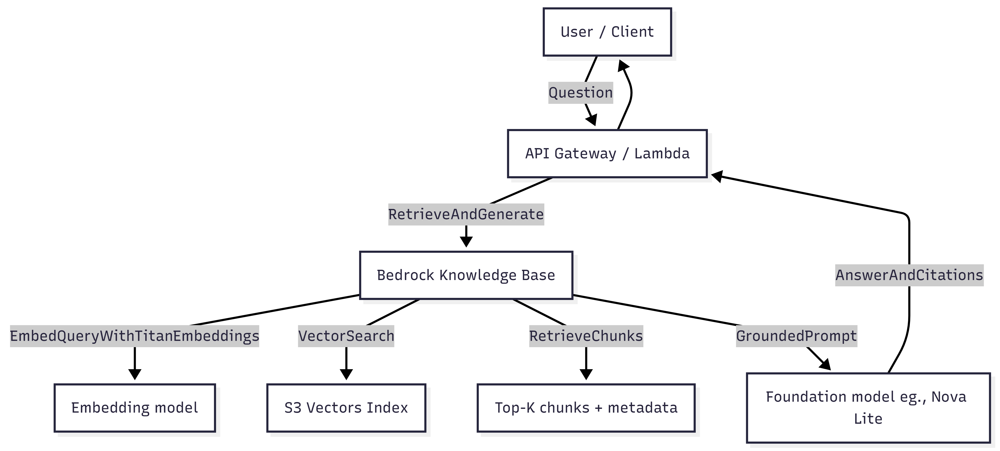
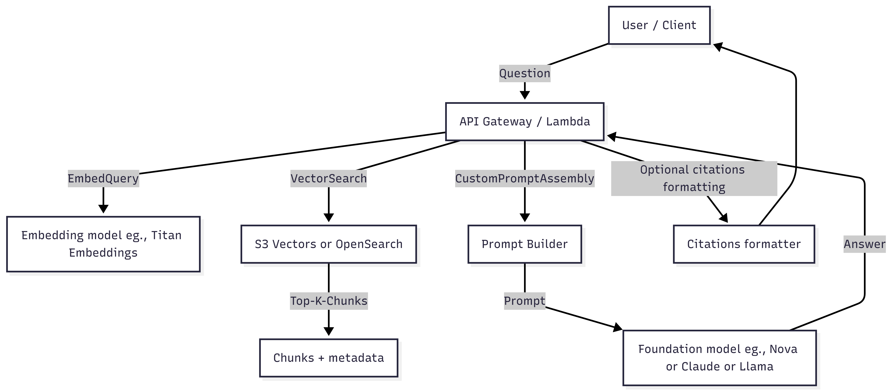

# ARCHITECTURE.md

## Project: Bedrock RAG — KB vs DIY RAG

This document compares two Retrieval-Augmented Generation (RAG) architectures implemented in this project:

1. **Bedrock Knowledge Bases (KB) RAG** (managed retrieval + managed grounding)
2. **DIY RAG** (custom retrieval + custom prompt assembly + model invocation)

The goal is to understand tradeoffs under exam-style constraints: cost, latency, governance, resilience, and implementation complexity.

---

## 1) Architecture A — Bedrock Knowledge Base RAG (Managed)

### Diagram (High level)

```mermaid
flowchart LR
    U[User / Client] -->|Question| API[API Gateway / Lambda]
    API -->|RetrieveAndGenerate| KB[Bedrock Knowledge Base]
    KB -->|Embed query (Titan Embeddings)| EMB[Embedding model]
    KB -->|Vector search| VS[S3 Vectors Index]
    KB -->|Retrieve chunks| CH[Top-K chunks + metadata]
    KB -->|Grounded prompt| GEN[Foundation model (Nova Lite)]
    GEN -->|Answer + citations| API
    API --> U
```


### What is managed by Bedrock KB

* Query embedding using the KB-configured embedding model
* Retrieval from the configured vector store (S3 Vectors)
* Chunk/metadata resolution
* Prompt grounding pattern for RAG
* Returning citations (source references)

### Where data lives

* **Documents**: S3 bucket (data source)
* **Embeddings / vectors**: S3 Vectors bucket + index
* **KB object**: configuration + pointers (not embeddings)

### Strengths

* Lowest implementation complexity
* Best governance and auditability (config-driven)
* Retrieval and grounding are consistent across apps

### Limitations

* Less control over prompt assembly and retrieval stages
* Model support is constrained to KB-supported generation models
* Advanced reranking/hybrid logic is less flexible than DIY

---

## 2) Architecture B — DIY RAG (Custom Pipeline)

### Diagram (High level)

```mermaid
flowchart LR
    U[User / Client] -->|Question| API[API Gateway / Lambda]
    API -->|Embed query| EMB[Embedding model (Titan Embeddings)]
    API -->|Vector search| VS[S3 Vectors or OpenSearch]
    VS -->|Top-K chunks| CH[Chunks + metadata]
    API -->|Custom prompt assembly| P[Prompt Builder]
    P -->|Prompt| GEN[Foundation model (Nova / Claude / Llama)]
    GEN -->|Answer| API
    API -->|Optional citations formatting| C[Citations formatter]
    C --> U
```



### What you manage in DIY

* Embedding model selection and query embedding
* Vector store query logic (topK, filters, hybrid search)
* Optional reranking logic
* Prompt templates, formatting, grounding rules
* Citation extraction and formatting
* Fallback strategies and error handling

### Strengths

* Maximum flexibility (custom prompt injection, reranking, hybrid search)
* Easy to swap vector stores and compare behaviors
* Easier to implement bespoke answer formats and policies

### Limitations

* More code, more IAM, more failure modes
* Easy to accidentally mismatch embedding spaces (bad results)
* Harder to audit/standardize at scale without governance tooling

---

## 3) “Same Components, Different Orchestration”

### Component ownership comparison

| Component                        | KB RAG                 | DIY RAG        |
| -------------------------------- | ---------------------- | -------------- |
| Document storage                 | You (S3)               | You (S3)       |
| Chunking                         | Managed by KB          | You implement  |
| Embedding generation             | Managed by KB          | You implement  |
| Vector store operations          | KB-managed integration | You implement  |
| Retrieval config (topK, filters) | Config/API             | Code/API       |
| Prompt assembly                  | Managed by KB          | You implement  |
| Generation model selection       | Config/API             | Code/API       |
| Governance & auditability        | High                   | Depends on you |

---

## 4) Decision Guide (Exam-aligned)

### Use Bedrock Knowledge Bases when:

* You want fast, reliable RAG with minimal moving parts
* You need governance and repeatability
* You are building a standard “enterprise docs assistant”
* You want simplest path to citations and grounding

### Use DIY RAG when:

* You need custom retrieval logic (hybrid, rerank, multi-stage)
* You must inject proprietary instructions or complex output formats
* You need strict control of prompts and context window usage
* You want portability across vector stores

---

## 5) Failure Modes (Practical + Exam)

### KB RAG common issues

* Unsupported generation model ARN for RetrieveAndGenerate
* Region mismatch between KB and runtime client
* Missing permissions (bedrock-agent-runtime + PassRole + s3vectors)
* Sync not run after adding new documents

### DIY RAG common issues

* Embedding model mismatch between ingestion and query time
* Bad chunking leads to poor recall
* Missing metadata causes irrelevant retrieval
* Prompt injection risk if you do not harden templates

---

## 6) Resilience Patterns (Both Architectures)

### Model fallback (generation)

* Primary model fails (throttle/timeout) → fallback to cheaper/smaller model

### Cross-region (optional)

* If allowed by governance, route queries to a secondary region model
* Keep the vector store region-aware (or replicate)

### Safe default behavior

* If retrieval returns weak evidence, respond with:
  “I don’t know based on available sources.”

---

## 7) Implementation Locations in Repo

* KB RAG Lambda:

  * `query/lambda-kb-rag/`

* DIY RAG Lambda:

  * `query/lambda-diy-rag/`

* Ingestion configuration and IAM notes:

  * `ingestion/kb-s3vectors/`
  * `ingestion/kb-opensearch/` (if implemented)

---
